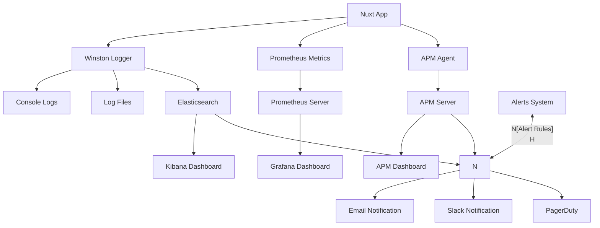

# Бекенд на Nuxt

## Логування та моніторинг

Ефективне логування та моніторинг є критично важливими для підтримки надійних веб-додатків. Вони дозволяють виявляти проблеми, відстежувати продуктивність та аналізувати поведінку користувачів. У цьому розділі ми розглянемо основні підходи до логування та моніторингу в Nuxt 3 додатках.

### Основи логування

#### Типи логів

У веб-додатках зазвичай використовуються такі типи логів:

1. **Логи розробки** — детальна інформація для налагодження в процесі розробки
2. **Логи додатку** — інформація про роботу додатку в продакшні
3. **Логи доступу** — записи про HTTP-запити до сервера
4. **Логи помилок** — інформація про виникнення помилок та винятків
5. **Логи безпеки** — записи про події, пов'язані з безпекою

#### Рівні логування

Стандартні рівні логування, відсортовані за зростанням серйозності:

1. **TRACE** — найдетальніша інформація (тільки для розробки)
2. **DEBUG** — детальна інформація для налагодження
3. **INFO** — загальна інформація про роботу системи
4. **WARN** — попередження, що не порушують роботу системи
5. **ERROR** — помилки, які потребують уваги
6. **FATAL** — критичні помилки, що призводять до падіння системи

### Налаштування логування у Nuxt 3

#### Вбудоване логування Nitro

Nuxt 3 використовує Nitro як серверний двигун, який має базову підтримку логування.

```typescript
// nuxt.config.ts
export default defineNuxtConfig({
    nitro: {
        logLevel: process.env.NODE_ENV === "development" ? "debug" : "info",
        // Додаткові налаштування для логування
        experimental: {
            // Увімкнути розширене логування запитів
            openAPI: true,
        },
    },
});
```

#### Інтеграція зовнішніх логерів

Для більш потужного логування можна інтегрувати спеціалізовані бібліотеки.

##### Winston

[Winston](https://github.com/winstonjs/winston) — потужна бібліотека для логування в Node.js.

1. **Встановлення**:

```bash
npm install winston
```

2. **Налаштування у Nuxt**:

```typescript
// server/plugins/logger.ts
import { defineNitroPlugin } from "nitropack/runtime";
import winston from "winston";
import "winston-daily-rotate-file";

export default defineNitroPlugin((nitroApp) => {
    // Форматування логів
    const format = winston.format.combine(
        winston.format.timestamp(),
        winston.format.errors({ stack: true }),
        winston.format.printf(({ level, message, timestamp, stack }) => {
            return `[${timestamp}] ${level.toUpperCase()}: ${message} ${
                stack ? "\n" + stack : ""
            }`;
        })
    );

    // Налаштування транспортів
    const transports = [
        // Консольний транспорт для розробки
        new winston.transports.Console({
            format: winston.format.combine(winston.format.colorize(), format),
        }),
    ];

    // Файлові транспорти для продакшну
    if (process.env.NODE_ENV === "production") {
        // Ротація логів щодня, зберігання 14 днів
        transports.push(
            new winston.transports.DailyRotateFile({
                filename: "logs/app-%DATE%.log",
                datePattern: "YYYY-MM-DD",
                maxFiles: "14d",
                format,
            }),
            new winston.transports.DailyRotateFile({
                filename: "logs/error-%DATE%.log",
                datePattern: "YYYY-MM-DD",
                maxFiles: "14d",
                level: "error",
                format,
            })
        );
    }

    // Створення логера
    const logger = winston.createLogger({
        level: process.env.NODE_ENV === "development" ? "debug" : "info",
        transports,
        // Не завершувати процес при помилці логування
        exitOnError: false,
    });

    // Доступ до логера через глобальний контекст
    nitroApp.logger = logger;

    // Логування помилок
    nitroApp.hooks.hook("error", (error, { event }) => {
        logger.error(`Unhandled error: ${error.message}`, {
            error,
            request: event
                ? {
                      path: event.path,
                      method: event.method,
                      headers: event.headers,
                  }
                : undefined,
        });
    });

    // Логування запитів (опціонально)
    nitroApp.hooks.hook("request", (event) => {
        logger.debug(`Request: ${event.method} ${event.path}`);
    });

    // Логування відповідей (опціонально)
    nitroApp.hooks.hook("afterResponse", (event, { body, status }) => {
        logger.debug(`Response: ${event.method} ${event.path} - ${status}`);
    });
});
```

3. **Використання логера в API-маршрутах**:

```typescript
// server/api/users/index.get.ts
export default defineEventHandler(async (event) => {
    const logger = event.context.nitro.logger;

    try {
        logger.info("Fetching users list");

        const users = await prisma.user.findMany();

        logger.debug(`Found ${users.length} users`);
        return users;
    } catch (error) {
        logger.error("Failed to fetch users", { error });
        throw createError({
            statusCode: 500,
            message: "Failed to fetch users",
        });
    }
});
```

##### Pino

[Pino](https://getpino.io/) — дуже швидкий та легкий логер для Node.js.

1. **Встановлення**:

```bash
npm install pino pino-http
```

2. **Налаштування у Nuxt**:

```typescript
// server/plugins/pino-logger.ts
import { defineNitroPlugin } from "nitropack/runtime";
import pino from "pino";
import pinoHttp from "pino-http";

export default defineNitroPlugin((nitroApp) => {
    // Налаштування Pino
    const logger = pino({
        level: process.env.NODE_ENV === "development" ? "debug" : "info",
        transport: {
            target: "pino-pretty",
            options: {
                colorize: true,
            },
        },
    });

    // Middleware для логування HTTP запитів
    const httpLogger = pinoHttp({
        logger,
        // Не логувати тіло запиту з міркувань безпеки та продуктивності
        redact: ["req.headers.authorization", "req.headers.cookie"],
    });

    // Інтеграція з Nitro
    nitroApp.hooks.hook("request", (event) => {
        // Застосування HTTP логера до запиту
        httpLogger(event.node.req, event.node.res);

        // Доступ до логера з контексту запиту
        event.context.logger = logger;
    });

    // Логування помилок
    nitroApp.hooks.hook("error", (error, { event }) => {
        const reqId = event?.node?.req?.id;
        logger.error({ err: error, reqId }, "Unhandled error");
    });
});
```

### Відстеження помилок (Error Tracking)

#### Sentry

[Sentry](https://sentry.io/) — популярний сервіс для відстеження та аналізу помилок.

1. **Встановлення**:

```bash
npm install @sentry/node @sentry/vue
```

2. **Налаштування для серверної частини**:

```typescript
// server/plugins/sentry.ts
import { defineNitroPlugin } from "nitropack/runtime";
import * as Sentry from "@sentry/node";

export default defineNitroPlugin((nitroApp) => {
    // Ініціалізація Sentry для серверної частини
    Sentry.init({
        dsn: process.env.SENTRY_DSN,
        environment: process.env.NODE_ENV,
        // Налаштування вибірки транзакцій для продуктивності
        tracesSampleRate: process.env.NODE_ENV === "production" ? 0.1 : 1.0,
        // Максимальний розмір запиту, який буде записано
        maxRequestBodySize: "medium",
        // Які дані запиту записувати
        sendDefaultPii: false,
    });

    // Інтеграція з Nitro
    nitroApp.hooks.hook("error", (error, { event }) => {
        // Отримання контексту запиту
        const user = event?.context?.user;
        const reqPath = event?.path;
        const reqMethod = event?.method;

        // Налаштування контексту для Sentry
        Sentry.configureScope((scope) => {
            if (user) {
                scope.setUser({
                    id: user.id,
                    email: user.email,
                });
            }

            scope.setExtra("path", reqPath);
            scope.setExtra("method", reqMethod);
        });

        // Відправка помилки в Sentry
        Sentry.captureException(error);
    });

    // Middleware для відстеження запитів
    nitroApp.hooks.hook("request", (event) => {
        const transaction = Sentry.startTransaction({
            name: `${event.method} ${event.path}`,
            op: "http.server",
        });

        // Збереження транзакції в контексті запиту
        event.context.sentryTransaction = transaction;

        // Встановлення поточної транзакції для Sentry
        Sentry.getCurrentHub().configureScope((scope) => {
            scope.setSpan(transaction);
        });
    });

    // Завершення транзакції після відповіді
    nitroApp.hooks.hook("afterResponse", (event) => {
        const transaction = event.context.sentryTransaction;
        if (transaction) {
            transaction.finish();
        }
    });
});
```

3. **Налаштування для клієнтської частини**:

```typescript
// plugins/sentry.client.ts
import { defineNuxtPlugin } from "#app";
import * as Sentry from "@sentry/vue";

export default defineNuxtPlugin((nuxtApp) => {
    const vueApp = nuxtApp.vueApp;
    const config = useRuntimeConfig();

    Sentry.init({
        app: vueApp,
        dsn: config.public.sentryDsn,
        environment: process.env.NODE_ENV,
        integrations: [
            new Sentry.BrowserTracing({
                routingInstrumentation: Sentry.vueRouterInstrumentation(
                    nuxtApp.$router
                ),
            }),
        ],
        tracesSampleRate: 0.1,
        // Рівень логування для Sentry
        logLevel: "error",
    });

    // Хуки для відстеження помилок Vue
    nuxtApp.hook("app:error", (error) => {
        Sentry.captureException(error);
    });

    nuxtApp.hook("vue:error", (error) => {
        Sentry.captureException(error);
    });
});
```

### Моніторинг продуктивності

#### Вбудований моніторинг Nitro

Nitro пропонує базові можливості для моніторингу продуктивності.

```typescript
// server/middleware/performance.ts
import { defineEventHandler } from "h3";

export default defineEventHandler((event) => {
    // Початок вимірювання часу
    const start = performance.now();

    // Після завершення запиту
    event.node.res.on("finish", () => {
        const duration = performance.now() - start;

        // Логування часу виконання
        console.log(
            `${event.method} ${event.path} - ${Math.round(duration)}ms`
        );

        // Додавання заголовка з часом виконання
        event.node.res.setHeader(
            "Server-Timing",
            `total;dur=${Math.round(duration)}`
        );
    });
});
```

#### New Relic

[New Relic](https://newrelic.com/) — платформа для моніторингу продуктивності додатків.

1. **Встановлення**:

```bash
npm install newrelic
```

2. **Налаштування**:

```javascript
// newrelic.js
"use strict";

exports.config = {
    app_name: [process.env.NEW_RELIC_APP_NAME || "My Nuxt App"],
    license_key: process.env.NEW_RELIC_LICENSE_KEY,
    logging: {
        level: "info",
    },
    allow_all_headers: true,
    attributes: {
        exclude: [
            "request.headers.cookie",
            "request.headers.authorization",
            "request.headers.proxyAuthorization",
            "request.headers.setCookie*",
            "request.headers.x*",
            "response.headers.cookie",
            "response.headers.authorization",
            "response.headers.proxyAuthorization",
            "response.headers.setCookie*",
            "response.headers.x*",
        ],
    },
};
```

3. **Інтеграція з Nuxt**:

```typescript
// server/plugins/newrelic.ts
import { defineNitroPlugin } from "nitropack/runtime";

export default defineNitroPlugin((nitroApp) => {
    // Завантаження New Relic в продакшн режимі
    if (process.env.NODE_ENV === "production") {
        require("newrelic");
        console.log("New Relic initialized");
    }
});
```

#### Datadog

[Datadog](https://www.datadoghq.com/) — платформа для моніторингу та аналітики.

1. **Встановлення**:

```bash
npm install dd-trace
```

2. **Налаштування**:

```typescript
// server/plugins/datadog.ts
import { defineNitroPlugin } from "nitropack/runtime";

export default defineNitroPlugin((nitroApp) => {
    if (process.env.NODE_ENV === "production") {
        const tracer = require("dd-trace").init({
            service: process.env.DD_SERVICE || "nuxt-app",
            env: process.env.NODE_ENV,
            // Налаштування вибірки для APM
            sampleRate: 0.5,
            // Налаштування вибірки для розподіленого трейсингу
            traceSampleRate: 0.1,
        });

        console.log("Datadog tracer initialized");

        // Інтеграція з Nitro
        nitroApp.hooks.hook("request", (event) => {
            // Створення спану для запиту
            const span = tracer.startSpan("http.request", {
                tags: {
                    "http.method": event.method,
                    "http.url": event.path,
                },
            });

            // Збереження спану в контексті запиту
            event.context.datadogSpan = span;
        });

        nitroApp.hooks.hook("afterResponse", (event) => {
            const span = event.context.datadogSpan;
            if (span) {
                // Додавання інформації про відповідь
                span.addTags({
                    "http.status_code": event.node.res.statusCode,
                });

                // Завершення спану
                span.finish();
            }
        });
    }
});
```

### Аналітика

#### Налаштування Server-Side аналітики

Для збору аналітичних даних на сервері можна використовувати різні підходи.

##### Власний збір аналітики

```typescript
// server/middleware/analytics.ts
import { defineEventHandler } from "h3";

// Спрощена структура для збору аналітики
const analytics = {
    requests: {
        total: 0,
        byPath: {},
    },
    errors: {
        total: 0,
        byCode: {},
    },
    responseTime: {
        total: 0,
        count: 0,
        max: 0,
        min: Infinity,
    },
};

// Функція для періодичного збереження аналітики
async function saveAnalytics() {
    // Тут можна зберігати дані в базу або надсилати в зовнішню систему
    console.log("Analytics data:", analytics);

    // Скидання лічильників
    analytics.responseTime.total = 0;
    analytics.responseTime.count = 0;
    analytics.responseTime.max = 0;
    analytics.responseTime.min = Infinity;
}

// Запускаємо збереження кожні 5 хвилин
const saveInterval = 5 * 60 * 1000;
setInterval(saveAnalytics, saveInterval);

export default defineEventHandler((event) => {
    // Збільшення лічильника запитів
    analytics.requests.total++;

    // Збір аналітики за шляхом
    const path = event.path;
    analytics.requests.byPath[path] =
        (analytics.requests.byPath[path] || 0) + 1;

    // Початок вимірювання часу
    const start = performance.now();

    // Після завершення запиту
    event.node.res.on("finish", () => {
        // Вимірювання часу відповіді
        const duration = performance.now() - start;

        // Оновлення статистики часу відповіді
        analytics.responseTime.total += duration;
        analytics.responseTime.count++;
        analytics.responseTime.max = Math.max(
            analytics.responseTime.max,
            duration
        );
        analytics.responseTime.min = Math.min(
            analytics.responseTime.min,
            duration
        );

        // Збір аналітики за кодом статусу
        const statusCode = event.node.res.statusCode;
        if (statusCode >= 400) {
            analytics.errors.total++;
            analytics.errors.byCode[statusCode] =
                (analytics.errors.byCode[statusCode] || 0) + 1;
        }
    });
});
```

##### Інтеграція з Google Analytics 4

```typescript
// server/utils/analytics.ts
import fetch from "node-fetch";

export async function trackServerEvent(eventName, params = {}) {
    // Перевірка наявності ключа GA4
    if (!process.env.GA4_MEASUREMENT_ID || !process.env.GA4_API_SECRET) {
        console.warn("GA4 credentials not configured");
        return;
    }

    try {
        // Підготовка даних для GA4
        const data = {
            client_id: "server.backend",
            timestamp_micros: Date.now() * 1000,
            non_personalized_ads: true,
            events: [
                {
                    name: eventName,
                    params: {
                        ...params,
                        engagement_time_msec: 1,
                        session_id: `server_${Date.now()}`,
                    },
                },
            ],
        };

        // Відправка даних в GA4
        const response = await fetch(
            `https://www.google-analytics.com/mp/collect?measurement_id=${process.env.GA4_MEASUREMENT_ID}&api_secret=${process.env.GA4_API_SECRET}`,
            {
                method: "POST",
                body: JSON.stringify(data),
                headers: {
                    "Content-Type": "application/json",
                },
            }
        );

        if (!response.ok) {
            throw new Error(
                `GA4 request failed: ${response.status} ${response.statusText}`
            );
        }
    } catch (error) {
        console.error("Failed to track GA4 event:", error);
    }
}
```

Використання в API-ендпоінтах:

```typescript
// server/api/orders/create.post.ts
import { trackServerEvent } from "../../utils/analytics";

export default defineEventHandler(async (event) => {
    try {
        const body = await readBody(event);

        // Створення замовлення
        const order = await prisma.order.create({
            data: body,
        });

        // Відстеження події
        await trackServerEvent("purchase", {
            transaction_id: order.id,
            value: order.totalAmount,
            currency: "USD",
            items: order.items.map((item) => ({
                item_id: item.productId,
                item_name: item.name,
                price: item.price,
                quantity: item.quantity,
            })),
        });

        return order;
    } catch (error) {
        throw createError({
            statusCode: 500,
            message: `Failed to create order: ${error.message}`,
        });
    }
});
```

#### Інтеграція з Prometheus

[Prometheus](https://prometheus.io/) — відкрита система моніторингу та генерації сповіщень.

1. **Встановлення**:

```bash
npm install prom-client
```

2. **Налаштування**:

```typescript
// server/plugins/prometheus.ts
import { defineNitroPlugin } from "nitropack/runtime";
import { Registry, Counter, Gauge, Histogram } from "prom-client";

export default defineNitroPlugin((nitroApp) => {
    // Створення реєстру метрик
    const register = new Registry();

    // Налаштування базових метрик
    register.setDefaultLabels({
        app: "nuxt-app",
    });

    // Лічильник HTTP запитів
    const httpRequestsCounter = new Counter({
        name: "http_requests_total",
        help: "Total number of HTTP requests",
        labelNames: ["method", "path", "status"],
    });

    // Гістограма часу відповіді
    const httpRequestDuration = new Histogram({
        name: "http_request_duration_seconds",
        help: "HTTP request duration in seconds",
        labelNames: ["method", "path", "status"],
        buckets: [0.01, 0.05, 0.1, 0.5, 1, 2, 5, 10],
    });

    // Лічильник помилок
    const errorCounter = new Counter({
        name: "errors_total",
        help: "Total number of errors",
        labelNames: ["type"],
    });

    // Поточні активні з'єднання
    const activeConnections = new Gauge({
        name: "active_connections",
        help: "Current active connections",
    });

    // Реєстрація метрик
    register.registerMetric(httpRequestsCounter);
    register.registerMetric(httpRequestDuration);
    register.registerMetric(errorCounter);
    register.registerMetric(activeConnections);

    // Додавання метрик до контексту Nitro
    nitroApp.metrics = {
        register,
        httpRequestsCounter,
        httpRequestDuration,
        errorCounter,
        activeConnections,
    };

    // Обробка HTTP запитів
    nitroApp.hooks.hook("request", (event) => {
        // Збільшення лічильника активних з'єднань
        activeConnections.inc();

        // Вимірювання часу виконання
        const start = process.hrtime();

        // Збереження часу початку в контексті запиту
        event.context.metricsStart = start;
    });

    // Обробка завершення запиту
    nitroApp.hooks.hook("afterResponse", (event) => {
        // Зменшення лічильника активних з'єднань
        activeConnections.dec();

        const start = event.context.metricsStart;
        if (start) {
            // Вимірювання часу виконання
            const [seconds, nanoseconds] = process.hrtime(start);
            const duration = seconds + nanoseconds / 1e9;

            // Отримання статусу відповіді
            const status = event.node.res.statusCode;

            // Запис метрик
            httpRequestsCounter.inc({
                method: event.method,
                path: event.path,
                status,
            });

            httpRequestDuration.observe(
                {
                    method: event.method,
                    path: event.path,
                    status,
                },
                duration
            );
        }
    });

    // Обробка помилок
    nitroApp.hooks.hook("error", (error) => {
        errorCounter.inc({ type: error.name || "Unknown" });
    });

    // Ендпоінт для Prometheus метрик
    nitroApp.hooks.hook("request", async (event) => {
        if (event.path === "/metrics" && event.method === "GET") {
            // Перевірка авторизації (опціонально)
            const authHeader = getHeader(event, "authorization");
            const metricsSecret = process.env.METRICS_SECRET;

            if (metricsSecret && authHeader !== `Bearer ${metricsSecret}`) {
                event.node.res.statusCode = 401;
                event.node.res.end("Unauthorized");
                return;
            }

            try {
                // Генерація метрик
                const metrics = await register.metrics();

                // Встановлення заголовків
                setHeader(event, "Content-Type", register.contentType);

                // Відправка метрик
                event.node.res.end(metrics);
            } catch (error) {
                console.error("Error generating metrics:", error);
                event.node.res.statusCode = 500;
                event.node.res.end("Internal Server Error");
            }
        }
    });
});
```

### Централізоване логування

Для централізованого логування у великих системах часто використовують стек ELK (Elasticsearch, Logstash, Kibana) або його альтернативи.

#### Інтеграція з ELK

1. **Встановлення**:

```bash
npm install winston winston-elasticsearch
```

2. **Налаштування**:

```typescript
// server/plugins/elk-logger.ts
import { defineNitroPlugin } from "nitropack/runtime";
import winston from "winston";
import { ElasticsearchTransport } from "winston-elasticsearch";

export default defineNitroPlugin((nitroApp) => {
    // Створення транспорту для Elasticsearch
    const esTransport = new ElasticsearchTransport({
        level: "info",
        clientOpts: {
            node: process.env.ELASTICSEARCH_URL || "http://localhost:9200",
            auth: {
                username: process.env.ELASTICSEARCH_USERNAME,
                password: process.env.ELASTICSEARCH_PASSWORD,
            },
        },
        indexPrefix: "nuxt-logs",
        // Генерація індексу за датою
        indexSuffixPattern: "YYYY.MM.DD",
        // Додаткові метадані для кожного запису
        transformer: (logData) => {
            return {
                "@timestamp": new Date().toISOString(),
                severity: logData.level,
                message: logData.message,
                fields: {
                    ...logData.meta,
                    service: "nuxt-app",
                    environment: process.env.NODE_ENV,
                },
            };
        },
    });

    // Створення логера
    const logger = winston.createLogger({
        level: process.env.NODE_ENV === "development" ? "debug" : "info",
        format: winston.format.combine(
            winston.format.timestamp(),
            winston.format.json()
        ),
        transports: [
            // Консольний транспорт для розробки
            new winston.transports.Console({
                format: winston.format.combine(
                    winston.format.colorize(),
                    winston.format.simple()
                ),
            }),
            // Elasticsearch транспорт
            esTransport,
        ],
    });

    // Доступ до логера через глобальний контекст
    nitroApp.logger = logger;

    // Логування помилок
    nitroApp.hooks.hook("error", (error, { event }) => {
        logger.error("Unhandled error", {
            error: {
                message: error.message,
                stack: error.stack,
                name: error.name,
            },
            request: event
                ? {
                      path: event.path,
                      method: event.method,
                      ip: event.context.clientAddress,
                  }
                : undefined,
        });
    });
});
```

### Діаграми та схеми

#### Централізоване логування та моніторинг



#### Цикл обробки логів

```
┌─────────────────────────┐      ┌────────────────────┐
│ Виникнення події        │      │ Фільтрація логів   │
│ (запит, помилка, тощо)  │─────▶│ за рівнем          │
└─────────────────────────┘      └──────────┬─────────┘
                                            │
┌─────────────────────────┐      ┌──────────▼─────────┐
│ Зберігання та архівація │      │ Форматування та    │
│ (retention policy)      │◀─────│ збагачення даних   │
└─────────────────────────┘      └──────────┬─────────┘
          ▲                                  │
          │                      ┌──────────▼─────────┐
┌─────────┴─────────────┐        │ Транспортування    │
│ Очищення старих логів │◀───────│ (console, file,    │
└───────────────────────┘        │ elasticsearch)     │
                                 └────────────────────┘
```

#### Порівняння систем моніторингу

```
┌─────────────────────────────────────────────────────┐
│ Система        │ Переваги             │ Недоліки    │
├────────────────┼──────────────────────┼─────────────┤
│ Prometheus     │ Відкритий код        │ Складність  │
│                │ Pull-модель          │ налаштування│
│                │ Потужні запити       │ Обмежене    │
│                │ Сповіщення           │ зберігання  │
├────────────────┼──────────────────────┼─────────────┤
│ Datadog        │ Легке налаштування   │ Платний     │
│                │ APM + логи + метрики │ Обмеження у │
│                │ Готові дашборди      │ безкоштовних│
│                │                      │ планах      │
├────────────────┼──────────────────────┼─────────────┤
│ New Relic      │ Повний моніторинг    │ Платний     │
│                │ Відстеження транзакцій│ Складний    │
│                │ Потужна аналітика    │ інтерфейс   │
├────────────────┼──────────────────────┼─────────────┤
│ ELK Stack      │ Гнучкість            │ Ресурсоємний│
│                │ Повнотекстовий пошук │ Складне     │
│                │ Потужна візуалізація │ масштабування│
└────────────────┴──────────────────────┴─────────────┘
```

#### Порівняння інструментів логування

```
┌─────────────────────────────────────────────────────┐
│ Інструмент     │ Переваги             │ Недоліки    │
├────────────────┼──────────────────────┼─────────────┤
│ Winston        │ Гнучкість            │ Більший     │
│                │ Багато транспортів   │ overhead    │
│                │ Простота             │ Повільніший │
├────────────────┼──────────────────────┼─────────────┤
│ Pino           │ Висока продуктивність│ Менше       │
│                │ Низький overhead     │ функцій     │
│                │ JSON за замовчуванням│ Простіша    │
│                │                      │ конфігурація│
├────────────────┼──────────────────────┼─────────────┤
│ Bunyan         │ JSON логування       │ Менше       │
│                │ CLI для читання логів│ транспортів │
│                │ Простота             │ Менше       │
│                │                      │ розширень   │
└────────────────┴──────────────────────┴─────────────┘
```

### Найкращі практики

#### Загальні рекомендації з логування

1. **Розподіляйте логи за рівнями**:

    - `debug` — тільки для розробки
    - `info` — нормальні події життєвого циклу
    - `warn` — потенційні проблеми
    - `error` — помилки, що потребують уваги

2. **Структуруйте логи**:

    - Використовуйте JSON формат
    - Додавайте контекст (запит, користувач, тощо)
    - Включайте timestamp та ідентифікатори запитів

3. **Забезпечте безпеку**:

    - Не логуйте чутливі дані (паролі, токени)
    - Маскуйте PII (personal identifiable information)
    - Обмежуйте доступ до логів

4. **Керуйте об'ємом логів**:
    - Налаштуйте ротацію логів
    - Встановіть політику зберігання
    - Використовуйте вибіркове логування (sampling)

#### Ефективний моніторинг

1. **Визначте ключові метрики**:

    - Швидкість відповіді (response time)
    - Частота помилок (error rate)
    - Пропускна здатність (throughput)
    - Використання ресурсів (CPU, RAM)

2. **Встановіть базові показники**:

    - Визначте "нормальну" поведінку системи
    - Налаштуйте сповіщення на відхилення

3. **Сегментуйте дані**:

    - За маршрутами/ендпоінтами
    - За кодами відповіді
    - За географією/користувачами

4. **Налаштуйте сповіщення**:
    - Визначте пріоритети сповіщень
    - Уникайте шуму (alert fatigue)
    - Налаштуйте ескалацію

#### Системи сповіщень

1. **Рівні серйозності**:

    - `Info` — інформаційні повідомлення
    - `Warning` — потенційні проблеми
    - `Error` — серйозні проблеми
    - `Critical` — аварійні ситуації

2. **Канали сповіщень**:
    - Email — для некритичних повідомлень
    - SMS/Push — для термінових повідомлень
    - Slack/Teams — для командної комунікації
    - PagerDuty — для ескалації та чергувань

### Приклад: Комплексна система моніторингу

```typescript
// nuxt.config.ts
export default defineNuxtConfig({
    // Налаштування для моніторингу
    nitro: {
        // Розширене логування
        logLevel: process.env.NODE_ENV === "development" ? "debug" : "info",

        // Користувацькі змінні
        runtimeConfig: {
            // Приватні змінні (тільки сервер)
            loggingLevel: process.env.LOGGING_LEVEL || "info",
            sentryDsn: process.env.SENTRY_DSN,
            datadogApiKey: process.env.DATADOG_API_KEY,
            elasticsearchUrl: process.env.ELASTICSEARCH_URL,

            // Публічні змінні (сервер + клієнт)
            public: {
                sentryDsn: process.env.SENTRY_PUBLIC_DSN,
                environment: process.env.NODE_ENV,
            },
        },

        // Плагіни для моніторингу
        plugins: [
            "~/server/plugins/logger.ts",
            "~/server/plugins/sentry.ts",
            "~/server/plugins/metrics.ts",
        ],
    },

    // Плагіни для клієнтського моніторингу
    plugins: ["~/plugins/sentry.client.ts"],

    // Обробники помилок
    hooks: {
        "app:error": (err) => {
            console.error("App error:", err);
        },
        "vue:error": (err) => {
            console.error("Vue error:", err);
        },
    },
});
```

### Висновок

Ефективне логування та моніторинг є невід'ємною частиною розробки надійних веб-додатків на Nuxt. Правильно налаштована система логування допомагає швидко виявляти та діагностувати проблеми, а моніторинг продуктивності дозволяє відстежувати здоров'я системи та оптимізувати її роботу.

Поєднання внутрішніх інструментів Nuxt з потужними зовнішніми сервісами, такими як Sentry, Prometheus, ELK Stack або комерційними рішеннями, дозволяє створити комплексну систему спостереження за додатком, яка допомагає забезпечити надійність і високу якість обслуговування.
