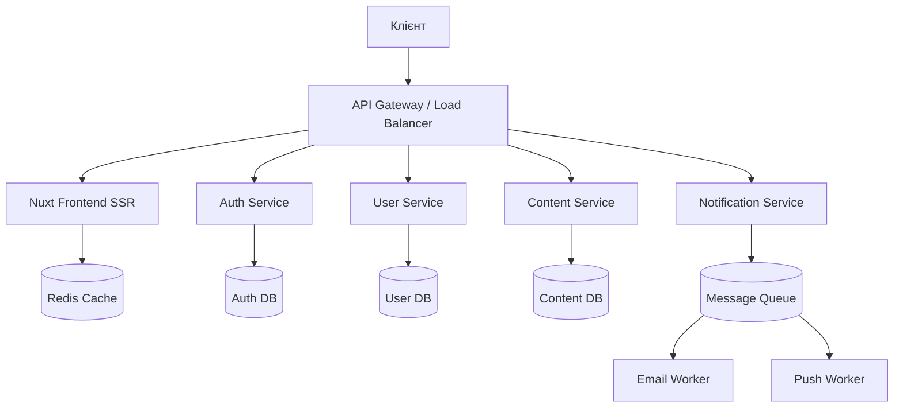
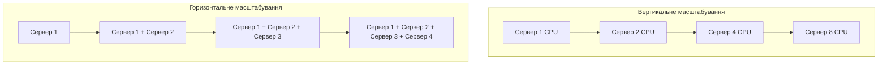
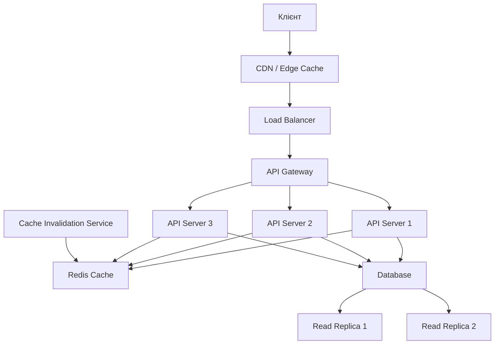

# Бекенд на Nuxt

## Масштабування

Масштабування бекенд-частини Nuxt додатків є критично важливим для забезпечення продуктивності та надійності під високим навантаженням. У цьому розділі розглянемо різні стратегії та підходи до масштабування Nuxt додатків.

### Основи масштабування

#### Типи масштабування

1. **Вертикальне масштабування (scaling up)** — збільшення потужності окремого сервера

    - Додавання CPU/RAM/диску
    - Використання потужнішого обладнання
    - Обмежене верхньою межею апаратних можливостей

2. **Горизонтальне масштабування (scaling out)** — збільшення кількості серверів

    - Додавання нових екземплярів додатку
    - Розподіл навантаження між серверами
    - Практично необмежене масштабування

3. **Функціональне масштабування** — розбиття додатку на мікросервіси
    - Виділення окремих функціональних компонентів
    - Незалежне масштабування різних частин системи
    - Складніша архітектура та взаємодія

### Кешування

Кешування є одним з найефективніших способів підвищення продуктивності та масштабованості.

#### Рівні кешування

1. **Кешування в пам'яті**
2. **Розподілене кешування**
3. **Кешування запитів до бази даних**
4. **Кешування на рівні HTTP**
5. **Кешування на рівні CDN**

#### Кешування в пам'яті з використанням Nitro

Nitro пропонує вбудовані можливості кешування через механізм cachedEventHandler:

```typescript
// server/api/products/index.get.ts
export default cachedEventHandler(
    async (event) => {
        // Витягнення параметрів запиту
        const query = getQuery(event);
        const page = parseInt((query.page as string) || "1");
        const limit = parseInt((query.limit as string) || "10");

        // Отримання даних з бази даних
        const products = await prisma.product.findMany({
            skip: (page - 1) * limit,
            take: limit,
            orderBy: { createdAt: "desc" },
            include: {
                category: true,
            },
        });

        return products;
    },
    {
        // Час зберігання кешу (5 хвилин)
        maxAge: 60 * 5,
        // Визначення ключа кешування на основі параметрів запиту
        getKey: (event) => {
            const query = getQuery(event);
            return `products-${query.page || "1"}-${query.limit || "10"}`;
        },
        // Обмеження кількості кешованих варіантів
        swr: true, // Stale-While-Revalidate
        // Час, протягом якого можна використовувати "застарілий" кеш
        // під час оновлення у фоновому режимі
        staleMaxAge: 60 * 10,
    }
);
```

#### Розподілене кешування з Redis

Для горизонтального масштабування необхідно використовувати розподілений кеш, наприклад, Redis:

1. **Встановлення залежностей**:

```bash
npm install ioredis
```

2. **Налаштування Redis клієнта**:

```typescript
// server/utils/redis.ts
import { Redis } from "ioredis";

// Створення Redis клієнта
const redis = new Redis({
    host: process.env.REDIS_HOST || "localhost",
    port: parseInt(process.env.REDIS_PORT || "6379"),
    password: process.env.REDIS_PASSWORD,
    // Налаштування для Sentinel або кластера
    ...(process.env.REDIS_SENTINEL_NAME && {
        sentinels: process.env.REDIS_SENTINELS?.split(",").map((s) => {
            const [host, port] = s.split(":");
            return { host, port: parseInt(port) };
        }),
        name: process.env.REDIS_SENTINEL_NAME,
    }),
});

// Обробка помилок
redis.on("error", (err) => {
    console.error("Redis error:", err);
});

export default redis;
```

3. **Реалізація розподіленого кешування**:

```typescript
// server/utils/distributed-cache.ts
import redis from "./redis";

/**
 * Функція для кешування результатів асинхронних операцій в Redis
 */
export async function cacheWithRedis<T>(
    key: string,
    fn: () => Promise<T>,
    ttlSeconds: number = 300 // 5 хвилин за замовчуванням
): Promise<T> {
    try {
        // Спроба отримати дані з кешу
        const cachedData = await redis.get(key);

        if (cachedData) {
            return JSON.parse(cachedData);
        }

        // Якщо даних у кеші немає, виконуємо функцію
        const result = await fn();

        // Зберігаємо результат у кеш
        await redis.set(key, JSON.stringify(result), "EX", ttlSeconds);

        return result;
    } catch (error) {
        console.error(`Cache error for key ${key}:`, error);
        // У разі помилки кешування, просто виконуємо функцію
        return fn();
    }
}

/**
 * Функція для видалення елементу з кешу
 */
export async function invalidateCache(key: string): Promise<void> {
    try {
        await redis.del(key);
    } catch (error) {
        console.error(`Error invalidating cache for key ${key}:`, error);
    }
}

/**
 * Функція для видалення кешу за патерном
 */
export async function invalidateCachePattern(pattern: string): Promise<void> {
    try {
        // Отримання ключів за патерном
        const keys = await redis.keys(pattern);

        if (keys.length > 0) {
            // Видалення всіх знайдених ключів
            await redis.del(...keys);
        }
    } catch (error) {
        console.error(
            `Error invalidating cache for pattern ${pattern}:`,
            error
        );
    }
}
```

4. **Використання в API ендпоінтах**:

```typescript
// server/api/categories/[id].get.ts
import {
    cacheWithRedis,
    invalidateCache,
} from "~/server/utils/distributed-cache";

export default defineEventHandler(async (event) => {
    const id = getRouterParam(event, "id");

    return await cacheWithRedis(
        `category:${id}`,
        async () => {
            // Запит до бази даних
            const category = await prisma.category.findUnique({
                where: { id },
                include: {
                    products: {
                        take: 10,
                        orderBy: { createdAt: "desc" },
                    },
                },
            });

            if (!category) {
                throw createError({
                    statusCode: 404,
                    message: "Category not found",
                });
            }

            return category;
        },
        // TTL: 10 хвилин
        60 * 10
    );
});

// server/api/categories/[id].put.ts
export default defineEventHandler(async (event) => {
    const id = getRouterParam(event, "id");
    const body = await readBody(event);

    // Оновлення категорії
    const updatedCategory = await prisma.category.update({
        where: { id },
        data: body,
    });

    // Інвалідація кешу для цієї категорії
    await invalidateCache(`category:${id}`);
    // Інвалідація кешу для списку категорій
    await invalidateCache("categories:list");

    return updatedCategory;
});
```

#### Кешування на рівні HTTP

Налаштування HTTP кешування через заголовки:

```typescript
// server/middleware/cache-control.ts
import { defineEventHandler } from "h3";

export default defineEventHandler((event) => {
    // Статичні ресурси з довгим терміном кешування
    if (event.path.match(/\.(js|css|png|jpg|jpeg|gif|ico|svg|woff|woff2)$/)) {
        event.node.res.setHeader(
            "Cache-Control",
            "public, max-age=31536000, immutable" // 1 рік
        );
        return;
    }

    // API відповіді, що часто змінюються
    if (event.path.startsWith("/api/realtime")) {
        event.node.res.setHeader(
            "Cache-Control",
            "no-cache, no-store, must-revalidate"
        );
        return;
    }

    // API відповіді, що рідко змінюються
    if (event.path.startsWith("/api/static")) {
        event.node.res.setHeader(
            "Cache-Control",
            "public, max-age=3600" // 1 година
        );
        return;
    }

    // Стандартні API відповіді
    if (event.path.startsWith("/api/")) {
        event.node.res.setHeader(
            "Cache-Control",
            "private, max-age=60" // 1 хвилина
        );
        return;
    }

    // Сторінки додатку
    event.node.res.setHeader(
        "Cache-Control",
        "public, max-age=300, stale-while-revalidate=300" // 5 хвилин з оновленням у фоні
    );
});
```

#### Конфігурація кешування на рівні маршрутів у Nuxt

```typescript
// nuxt.config.ts
export default defineNuxtConfig({
    nitro: {
        routeRules: {
            // Статичні активи з довгим терміном кешування
            "/assets/**": {
                headers: {
                    "cache-control": "public, max-age=31536000, immutable",
                },
            },
            // Статичні API відповіді
            "/api/static/**": {
                cache: {
                    maxAge: 60 * 60, // 1 година
                },
            },
            // API відповіді, що часто змінюються
            "/api/realtime/**": {
                cache: false,
            },
            // Прокси для зовнішніх API
            "/api/external/**": {
                proxy: process.env.EXTERNAL_API_URL,
                headers: {
                    "accept-encoding": "gzip, deflate",
                },
            },
        },
    },
});
```

### Балансування навантаження

Для горизонтального масштабування необхідно налаштувати балансування навантаження між екземплярами додатку.

#### Типи балансування навантаження

1. **Round Robin** — послідовний розподіл запитів між серверами
2. **Least Connections** — направлення запитів на сервер з найменшою кількістю активних з'єднань
3. **IP Hash** — розподіл на основі IP-адреси клієнта (забезпечує "липкі" сесії)
4. **Weighted** — розподіл з урахуванням ваги кожного сервера

#### Налаштування Nginx як балансувальника навантаження

```nginx
# /etc/nginx/sites-available/nuxt-app

upstream nuxt_backends {
    # Round Robin балансування за замовчуванням
    server backend1.example.com:3000;
    server backend2.example.com:3000;
    server backend3.example.com:3000;

    # Альтернативно: Least Connections
    # least_conn;

    # Альтернативно: IP Hash для "липких" сесій
    # ip_hash;

    # Альтернативно: Weighted розподіл
    # server backend1.example.com:3000 weight=3;
    # server backend2.example.com:3000 weight=1;

    # Налаштування для перевірки працездатності
    keepalive 32;
}

server {
    listen 80;
    server_name example.com www.example.com;

    # Перенаправлення на HTTPS
    location / {
        return 301 https://$host$request_uri;
    }
}

server {
    listen 443 ssl http2;
    server_name example.com www.example.com;

    # SSL налаштування
    ssl_certificate /etc/letsencrypt/live/example.com/fullchain.pem;
    ssl_certificate_key /etc/letsencrypt/live/example.com/privkey.pem;
    ssl_protocols TLSv1.2 TLSv1.3;
    ssl_prefer_server_ciphers on;
    ssl_ciphers ECDHE-ECDSA-AES128-GCM-SHA256:ECDHE-RSA-AES128-GCM-SHA256;
    ssl_session_cache shared:SSL:10m;

    # Налаштування кешування в Nginx
    proxy_cache_path /var/cache/nginx levels=1:2 keys_zone=nuxt_cache:10m inactive=60m;
    proxy_cache_key "$scheme$request_method$host$request_uri";
    proxy_cache_valid 200 302 10m;
    proxy_cache_valid 404 1m;

    # Налаштування буферизації
    proxy_buffers 16 16k;
    proxy_buffer_size 32k;

    # Проксіювання запитів до бекенду
    location / {
        proxy_pass http://nuxt_backends;
        proxy_http_version 1.1;
        proxy_set_header Upgrade $http_upgrade;
        proxy_set_header Connection 'upgrade';
        proxy_set_header Host $host;
        proxy_set_header X-Real-IP $remote_addr;
        proxy_set_header X-Forwarded-For $proxy_add_x_forwarded_for;
        proxy_set_header X-Forwarded-Proto $scheme;

        # Використання кешу для GET запитів
        proxy_cache nuxt_cache;
        proxy_cache_bypass $http_pragma;
        add_header X-Cache-Status $upstream_cache_status;

        # Налаштування таймаутів
        proxy_connect_timeout 5s;
        proxy_send_timeout 10s;
        proxy_read_timeout 10s;
    }

    # Кешування статичних файлів
    location ~* \.(js|css|png|jpg|jpeg|gif|ico|svg|woff|woff2)$ {
        proxy_pass http://nuxt_backends;
        proxy_cache nuxt_cache;
        proxy_cache_valid 200 302 30d;
        add_header Cache-Control "public, max-age=31536000, immutable";
        add_header X-Cache-Status $upstream_cache_status;

        # Зменшуємо кількість логів для статичних файлів
        access_log off;
        log_not_found off;
    }

    # Обмеження кількості запитів для запобігання DoS-атак
    limit_req_zone $binary_remote_addr zone=api_limit:10m rate=10r/s;

    # Обмеження для API ендпоінтів
    location /api/ {
        limit_req zone=api_limit burst=20 nodelay;
        proxy_pass http://nuxt_backends;
        proxy_http_version 1.1;
        proxy_set_header Host $host;
        proxy_set_header X-Real-IP $remote_addr;
        proxy_set_header X-Forwarded-For $proxy_add_x_forwarded_for;
        proxy_set_header X-Forwarded-Proto $scheme;
    }
}
```

#### Налаштування health checks для виявлення непрацюючих серверів

```typescript
// server/api/health.get.ts
export default defineEventHandler(async (event) => {
    try {
        // Перевірка з'єднання з базою даних
        await prisma.$queryRaw`SELECT 1`;

        // Перевірка з'єднання з Redis
        const redis = event.context.redis;
        await redis.ping();

        // Системна інформація
        const systemInfo = {
            memory: process.memoryUsage(),
            uptime: process.uptime(),
            nodeVersion: process.version,
            hostname: os.hostname(),
        };

        return {
            status: "ok",
            timestamp: new Date(),
            systemInfo,
        };
    } catch (error) {
        // Встановлення коду помилки
        event.node.res.statusCode = 500;

        return {
            status: "error",
            message: error.message,
            timestamp: new Date(),
        };
    }
});
```

Конфігурація перевірки здоров'я в Nginx:

```nginx
# Додавання до upstream блоку
upstream nuxt_backends {
    server backend1.example.com:3000 max_fails=3 fail_timeout=30s;
    server backend2.example.com:3000 max_fails=3 fail_timeout=30s;
    server backend3.example.com:3000 max_fails=3 fail_timeout=30s;
}

# Регулярна перевірка працездатності
http {
    # ...

    # Налаштування активної перевірки здоров'я (потребує модуля health_check)
    server {
        # ...

        location / {
            proxy_pass http://nuxt_backends;
            health_check interval=10 fails=3 passes=2;
            # ...
        }
    }
}
```

### Оптимізація запитів до бази даних

Оптимізація взаємодії з базою даних є критично важливою для масштабування.

#### Ефективні запити з Prisma

```typescript
// Неоптимальний підхід (N+1 проблема)
async function getPostsWithAuthorsInefficient() {
    const posts = await prisma.post.findMany();

    // Для кожного поста окремий запит до БД для отримання автора
    const postsWithAuthors = await Promise.all(
        posts.map(async (post) => {
            const author = await prisma.user.findUnique({
                where: { id: post.authorId },
            });
            return { ...post, author };
        })
    );

    return postsWithAuthors;
}

// Оптимізований підхід (один запит з включенням зв'язків)
async function getPostsWithAuthorsEfficient() {
    return await prisma.post.findMany({
        include: {
            author: {
                select: {
                    id: true,
                    name: true,
                    email: true,
                },
            },
        },
    });
}
```

#### Оптимізація через агрегації та фільтрацію на рівні БД

```typescript
// server/api/dashboard/stats.get.ts
export default defineEventHandler(async (event) => {
    // Отримання статистики за один запит з агрегацією на рівні БД
    const stats = await prisma.$queryRaw`
    SELECT
      (SELECT COUNT(*) FROM "User") as total_users,
      (SELECT COUNT(*) FROM "Post") as total_posts,
      (SELECT COUNT(*) FROM "Comment") as total_comments,
      (SELECT COUNT(*) FROM "User" WHERE "createdAt" > NOW() - INTERVAL '7 DAY') as new_users_week,
      (SELECT COUNT(*) FROM "Post" WHERE "createdAt" > NOW() - INTERVAL '7 DAY') as new_posts_week,
      (SELECT COUNT(*) FROM "Comment" WHERE "createdAt" > NOW() - INTERVAL '7 DAY') as new_comments_week
  `;

    return stats[0];
});
```

#### Пагінація для великих наборів даних

```typescript
// server/api/posts/index.get.ts
export default defineEventHandler(async (event) => {
    const query = getQuery(event);

    // Отримання та валідація параметрів пагінації
    const page = parseInt((query.page as string) || "1", 10);
    const limit = Math.min(
        parseInt((query.limit as string) || "10", 10),
        50 // Максимальне обмеження для запобігання зловживанням
    );

    const skip = (page - 1) * limit;

    // Умови фільтрації
    const where = {};

    if (query.category) {
        where.categoryId = query.category;
    }

    if (query.search) {
        where.OR = [
            { title: { contains: query.search, mode: "insensitive" } },
            { content: { contains: query.search, mode: "insensitive" } },
        ];
    }

    // Паралельне виконання запитів для даних та загальної кількості
    const [posts, total] = await Promise.all([
        prisma.post.findMany({
            where,
            skip,
            take: limit,
            orderBy: { createdAt: "desc" },
            include: {
                author: {
                    select: {
                        id: true,
                        name: true,
                        avatar: true,
                    },
                },
                category: true,
                _count: {
                    select: { comments: true },
                },
            },
        }),
        prisma.post.count({ where }),
    ]);

    return {
        posts,
        pagination: {
            page,
            limit,
            total,
            totalPages: Math.ceil(total / limit),
        },
    };
});
```

#### Індексація бази даних

```typescript
// prisma/schema.prisma
model Post {
  id        String   @id @default(uuid())
  title     String
  content   String
  published Boolean  @default(false)
  authorId  String
  categoryId String?
  createdAt DateTime @default(now())
  updatedAt DateTime @updatedAt

  author    User     @relation(fields: [authorId], references: [id])
  category  Category? @relation(fields: [categoryId], references: [id])
  comments  Comment[]

  // Індекси для підвищення продуктивності запитів
  @@index([authorId])
  @@index([categoryId])
  @@index([createdAt])
  @@index([published, createdAt])
  @@index([title(ops: raw("gin_trgm_ops"))], type: Gin) // Для пошуку тексту (PostgreSQL)
}
```

#### Connection pooling для баз даних

```typescript
// server/plugins/prisma.ts
import { defineNitroPlugin } from "nitropack/runtime";
import { PrismaClient } from "@prisma/client";

export default defineNitroPlugin(() => {
    const prisma = new PrismaClient({
        log:
            process.env.NODE_ENV === "development"
                ? ["query", "error", "warn"]
                : ["error"],
        // Налаштування пулу з'єднань
        datasources: {
            db: {
                url: process.env.DATABASE_URL,
            },
        },
        // Налаштування для великого навантаження
        // @ts-ignore - ці налаштування можуть не бути в типах
        __internal: {
            engine: {
                connectionLimit: 10, // Обмеження кількості з'єднань
            },
        },
    });

    // Обробка сигналів завершення роботи
    process.on("beforeExit", async () => {
        await prisma.$disconnect();
    });

    // Додавання клієнта до глобального контексту
    globalThis.$prisma = prisma;
});
```

### Масштабування з використанням мікросервісів

Для більших додатків можна розділити функціональність на окремі мікросервіси.

#### Архітектура мікросервісів для Nuxt додатку



#### Комунікація між сервісами

1. **REST API** - для синхронної комунікації
2. **Message Queue** - для асинхронної комунікації
3. **gRPC** - для ефективної внутрішньої комунікації

#### Інтеграція з RabbitMQ для асинхронної обробки

1. **Встановлення залежностей**:

```bash
npm install amqplib
```

2. **Налаштування клієнта**:

```typescript
// server/utils/rabbit.ts
import amqp from "amqplib";

class RabbitMQClient {
    private connection: amqp.Connection | null = null;
    private channel: amqp.Channel | null = null;

    async connect() {
        try {
            // Підключення до RabbitMQ
            this.connection = await amqp.connect(
                process.env.RABBITMQ_URL || "amqp://localhost"
            );
            this.channel = await this.connection.createChannel();

            // Обробка закриття з'єднання
            this.connection.on("close", () => {
                console.warn("RabbitMQ connection closed");
                // Повторне підключення через 5 секунд
                setTimeout(() => this.connect(), 5000);
            });

            console.log("Connected to RabbitMQ");
            return this.channel;
        } catch (error) {
            console.error("Failed to connect to RabbitMQ:", error);
            // Повторна спроба підключення
            setTimeout(() => this.connect(), 5000);
        }
    }

    async publish(exchange: string, routingKey: string, message: any) {
        try {
            if (!this.channel) {
                await this.connect();
            }

            // Створення обміну, якщо його не існує
            await this.channel!.assertExchange(exchange, "topic", {
                durable: true,
            });

            // Відправка повідомлення
            return this.channel!.publish(
                exchange,
                routingKey,
                Buffer.from(JSON.stringify(message)),
                { persistent: true }
            );
        } catch (error) {
            console.error("Failed to publish message:", error);
            throw error;
        }
    }

    async subscribe(
        exchange: string,
        queue: string,
        routingKey: string,
        callback: (message: any) => Promise<void>
    ) {
        try {
            if (!this.channel) {
                await this.connect();
            }

            // Створення обміну та черги
            await this.channel!.assertExchange(exchange, "topic", {
                durable: true,
            });
            const queueResult = await this.channel!.assertQueue(queue, {
                durable: true,
            });

            // Прив'язка черги до обміну
            await this.channel!.bindQueue(
                queueResult.queue,
                exchange,
                routingKey
            );

            // Підписка на повідомлення
            await this.channel!.consume(queueResult.queue, async (msg) => {
                if (!msg) return;

                try {
                    const content = JSON.parse(msg.content.toString());
                    await callback(content);

                    // Підтвердження обробки повідомлення
                    this.channel!.ack(msg);
                } catch (error) {
                    console.error("Error processing message:", error);

                    // Відправка повідомлення назад у чергу
                    this.channel!.nack(msg, false, true);
                }
            });

            console.log(
                `Subscribed to ${exchange}/${routingKey} on queue ${queue}`
            );
        } catch (error) {
            console.error("Failed to subscribe:", error);
            throw error;
        }
    }

    async close() {
        try {
            if (this.channel) {
                await this.channel.close();
            }
            if (this.connection) {
                await this.connection.close();
            }
        } catch (error) {
            console.error("Error closing RabbitMQ connection:", error);
        }
    }
}

// Створення єдиного екземпляра клієнта
const rabbitClient = new RabbitMQClient();

export default rabbitClient;
```

3. **Відправка повідомлень**:

```typescript
// server/api/orders/create.post.ts
import rabbitClient from "~/server/utils/rabbit";

export default defineEventHandler(async (event) => {
    try {
        const body = await readBody(event);

        // Створення замовлення
        const order = await prisma.order.create({
            data: body,
            include: {
                items: true,
                user: true,
            },
        });

        // Асинхронна відправка сповіщень
        await rabbitClient.publish("notifications", "order.created", {
            orderId: order.id,
            userId: order.userId,
            totalAmount: order.totalAmount,
            timestamp: new Date(),
        });

        // Асинхронна обробка складу
        await rabbitClient.publish("inventory", "inventory.update", {
            orderId: order.id,
            items: order.items.map((item) => ({
                productId: item.productId,
                quantity: item.quantity,
            })),
            timestamp: new Date(),
        });

        return order;
    } catch (error) {
        throw createError({
            statusCode: 500,
            message: `Failed to create order: ${error.message}`,
        });
    }
});
```

4. **Підписка на повідомлення**:

```typescript
// server/plugins/rabbitmq-consumers.ts
import { defineNitroPlugin } from "nitropack/runtime";
import rabbitClient from "~/server/utils/rabbit";

export default defineNitroPlugin(async (nitroApp) => {
    // Підключення до RabbitMQ
    await rabbitClient.connect();

    // Підписка на повідомлення про оновлення користувачів
    await rabbitClient.subscribe(
        "users",
        "notifications.user-updates",
        "user.updated",
        async (message) => {
            console.log("Received user update:", message);

            // Оновлення кешу користувача
            await nitroApp.redis.del(`user:${message.userId}`);

            // Додаткова логіка обробки...
        }
    );

    // Підписка на повідомлення про нові замовлення
    await rabbitClient.subscribe(
        "notifications",
        "email.order-notifications",
        "order.created",
        async (message) => {
            console.log("Sending order notification email:", message);

            // Логіка відправки email
            try {
                // Отримання даних користувача
                const user = await prisma.user.findUnique({
                    where: { id: message.userId },
                });

                // Відправка email через сервіс
                // await emailService.sendOrderConfirmation(user.email, message)

                console.log(`Email notification sent to ${user.email}`);
            } catch (error) {
                console.error("Failed to send email notification:", error);
                throw error; // Повторна спроба відправки через RabbitMQ
            }
        }
    );

    // Закриття з'єднання при завершенні роботи
    process.on("beforeExit", async () => {
        await rabbitClient.close();
    });
});
```

### Шардинг даних

Для надвеликих обсягів даних можна застосувати шардинг.

#### Стратегії шардингу

1. **Шардинг за ключем** - розподіл даних на основі значення певного поля
2. **Вертикальний шардинг** - розділення таблиць за різними базами даних
3. **Функціональний шардинг** - розділення за функціональністю

#### Приклад шардингу користувачів за країною

```typescript
// server/utils/db-sharding.ts
import { PrismaClient } from "@prisma/client";

// Створення кількох клієнтів Prisma для різних шардів
const shards = {
    eu: new PrismaClient({
        datasources: { db: { url: process.env.DATABASE_URL_EU } },
    }),
    us: new PrismaClient({
        datasources: { db: { url: process.env.DATABASE_URL_US } },
    }),
    asia: new PrismaClient({
        datasources: { db: { url: process.env.DATABASE_URL_ASIA } },
    }),
};

// Визначення шарду за регіоном
export function getShardForRegion(region: string) {
    const regionToShard = {
        EU: "eu",
        US: "us",
        CA: "us",
        AS: "asia",
        AU: "asia",
    };

    return shards[regionToShard[region] || "eu"];
}

// Визначення шарду за ID користувача
export function getShardForUser(userId: string) {
    // Якщо ID містить інформацію про шард
    if (userId.includes("-")) {
        const [shardKey] = userId.split("-");
        return shards[shardKey] || shards.eu;
    }

    // Якщо ID не містить інформації про шард
    // Визначаємо шард за хешем ID
    const hash = hashString(userId);
    const shardKeys = Object.keys(shards);
    const shardIndex = hash % shardKeys.length;

    return shards[shardKeys[shardIndex]];
}

// Хеш-функція для розподілу ID по шардах
function hashString(str: string) {
    let hash = 0;
    for (let i = 0; i < str.length; i++) {
        hash = (hash << 5) - hash + str.charCodeAt(i);
        hash |= 0;
    }
    return Math.abs(hash);
}
```

Використання шардингу в API:

```typescript
// server/api/users/[id].get.ts
import { getShardForUser } from "~/server/utils/db-sharding";

export default defineEventHandler(async (event) => {
    const id = getRouterParam(event, "id");

    try {
        // Визначення шарду за ID користувача
        const prisma = getShardForUser(id);

        // Запит до відповідного шарду
        const user = await prisma.user.findUnique({
            where: { id },
        });

        if (!user) {
            throw createError({
                statusCode: 404,
                message: "User not found",
            });
        }

        return user;
    } catch (error) {
        throw createError({
            statusCode: 500,
            message: `Failed to fetch user: ${error.message}`,
        });
    }
});
```

### Діаграми та схеми

#### Вертикальне vs горизонтальне масштабування



#### Архітектура з багаторівневим кешуванням



#### Порівняння стратегій масштабування

```
┌───────────────────────────────────────────────────────┐
│ Стратегія            │ Переваги          │ Недоліки   │
├─────────────────────┬─────────────────────┬───────────┤
│ Вертикальне         │ Простота           │ Обмеження  │
│ масштабування       │ Менша складність   │ верхньої   │
│                     │ Простіше управління │ межі       │
│                     │ Не потребує змін   │ Висока     │
│                     │ в коді             │ вартість   │
├─────────────────────┼─────────────────────┼───────────┤
│ Горизонтальне       │ Необмежене         │ Складність │
│ масштабування       │ масштабування      │ управління │
│                     │ Відмовостійкість   │ Розподіл   │
│                     │ Економія коштів    │ даних      │
│                     │ Гнучкість          │ Стану      │
├─────────────────────┼─────────────────────┼───────────┤
│ Кешування           │ Зниження           │ Проблеми   │
│                     │ навантаження       │ з інвалі-  │
│                     │ Швидша відповідь   │ дацією     │
│                     │ Економія ресурсів  │ Додаткова  │
│                     │                    │ складність │
├─────────────────────┼─────────────────────┼───────────┤
│ Мікросервіси        │ Незалежне          │ Складність │
│                     │ масштабування      │ розробки   │
│                     │ Вибір технологій   │ Складна    │
│                     │ Ізоляція відмов    │ комунікація│
│                     │ Розподіл команд    │ Управління │
└─────────────────────┴─────────────────────┴───────────┘
```

#### Порівняння рішень для кешування

```
┌───────────────────────────────────────────────────────┐
│ Рішення       │ Переваги              │ Недоліки     │
├──────────────┬──────────────────────┬────────────────┤
│ In-Memory    │ Швидкість            │ Обмеження     │
│ кешування    │ Простота             │ пам'яті       │
│              │ Не потребує          │ Не підходить  │
│              │ додаткових сервісів  │ для кластерів │
├──────────────┼──────────────────────┼────────────────┤
│ Redis        │ Швидкість            │ Додатковий    │
│              │ Розподіленість       │ сервіс        │
│              │ Багато структур      │ Складніше     │
│              │ даних                │ управління    │
├──────────────┼──────────────────────┼────────────────┤
│ Memcached    │ Простота             │ Обмежені      │
│              │ Ефективність         │ можливості    │
│              │ Горизонтальне        │ Тільки        │
│              │ масштабування        │ key-value     │
├──────────────┼──────────────────────┼────────────────┤
│ CDN          │ Глобальне            │ Контроль      │
│              │ розповсюдження       │ інвалідації   │
│              │ Зменшення затримки   │ Складність    │
│              │ Захист від DDoS      │ налаштування  │
└──────────────┴──────────────────────┴────────────────┘
```

### Найкращі практики

#### Загальні рекомендації з масштабування

1. **Почніть з профілювання**

    - Визначте вузькі місця перш ніж масштабувати
    - Зберіть дані про продуктивність

2. **Використовуйте поступовий підхід**

    - Спочатку оптимізуйте код
    - Потім використовуйте кешування
    - Тільки після цього масштабуйте інфраструктуру

3. **Будуйте з розрахунком на масштабування**

    - Проектуйте з урахуванням можливого масштабування
    - Використовуйте асинхронні операції
    - Мінімізуйте стан на сервері

4. **Автоматизуйте**
    - Використовуйте Infrastructure as Code
    - Автоматизуйте розгортання
    - Налаштуйте автоматичне масштабування

#### Конкретні поради для Nuxt 3

1. **Оптимізуйте кешування**

    - Використовуйте cachedEventHandler для API-ендпоінтів
    - Налаштуйте HTTP кешування через заголовки
    - Використовуйте CDN для статичних ресурсів

2. **Розділіть відповідальність**

    - Відокремте API від рендерингу
    - Використовуйте серверні маршрути для API
    - Розгляньте можливість використання мікросервісів для складних систем

3. **Оптимізуйте бази даних**

    - Використовуйте індекси
    - Оптимізуйте запити
    - Впровадьте пагінацію та обмеження вибірки

4. **Моніторте та тестуйте**
    - Налаштуйте моніторинг продуктивності
    - Проводьте стрес-тестування
    - Аналізуйте логи та метрики

### Приклад: Повна стратегія масштабування для e-commerce додатку

```typescript
// nuxt.config.ts
export default defineNuxtConfig({
    // Налаштування для продуктивності
    nitro: {
        // Кешування на рівні маршрутів
        routeRules: {
            // Статичні сторінки
            "/about": { swr: 3600 },
            "/faq": { swr: 3600 },

            // Списки продуктів (кешуються на 5 хвилин)
            "/api/products": { swr: 300 },

            // Дані окремих продуктів (кешуються на 10 хвилин)
            "/api/products/**": { swr: 600 },

            // Категорії (кешуються на 1 годину)
            "/api/categories/**": { swr: 3600 },

            // Дані користувача (не кешуються)
            "/api/user/**": { cache: false },

            // Кошик (не кешується)
            "/api/cart/**": { cache: false },

            // Замовлення (не кешуються)
            "/api/orders/**": { cache: false },

            // Статичні ресурси
            "/images/**": {
                headers: {
                    "cache-control": "public, max-age=31536000, immutable",
                },
            },
        },

        // Налаштування сховища кешу
        storage: {
            redis: {
                driver: "redis",
                host: process.env.REDIS_HOST || "localhost",
                port: parseInt(process.env.REDIS_PORT || "6379"),
                password: process.env.REDIS_PASSWORD,
                db: 0,
                tls: process.env.REDIS_TLS === "true",
            },
        },
    },

    // Плагіни для масштабування
    plugins: [
        "~/plugins/error-tracking.client.ts",
        "~/plugins/performance-monitoring.client.ts",
    ],
});
```

Налаштування кешування в Redis:

```typescript
// server/plugins/redis-cache.ts
import { defineNitroPlugin } from "nitropack/runtime";
import Redis from "ioredis";

export default defineNitroPlugin((nitroApp) => {
    // Створення Redis клієнта
    const redis = new Redis({
        host: process.env.REDIS_HOST || "localhost",
        port: parseInt(process.env.REDIS_PORT || "6379"),
        password: process.env.REDIS_PASSWORD,
        db: 0,
        tls: process.env.REDIS_TLS === "true",
        // Налаштування для кластера Redis
        ...(process.env.REDIS_CLUSTER === "true" && {
            redisOptions: {
                enableAutoPipelining: true,
            },
        }),
    });

    // Функція для кешування в Redis
    async function cacheGet(key) {
        try {
            const data = await redis.get(key);
            return data ? JSON.parse(data) : null;
        } catch (error) {
            console.error("Redis cache get error:", error);
            return null;
        }
    }

    async function cacheSet(key, value, ttl = 300) {
        try {
            await redis.set(key, JSON.stringify(value), "EX", ttl);
            return true;
        } catch (error) {
            console.error("Redis cache set error:", error);
            return false;
        }
    }

    async function cacheInvalidate(pattern) {
        try {
            const keys = await redis.keys(pattern);
            if (keys.length > 0) {
                await redis.del(...keys);
            }
            return true;
        } catch (error) {
            console.error("Redis cache invalidation error:", error);
            return false;
        }
    }

    // Додавання утиліт кешування до глобального контексту
    nitroApp.cache = {
        get: cacheGet,
        set: cacheSet,
        invalidate: cacheInvalidate,
    };

    // Додавання Redis клієнта для інших потреб
    nitroApp.redis = redis;
});
```

Налаштування шардингу для мультитенантності:

```typescript
// server/middleware/tenant-router.ts
import { defineEventHandler } from "h3";

// Карта тенантів до шардів баз даних
const tenantDbMap = {
    tenant1: "DATABASE_URL_1",
    tenant2: "DATABASE_URL_2",
    tenant3: "DATABASE_URL_3",
    // За замовчуванням
    default: "DATABASE_URL",
};

export default defineEventHandler((event) => {
    // Отримання ID тенанта з заголовка або піддомену
    let tenantId = getHeader(event, "x-tenant-id");

    if (!tenantId) {
        // Спроба отримати тенант з хоста (subdomain.example.com)
        const host = getHeader(event, "host") || "";
        const subdomain = host.split(".")[0];

        if (subdomain && subdomain !== "www") {
            tenantId = subdomain;
        }
    }

    // Визначення з'єднання з БД для тенанта
    const dbEnvVar = tenantDbMap[tenantId] || tenantDbMap.default;
    const dbUrl = process.env[dbEnvVar];

    // Збереження інформації про тенанта та URL БД в контексті запиту
    event.context.tenant = {
        id: tenantId || "default",
        dbUrl,
    };
});
```

Створення динамічного клієнта Prisma для мультитенантності:

```typescript
// server/utils/tenant-db.ts
import { PrismaClient } from "@prisma/client";

// Кеш клієнтів Prisma для різних тенантів
const prismaClientCache = new Map();

export function getTenantPrismaClient(tenantDbUrl) {
    // Повернення кешованого клієнта, якщо він існує
    if (prismaClientCache.has(tenantDbUrl)) {
        return prismaClientCache.get(tenantDbUrl);
    }

    // Створення нового клієнта для тенанта
    const prisma = new PrismaClient({
        datasources: {
            db: {
                url: tenantDbUrl,
            },
        },
    });

    // Кешування клієнта
    prismaClientCache.set(tenantDbUrl, prisma);

    return prisma;
}

// Використання у запитах:
// server/api/products/index.get.ts
export default defineEventHandler(async (event) => {
    // Отримання клієнта для поточного тенанта
    const { dbUrl } = event.context.tenant;
    const prisma = getTenantPrismaClient(dbUrl);

    // Звичайні операції з Prisma...
});
```

### Висновок

Масштабування бекенд-частини Nuxt додатків вимагає комплексного підходу, що включає оптимізацію коду, ефективне кешування, балансування навантаження та оптимізацію баз даних. Використання вбудованих можливостей Nitro, таких як cachedEventHandler та routeRules, разом з сучасними рішеннями для кешування (Redis) та масштабування (горизонтальне масштабування з балансуванням навантаження) дозволяє створювати високопродуктивні та надійні додатки, які можуть обслуговувати великі обсяги трафіку.

Для додатків з дуже високим навантаженням варто розглянути розбиття на мікросервіси та використання асинхронної комунікації через черги повідомлень, а також технології шардингу для ефективної роботи з великими обсягами даних.
