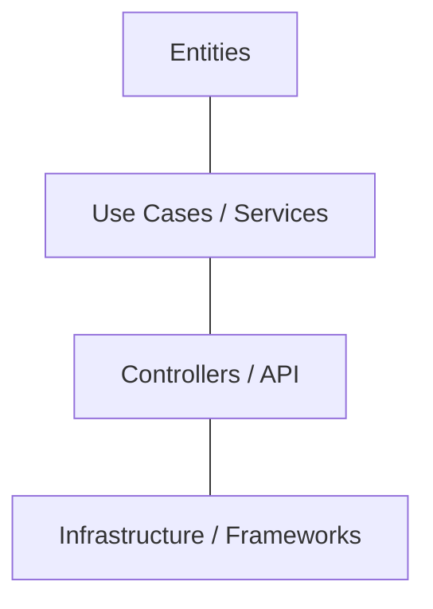
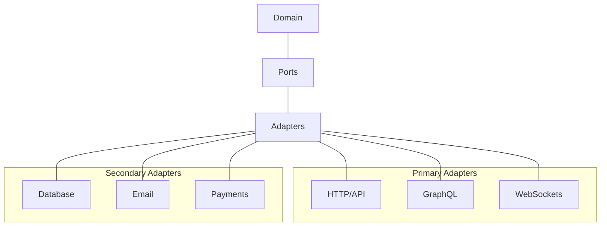
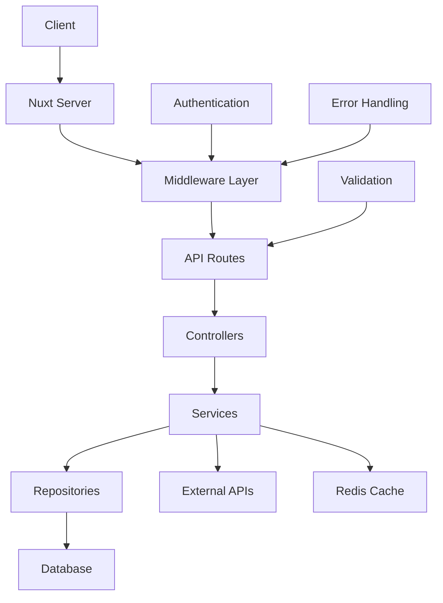
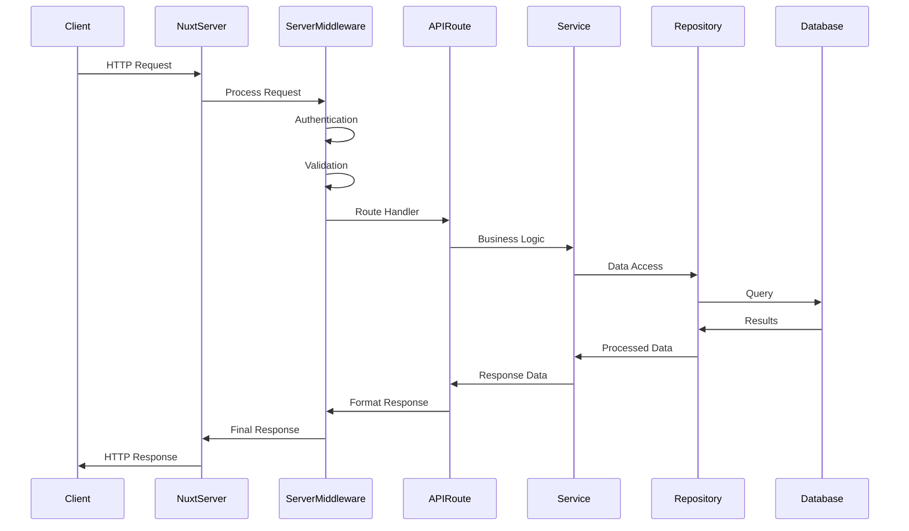

# Бекенд на Nuxt

## Типова архітектура проєкту

Правильна організація структури проєкту має критичне значення для підтримки, масштабування та ефективної розробки Nuxt додатків. У цьому розділі розглянемо типову архітектуру Nuxt проєкту з фокусом на бекенд-частину, основні паттерни проєктування та найкращі практики.

### Структура папок

Nuxt 3 має певну структуру папок, яка ґрунтується на принципі "файл-маршрут" (file-based routing) та "файл-конфігурація" (file-based configuration). Розглянемо рекомендовану структуру Nuxt проєкту з розширеною бекенд-частиною.

#### Базова структура Nuxt проєкту

```
├── .nuxt/                 # Згенеровані файли (автоматично)
├── .output/               # Результат збірки (автоматично)
├── assets/                # Необроблені ресурси (CSS, SCSS, зображення)
├── components/            # Vue компоненти
│   ├── ui/                # UI компоненти (кнопки, поля введення, модалки)
│   ├── layout/            # Компоненти, що формують структуру сторінки
│   ├── forms/             # Компоненти для форм
│   └── shared/            # Спільні компоненти
├── composables/           # Композабли (реактивна логіка)
├── content/               # Markdown файли для Nuxt Content
├── layouts/               # Шаблони сторінок
├── middleware/            # Middleware для клієнта та сервера
├── modules/               # Локальні Nuxt модулі
├── pages/                 # Сторінки (автоматичні маршрути)
├── plugins/               # Плагіни Vue.js
├── public/                # Статичні файли (robots.txt, favicon.ico)
├── server/                # Серверний код
│   ├── api/               # API ендпоїнти
│   ├── middleware/        # Серверні middleware
│   ├── plugins/           # Серверні плагіни
│   ├── routes/            # Серверні маршрути
│   ├── utils/             # Серверні утиліти
│   └── db/                # Взаємодія з базою даних
├── stores/                # Pinia сховища
├── types/                 # TypeScript типи та інтерфейси
├── utils/                 # Спільні утиліти
├── app.vue                # Кореневий компонент
├── nuxt.config.ts         # Конфігурація Nuxt
├── tsconfig.json          # Конфігурація TypeScript
└── package.json           # Залежності та скрипти
```

#### Розширена бекенд структура

Для складних додатків з великою бекенд-частиною рекомендується розширити структуру `server/` директорії:

```
server/
├── api/                   # API ендпоїнти
│   ├── v1/                # API версії
│   │   ├── users/         # Групування за ресурсами
│   │   │   ├── [id].get.ts
│   │   │   ├── [id].put.ts
│   │   │   ├── [id].delete.ts
│   │   │   └── index.get.ts
│   │   └── products/
│   └── v2/                # Нова версія API
├── controllers/           # Бізнес-логіка (опціонально)
│   ├── user.controller.ts
│   └── product.controller.ts
├── db/                    # Взаємодія з базою даних
│   ├── migrations/        # Міграції бази даних
│   ├── seeds/             # Сідери для тестових даних
│   ├── models/            # Моделі даних
│   │   ├── user.model.ts
│   │   └── product.model.ts
│   └── repositories/      # Репозиторії для доступу до даних
│       ├── user.repository.ts
│       └── product.repository.ts
├── middleware/            # Серверні middleware
│   ├── auth.ts            # Аутентифікація
│   ├── logger.ts          # Логування
│   ├── error-handler.ts   # Обробка помилок
│   └── cors.ts            # CORS конфігурація
├── plugins/               # Серверні плагіни
│   ├── prisma.ts          # Ініціалізація ORM
│   ├── redis.ts           # Кешування
│   └── sentry.ts          # Моніторинг помилок
├── services/              # Сервіси для бізнес-логіки
│   ├── auth.service.ts    # Аутентифікація
│   ├── email.service.ts   # Відправка email
│   └── payment.service.ts # Платежі
├── utils/                 # Утиліти
│   ├── encryption.ts      # Шифрування
│   ├── validation.ts      # Валідація
│   └── formatting.ts      # Форматування
├── types/                 # TypeScript типи для сервера
│   ├── request.ts         # Типи запитів
│   └── response.ts        # Типи відповідей
├── config/                # Конфігурації
│   ├── database.ts        # Налаштування БД
│   └── services.ts        # Налаштування сервісів
└── tests/                 # Тести
    ├── integration/       # Інтеграційні тести
    └── unit/              # Модульні тести
```

#### Архітектура API маршрутів в Nuxt 3

Nuxt 3 використовує H3 під капотом для обробки API маршрутів. Файлова система визначає структуру API:

```
server/api/
├── users/
│   ├── [id].get.ts        # GET /api/users/:id
│   ├── [id].put.ts        # PUT /api/users/:id
│   ├── [id].delete.ts     # DELETE /api/users/:id
│   └── index.ts           # GET, POST /api/users
├── auth/
│   ├── login.post.ts      # POST /api/auth/login
│   ├── register.post.ts   # POST /api/auth/register
│   └── logout.post.ts     # POST /api/auth/logout
└── products/
    ├── [id]/
    │   ├── index.get.ts   # GET /api/products/:id
    │   └── reviews.get.ts # GET /api/products/:id/reviews
    └── index.get.ts       # GET /api/products
```

#### Приклад файлів

**Приклад API ендпоїнту:**

```typescript
// server/api/users/[id].get.ts
import { defineEventHandler, getRouterParam, createError } from "h3";
import { prisma } from "~/server/db/client";
import { getUserById } from "~/server/repositories/user.repository";

export default defineEventHandler(async (event) => {
    try {
        const id = getRouterParam(event, "id");

        // Отримання користувача за допомогою репозиторію
        const user = await getUserById(id);

        if (!user) {
            throw createError({
                statusCode: 404,
                message: "User not found",
            });
        }

        return user;
    } catch (error) {
        throw createError({
            statusCode: error.statusCode || 500,
            message: error.message || "Internal server error",
        });
    }
});
```

**Приклад репозиторію:**

```typescript
// server/repositories/user.repository.ts
import { prisma } from "~/server/db/client";
import { User } from "~/server/types/user";

/**
 * Отримання користувача за ID
 */
export async function getUserById(id: string): Promise<User | null> {
    return await prisma.user.findUnique({
        where: { id },
        select: {
            id: true,
            name: true,
            email: true,
            createdAt: true,
            updatedAt: true,
            // Приховуємо чутливу інформацію
            password: false,
        },
    });
}

/**
 * Пошук користувачів з пагінацією
 */
export async function getUsers(
    page: number = 1,
    limit: number = 10,
    search?: string
) {
    const skip = (page - 1) * limit;

    const where = search
        ? {
              OR: [
                  { name: { contains: search, mode: "insensitive" } },
                  { email: { contains: search, mode: "insensitive" } },
              ],
          }
        : {};

    const [users, total] = await Promise.all([
        prisma.user.findMany({
            where,
            select: {
                id: true,
                name: true,
                email: true,
                createdAt: true,
                updatedAt: true,
            },
            skip,
            take: limit,
            orderBy: { createdAt: "desc" },
        }),
        prisma.user.count({ where }),
    ]);

    return {
        data: users,
        meta: {
            page,
            limit,
            total,
            pages: Math.ceil(total / limit),
        },
    };
}
```

**Приклад сервісу:**

```typescript
// server/services/auth.service.ts
import bcrypt from "bcryptjs";
import jwt from "jsonwebtoken";
import { prisma } from "~/server/db/client";
import { createError } from "h3";

export interface LoginPayload {
    email: string;
    password: string;
}

export interface RegisterPayload {
    name: string;
    email: string;
    password: string;
}

export interface TokenResponse {
    accessToken: string;
    refreshToken: string;
    user: {
        id: string;
        name: string;
        email: string;
    };
}

/**
 * Сервіс для роботи з аутентифікацією
 */
export const AuthService = {
    /**
     * Логін користувача
     */
    async login(payload: LoginPayload): Promise<TokenResponse> {
        const user = await prisma.user.findUnique({
            where: { email: payload.email },
        });

        if (!user) {
            throw createError({
                statusCode: 401,
                message: "Invalid credentials",
            });
        }

        const isPasswordValid = await bcrypt.compare(
            payload.password,
            user.password
        );

        if (!isPasswordValid) {
            throw createError({
                statusCode: 401,
                message: "Invalid credentials",
            });
        }

        // Створення JWT токена
        const accessToken = jwt.sign(
            { userId: user.id },
            process.env.JWT_SECRET as string,
            { expiresIn: "15m" }
        );

        const refreshToken = jwt.sign(
            { userId: user.id },
            process.env.JWT_REFRESH_SECRET as string,
            { expiresIn: "7d" }
        );

        // Збереження refresh токена в БД
        await prisma.refreshToken.create({
            data: {
                token: refreshToken,
                userId: user.id,
                expiresAt: new Date(Date.now() + 7 * 24 * 60 * 60 * 1000),
            },
        });

        return {
            accessToken,
            refreshToken,
            user: {
                id: user.id,
                name: user.name,
                email: user.email,
            },
        };
    },

    /**
     * Реєстрація нового користувача
     */
    async register(payload: RegisterPayload): Promise<TokenResponse> {
        // Перевірка на існуючого користувача
        const existingUser = await prisma.user.findUnique({
            where: { email: payload.email },
        });

        if (existingUser) {
            throw createError({
                statusCode: 400,
                message: "User with this email already exists",
            });
        }

        // Хешування паролю
        const hashedPassword = await bcrypt.hash(payload.password, 10);

        // Створення користувача
        const user = await prisma.user.create({
            data: {
                name: payload.name,
                email: payload.email,
                password: hashedPassword,
            },
        });

        // Створення токенів (як у методі login)
        const accessToken = jwt.sign(
            { userId: user.id },
            process.env.JWT_SECRET as string,
            { expiresIn: "15m" }
        );

        const refreshToken = jwt.sign(
            { userId: user.id },
            process.env.JWT_REFRESH_SECRET as string,
            { expiresIn: "7d" }
        );

        await prisma.refreshToken.create({
            data: {
                token: refreshToken,
                userId: user.id,
                expiresAt: new Date(Date.now() + 7 * 24 * 60 * 60 * 1000),
            },
        });

        return {
            accessToken,
            refreshToken,
            user: {
                id: user.id,
                name: user.name,
                email: user.email,
            },
        };
    },

    /**
     * Вихід користувача (видалення refresh токена)
     */
    async logout(refreshToken: string): Promise<void> {
        await prisma.refreshToken.deleteMany({
            where: { token: refreshToken },
        });
    },
};
```

**Приклад middleware:**

```typescript
// server/middleware/auth.ts
import { defineEventHandler, getHeader, createError } from "h3";
import jwt from "jsonwebtoken";
import { prisma } from "~/server/db/client";

export default defineEventHandler(async (event) => {
    // Пропускаємо публічні маршрути
    if (
        event.path.startsWith("/api/auth/login") ||
        event.path.startsWith("/api/auth/register")
    ) {
        return;
    }

    // Перевірка токена авторизації
    const authHeader = getHeader(event, "authorization");

    if (!authHeader || !authHeader.startsWith("Bearer ")) {
        throw createError({
            statusCode: 401,
            message: "Unauthorized",
        });
    }

    const token = authHeader.slice(7);

    try {
        // Верифікація JWT токена
        const decoded = jwt.verify(token, process.env.JWT_SECRET as string) as {
            userId: string;
        };

        // Отримання користувача з БД
        const user = await prisma.user.findUnique({
            where: { id: decoded.userId },
            select: {
                id: true,
                name: true,
                email: true,
                role: true,
            },
        });

        if (!user) {
            throw createError({
                statusCode: 401,
                message: "Invalid token",
            });
        }

        // Додавання користувача до контексту запиту
        event.context.user = user;
    } catch (error) {
        throw createError({
            statusCode: 401,
            message: "Invalid or expired token",
        });
    }
});
```

### Паттерни проєктування

При розробці бекенд-частини Nuxt додатків рекомендується використовувати усталені паттерни проєктування для забезпечення читабельності, підтримуваності та масштабованості коду.

#### 1. Repository Pattern

Репозиторій абстрагує логіку доступу до даних, що дозволяє відокремити бізнес-логіку від деталей зберігання.

```typescript
// server/repositories/product.repository.ts
import { prisma } from "~/server/db/client";
import {
    Product,
    ProductCreateInput,
    ProductUpdateInput,
} from "~/server/types/product";

export const ProductRepository = {
    /**
     * Отримання всіх продуктів з пагінацією
     */
    async findAll(page: number = 1, limit: number = 10, filter?: any) {
        const skip = (page - 1) * limit;

        const where = filter ? { ...filter } : {};

        const [products, total] = await Promise.all([
            prisma.product.findMany({
                where,
                skip,
                take: limit,
                include: {
                    category: true,
                },
                orderBy: { createdAt: "desc" },
            }),
            prisma.product.count({ where }),
        ]);

        return {
            data: products,
            meta: {
                page,
                limit,
                total,
                pages: Math.ceil(total / limit),
            },
        };
    },

    /**
     * Отримання продукту за ID
     */
    async findById(id: string): Promise<Product | null> {
        return await prisma.product.findUnique({
            where: { id },
            include: {
                category: true,
                reviews: {
                    take: 5,
                    orderBy: { createdAt: "desc" },
                    include: {
                        user: {
                            select: {
                                id: true,
                                name: true,
                            },
                        },
                    },
                },
            },
        });
    },

    /**
     * Створення нового продукту
     */
    async create(data: ProductCreateInput): Promise<Product> {
        return await prisma.product.create({
            data,
            include: {
                category: true,
            },
        });
    },

    /**
     * Оновлення продукту
     */
    async update(id: string, data: ProductUpdateInput): Promise<Product> {
        return await prisma.product.update({
            where: { id },
            data,
            include: {
                category: true,
            },
        });
    },

    /**
     * Видалення продукту
     */
    async delete(id: string): Promise<Product> {
        return await prisma.product.delete({
            where: { id },
        });
    },
};
```

#### 2. Service Pattern

Сервіси інкапсулюють бізнес-логіку додатку та використовують репозиторії для доступу до даних.

```typescript
// server/services/product.service.ts
import { ProductRepository } from "~/server/repositories/product.repository";
import {
    Product,
    ProductCreateInput,
    ProductUpdateInput,
} from "~/server/types/product";
import { createError } from "h3";

export const ProductService = {
    /**
     * Отримання всіх продуктів
     */
    async getProducts(page: number = 1, limit: number = 10, filter?: any) {
        return await ProductRepository.findAll(page, limit, filter);
    },

    /**
     * Отримання продукту за ID
     */
    async getProductById(id: string): Promise<Product> {
        const product = await ProductRepository.findById(id);

        if (!product) {
            throw createError({
                statusCode: 404,
                message: "Product not found",
            });
        }

        return product;
    },

    /**
     * Створення нового продукту
     */
    async createProduct(data: ProductCreateInput): Promise<Product> {
        // Додаткова бізнес-логіка перед створенням
        if (data.price < 0) {
            throw createError({
                statusCode: 400,
                message: "Price cannot be negative",
            });
        }

        return await ProductRepository.create(data);
    },

    /**
     * Оновлення продукту
     */
    async updateProduct(
        id: string,
        data: ProductUpdateInput
    ): Promise<Product> {
        // Перевірка існування продукту
        await this.getProductById(id);

        // Додаткова логіка перед оновленням
        if (data.price !== undefined && data.price < 0) {
            throw createError({
                statusCode: 400,
                message: "Price cannot be negative",
            });
        }

        return await ProductRepository.update(id, data);
    },

    /**
     * Видалення продукту
     */
    async deleteProduct(id: string): Promise<Product> {
        // Перевірка існування продукту
        await this.getProductById(id);

        // Додаткова логіка перед видаленням (наприклад, перевірка прав)

        return await ProductRepository.delete(id);
    },
};
```

#### 3. DTO (Data Transfer Object) Pattern

DTO використовується для структурування даних, які передаються між шарами додатку.

```typescript
// server/types/dto/product.dto.ts
import { z } from "zod";

// Схема для валідації даних при створенні продукту
export const ProductCreateSchema = z.object({
    name: z.string().min(3).max(100),
    description: z.string().min(10).optional(),
    price: z.number().positive(),
    stock: z.number().int().nonnegative(),
    categoryId: z.string().uuid().optional(),
});

// Схема для валідації даних при оновленні продукту
export const ProductUpdateSchema = z.object({
    name: z.string().min(3).max(100).optional(),
    description: z.string().min(10).optional(),
    price: z.number().positive().optional(),
    stock: z.number().int().nonnegative().optional(),
    categoryId: z.string().uuid().optional(),
});

// Типи для TypeScript
export type ProductCreateDTO = z.infer<typeof ProductCreateSchema>;
export type ProductUpdateDTO = z.infer<typeof ProductUpdateSchema>;

// Схема для валідації параметрів запиту
export const ProductQuerySchema = z.object({
    page: z.string().transform(Number).optional(),
    limit: z.string().transform(Number).optional(),
    search: z.string().optional(),
    category: z.string().optional(),
    minPrice: z.string().transform(Number).optional(),
    maxPrice: z.string().transform(Number).optional(),
    sort: z
        .enum(["name_asc", "name_desc", "price_asc", "price_desc", "newest"])
        .optional(),
});

export type ProductQueryDTO = z.infer<typeof ProductQuerySchema>;
```

Використання DTO в API ендпоїнтах:

```typescript
// server/api/products/index.post.ts
import { defineEventHandler, readBody } from "h3";
import { ProductService } from "~/server/services/product.service";
import { ProductCreateSchema } from "~/server/types/dto/product.dto";

export default defineEventHandler(async (event) => {
    try {
        // Отримання даних з тіла запиту
        const body = await readBody(event);

        // Валідація даних за допомогою Zod
        const validatedData = ProductCreateSchema.parse(body);

        // Створення продукту через сервіс
        const product = await ProductService.createProduct(validatedData);

        return {
            success: true,
            data: product,
        };
    } catch (error) {
        // Обробка помилок валідації
        if (error.name === "ZodError") {
            return {
                statusCode: 400,
                message: "Validation error",
                errors: error.errors,
            };
        }

        throw error;
    }
});
```

#### 4. Factory Pattern

Фабрики дозволяють створювати об'єкти різних типів з єдиного інтерфейсу.

```typescript
// server/factories/notification.factory.ts
import { EmailNotificationService } from "~/server/services/email-notification.service";
import { PushNotificationService } from "~/server/services/push-notification.service";
import { SMSNotificationService } from "~/server/services/sms-notification.service";

// Інтерфейс для всіх типів сповіщень
export interface NotificationService {
    send(recipient: string, subject: string, content: string): Promise<void>;
}

// Типи сповіщень
export enum NotificationType {
    EMAIL = "email",
    PUSH = "push",
    SMS = "sms",
}

// Фабрика для створення відповідного сервісу сповіщень
export class NotificationFactory {
    static create(type: NotificationType): NotificationService {
        switch (type) {
            case NotificationType.EMAIL:
                return new EmailNotificationService();
            case NotificationType.PUSH:
                return new PushNotificationService();
            case NotificationType.SMS:
                return new SMSNotificationService();
            default:
                throw new Error(`Unknown notification type: ${type}`);
        }
    }
}

// Використання:
// const notificationService = NotificationFactory.create(NotificationType.EMAIL)
// await notificationService.send(user.email, 'Welcome', 'Welcome to our platform!')
```

#### 5. Middleware Pattern

Middleware обробляє запити перед їх потраплянням до обробників маршрутів.

```typescript
// server/middleware/logger.ts
import { defineEventHandler, getRequestURL, getMethod } from "h3";

export default defineEventHandler((event) => {
    const start = Date.now();
    const url = getRequestURL(event);
    const method = getMethod(event);

    // Додавання обробника завершення запиту
    event.node.res.on("finish", () => {
        const duration = Date.now() - start;
        const statusCode = event.node.res.statusCode;

        console.log(
            `[${new Date().toISOString()}] ${method} ${
                url.pathname
            } - ${statusCode} (${duration}ms)`
        );
    });
});
```

#### 6. Adapter Pattern

Адаптер дозволяє використовувати несумісні інтерфейси разом.

```typescript
// server/adapters/payment-gateway.adapter.ts
// Інтерфейс нашої системи
export interface PaymentGateway {
    processPayment(
        amount: number,
        currency: string,
        cardDetails: any
    ): Promise<PaymentResult>;
}

export interface PaymentResult {
    success: boolean;
    transactionId: string;
    message: string;
}

// Зовнішній платіжний шлюз з іншим інтерфейсом
class StripeGateway {
    async createCharge(paymentDetails: {
        amount: number;
        currency: string;
        source: string;
        description: string;
    }) {
        // Логіка роботи з API Stripe
        return {
            id: "stripe_transaction_id",
            status: "succeeded",
            outcome: { type: "authorized" },
        };
    }
}

// Адаптер, який приводить інтерфейс Stripe до нашого інтерфейсу
export class StripePaymentAdapter implements PaymentGateway {
    private stripeGateway: StripeGateway;

    constructor() {
        this.stripeGateway = new StripeGateway();
    }

    async processPayment(
        amount: number,
        currency: string,
        cardDetails: any
    ): Promise<PaymentResult> {
        try {
            // Адаптація інтерфейсу
            const stripeResult = await this.stripeGateway.createCharge({
                amount: amount * 100, // Конвертація у центи для Stripe
                currency,
                source: cardDetails.token,
                description: cardDetails.description || "Payment",
            });

            return {
                success: stripeResult.status === "succeeded",
                transactionId: stripeResult.id,
                message:
                    stripeResult.status === "succeeded"
                        ? "Payment successful"
                        : "Payment failed",
            };
        } catch (error) {
            return {
                success: false,
                transactionId: "",
                message: error.message,
            };
        }
    }
}
```

### Архітектурні підходи

#### 1. Чиста архітектура (Clean Architecture)

Чиста архітектура організовує код у шари з чіткими межами та залежностями, спрямованими всередину.



**Переваги чистої архітектури:**

-   Незалежність від фреймворків
-   Тестованість
-   Незалежність від UI
-   Незалежність від бази даних
-   Незалежність від зовнішніх сервісів

**Реалізація в Nuxt:**

```
server/
├── domain/                 # Домен (бізнес-правила та сутності)
│   ├── entities/           # Бізнес-об'єкти
│   │   ├── user.entity.ts
│   │   └── product.entity.ts
│   └── repositories/       # Інтерфейси репозиторіїв
│       ├── user.repository.interface.ts
│       └── product.repository.interface.ts
├── application/            # Прикладний шар (сценарії використання)
│   ├── services/           # Сервіси з бізнес-логікою
│   │   ├── user.service.ts
│   │   └── product.service.ts
│   └── dtos/               # DTO для взаємодії між шарами
│       ├── user.dto.ts
│       └── product.dto.ts
├── infrastructure/         # Інфраструктура (реалізації інтерфейсів)
│   ├── repositories/       # Реалізації репозиторіїв
│   │   ├── prisma-user.repository.ts
│   │   └── prisma-product.repository.ts
│   ├── database/           # Конфігурація бази даних
│   │   └── prisma.ts
│   └── services/           # Зовнішні сервіси
│       ├── email.service.ts
│       └── payment.service.ts
└── api/                    # API шар
    ├── controllers/        # Контролери (адаптери для HTTP)
    │   ├── user.controller.ts
    │   └── product.controller.ts
    ├── routes/             # Маршрути API
    │   ├── users/
    │   └── products/
    └── middleware/         # Middleware
        ├── auth.ts
        └── validation.ts
```

#### 2. Hexagonal Architecture (Ports and Adapters)

Гексагональна архітектура розділяє логіку додатку на внутрішню (домен) і зовнішню (адаптери).



**Реалізація в Nuxt:**

```
server/
├── domain/                 # Внутрішній шар (бізнес-логіка)
│   ├── entities/           # Бізнес-об'єкти
│   └── services/           # Бізнес-правила та сценарії
├── ports/                  # Порти (інтерфейси)
│   ├── primary/            # Вхідні порти (API)
│   │   ├── user.port.ts
│   │   └── product.port.ts
│   └── secondary/          # Вихідні порти (зовнішні сервіси)
│       ├── repository.port.ts
│       └── email.port.ts
├── adapters/               # Адаптери (реалізації портів)
│   ├── primary/            # Вхідні адаптери
│   │   ├── api/            # HTTP API
│   │   └── websocket/      # WebSocket API
│   └── secondary/          # Вихідні адаптери
│       ├── prisma/         # База даних
│       └── nodemailer/     # Email
└── infrastructure/         # Конфігурація та допоміжні інструменти
    ├── config/
    └── logging/
```

#### 3. Модульна архітектура (Feature-based)

Модульна архітектура організовує код за функціональними можливостями, а не за технічними шарами.

```
server/
├── modules/                # Модулі за функціональністю
│   ├── users/              # Модуль користувачів
│   │   ├── api/            # API ендпоїнти
│   │   ├── services/       # Сервіси
│   │   ├── repositories/   # Репозиторії
│   │   ├── types/          # Типи та інтерфейси
│   │   └── tests/          # Тести
│   ├── products/           # Модуль продуктів
│   │   ├── api/
│   │   ├── services/
│   │   ├── repositories/
│   │   ├── types/
│   │   └── tests/
│   └── auth/               # Модуль автентифікації
│       ├── api/
│       ├── services/
│       ├── middleware/
│       ├── types/
│       └── tests/
├── shared/                 # Спільні компоненти
│   ├── middleware/         # Загальні middleware
│   ├── utils/              # Утиліти
│   └── types/              # Спільні типи
└── infrastructure/         # Інфраструктура
    ├── database/           # Конфігурація БД
    ├── logger/             # Логування
    └── email/              # Email сервіс
```

### Best Practices

#### Організація коду

1. **Організуйте код за функціональністю, а не за типом файлів**

    - Групуйте пов'язані файли разом
    - Використовуйте модульний підхід

2. **Дотримуйтесь принципу Single Responsibility**

    - Кожен файл повинен мати єдину відповідальність
    - Розбивайте великі класи на менші

3. **Відокремлюйте бізнес-логіку від інфраструктури**

    - Бізнес-логіка повинна бути незалежною від фреймворків
    - Використовуйте інтерфейси для абстракції зовнішніх залежностей

4. **Використовуйте TypeScript**
    - Визначайте чіткі інтерфейси
    - Користуйтеся перевагами системи типів

#### API дизайн

1. **Використовуйте RESTful принципи**

    - Ресурси в URL
    - HTTP методи відповідно до дій (GET, POST, PUT, DELETE)
    - Належні коди статусу

2. **Впроваджуйте версіонування API**

    - Використовуйте префікс в URL (наприклад, `/api/v1/`)
    - Або використовуйте заголовок `Accept-Version`

3. **Стандартизуйте відповіді API**
    - Послідовна структура для успішних відповідей та помилок
    - Включайте метадані (пагінація, загальна кількість)

```typescript
// Стандартна структура відповіді
export interface ApiResponse<T> {
    success: boolean;
    data: T;
    meta?: {
        page?: number;
        limit?: number;
        total?: number;
        pages?: number;
    };
}

// Стандартна структура помилки
export interface ApiError {
    success: false;
    error: {
        code: string;
        message: string;
        details?: any;
    };
}

// Приклад використання
export default defineEventHandler(
    async (event): Promise<ApiResponse<Product[]> | ApiError> => {
        try {
            const products = await ProductService.getProducts();

            return {
                success: true,
                data: products.data,
                meta: products.meta,
            };
        } catch (error) {
            return {
                success: false,
                error: {
                    code: error.code || "INTERNAL_ERROR",
                    message: error.message || "An unexpected error occurred",
                    details:
                        process.env.NODE_ENV === "development"
                            ? error.stack
                            : undefined,
                },
            };
        }
    }
);
```

#### Обробка помилок

1. **Створіть централізовану систему обробки помилок**
    - Стандартизуйте формат помилок
    - Використовуйте HTTP коди статусів правильно

```typescript
// server/middleware/error-handler.ts
import { defineEventHandler, createError } from "h3";

export default defineEventHandler((event) => {
    return new Promise((resolve) => {
        // Продовжуємо обробку запиту
        resolve(undefined);
    }).catch((error) => {
        console.error(`Error processing ${event.path}:`, error);

        // Форматування помилки відповідно до стандарту API
        const statusCode = error.statusCode || 500;
        const message = error.message || "Internal Server Error";

        // Налаштування додаткової інформації в режимі розробки
        const details =
            process.env.NODE_ENV === "development"
                ? { stack: error.stack, cause: error.cause }
                : undefined;

        // Повертаємо структуровану помилку
        return {
            success: false,
            error: {
                code: error.code || "INTERNAL_ERROR",
                message,
                details,
            },
        };
    });
});
```

2. **Використовуйте доменні помилки**
    - Створіть спеціалізовані класи помилок для різних ситуацій

```typescript
// server/errors/domain-errors.ts
export class DomainError extends Error {
    constructor(message: string) {
        super(message);
        this.name = this.constructor.name;
    }
}

export class ResourceNotFoundError extends DomainError {
    constructor(resource: string, id: string) {
        super(`${resource} with id ${id} not found`);
        this.statusCode = 404;
        this.code = "RESOURCE_NOT_FOUND";
    }
}

export class ValidationError extends DomainError {
    constructor(message: string, public details: any) {
        super(message);
        this.statusCode = 400;
        this.code = "VALIDATION_ERROR";
    }
}

export class AuthenticationError extends DomainError {
    constructor(message: string = "Authentication required") {
        super(message);
        this.statusCode = 401;
        this.code = "AUTHENTICATION_ERROR";
    }
}

export class AuthorizationError extends DomainError {
    constructor(message: string = "Permission denied") {
        super(message);
        this.statusCode = 403;
        this.code = "AUTHORIZATION_ERROR";
    }
}
```

#### Безпека

1. **Використовуйте middleware для захисту маршрутів**

    - Перевіряйте аутентифікацію
    - Валідуйте авторизацію

2. **Впроваджуйте валідацію вхідних даних**

    - Перевіряйте всі дані, що надходять від клієнта
    - Використовуйте бібліотеки як Zod або Joi

3. **Захищайтеся від вразливостей**
    - Використовуйте helmet для HTTP заголовків
    - Налаштуйте CORS правильно
    - Захистіть від XSS, CSRF, SQL-ін'єкцій

```typescript
// server/middleware/security.ts
import { defineEventHandler, getRequestURL } from "h3";

export default defineEventHandler((event) => {
    const url = getRequestURL(event);

    // Додавання security заголовків
    event.node.res.setHeader("X-Content-Type-Options", "nosniff");
    event.node.res.setHeader("X-Frame-Options", "DENY");
    event.node.res.setHeader("X-XSS-Protection", "1; mode=block");

    // Налаштування Content-Security-Policy
    event.node.res.setHeader(
        "Content-Security-Policy",
        "default-src 'self'; script-src 'self' 'unsafe-inline'; style-src 'self' 'unsafe-inline'; img-src 'self' data:; font-src 'self' data:;"
    );

    // Налаштування CORS для API
    if (url.pathname.startsWith("/api/")) {
        event.node.res.setHeader(
            "Access-Control-Allow-Origin",
            process.env.ALLOWED_ORIGINS || "*"
        );
        event.node.res.setHeader(
            "Access-Control-Allow-Methods",
            "GET, POST, PUT, DELETE, OPTIONS"
        );
        event.node.res.setHeader(
            "Access-Control-Allow-Headers",
            "Content-Type, Authorization"
        );

        // Обробка preflight запитів
        if (event.node.req.method === "OPTIONS") {
            event.node.res.statusCode = 204;
            event.node.res.end();
            return;
        }
    }
});
```

#### Тестування

1. **Пишіть тести для бізнес-логіки**

    - Модульні тести для сервісів
    - Інтеграційні тести для API

2. **Використовуйте мокування для зовнішніх залежностей**
    - Мокуйте бази даних та зовнішні API
    - Використовуйте in-memory бази для тестів

```typescript
// server/services/__tests__/product.service.test.ts
import { ProductService } from "../product.service";
import { ProductRepository } from "~/server/repositories/product.repository";

// Мокування репозиторію
jest.mock("~/server/repositories/product.repository", () => ({
    ProductRepository: {
        findById: jest.fn(),
        findAll: jest.fn(),
        create: jest.fn(),
        update: jest.fn(),
        delete: jest.fn(),
    },
}));

describe("ProductService", () => {
    beforeEach(() => {
        jest.clearAllMocks();
    });

    describe("getProductById", () => {
        it("should return product when found", async () => {
            // Налаштування моку
            const mockProduct = { id: "1", name: "Test Product", price: 100 };
            (ProductRepository.findById as jest.Mock).mockResolvedValue(
                mockProduct
            );

            // Виклик методу
            const result = await ProductService.getProductById("1");

            // Перевірка результату
            expect(result).toEqual(mockProduct);
            expect(ProductRepository.findById).toHaveBeenCalledWith("1");
        });

        it("should throw error when product not found", async () => {
            // Налаштування моку
            (ProductRepository.findById as jest.Mock).mockResolvedValue(null);

            // Перевірка, що метод викидає помилку
            await expect(ProductService.getProductById("1")).rejects.toThrow();
        });
    });

    describe("createProduct", () => {
        it("should validate price before creating", async () => {
            // Підготовка даних
            const productData = { name: "Test", price: -10 };

            // Перевірка, що метод викидає помилку валідації
            await expect(
                ProductService.createProduct(productData)
            ).rejects.toThrow("Price cannot be negative");

            // Перевірка, що репозиторій не викликався
            expect(ProductRepository.create).not.toHaveBeenCalled();
        });

        it("should create valid product", async () => {
            // Підготовка даних
            const productData = { name: "Test", price: 100 };
            const createdProduct = { id: "1", ...productData };

            // Налаштування моку
            (ProductRepository.create as jest.Mock).mockResolvedValue(
                createdProduct
            );

            // Виклик методу
            const result = await ProductService.createProduct(productData);

            // Перевірка результату
            expect(result).toEqual(createdProduct);
            expect(ProductRepository.create).toHaveBeenCalledWith(productData);
        });
    });
});
```

#### Документація

1. **Документуйте API**

    - Використовуйте OpenAPI (Swagger)
    - Додавайте JSDoc коментарі

2. **Створіть README з інструкціями**
    - Опишіть структуру проєкту
    - Додайте інструкції з налаштування та запуску

#### Продуктивність

1. **Оптимізуйте запити до бази даних**

    - Вибирайте тільки необхідні поля
    - Використовуйте індекси
    - Впроваджуйте пагінацію

2. **Кешуйте дані, де це доречно**

    - Використовуйте Redis для кешування
    - Налаштуйте TTL для різних типів даних

3. **Обробляйте великі навантаження**
    - Використовуйте черги для важких операцій
    - Розбивайте операції на менші частини

### Діаграми та схеми

#### Архітектура API в Nuxt проєкті



#### Потік запиту в Nuxt 3 Бекенд



#### Порівняння підходів до архітектури

```
┌────────────────────────────────────────────────────────────────┐
│ Архітектура        │ Переваги                │ Недоліки        │
├───────────────────┬──────────────────────────┬─────────────────┤
│ Монолітна         │ Простота розробки        │ Складне         │
│                   │ Єдина кодова база        │ масштабування   │
│                   │ Легше розгортання        │ Важче           │
│                   │                          │ підтримувати    │
├───────────────────┼──────────────────────────┼─────────────────┤
│ Чиста архітектура │ Незалежність від         │ Більше          │
│                   │ зовнішніх систем         │ початкових      │
│                   │ Краща тестованість       │ зусиль          │
│                   │ Гнучкість до змін        │ Більше коду     │
├───────────────────┼──────────────────────────┼─────────────────┤
│ Гексагональна     │ Ізоляція бізнес-логіки   │ Більше          │
│                   │ Замінні адаптери         │ абстракцій      │
│                   │ Незалежне тестування     │ Складніше       │
│                   │                          │ для новачків    │
├───────────────────┼──────────────────────────┼─────────────────┤
│ Модульна          │ Організація за           │ Можливий        │
│                   │ функціональністю         │ дублювання      │
│                   │ Легше масштабувати       │ коду            │
│                   │ команду                  │ Складніша       │
│                   │ Краща ізоляція           │ інтеграція      │
└───────────────────┴──────────────────────────┴─────────────────┘
```

### Типові файли проєкту

#### nuxt.config.ts

```typescript
// nuxt.config.ts
export default defineNuxtConfig({
    // Налаштування режиму SSR (Server-Side Rendering)
    ssr: true,

    // Модулі Nuxt
    modules: [
        "@pinia/nuxt",
        "@nuxtjs/tailwindcss",
        "nuxt-security",
        "@nuxt/content",
    ],

    // Налаштування TypeScript
    typescript: {
        strict: true,
        typeCheck: true,
    },

    // Налаштування серверної частини
    nitro: {
        preset: "node-server",
        // Правила маршрутизації для кешування та проксіювання
        routeRules: {
            "/api/public/**": { cache: { maxAge: 60 } },
            "/api/private/**": { cache: false },
        },
        // Налаштування зберігання даних (кешування, сесії тощо)
        storage: {
            redis: {
                driver: "redis",
                host: process.env.REDIS_HOST || "localhost",
                port: parseInt(process.env.REDIS_PORT || "6379"),
                password: process.env.REDIS_PASSWORD,
            },
        },
        // Публічні змінні оточення (доступні на клієнті та сервері)
        publicConfig: {
            apiBaseUrl: process.env.API_BASE_URL,
        },
    },

    // Налаштування рантайму
    runtimeConfig: {
        // Приватні змінні оточення (тільки на сервері)
        databaseUrl: process.env.DATABASE_URL,
        jwtSecret: process.env.JWT_SECRET,
        // Публічні змінні (доступні на клієнті)
        public: {
            apiBaseUrl: process.env.API_BASE_URL,
        },
    },

    // Налаштування для розробки
    devtools: {
        enabled: process.env.NODE_ENV === "development",
    },
});
```

#### Prisma клієнт

```typescript
// server/db/client.ts
import { PrismaClient } from "@prisma/client";

// Створення єдиного екземпляра Prisma
const prismaGlobal = globalThis as unknown as {
    prisma: PrismaClient | undefined;
};

export const prisma =
    prismaGlobal.prisma ??
    new PrismaClient({
        log:
            process.env.NODE_ENV === "development"
                ? ["query", "error", "warn"]
                : ["error"],
        errorFormat: "pretty",
    });

if (process.env.NODE_ENV !== "production") {
    prismaGlobal.prisma = prisma;
}
```

#### Prisma схема

```prisma
// prisma/schema.prisma
generator client {
  provider = "prisma-client-js"
}

datasource db {
  provider = "postgresql"
  url      = env("DATABASE_URL")
}

model User {
  id        String   @id @default(uuid())
  email     String   @unique
  name      String
  password  String
  role      Role     @default(USER)
  createdAt DateTime @default(now())
  updatedAt DateTime @updatedAt

  products    Product[]
  refreshTokens RefreshToken[]
}

model RefreshToken {
  id        String   @id @default(uuid())
  token     String   @unique
  userId    String
  expiresAt DateTime
  createdAt DateTime @default(now())

  user User @relation(fields: [userId], references: [id], onDelete: Cascade)
}

model Product {
  id          String   @id @default(uuid())
  name        String
  description String?
  price       Float
  stock       Int
  authorId    String
  categoryId  String?
  createdAt   DateTime @default(now())
  updatedAt   DateTime @updatedAt

  author   User     @relation(fields: [authorId], references: [id])
  category Category? @relation(fields: [categoryId], references: [id])
  reviews  Review[]

  @@index([authorId])
  @@index([categoryId])
}

model Category {
  id        String   @id @default(uuid())
  name      String   @unique
  createdAt DateTime @default(now())
  updatedAt DateTime @updatedAt

  products Product[]
}

model Review {
  id        String   @id @default(uuid())
  text      String
  rating    Int
  userId    String
  productId String
  createdAt DateTime @default(now())
  updatedAt DateTime @updatedAt

  user    User    @relation(fields: [userId], references: [id])
  product Product @relation(fields: [productId], references: [id], onDelete: Cascade)

  @@index([userId])
  @@index([productId])
}

enum Role {
  USER
  ADMIN
}
```

### Висновок

Проєктування архітектури бекенд-частини Nuxt додатку є критично важливим для створення масштабованих, підтримуваних та надійних рішень. Nuxt 3 з його вбудованим сервером Nitro надає потужний фундамент для реалізації різних архітектурних підходів, від монолітної до мікросервісної.

Дотримання принципів чистої архітектури, використання сучасних паттернів проєктування та найкращих практик дозволяє створювати ефективні API та серверні рішення, які легко масштабуються та підтримуються.

При проєктуванні нового Nuxt додатку варто зважати на особливості проєкту, розмір команди та вимоги до системи, щоб обрати найбільш доречну архітектуру та структуру папок. Незалежно від обраного підходу, ключовими є принципи організації, розділення відповідальності та тестованості коду.
