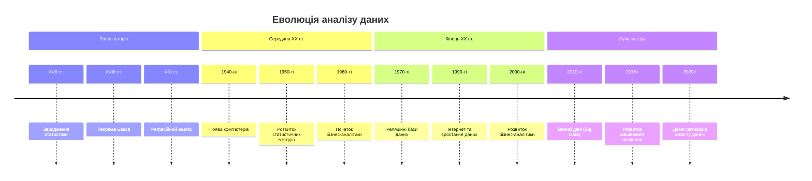
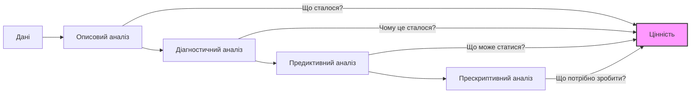
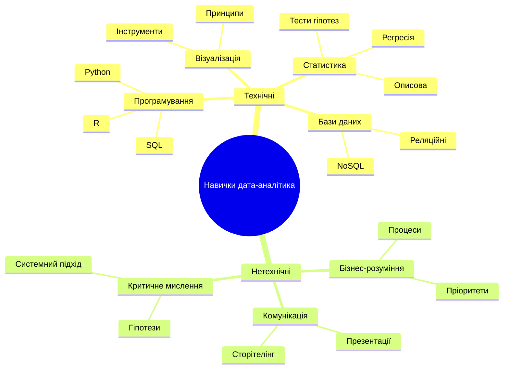

# Введення в аналіз даних

## Зміст розділу

-   [Що таке аналіз даних](#що-таке-аналіз-даних)
-   [Історичний розвиток аналізу даних](#історичний-розвиток-аналізу-даних)
-   [Типи аналізу даних](#типи-аналізу-даних)
-   [Ключові навички дата-аналітика](#ключові-навички-дата-аналітика)
-   [Галузі застосування аналізу даних](#галузі-застосування-аналізу-даних)
-   [Етичні аспекти роботи з даними](#етичні-аспекти-роботи-з-даними)

## Що таке аналіз даних

Аналіз даних (Data Analysis) — це процес вивчення, очищення, трансформації та моделювання даних з метою виявлення корисної інформації, формування висновків та підтримки прийняття рішень. У сучасному світі, що керується даними, аналіз даних став фундаментальною дисципліною, яка лежить в основі більшості бізнес-стратегій та наукових досліджень.

Аналіз даних можна розглядати як міст між сирими даними та практичними висновками. Він дозволяє перетворити розрізнені факти на структуровані знання, що можуть бути використані для вирішення конкретних завдань.

На глибинному рівні аналіз даних поєднує методології з різних галузей:

-   Статистика для кількісної оцінки та перевірки гіпотез
-   Інформатика для ефективної обробки даних
-   Предметні знання для контекстуальної інтерпретації результатів
-   Візуалізація для наочного представлення виявлених закономірностей

### Різниця між даними та інформацією

Важливо розуміти фундаментальну різницю між даними та інформацією:

| Дані (Data)                                   | Інформація (Information)                                            |
| --------------------------------------------- | ------------------------------------------------------------------- |
| Сирі, неструктуровані факти                   | Організовані, проаналізовані та контекстуалізовані дані             |
| Представлені як числа, текст, зображення тощо | Має значення та корисність для користувача                          |
| Не мають самостійної цінності                 | Використовується для прийняття рішень                               |
| Наприклад: 37.5, "Київ", 01.01.2025           | Наприклад: "Температура в Києві 1 січня 2025 року становила 37.5°C" |

Трансформація даних в інформацію, а інформації в знання — це основний шлях аналізу даних.

## Історичний розвиток аналізу даних

Аналіз даних має довгу історію, яка еволюціонувала разом із технологічним прогресом та накопиченням знань.

### Рання історія (до 1900-х років)

-   **Початок статистики**: Зародження в XVII столітті з робіт Джона Граунта щодо таблиць смертності
-   **Бейєсівський підхід**: Томас Баєс розробив теорему, що стала основою ймовірнісного підходу до аналізу даних
-   **Регресійний аналіз**: Френсіс Гальтон ввів поняття регресії до середнього в 1886 році

### Середина XX століття

-   **Поява комп'ютерів**: Автоматизація розрахунків та можливість обробки більших обсягів даних
-   **Розвиток статистичних методів**: Розробка дисперсійного аналізу, факторного аналізу
-   **Бізнес-аналітика**: Початок використання даних для прийняття бізнес-рішень

### Кінець XX - початок XXI століття

-   **Поява реляційних баз даних**: Структуроване зберігання та ефективний доступ до даних
-   **Розвиток інтернету**: Експоненційне зростання обсягів доступних даних
-   **Бізнес-аналітика 2.0**: Розвиток OLAP, сховищ даних та інструментів візуалізації

### Сучасна ера (2010-ті і далі)

-   **Великі дані (Big Data)**: Можливість обробки надзвичайно великих і складних наборів даних
-   **Машинне навчання**: Автоматизоване виявлення закономірностей та прогнозування
-   **Штучний інтелект**: Розширення можливостей аналізу на неструктуровані дані
-   **Хмарні обчислення**: Масштабована обробка даних без значних капітальних вкладень

## Типи аналізу даних

Сучасний аналіз даних можна класифікувати за кількома різними підходами та цілями. Кожен тип аналізу відповідає на різні питання та служить різним потребам.

### За ступенем складності та зрілості

#### 1. Описовий аналіз (Descriptive Analysis)

-   **Відповідає на питання**: "Що сталося?"
-   **Фокус**: Узагальнення минулих даних та подій
-   **Методи**: Агрегація даних, описова статистика, візуалізація
-   **Приклади**: Щомісячні звіти про продажі, демографічні зведення

#### 2. Діагностичний аналіз (Diagnostic Analysis)

-   **Відповідає на питання**: "Чому це сталося?"
-   **Фокус**: Пошук причинно-наслідкових зв'язків
-   **Методи**: Деталізація даних, кореляційний аналіз, виявлення аномалій
-   **Приклади**: Аналіз причин падіння продажів, розслідування проблем якості

#### 3. Предиктивний аналіз (Predictive Analysis)

-   **Відповідає на питання**: "Що може статися?"
-   **Фокус**: Прогнозування майбутніх тенденцій
-   **Методи**: Статистичне моделювання, машинне навчання, аналіз часових рядів
-   **Приклади**: Прогноз попиту, оцінка ризику дефолту клієнта

#### 4. Прескриптивний аналіз (Prescriptive Analysis)

-   **Відповідає на питання**: "Що потрібно зробити?"
-   **Фокус**: Рекомендації для оптимальних дій
-   **Методи**: Оптимізація, симуляція, експертні системи
-   **Приклади**: Оптимізація маршрутів доставки, підбір персоналізованих рекомендацій

### За технологічним підходом

#### 1. Традиційний аналіз (Traditional Analytics)

-   Використання структурованих даних з реляційних баз даних
-   Обробка історичних даних у пакетному режимі
-   Статистичні методи та запити SQL

#### 2. Бізнес-аналітика (Business Intelligence)

-   Акцент на візуалізації та звітності
-   Інтерактивні дашборди та OLAP-куби
-   Орієнтація на бізнес-користувачів, а не технічних спеціалістів

#### 3. Аналіз великих даних (Big Data Analytics)

-   Обробка надзвичайно великих обсягів даних
-   Використання розподілених систем (Hadoop, Spark)
-   Включає структуровані та неструктуровані дані
-   Масштабованість та швидкість обробки

#### 4. Розширена аналітика (Advanced Analytics)

-   Включає машинне навчання та статистичне моделювання
-   Глибоке навчання для аналізу складних даних
-   Природна обробка мови, комп'ютерний зір

## Ключові навички дата-аналітика

Успішний дата-аналітик повинен володіти різноманітними навичками, які можна умовно розділити на кілька категорій:

### Технічні навички

#### 1. Програмування та інструменти

-   **Мови програмування**: Python, R, SQL
-   **Бібліотеки для аналізу даних**: Pandas, NumPy, dplyr
-   **Середовища розробки**: Jupyter Notebook, RStudio
-   **Системи контролю версій**: Git

#### 2. Статистика та математика

-   Описова статистика
-   Теорія ймовірності
-   Статистичні тести
-   Регресійний аналіз

#### 3. Бази даних

-   Реляційні бази даних (MySQL, PostgreSQL)
-   Проектування схем даних
-   Оптимізація запитів
-   Основи NoSQL баз даних

#### 4. Візуалізація даних

-   Основні типи візуалізації
-   Інструменти: Matplotlib, ggplot2, Tableau, Power BI
-   Принципи ефективної візуалізації
-   Інтерактивні дашборди

### Нетехнічні навички

#### 1. Бізнес-розуміння

-   Розуміння бізнес-процесів
-   Формулювання бізнес-проблем у термінах аналізу даних
-   Оцінка вартості та пріоритетності рішень
-   Розуміння галузевої специфіки

#### 2. Комунікативні навички

-   Презентація результатів нетехнічній аудиторії
-   Візуальне оповідання історій на основі даних (Data Storytelling)
-   Формулювання чітких висновків та рекомендацій
-   Документування аналізу та процесів

#### 3. Критичне мислення

-   Формулювання та перевірка гіпотез
-   Розпізнавання хибних кореляцій
-   Уважність до деталей та виявлення аномалій
-   Системний підхід до аналізу проблем

## Галузі застосування аналізу даних

Аналіз даних знаходить застосування практично в усіх сферах людської діяльності. Розглянемо основні галузі та приклади їх застосування:

### Бізнес та маркетинг

-   **Сегментація клієнтів**: Розподіл клієнтської бази на групи для таргетованого маркетингу
-   **Аналіз продажів**: Виявлення тенденцій, сезонності та каналів продажів
-   **Аналіз поведінки користувачів**: Дослідження шляху користувача на веб-сайті або в додатку
-   **Прогнозування попиту**: Оцінка майбутнього попиту на товари та послуги

### Фінанси та банківська сфера

-   **Оцінка кредитних ризиків**: Аналіз ймовірності дефолту позичальника
-   **Виявлення шахрайства**: Ідентифікація підозрілих транзакцій
-   **Алгоритмічна торгівля**: Автоматизована торгівля на фінансових ринках
-   **Управління інвестиційним портфелем**: Оптимізація співвідношення ризику та прибутковості

### Охорона здоров'я

-   **Медична діагностика**: Аналіз медичних зображень та лабораторних даних
-   **Персоналізована медицина**: Підбір оптимального лікування на основі генетичних даних
-   **Епідеміологічні дослідження**: Прогнозування поширення захворювань
-   **Оптимізація медичних послуг**: Підвищення ефективності роботи лікарень

### Виробництво та логістика

-   **Контроль якості**: Виявлення відхилень у виробничому процесі
-   **Предиктивне обслуговування**: Прогнозування виходу з ладу обладнання
-   **Оптимізація ланцюгів поставок**: Мінімізація витрат та часу доставки
-   **Управління запасами**: Оптимізація рівнів запасів на складах

### Державний сектор

-   **Розумні міста**: Аналіз транспортних потоків, споживання енергії
-   **Боротьба зі злочинністю**: Прогнозування кримінальної активності
-   **Податковий аналіз**: Виявлення ухилення від сплати податків
-   **Соціальна політика**: Оцінка ефективності соціальних програм

### Наука та дослідження

-   **Геноміка**: Аналіз генетичних даних
-   **Кліматологія**: Моделювання кліматичних змін
-   **Астрономія**: Обробка даних з телескопів
-   **Соціологія**: Аналіз соціальних тенденцій та поведінки

### Спорт

-   **Аналіз продуктивності гравців**: Оцінка ефективності спортсменів
-   **Тактичний аналіз**: Розробка оптимальних стратегій гри
-   **Запобігання травмам**: Прогнозування ризику травмування
-   **Скаутинг та рекрутинг**: Виявлення талановитих гравців

## Етичні аспекти роботи з даними

У міру того, як аналіз даних стає все більш впливовим у прийнятті рішень, зростає важливість етичних аспектів роботи з даними.

### Основні етичні проблеми

#### 1. Конфіденційність та приватність

-   Збір та зберігання персональних даних
-   Анонімізація та деідентифікація даних
-   Згода на використання даних
-   Право на забуття та контроль над власними даними

#### 2. Упередженість (Bias) та справедливість

-   Системна упередженість у даних
-   Дискримінація на основі алгоритмічних рішень
-   Репрезентативність різних демографічних груп
-   Справедливість у критичних рішеннях (кредитування, найм, медицина)

#### 3. Прозорість та пояснюваність

-   "Чорні скриньки" складних моделей
-   Право на пояснення алгоритмічних рішень
-   Відповідальність за автоматизовані рішення
-   Аудит алгоритмів та процесів аналізу

#### 4. Безпека даних

-   Захист від несанкціонованого доступу
-   Запобігання витокам даних
-   Стійкість до маніпуляцій та атак
-   Належна утилізація даних

### Етичні принципи для дата-аналітиків

1. **Відповідальність**: Визнання власної відповідальності за наслідки аналізу
2. **Прозорість**: Забезпечення зрозумілості методології та обмежень аналізу
3. **Чесність**: Об'єктивне представлення результатів, уникнення маніпуляцій
4. **Конфіденційність**: Захист приватності осіб, чиї дані аналізуються
5. **Справедливість**: Забезпечення рівності та справедливості в аналізі та висновках
6. **Професіоналізм**: Постійне вдосконалення власних навичок та знань
7. **Суспільне благо**: Урахування ширшого впливу аналізу на суспільство

### Нормативні та законодавчі рамки

-   **GDPR (General Data Protection Regulation)**: Європейський регламент про захист даних
-   **CCPA (California Consumer Privacy Act)**: Каліфорнійський закон про приватність
-   **HIPAA (Health Insurance Portability and Accountability Act)**: Закон США про медичну інформацію
-   **Галузеві стандарти**: ISO 27001, NIST та інші

Дата-аналітики повинні бути обізнані з відповідними нормативними актами та дотримуватися їх при роботі з даними.

## Висновки

Аналіз даних є фундаментальною дисципліною, яка трансформує сирі дані в цінну інформацію та знання. Від простого описового аналізу до складного прескриптивного аналізу, від традиційних статистичних методів до передових алгоритмів машинного навчання — аналіз даних охоплює широкий спектр підходів та технологій.

Успішний дата-аналітик поєднує технічні навички з бізнес-розумінням та етичними принципами. Він не лише знаходить закономірності в даних, але й інтерпретує їх у відповідному контексті, ефективно комунікує результати та забезпечує етичне використання даних.

У наступних розділах ми детальніше розглянемо конкретні методи, інструменти та технології, які використовуються в аналізі даних, починаючи з ролі дата-аналітика в сучасному світі.

---

**Попередня тема**: [Підручник з аналізу даних: від основ до експертного рівня](./інструкції.md)  
**Наступна тема**: [Роль дата-аналітика в сучасному світі](./02_роль_дата_аналітика.md)
