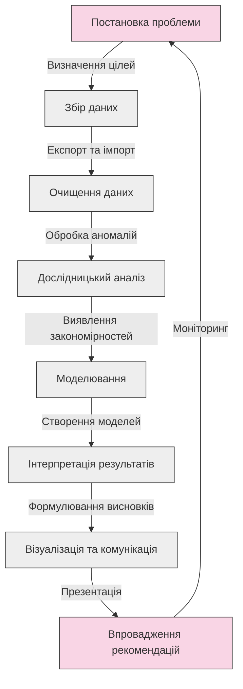
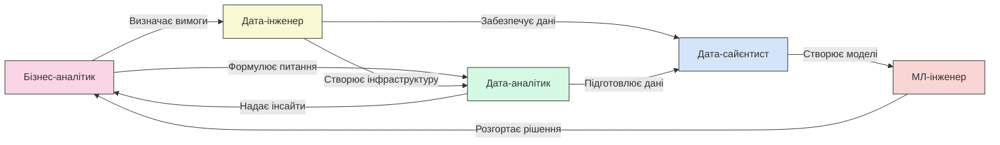
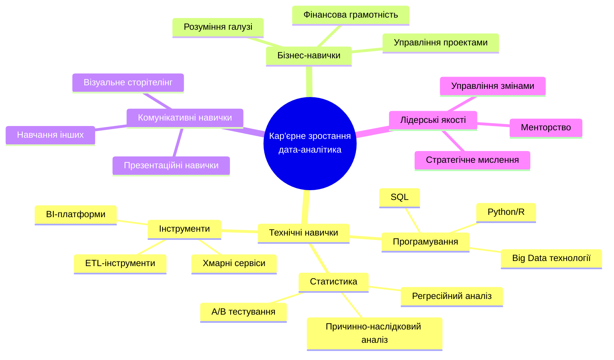
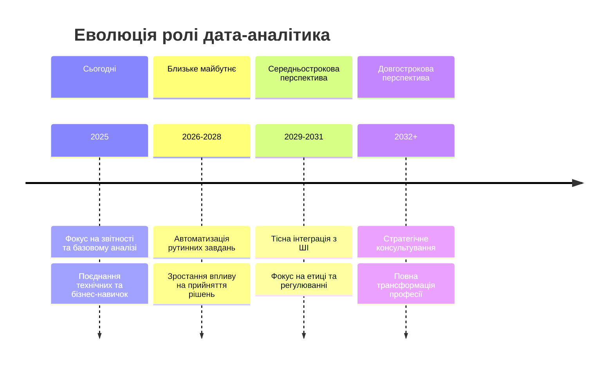

# Роль дата-аналітика в сучасному світі

## Зміст розділу

-   [Хто такий дата-аналітик](#хто-такий-дата-аналітик)
-   [Обов'язки та відповідальності](#обовязки-та-відповідальності)
-   [Порівняння з іншими даними професіями](#порівняння-з-іншими-даними-професіями)
-   [Кар'єрний шлях дата-аналітика](#карєрний-шлях-дата-аналітика)
-   [Вплив на бізнес та суспільство](#вплив-на-бізнес-та-суспільство)
-   [Майбутнє професії](#майбутнє-професії)

## Хто такий дата-аналітик

Дата-аналітик (Data Analyst) — це фахівець, який збирає, обробляє та аналізує дані для отримання значущих висновків, що допомагають організаціям приймати обґрунтовані рішення. Дата-аналітики відіграють критичну роль у перетворенні "сирих" даних на корисну інформацію та рекомендації.

### Ключові характеристики дата-аналітика

-   **Технічна експертиза**: Володіння інструментами аналізу даних та статистичними методами
-   **Аналітичне мислення**: Здатність виявляти закономірності та тренди в даних
-   **Бізнес-орієнтованість**: Розуміння бізнес-контексту та здатність перекладати технічні знахідки на мову бізнесу
-   **Комунікаційні навички**: Вміння чітко та переконливо представляти результати аналізу
-   **Допитливість**: Постійне прагнення до дослідження даних та знаходження нових інсайтів
-   **Увага до деталей**: Ретельність та точність у роботі з даними

### Історична еволюція ролі

Роль дата-аналітика пройшла значну еволюцію протягом останніх десятиліть:

#### 1970-1980-ті роки: Зародження професії

-   Фокус на статистичному аналізі
-   Використання мейнфреймів та спеціалізованого програмного забезпечення
-   Обмежений доступ до даних
-   Аналіз переважно для наукових та державних цілей

#### 1990-2000-ні роки: Становлення бізнес-аналітики

-   Поява персональних комп'ютерів та доступних інструментів (Excel, SPSS)
-   Розвиток реляційних баз даних та SQL
-   Інтеграція аналізу даних у бізнес-процеси
-   Формування ролі бізнес-аналітика

#### 2010-ті роки: Ера великих даних

-   Експоненційне зростання обсягів даних
-   Поява нових інструментів для обробки великих даних (Hadoop, Spark)
-   Розвиток програмних мов та бібліотек для аналізу (Python, R)
-   Підвищення вимог до технічних навичок

#### 2020-ті роки і далі: Ера автоматизації та ШІ

-   Інтеграція машинного навчання в аналітичні процеси
-   Демократизація інструментів аналізу даних
-   Фокус на етичному використанні даних та алгоритмів
-   Поглиблення спеціалізації та міждисциплінарних навичок

## Обов'язки та відповідальності

Дата-аналітики виконують широкий спектр завдань, які можуть варіюватися залежно від галузі, розміру організації та конкретної позиції. Однак існує низка типових обов'язків, притаманних більшості ролей.

### Основні функціональні обов'язки

#### 1. Збір та підготовка даних

-   Визначення релевантних джерел даних
-   Екстракція даних з різних систем (бази даних, API, файли)
-   Очищення даних від помилок, дублікатів та аномалій
-   Трансформація даних у формат, придатний для аналізу
-   Інтеграція даних з різних джерел

#### 2. Аналіз даних

-   Проведення описового аналізу (середні значення, розподіли, тренди)
-   Застосування статистичних методів для перевірки гіпотез
-   Виявлення кореляцій та причинно-наслідкових зв'язків
-   Сегментація та кластеризація даних
-   Проведення порівняльного аналізу

#### 3. Візуалізація та комунікація

-   Створення інформативних візуалізацій (графіки, діаграми, дашборди)
-   Підготовка звітів та презентацій
-   Представлення результатів зацікавленим сторонам
-   Переклад технічних знахідок на мову бізнесу
-   Формулювання рекомендацій на основі аналізу

#### 4. Моніторинг та оптимізація

-   Розробка та відстеження ключових показників ефективності (KPI)
-   Моніторинг бізнес-процесів та виявлення аномалій
-   Оцінка ефективності впроваджених рішень
-   Постійне вдосконалення аналітичних методів та процесів

### Життєвий цикл аналітичного проєкту

Типовий аналітичний проєкт включає наступні етапи, в яких дата-аналітик бере активну участь:

### Відповідальність перед стейкхолдерами

Дата-аналітики несуть відповідальність перед різними зацікавленими сторонами:

#### Перед організацією

-   Забезпечення точності та надійності аналізу
-   Дотримання конфіденційності даних та безпеки інформації
-   Створення цінності через генерацію корисних інсайтів
-   Оптимізація використання ресурсів

#### Перед користувачами та клієнтами

-   Захист персональних даних
-   Уникнення упередженості в аналізі та рекомендаціях
-   Забезпечення прозорості аналітичних методів
-   Етичне використання даних

#### Перед суспільством

-   Уникнення створення або посилення соціальної нерівності
-   Відповідальне використання алгоритмів та автоматизованих рішень
-   Врахування ширших соціальних наслідків аналізу
-   Сприяння інформованому прийняттю рішень

## Порівняння з іншими даними професіями

Сфера даних (Data field) включає низку професій, які часто плутають між собою. Розуміння відмінностей між цими ролями допомагає визначити кар'єрний шлях та необхідні навички.

### Основні професії у сфері даних

#### Дата-аналітик (Data Analyst)

-   **Фокус**: Аналіз історичних даних для відповіді на бізнес-питання
-   **Ключові навички**: SQL, Excel, BI-інструменти, базова статистика
-   **Інструменти**: Tableau, Power BI, Python/R (базовий рівень)
-   **Типові завдання**: Звітність, створення дашбордів, сегментація клієнтів

#### Дата-сайєнтист (Data Scientist)

-   **Фокус**: Розробка предиктивних моделей та виявлення складних закономірностей
-   **Ключові навички**: Машинне навчання, глибока статистика, програмування
-   **Інструменти**: Python, R (просунутий рівень), TensorFlow, PyTorch
-   **Типові завдання**: Прогнозне моделювання, кластеризація, NLP, комп'ютерний зір

#### Дата-інженер (Data Engineer)

-   **Фокус**: Розробка та підтримка інфраструктури для обробки даних
-   **Ключові навички**: Програмування, архітектура баз даних, ETL-процеси
-   **Інструменти**: SQL, NoSQL, Hadoop, Spark, Airflow
-   **Типові завдання**: Створення дата-пайплайнів, проектування сховищ даних

#### Бізнес-аналітик (Business Analyst)

-   **Фокус**: Аналіз бізнес-процесів та потреб користувачів
-   **Ключові навички**: Бізнес-аналіз, документування вимог, процесне моделювання
-   **Інструменти**: Excel, Jira, системи управління проектами
-   **Типові завдання**: Аналіз вимог, оптимізація процесів, оцінка ефективності

#### МЛ-інженер (Machine Learning Engineer)

-   **Фокус**: Реалізація та розгортання моделей машинного навчання
-   **Ключові навички**: Програмна інженерія, MLOps, оптимізація моделей
-   **Інструменти**: Python, Docker, Kubernetes, CI/CD-інструменти
-   **Типові завдання**: Розгортання моделей, моніторинг продуктивності, масштабування

### Порівняльна таблиця ролей

| Характеристика         | Дата-аналітик      | Дата-сайєнтист              | Дата-інженер         | Бізнес-аналітик  | МЛ-інженер          |
| ---------------------- | ------------------ | --------------------------- | -------------------- | ---------------- | ------------------- |
| **Основний фокус**     | Аналіз і звітність | Моделювання і прогнозування | Інфраструктура даних | Бізнес-процеси   | Розгортання моделей |
| **Технічний рівень**   | Середній           | Високий                     | Високий              | Низький-середній | Високий             |
| **Програмування**      | Базове             | Поглиблене                  | Поглиблене           | Мінімальне       | Поглиблене          |
| **Статистика**         | Середній рівень    | Експертний рівень           | Базовий рівень       | Базовий рівень   | Середній рівень     |
| **Бізнес-розуміння**   | Високе             | Середнє                     | Низьке-середнє       | Дуже високе      | Низьке-середнє      |
| **Початкова зарплата** | $$                 | $$$                         | $$$                  | $$               | $$$$                |
| **Бар'єр входу**       | Середній           | Високий                     | Високий              | Низький-середній | Дуже високий        |

### Взаємодія ролей у даних проєктах

## Кар'єрний шлях дата-аналітика

Кар'єра дата-аналітика пропонує різноманітні шляхи розвитку, залежно від особистих інтересів, навичок та цілей.

### Типовий шлях кар'єрного зростання

#### 1. Початковий рівень (Junior Data Analyst)

-   **Досвід**: 0-2 роки
-   **Обов'язки**: Базова обробка даних, створення простих звітів, підтримка старших аналітиків
-   **Навички**: SQL (базовий), Excel, початкові навички візуалізації
-   **Фокус розвитку**: Освоєння інструментів, розуміння бізнес-контексту, вивчення статистичних концепцій

#### 2. Середній рівень (Data Analyst)

-   **Досвід**: 2-4 роки
-   **Обов'язки**: Самостійний аналіз, створення дашбордів, виявлення трендів, базове моделювання
-   **Навички**: SQL (просунутий), Python/R, BI-інструменти, статистика
-   **Фокус розвитку**: Поглиблення технічних навичок, розширення методів аналізу, розвиток комунікаційних навичок

#### 3. Старший рівень (Senior Data Analyst)

-   **Досвід**: 4+ років
-   **Обов'язки**: Складний аналіз, керівництво проектами, наставництво молодших аналітиків
-   **Навички**: Просунуте програмування, складні аналітичні методи, глибоке розуміння бізнесу
-   **Фокус розвитку**: Стратегічне мислення, впровадження інновацій, розвиток лідерських якостей

#### 4. Керівні позиції

-   **Аналітичний менеджер (Analytics Manager)**: Керівництво командою аналітиків
-   **Керівник аналітичного відділу (Head of Analytics)**: Стратегічне керівництво аналітичною функцією
-   **Директор з даних (Chief Data Officer)**: Формування стратегії роботи з даними на рівні організації

### Альтернативні шляхи розвитку

#### Спеціалізація

-   **Маркетинговий аналітик**: Фокус на аналізі ефективності маркетингових кампаній
-   **Фінансовий аналітик**: Спеціалізація на фінансовому моделюванні та аналізі
-   **Аналітик продукту**: Фокус на метриках продукту та користувацькому досвіді
-   **Аналітик ризиків**: Спеціалізація на оцінці та управлінні ризиками

#### Перехід в суміжні ролі

-   **Шлях до дата-сайєнтиста**: Поглиблення навичок машинного навчання та алгоритмів
-   **Шлях до дата-інженера**: Фокус на інфраструктурі даних та ETL-процесах
-   **Шлях до продукт-менеджера**: Розвиток навичок управління продуктом на основі даних
-   **Шлях до бізнес-аналітика**: Поглиблення розуміння бізнес-процесів та вимог

### Необхідні навички для кар'єрного зростання

### Освіта та сертифікації

#### Формальна освіта

-   **Бакалаврат**: Статистика, математика, комп'ютерні науки, економіка
-   **Магістратура**: Аналіз даних, наука про дані, бізнес-аналітика
-   **Курси та буткемпи**: Інтенсивні програми з аналізу даних

#### Популярні сертифікації

-   **Microsoft Certified: Data Analyst Associate**
-   **Tableau Desktop Specialist/Professional**
-   **Google Data Analytics Professional Certificate**
-   **IBM Data Analyst Professional Certificate**
-   **SAS Certified Data Scientist**

## Вплив на бізнес та суспільство

Дата-аналітики відіграють важливу роль у сучасному світі, впливаючи на бізнес-рішення та соціальні процеси.

### Бізнес-вплив

#### 1. Оптимізація процесів та витрат

-   Виявлення неефективностей у бізнес-процесах
-   Оптимізація операційних витрат
-   Підвищення продуктивності праці
-   Автоматизація рутинних процесів

#### 2. Покращення клієнтського досвіду

-   Персоналізація взаємодії з клієнтами
-   Аналіз клієнтського шляху та точок болю
-   Прогнозування клієнтських потреб
-   Зниження відтоку клієнтів

#### 3. Розробка нових продуктів та послуг

-   Виявлення незадоволених потреб ринку
-   Тестування нових ідей та концепцій
-   Аналіз продуктових метрик
-   Оптимізація ціноутворення

#### 4. Стратегічне планування

-   Прогнозування ринкових тенденцій
-   Аналіз конкурентного середовища
-   Оцінка потенційних ризиків
-   Пріоритизація інвестицій

### Вимірювання бізнес-впливу

#### Кількісні метрики

-   **ROI аналітичних проектів**: Співвідношення вигоди до інвестицій
-   **Зниження витрат**: Відсоток скорочення операційних витрат
-   **Підвищення доходів**: Зростання продажів завдяки аналітичним рішенням
-   **Час на прийняття рішень**: Скорочення часу від даних до дій

#### Якісні метрики

-   **Якість рішень**: Покращення процесу прийняття рішень
-   **Організаційна культура**: Розвиток культури, заснованої на даних
-   **Інноваційність**: Стимулювання інновацій через інсайти
-   **Конкурентна перевага**: Стратегічні переваги завдяки аналітиці

### Соціальний вплив

#### 1. Охорона здоров'я

-   Рання діагностика захворювань
-   Персоналізована медицина
-   Оптимізація розподілу медичних ресурсів
-   Прогнозування епідемій

#### 2. Освіта

-   Персоналізовані освітні програми
-   Виявлення факторів успішності студентів
-   Оптимізація освітніх ресурсів
-   Підтримка професійної орієнтації

#### 3. Урбаністика та транспорт

-   Розумні міста та транспортні системи
-   Оптимізація енергоспоживання
-   Зниження заторів та забруднення
-   Покращення міської інфраструктури

#### 4. Соціальна політика

-   Адресна соціальна допомога
-   Оцінка ефективності соціальних програм
-   Виявлення вразливих груп населення
-   Боротьба з нерівністю та дискримінацією

### Етичні виклики

Разом з позитивним впливом, дата-аналітики стикаються з етичними викликами:

-   **Приватність та конфіденційність**: Баланс між використанням даних та захистом приватності
-   **Алгоритмічна упередженість**: Уникнення підсилення дискримінації через аналіз
-   **Прозорість**: Забезпечення розуміння методології та обмежень аналізу
-   **Соціальна відповідальність**: Врахування ширших соціальних наслідків аналітичних рішень

## Майбутнє професії

Професія дата-аналітика продовжує еволюціонувати під впливом технологічних, ринкових та соціальних факторів.

### Ключові тренди, що формують майбутнє

#### 1. Автоматизація та ШІ

-   **Автоматизація рутинних завдань**: Збір, очищення та базовий аналіз даних
-   **Аугментована аналітика**: ШІ-асистенти для аналітиків
-   **Генеративний ШІ**: Автоматичне створення звітів та інтерпретація даних
-   **Перехід до більш стратегічних ролей**: Фокус на інтерпретації та рекомендаціях

#### 2. Демократизація аналітики

-   **Low-code та no-code інструменти**: Доступність аналітики для нетехнічних користувачів
-   **Самообслуговування**: Бізнес-користувачі самостійно отримують базові інсайти
-   **Спрощення складних концепцій**: Інструменти з інтуїтивним інтерфейсом
-   **Культура даних**: Поширення аналітичного мислення в організаціях

#### 3. Поглиблення спеціалізації

-   **Галузева спеціалізація**: Фокус на конкретних індустріях (фінанси, охорона здоров'я, роздріб)
-   **Функціональна спеціалізація**: Спеціалізація за напрямками (маркетинг, HR, операції)
-   **Технічна спеціалізація**: Експертиза в конкретних методах або технологіях
-   **Гібридні ролі**: Поєднання аналітики з іншими дисциплінами

#### 4. Зростання вимог до етики та регулювання

-   **Посилення регулювання**: Нові закони щодо використання даних
-   **Етична аналітика**: Фокус на справедливих та прозорих методах
-   **Privacy by design**: Вбудовування приватності в аналітичні процеси
-   **Алгоритмічна відповідальність**: Аудит алгоритмів на упередженість

### Необхідні навички майбутнього

#### Технічні навички

-   **Розширена автоматизація**: Програмування автоматизованих робочих процесів
-   **Штучний інтелект та ML**: Розуміння та використання ШІ-інструментів
-   **Хмарні технології**: Робота з хмарними платформами для аналітики
-   **Обробка неструктурованих даних**: Аналіз тексту, зображень, відео

#### Нетехнічні навички

-   **Етичний аналіз**: Оцінка етичних наслідків аналітичних рішень
-   **Критичне мислення**: Оцінка обмежень та упереджень аналізу
-   **Стратегічне мислення**: Зв'язок аналітики з бізнес-стратегією
-   **Адаптивність**: Готовність до постійних змін та навчання

### Прогнози розвитку ринку праці

#### Короткострокові перспективи (1-3 роки)

-   **Стабільний попит**: Продовження високого попиту на аналітиків
-   **Диверсифікація ролей**: Поява нових спеціалізацій
-   **Підвищення вимог**: Зростання очікувань щодо технічних навичок
-   **Гібридні моделі роботи**: Поєднання віддаленої та офісної роботи

#### Середньострокові перспективи (3-5 років)

-   **Трансформація ролі**: Зміщення фокусу від технічних завдань до стратегічних
-   **Інтеграція з ШІ**: Тісна співпраця з ШІ-інструментами
-   **Галузева консолідація**: Чіткіше розмежування між різними даними професіями
-   **Розширення ринку**: Проникнення в нові галузі та типи організацій

#### Довгострокові перспективи (5-10 років)

-   **Повна автоматизація базових завдань**: Зникнення рутинних аналітичних функцій
-   **Фокус на інновації**: Аналітики як драйвери інновацій
-   **Міждисциплінарні ролі**: Розмивання меж між аналітикою та іншими дисциплінами
-   **Соціальна відповідальність**: Зростання ролі в розв'язанні глобальних проблем

## Висновки

Роль дата-аналітика є критично важливою у сучасному світі, що керується даними. Від виявлення трендів у споживчій поведінці до оптимізації бізнес-процесів та підтримки стратегічних рішень — дата-аналітики створюють цінність через перетворення сирих даних на корисні інсайти.

Ця професія пропонує різноманітні кар'єрні шляхи, від технічної спеціалізації до управлінських ролей, і постійно еволюціонує під впливом нових технологій та методів. Хоча автоматизація та ШІ змінюватимуть характер роботи аналітика, людський фактор — критичне мислення, контекстуальне розуміння, етичний підхід — залишатиметься незамінним.

Для успіху в цій професії необхідно постійно розвивати як технічні навички, так і soft skills, розуміти бізнес-контекст та етичні аспекти роботи з даними. Дата-аналітики, які зможуть адаптуватися до змін та ефективно поєднувати аналітичне мислення з комунікативними навичками, матимуть найкращі перспективи у цій динамічній галузі.

У наступному розділі ми розглянемо життєвий цикл аналізу даних — від постановки проблеми до впровадження рішень та оцінки результатів.

---

**Попередня тема**: [Введення в аналіз даних](./01_введення_в_аналіз_даних.md)  
**Наступна тема**: [Життєвий цикл аналізу даних](./03_життєвий_цикл_аналізу_даних.md)
