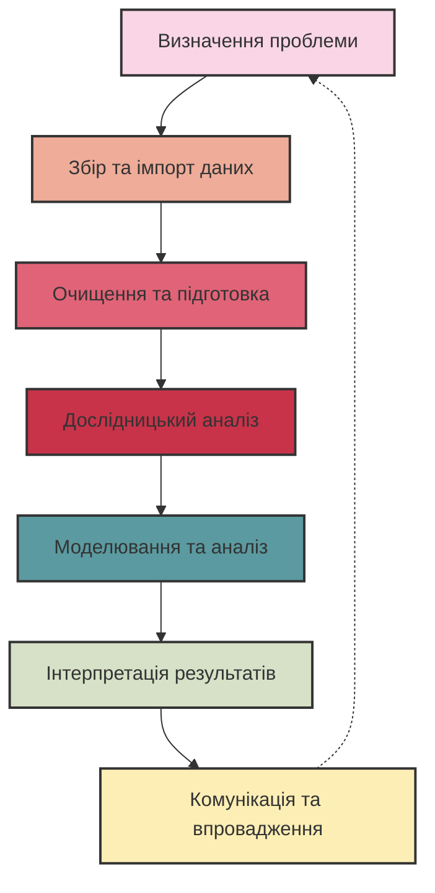
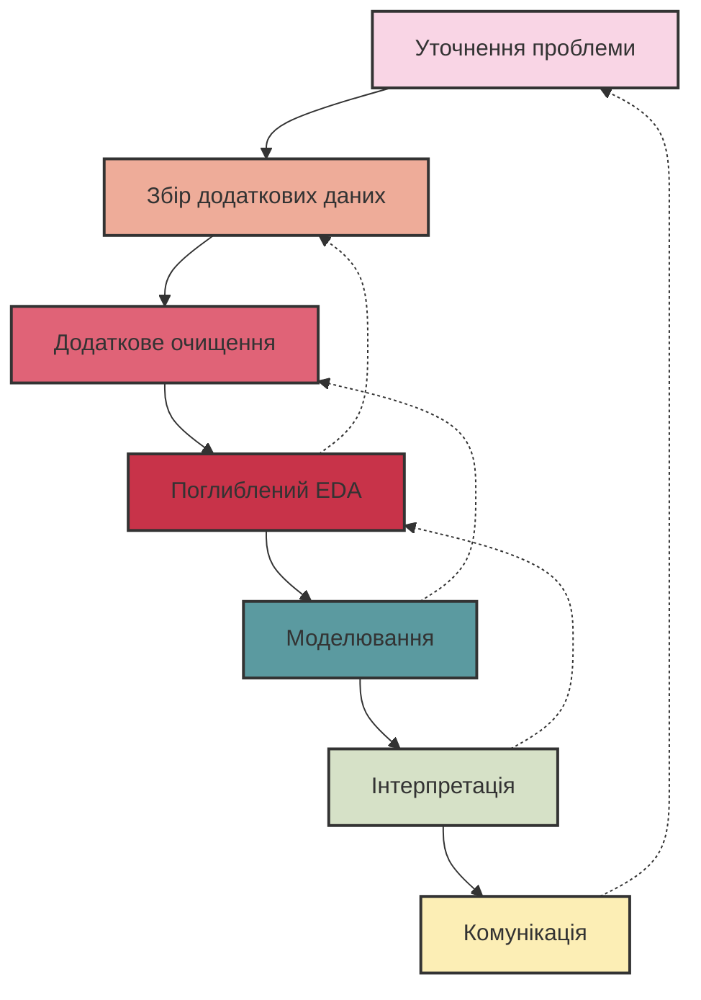

# Життєвий цикл аналізу даних

## Зміст розділу

-   [Що таке життєвий цикл аналізу даних](#що-таке-життєвий-цикл-аналізу-даних)
-   [Етап 1: Визначення проблеми та постановка задачі](#етап-1-визначення-проблеми-та-постановка-задачі)
-   [Етап 2: Збір та імпорт даних](#етап-2-збір-та-імпорт-даних)
-   [Етап 3: Очищення та підготовка даних](#етап-3-очищення-та-підготовка-даних)
-   [Етап 4: Дослідницький аналіз даних](#етап-4-дослідницький-аналіз-даних)
-   [Етап 5: Моделювання та аналіз](#етап-5-моделювання-та-аналіз)
-   [Етап 6: Інтерпретація результатів](#етап-6-інтерпретація-результатів)
-   [Етап 7: Комунікація результатів та впровадження рішень](#етап-7-комунікація-результатів-та-впровадження-рішень)
-   [Ітеративність процесу аналізу даних](#ітеративність-процесу-аналізу-даних)

## Що таке життєвий цикл аналізу даних

Життєвий цикл аналізу даних (Data Analysis Lifecycle) — це структурований підхід до перетворення сирих даних у цінні висновки та рішення. Цей процес складається з послідовних етапів, які забезпечують систематичний та методичний підхід до роботи з даними.

Розуміння життєвого циклу аналізу даних має критичне значення для:

-   Забезпечення повноти та надійності аналізу
-   Уникнення пропуску важливих кроків та помилок
-   Ефективного планування ресурсів та часу
-   Стандартизації робочих процесів у команді

Різні організації та методології можуть використовувати дещо відмінні моделі життєвого циклу, але більшість із них включає подібні ключові етапи.



## Етап 1: Визначення проблеми та постановка задачі

Перший і найважливіший етап аналізу даних — чітке визначення бізнес-проблеми або дослідницького питання, яке потрібно вирішити.

### Ключові компоненти визначення проблеми

1. **Формулювання бізнес-проблеми**

    - Що саме ми намагаємося вирішити або дізнатися?
    - Який бізнес-контекст цього питання?

2. **Встановлення цілей аналізу**

    - Яких конкретних результатів ми прагнемо досягти?
    - Які метрики визначатимуть успіх?

3. **Визначення зацікавлених сторін**

    - Хто використовуватиме результати аналізу?
    - Які їхні очікування та потреби?

4. **Визначення обмежень**
    - Які часові, бюджетні або технічні обмеження проекту?
    - Які дані доступні або недоступні?

### Інструменти для визначення проблеми

-   **SMART-критерії** для формулювання цілей:

    -   Specific (конкретні)
    -   Measurable (вимірювані)
    -   Achievable (досяжні)
    -   Relevant (релевантні)
    -   Time-bound (обмежені в часі)

-   **5W1H-метод** для структурування проблеми:
    -   What? (Що?) — Що саме ми аналізуємо?
    -   Why? (Чому?) — Чому це важливо?
    -   Who? (Хто?) — Хто зацікавлений у результатах?
    -   When? (Коли?) — Коли потрібні результати?
    -   Where? (Де?) — Де проблема виникає?
    -   How? (Як?) — Як ми вимірюватимемо результати?

### Приклад правильного визначення проблеми

**Неправильно:** "Проаналізувати продажі компанії"

**Правильно:** "Визначити фактори, які впливають на падіння продажів у південному регіоні на 15% за останні два квартали, з метою розробки цільових маркетингових кампаній для підвищення продажів на 10% у наступному кварталі"

## Етап 2: Збір та імпорт даних

Після чіткого визначення проблеми наступним кроком є ідентифікація, збір та імпорт необхідних даних для аналізу.

### Стратегії збору даних

1. **Ідентифікація джерел даних**

    - Внутрішні джерела: CRM-системи, ERP, транзакційні бази даних, логи
    - Зовнішні джерела: відкриті дані, API, придбані набори даних
    - Первинні дані: опитування, інтерв'ю, експерименти
    - Вторинні дані: дослідження, галузеві звіти

2. **Оцінка якості та доступності даних**

    - Повнота даних
    - Точність та достовірність
    - Актуальність (рівень оновлення)
    - Правові та етичні обмеження

3. **Розробка стратегії вибірки**
    - Випадкова вибірка
    - Стратифікована вибірка
    - Кластерна вибірка
    - Систематична вибірка

### Методи імпорту даних

1. **Підключення до баз даних**

```python
# Приклад підключення до PostgreSQL
import psycopg2

conn = psycopg2.connect(
    host="localhost",
    database="sales_data",
    user="analyst",
    password="secure_password"
)

# Створення курсора для виконання SQL-запитів
cursor = conn.cursor()

# Виконання запиту
cursor.execute("SELECT * FROM sales WHERE region = 'South' AND date >= '2024-01-01'")

# Отримання результатів
results = cursor.fetchall()

# Закриття підключення
cursor.close()
conn.close()
```

2. **Імпорт з файлів**

```python
# Імпорт CSV-файлу з використанням pandas
import pandas as pd

# Зчитування даних з CSV
sales_data = pd.read_csv('sales_data.csv')

# Зчитування даних з Excel
financial_data = pd.read_excel('financial_report.xlsx', sheet_name='Q2_2024')

# Зчитування JSON-даних
config = pd.read_json('config.json')
```

3. **Використання API**

```python
# Отримання даних через API
import requests

# Виконання GET-запиту до API
response = requests.get(
    'https://api.example.com/data',
    headers={'Authorization': 'Bearer API_KEY'},
    params={'start_date': '2024-01-01', 'end_date': '2024-06-30'}
)

# Перевірка успішності запиту
if response.status_code == 200:
    # Перетворення відповіді в JSON
    data = response.json()
else:
    print(f"Помилка: {response.status_code}")
```

### Документування процесу збору даних

Важливо документувати весь процес збору даних для забезпечення відтворюваності аналізу:

-   Джерела даних та дати отримання
-   Версії та методи вибірки
-   Критерії відбору та фільтрації
-   Відомі обмеження та проблеми з даними

## Етап 3: Очищення та підготовка даних

Сирі дані рідко бувають готові для аналізу. Етап очищення та підготовки даних часто займає до 80% часу всього аналітичного процесу, але є критично важливим для забезпечення якості результатів.

### Діагностика якості даних

1. **Виявлення пропущених значень**

```python
# Перевірка наявності пропущених значень
import pandas as pd
import numpy as np

# Підрахунок пропущених значень у кожному стовпці
missing_values = df.isnull().sum()

# Відображення відсотка пропущених значень
missing_percentage = (missing_values / len(df)) * 100
missing_info = pd.DataFrame({
    'Missing Values': missing_values,
    'Percentage': missing_percentage
})
print(missing_info[missing_info['Missing Values'] > 0])
```

2. **Ідентифікація дублікатів**

```python
# Виявлення дублікатів
duplicate_rows = df.duplicated().sum()
print(f"Кількість дублікатів: {duplicate_rows}")

# Виявлення дублікатів за певними стовпцями
business_key_duplicates = df.duplicated(subset=['customer_id', 'transaction_date']).sum()
print(f"Дублікати за бізнес-ключем: {business_key_duplicates}")
```

3. **Виявлення викидів та аномалій**

```python
# Виявлення викидів за допомогою методу IQR
Q1 = df['revenue'].quantile(0.25)
Q3 = df['revenue'].quantile(0.75)
IQR = Q3 - Q1

# Визначення верхньої та нижньої меж
lower_bound = Q1 - 1.5 * IQR
upper_bound = Q3 + 1.5 * IQR

# Фільтрація викидів
outliers = df[(df['revenue'] < lower_bound) | (df['revenue'] > upper_bound)]
print(f"Кількість викидів: {len(outliers)}")
```

### Стратегії очищення даних

1. **Обробка пропущених значень**
    - Видалення рядків з пропущеними значеннями
    - Заповнення середнім, медіаною або модою
    - Використання просунутих методів імпутації

```python
# Видалення рядків з пропущеними значеннями
df_clean = df.dropna()

# Заповнення пропущених значень
df['age'].fillna(df['age'].median(), inplace=True)
df['category'].fillna(df['category'].mode()[0], inplace=True)

# Використання просунутих методів імпутації
from sklearn.impute import KNNImputer
imputer = KNNImputer(n_neighbors=5)
df_imputed = pd.DataFrame(
    imputer.fit_transform(df[['age', 'income', 'spending']]),
    columns=['age', 'income', 'spending']
)
```

2. **Обробка дублікатів**

```python
# Видалення повних дублікатів
df_unique = df.drop_duplicates()

# Видалення дублікатів за певними стовпцями
df_business_key = df.drop_duplicates(subset=['customer_id', 'transaction_date'])
```

3. **Стандартизація та нормалізація**

```python
# Стандартизація числових змінних (Z-score)
from sklearn.preprocessing import StandardScaler
scaler = StandardScaler()
df[['income', 'spending']] = scaler.fit_transform(df[['income', 'spending']])

# Мін-макс нормалізація
from sklearn.preprocessing import MinMaxScaler
min_max_scaler = MinMaxScaler()
df[['age']] = min_max_scaler.fit_transform(df[['age']])
```

### Трансформація даних

1. **Перетворення типів даних**

```python
# Перетворення рядків у дати
df['transaction_date'] = pd.to_datetime(df['transaction_date'])

# Перетворення категоріальних змінних у числові
df['gender'] = df['gender'].map({'Male': 0, 'Female': 1})

# Використання методу one-hot encoding
df_encoded = pd.get_dummies(df, columns=['product_category'], drop_first=True)
```

2. **Створення нових ознак**

```python
# Витягування компонентів з дати
df['transaction_year'] = df['transaction_date'].dt.year
df['transaction_month'] = df['transaction_date'].dt.month
df['is_weekend'] = df['transaction_date'].dt.dayofweek >= 5

# Створення співвідношень
df['spending_to_income_ratio'] = df['spending'] / df['income']

# Агрегування даних
customer_summary = df.groupby('customer_id').agg({
    'transaction_amount': ['sum', 'mean', 'count'],
    'product_category': 'nunique'
})
```

### Документування змін

Важливо вести документацію всіх змін, внесених у набір даних:

-   Які трансформації були застосовані
-   Скільки рядків/стовпців було видалено/додано
-   Які припущення були зроблені під час обробки даних

## Етап 4: Дослідницький аналіз даних

Дослідницький аналіз даних (Exploratory Data Analysis, EDA) — це процес вивчення та візуалізації даних для розуміння їхньої структури, виявлення закономірностей, аномалій та формулювання гіпотез.

### Цілі дослідницького аналізу

1. **Розуміння розподілу даних**

    - Унімодальний, бімодальний або мультимодальний розподіл
    - Симетрія або асиметрія
    - Наявність екстремальних значень

2. **Виявлення взаємозв'язків між змінними**

    - Кореляції між числовими змінними
    - Асоціації між категоріальними змінними
    - Залежності між незалежними та цільовими змінними

3. **Ідентифікація трендів та паттернів**
    - Сезонні коливання
    - Довгострокові тенденції
    - Циклічні патерни

### Методи одновимірного аналізу

1. **Статистичні метрики**

```python
# Обчислення описових статистик
summary_stats = df.describe()

# Додаткові метрики для категоріальних змінних
category_counts = df['product_category'].value_counts()
category_proportions = df['product_category'].value_counts(normalize=True)
```

2. **Візуалізація розподілів**

```python
import matplotlib.pyplot as plt
import seaborn as sns

# Гістограма для числової змінної
plt.figure(figsize=(10, 6))
sns.histplot(df['income'], kde=True)
plt.title('Розподіл доходу клієнтів')
plt.xlabel('Дохід')
plt.ylabel('Частота')
plt.show()

# Boxplot для виявлення викидів
plt.figure(figsize=(10, 6))
sns.boxplot(x=df['spending'])
plt.title('Розподіл витрат клієнтів')
plt.xlabel('Витрати')
plt.show()

# Діаграма для категоріальних даних
plt.figure(figsize=(12, 6))
sns.countplot(x='product_category', data=df, order=df['product_category'].value_counts().index)
plt.title('Розподіл категорій продуктів')
plt.xlabel('Категорія')
plt.ylabel('Кількість')
plt.xticks(rotation=45)
plt.show()
```

### Методи багатовимірного аналізу

1. **Аналіз взаємозв'язків**

```python
# Кореляційна матриця
correlation_matrix = df[['income', 'age', 'spending', 'frequency']].corr()

# Візуалізація кореляцій
plt.figure(figsize=(10, 8))
sns.heatmap(correlation_matrix, annot=True, cmap='coolwarm', linewidths=0.5)
plt.title('Кореляційна матриця числових змінних')
plt.show()

# Scatter plot для пар змінних
plt.figure(figsize=(10, 6))
sns.scatterplot(x='income', y='spending', hue='customer_segment', data=df)
plt.title('Взаємозв\'язок між доходом та витратами за сегментами')
plt.xlabel('Дохід')
plt.ylabel('Витрати')
plt.show()
```

2. **Групування та агрегація**

```python
# Аналіз метрик за групами
segment_analysis = df.groupby('customer_segment').agg({
    'income': 'mean',
    'spending': 'mean',
    'age': 'mean',
    'transaction_count': 'sum'
}).reset_index()

# Візуалізація агрегованих даних
plt.figure(figsize=(12, 6))
sns.barplot(x='customer_segment', y='spending', data=segment_analysis)
plt.title('Середні витрати за сегментами клієнтів')
plt.xlabel('Сегмент')
plt.ylabel('Середні витрати')
plt.show()
```

3. **Багатовимірна візуалізація**

```python
# Pairplot для візуалізації взаємозв'язків між кількома змінними
plt.figure(figsize=(15, 15))
sns.pairplot(df[['income', 'age', 'spending', 'frequency', 'customer_segment']],
             hue='customer_segment')
plt.suptitle('Взаємозв\'язки між ключовими змінними', y=1.02)
plt.show()

# Паралельні координати для багатовимірних даних
from pandas.plotting import parallel_coordinates
plt.figure(figsize=(12, 8))
parallel_coordinates(df.sample(100), 'customer_segment')
plt.title('Паралельні координати для характеристик клієнтів')
plt.show()
```

### Формулювання гіпотез

На основі результатів EDA аналітик формулює гіпотези, які можуть бути перевірені за допомогою статистичних тестів або моделювання:

-   "Клієнти з вищим доходом частіше купують преміум-продукти"
-   "Сезонність значно впливає на обсяги продажів у категорії X"
-   "Демографічні фактори є кращими предикторами поведінки клієнтів, ніж історія транзакцій"

## Етап 5: Моделювання та аналіз

На основі результатів EDA та сформульованих гіпотез аналітик обирає відповідні методи моделювання та аналізу для виявлення закономірностей та отримання висновків.

### Вибір методів аналізу

Вибір методів залежить від типу поставленої задачі:

1. **Описовий аналіз (Descriptive Analysis)**

    - Агрегація та узагальнення даних
    - Сегментація та класифікація
    - Аналіз тенденцій та сезонності

2. **Діагностичний аналіз (Diagnostic Analysis)**

    - Статистичні тести
    - Аналіз причинно-наслідкових зв'язків
    - Аналіз факторів впливу

3. **Предиктивний аналіз (Predictive Analysis)**

    - Регресійні моделі
    - Класифікаційні моделі
    - Часові ряди та прогнозування

4. **Прескриптивний аналіз (Prescriptive Analysis)**
    - Оптимізаційні моделі
    - Симуляційні моделі
    - Рекомендаційні системи

### Приклади методів моделювання

1. **Регресійний аналіз**

```python
from sklearn.linear_model import LinearRegression
from sklearn.model_selection import train_test_split
from sklearn.metrics import mean_squared_error, r2_score

# Підготовка даних
X = df[['income', 'age', 'previous_purchases']]
y = df['spending']

# Розділення на тренувальний та тестовий набори
X_train, X_test, y_train, y_test = train_test_split(X, y, test_size=0.2, random_state=42)

# Створення та навчання моделі
model = LinearRegression()
model.fit(X_train, y_train)

# Оцінка моделі
y_pred = model.predict(X_test)
mse = mean_squared_error(y_test, y_pred)
r2 = r2_score(y_test, y_pred)

print(f"Mean Squared Error: {mse:.2f}")
print(f"R-squared: {r2:.2f}")

# Аналіз коефіцієнтів
coefficients = pd.DataFrame({
    'Feature': X.columns,
    'Coefficient': model.coef_
})
print(coefficients.sort_values(by='Coefficient', ascending=False))
```

2. **Класифікаційний аналіз**

```python
from sklearn.ensemble import RandomForestClassifier
from sklearn.metrics import accuracy_score, classification_report, confusion_matrix

# Підготовка даних
X = df[['income', 'age', 'spending', 'visit_frequency']]
y = df['customer_segment']  # цільова змінна, наприклад, 'High Value', 'Medium Value', 'Low Value'

# Розділення на тренувальний та тестовий набори
X_train, X_test, y_train, y_test = train_test_split(X, y, test_size=0.2, random_state=42)

# Створення та навчання моделі
clf = RandomForestClassifier(n_estimators=100, random_state=42)
clf.fit(X_train, y_train)

# Прогнозування
y_pred = clf.predict(X_test)

# Оцінка моделі
accuracy = accuracy_score(y_test, y_pred)
print(f"Accuracy: {accuracy:.2f}")

# Детальний звіт про якість класифікації
print(classification_report(y_test, y_pred))

# Матриця помилок
conf_matrix = confusion_matrix(y_test, y_pred)
plt.figure(figsize=(10, 8))
sns.heatmap(conf_matrix, annot=True, fmt='d', cmap='Blues',
            xticklabels=clf.classes_, yticklabels=clf.classes_)
plt.xlabel('Прогнозовані значення')
plt.ylabel('Фактичні значення')
plt.title('Матриця помилок')
plt.show()

# Важливість ознак
feature_importance = pd.DataFrame({
    'Feature': X.columns,
    'Importance': clf.feature_importances_
}).sort_values(by='Importance', ascending=False)

plt.figure(figsize=(10, 6))
sns.barplot(x='Importance', y='Feature', data=feature_importance)
plt.title('Важливість ознак')
plt.show()
```

3. **Кластерний аналіз**

```python
from sklearn.cluster import KMeans
from sklearn.preprocessing import StandardScaler

# Підготовка даних
features = df[['income', 'spending', 'visit_frequency', 'average_purchase']]

# Стандартизація даних
scaler = StandardScaler()
features_scaled = scaler.fit_transform(features)

# Визначення оптимальної кількості кластерів за допомогою методу ліктя
inertias = []
for k in range(1, 11):
    kmeans = KMeans(n_clusters=k, random_state=42)
    kmeans.fit(features_scaled)
    inertias.append(kmeans.inertia_)

# Візуалізація методу ліктя
plt.figure(figsize=(10, 6))
plt.plot(range(1, 11), inertias, marker='o')
plt.title('Метод ліктя для визначення оптимальної кількості кластерів')
plt.xlabel('Кількість кластерів')
plt.ylabel('Інерція (сума квадратів відстаней)')
plt.grid(True)
plt.show()

# Застосування кластеризації з оптимальною кількістю кластерів
optimal_k = 4  # Визначаємо на основі графіка
kmeans = KMeans(n_clusters=optimal_k, random_state=42)
df['cluster'] = kmeans.fit_predict(features_scaled)

# Аналіз кластерів
cluster_analysis = df.groupby('cluster').agg({
    'income': 'mean',
    'spending': 'mean',
    'visit_frequency': 'mean',
    'average_purchase': 'mean',
    'customer_id': 'count'
}).reset_index()

# Візуалізація характеристик кластерів
plt.figure(figsize=(14, 8))
for i, feature in enumerate(['income', 'spending', 'visit_frequency', 'average_purchase']):
    plt.subplot(2, 2, i+1)
    sns.barplot(x='cluster', y=feature, data=cluster_analysis)
    plt.title(f'Середній {feature} за кластерами')
plt.tight_layout()
plt.show()

# Візуалізація кластерів у двовимірному просторі
plt.figure(figsize=(12, 10))
sns.scatterplot(
    x='income',
    y='spending',
    hue='cluster',
    data=df,
    palette='viridis',
    s=100,
    alpha=0.7
)
plt.title('Кластеризація клієнтів за доходом та витратами')
plt.xlabel('Дохід')
plt.ylabel('Витрати')
plt.show()
```

### Оцінка та валідація результатів

1. **Крос-валідація**

```python
from sklearn.model_selection import cross_val_score

# Крос-валідація для регресійної моделі
cv_scores = cross_val_score(model, X, y, cv=5, scoring='r2')
print(f"Cross-validation R² scores: {cv_scores}")
print(f"Mean R² score: {cv_scores.mean():.2f} (±{cv_scores.std():.2f})")

# Крос-валідація для класифікаційної моделі
cv_accuracy = cross_val_score(clf, X, y, cv=5, scoring='accuracy')
print(f"Cross-validation Accuracy scores: {cv_accuracy}")
print(f"Mean Accuracy: {cv_accuracy.mean():.2f} (±{cv_accuracy.std():.2f})")
```

2. **Оцінка з урахуванням бізнес-контексту**
    - Розрахунок ROI для різних сценаріїв
    - Оцінка економічного ефекту від впровадження
    - Аналіз чутливості результатів до змін вхідних параметрів

## Етап 6: Інтерпретація результатів

Перетворення результатів аналізу на конкретні висновки та рекомендації — це етап, який вимагає поєднання технічних навичок та бізнес-розуміння.

### Ключові аспекти інтерпретації

1. **Контекстуалізація результатів**

    - Інтерпретація в рамках бізнес-контексту
    - Врахування галузевих особливостей та бенчмарків
    - Зв'язок з початковими цілями аналізу

2. **Виявлення причинно-наслідкових зв'язків**

    - Розрізнення кореляції та причинності
    - Ідентифікація прямих та непрямих ефектів
    - Врахування конфаундерів та прихованих змінних

3. **Формулювання висновків**
    - Чіткі та однозначні твердження
    - Підкріплення даними та статистикою
    - Вказівка на обмеження та застереження

### Структура інтерпретації результатів

1. **Основні висновки**

    - 3-5 ключових знахідок, що безпосередньо відповідають на поставлене питання
    - Підтвердження або спростування гіпотез
    - Несподівані або контрінтуїтивні результати

2. **Деталізація результатів**

    - Розбивка за сегментами або групами
    - Часові тренди та динаміка
    - Фактори впливу та їхня відносна важливість

3. **Обмеження аналізу**
    - Технічні обмеження використаних методів
    - Обмеження даних (репрезентативність, актуальність)
    - Можливі альтернативні пояснення результатів

### Приклад структури висновків

```
# Висновки аналізу клієнтської бази

## Ключові знахідки:

1. **Сегментація клієнтів**: Ідентифіковано 4 основні сегменти клієнтів з чіткими поведінковими характеристиками:
   - Сегмент A (22%): Високий дохід, високі витрати, часті візити
   - Сегмент B (35%): Середній дохід, високі витрати, середня частота
   - Сегмент C (28%): Середній дохід, низькі витрати, низька частота
   - Сегмент D (15%): Низький дохід, низькі витрати, рідкісні візити

2. **Фактори лояльності**: Найсильнішими предикторами лояльності клієнтів є:
   - Частота взаємодій з персоналом (+68%)
   - Участь у програмі лояльності (+42%)
   - Швидкість вирішення проблем (+37%)

3. **Відтік клієнтів**: Відтік спостерігається переважно в сегменті C і пов'язаний з:
   - Відсутністю персоналізованих пропозицій (OR=2.8)
   - Негативним досвідом з обслуговування (OR=2.3)
   - Більш привабливими пропозиціями конкурентів (OR=1.9)

## Обмеження аналізу:

- Дані охоплюють лише останні 12 місяців
- Відсутня інформація про конкурентів
- Модель не враховує макроекономічні фактори
```

## Етап 7: Комунікація результатів та впровадження рішень

Останній, але не менш важливий етап — ефективна комунікація результатів аналізу зацікавленим сторонам та трансформація висновків у практичні дії.

### Елементи ефективної комунікації

1. **Адаптація до аудиторії**

    - Технічна аудиторія: деталі методології, статистична значущість, технічні нюанси
    - Бізнес-аудиторія: бізнес-цінність, практичні рекомендації, відповіді на ключові питання
    - Керівництво: ключові висновки, стратегічні імплікації, ROI

2. **Візуалізація результатів**

    - Інформативні графіки та діаграми
    - Інтерактивні дашборди
    - Інфографіка для складних концепцій

3. **Розповідь історії даних (Data Storytelling)**
    - Структурована наративна лінія
    - Зв'язок між даними та бізнес-контекстом
    - Емоційне залучення через реальні приклади

### Інструменти комунікації

1. **Презентації**

    - Структуровані слайди з ключовими висновками
    - Баланс між текстом, графіками та вільним простором
    - Чіткий заклик до дії (Call to Action)

2. **Звіти та документація**

    - Детальний опис методології
    - Повний набір результатів та висновків
    - Документація коду та аналітичного процесу

3. **Дашборди**
    - Інтерактивні візуалізації для дослідження даних
    - Регулярно оновлювані метрики
    - Можливість деталізації та фільтрації

### Впровадження рішень

1. **Розробка плану дій**

    - Конкретні кроки, базовані на результатах аналізу
    - Пріоритизація ініціатив за впливом та складністю
    - Визначення відповідальних та термінів

2. **Вимірювання ефективності**

    - Визначення KPI для оцінки успіху
    - Встановлення базових значень та цільових показників
    - Регулярний моніторинг прогресу

3. **Ітеративний підхід**
    - Тестування гіпотез на малих вибірках
    - A/B тестування різних підходів
    - Постійне вдосконалення на основі нових даних

### Приклад комунікаційної стратегії

```
# Стратегія комунікації результатів аналізу відтоку клієнтів

## Цільові аудиторії:

1. **Виконавчий комітет**
   - Формат: Стисла презентація (15 хв)
   - Фокус: Фінансовий вплив, стратегічні рекомендації, ROI
   - Ключові матеріали: Інфографіка, підсумкові діаграми, сценарії

2. **Керівники відділів**
   - Формат: Детальна презентація (45 хв) + Q&A
   - Фокус: Секторальні знахідки, тактичні рекомендації, план дій
   - Ключові матеріали: Сегментований аналіз, порівняльні метрики

3. **Аналітична команда**
   - Формат: Технічний звіт + воркшоп
   - Фокус: Методологія, деталі моделювання, обмеження аналізу
   - Ключові матеріали: Jupyter notebook, документація, дані

## Ключові повідомлення:

1. Виявлено 3 основні причини відтоку, які відповідають за 78% випадків
2. Розроблено предиктивну модель з точністю 87% для раннього виявлення ризику
3. Запропоновані заходи можуть зменшити відтік на 35% з ROI 280% за 18 місяців
```

## Ітеративність процесу аналізу даних

Важливо розуміти, що життєвий цикл аналізу даних рідко є строго лінійним процесом. У реальності він є ітеративним, з постійними поверненнями до попередніх етапів для уточнення та вдосконалення.

### Причини ітеративності

1. **Нові запитання**

    - Початкові результати часто породжують нові запитання
    - Зацікавлені сторони можуть змінювати фокус дослідження
    - Виявлення несподіваних патернів вимагає додаткового аналізу

2. **Зміна контексту**

    - Нові дані стають доступними
    - Зміни в бізнес-середовищі або ринкових умовах
    - Еволюція бізнес-пріоритетів

3. **Удосконалення методів**
    - Виявлення обмежень початкових підходів
    - Розробка більш складних моделей
    - Тестування альтернативних гіпотез

### Ефективний ітеративний підхід

1. **Agile-методологія для аналітики**

    - Короткі спринти з конкретними цілями
    - Регулярні презентації проміжних результатів
    - Гнучкість у зміні пріоритетів

2. **Документування ітерацій**

    - Відстеження змін у підходах та методах
    - Фіксація проміжних результатів
    - Обґрунтування зміни напрямку

3. **Встановлення контрольних точок**
    - Визначення критеріїв для переходу до наступного етапу
    - Періодичний перегляд загального прогресу
    - Баланс між глибиною аналізу та часовими обмеженнями



### Порівняння ітеративного та каскадного підходів

| Аспект                            | Ітеративний підхід                               | Каскадний підхід                                     |
| --------------------------------- | ------------------------------------------------ | ---------------------------------------------------- |
| Гнучкість                         | Висока, можливість адаптації на будь-якому етапі | Низька, фіксований план від початку до кінця         |
| Швидкість отримання результатів   | Проміжні результати доступні швидко              | Результати доступні лише в кінці проекту             |
| Залучення зацікавлених сторін     | Постійна взаємодія та зворотний зв'язок          | Обмежена взаємодія, часто лише на початку та в кінці |
| Ризики                            | Розподілені, виявляються рано                    | Концентровані, можуть виявитися пізно                |
| Ефективність для складних проблем | Висока, дозволяє досліджувати різні підходи      | Середня, вимагає точного планування від початку      |

## Висновки

Життєвий цикл аналізу даних — це структурований, але гнучкий процес, який дозволяє систематично перетворювати сирі дані на цінні бізнес-рішення. Розуміння та правильне застосування всіх етапів циклу є критично важливим для успішного аналізу даних.

Ключові принципи успішного аналізу даних:

1. **Чітке визначення проблеми** — почніть з точного розуміння того, що ви намагаєтеся вирішити
2. **Якість даних понад усе** — інвестуйте час у збір та очищення даних
3. **Глибокий EDA** — не поспішайте до складних моделей без ґрунтовного розуміння даних
4. **Баланс між простотою та точністю** — найскладніша модель не завжди найкраща
5. **Ефективна комунікація** — найкращий аналіз марний, якщо він не веде до дій
6. **Ітеративне вдосконалення** — готовність повертатися до попередніх етапів для покращення результатів

Дотримуючись цих принципів та систематично проходячи всі етапи життєвого циклу, аналітики можуть максимізувати цінність даних та забезпечити прийняття обґрунтованих рішень у будь-якій організації.

---

**Попередня тема:** [Роль дата-аналітика в сучасному світі](./02_роль_дата_аналітика.md)

**Наступна тема:** [Описова статистика](./04_описова_статистика.md)
