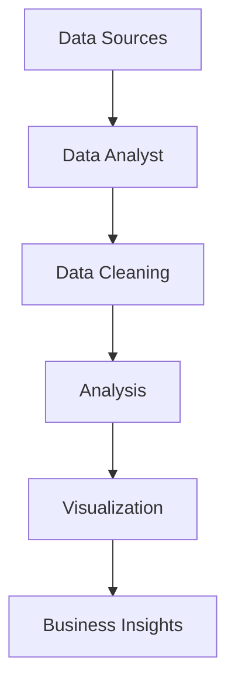
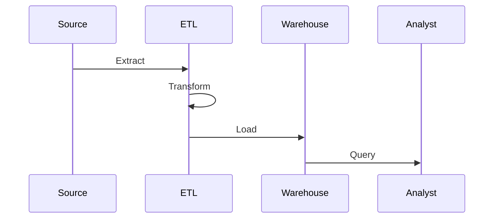

# Роль Data Analyst

## Вступ

Data Analyst — це фахівець, який перетворює дані на знання для прийняття рішень. Його роль критична у сучасному бізнесі, науці, державному управлінні, адже саме дані стали основою для конкурентних переваг, оптимізації процесів і інновацій.

У світі, де щодня генеруються петабайти інформації, аналітик даних стає ключовою фігурою для організацій, які прагнуть бути data-driven. Від банків до стартапів, від медицини до державного управління — скрізь потрібен той, хто вміє перетворити «шум» у даних на зрозумілі інсайти.

Data Analyst — це не просто «людина з Excel». Це фахівець, який володіє інструментами для збору, обробки, аналізу, візуалізації та інтерпретації даних. Його робота — це міст між сирими даними та бізнес-рішеннями, між технічними командами та менеджментом.

## Історія/Походження

Перші аналітики даних з’явилися разом із розвитком статистики та обчислювальної техніки. У 1960–80-х роках роль Data Analyst була пов’язана з обробкою фінансових, демографічних та виробничих даних. З появою великих даних (Big Data), хмарних технологій і BI-інструментів професія стала однією з найзатребуваніших у світі.

В історії розвитку Data Analyst можна виділити кілька етапів:

-   Епоха паперових звітів і ручних розрахунків (до 1970-х)
-   Поява електронних таблиць (VisiCalc, Lotus 1-2-3, Excel)
-   Розвиток реляційних баз даних і SQL (1980–90-ті)
-   BI-революція: OLAP, дашборди, інтерактивна аналітика (2000-ті)
-   Big Data, Hadoop, Spark, NoSQL, хмарні платформи (2010+)

Сьогодні Data Analyst — це не лише статистик, а й інженер, комунікатор, бізнес-партнер.

## Основний матеріал

Data Analyst працює на перетині бізнесу, ІТ та математики. Основні задачі:

-   Збір даних із різних джерел (БД, API, Excel, веб-сервіси, лог-файли, соціальні мережі, open data)
-   Очищення, трансформація, нормалізація даних (видалення пропусків, обробка аномалій, стандартизація форматів)
-   Описова та індуктивна статистика (розрахунок середніх, медіан, дисперсій, побудова гіпотез)
-   Візуалізація даних для пошуку патернів (графіки, heatmap, геоаналіз, інтерактивні дашборди)
-   Побудова звітів, дашбордів, презентацій (Power BI, Tableau, Google Data Studio)
-   Пошук корисних інсайтів для бізнесу (аналіз трендів, кореляцій, причинно-наслідкових зв’язків)
-   Взаємодія з Data Engineer, BI Developer, менеджерами, маркетологами, фінансистами

### Ключові компетенції:

-   SQL, Excel/Google Sheets, Python (pandas, numpy, matplotlib, seaborn, scikit-learn)
-   BI-інструменти: Power BI, Tableau, Looker, Qlik, Google Data Studio
-   Статистика, аналітичне мислення, знання теорії ймовірностей
-   Вміння презентувати результати, storytelling, data-driven decision making
-   Знання ETL-процесів, основи Data Engineering
-   Soft skills: комунікація, критичне мислення, тайм-менеджмент

#### Порівняння Data Analyst, Data Scientist, BI Developer

| Роль           | Основний фокус           | Інструменти             | Взаємодія  |
| -------------- | ------------------------ | ----------------------- | ---------- |
| Data Analyst   | Описова аналітика, звіти | SQL, Excel, Python, BI  | Бізнес, IT |
| Data Scientist | Моделювання, ML, прогноз | Python, R, ML, Big Data | IT, наука  |
| BI Developer   | Дашборди, інтеграція     | BI Tools, SQL, ETL      | Бізнес     |

## Приклад коду: базова аналітика

```python
# Збір та базова обробка даних у pandas
import pandas as pd
df = pd.read_csv('sales.csv')
# Очищення: видалення пропусків
df = df.dropna()
# Групування та агрегація
summary = df.groupby('region')['revenue'].sum()
print(summary)
```

## Пояснення під капотом

Data Analyst використовує інструменти, які автоматизують рутинні задачі (ETL, SQL, pandas). Важливо розуміти, як працює пам’ять, як оптимізувати запити, як обирати типи даних для ефективної обробки. Взаємодія з Data Engineer дозволяє отримувати якісні дані, а з BI Developer — будувати інтерактивні звіти.

Важливо знати:

-   Як працює індексація у pandas та SQL
-   Як оптимізувати великі запити (JOIN, GROUP BY, індекси)
-   Як працює пам’ять у Python, чому важливий тип даних
-   Як ETL-процеси впливають на якість даних

## Нюанси та підводні камені

-   Дані часто бувають неякісними, неповними, з помилками (пропуски, дублікати, outliers)
-   Важливо розуміти бізнес-контекст, щоб не зробити хибних висновків
-   Не всі інструменти однаково підходять для різних задач (Excel vs Python vs BI)
-   Потрібно вміти пояснювати складні речі просто (storytelling)
-   Важливо тестувати гіпотези, а не лише описувати дані
-   Необхідно враховувати етичні аспекти роботи з даними (GDPR, privacy)

## Діаграма: роль аналітика у процесі даних



## Приклад застосування в реальних проєктах

**Ритейл:** Data Analyst аналізує продажі, прогнозує попит, оптимізує запаси. Наприклад, аналізуючи сезонність, аналітик допомагає закупівельникам планувати поставки, що знижує витрати на склад.

**Фінанси:** Виявлення шахрайства, оцінка ризиків, побудова скорингових моделей. Аналітик може знайти аномальні транзакції, що сигналізують про потенційне шахрайство.

**E-commerce:** Аналіз поведінки користувачів, підвищення конверсії, оптимізація маркетингових кампаній. Наприклад, аналізуючи кліки та покупки, аналітик допомагає маркетологам визначити найефективніший час для розсилки акцій.

**Медицина:** Пошук закономірностей у даних пацієнтів, оптимізація лікування, прогнозування епідемій. Аналітик може знайти кореляції між симптомами та результатами лікування.

## Best practices

-   Завжди перевіряйте якість даних перед аналізом (data profiling)
-   Документуйте всі етапи трансформації (data lineage)
-   Використовуйте візуалізацію для пошуку неочевидних патернів (heatmap, scatterplot)
-   Вчіться пояснювати результати для нетехнічної аудиторії (storytelling)
-   Впроваджуйте автоматизацію рутинних задач (скрипти, ETL)
-   Дотримуйтесь етики роботи з даними (privacy, security)

## Крос-посилання

-   [Основи статистики](../../02-statistics/descriptive.md)
-   [Data wrangling](../../04-wrangling/cleaning.md)
-   [Візуалізація даних](../../05-visualization/principles.md)
-   [Python для аналізу даних](../../08-python/pandas.md)
-   [SQL для аналітики](../../06-sql/basics.md)

## Підсумок

-   Data Analyst — міст між даними та рішеннями
-   Ключові навички: аналітика, інструменти, комунікація
-   Важливо розуміти як технічний, так і бізнес-контекст
-   Якісна робота аналітика = якісні дані + правильні висновки
-   Постійне навчання, розвиток компетенцій, адаптація до нових технологій

---

# Додатково: розширений матеріал

## Еволюція ролі Data Analyst

З розвитком технологій роль Data Analyst трансформувалася. Якщо раніше це була робота з таблицями та простими звітами, то сьогодні аналітик працює з Big Data, хмарними платформами, інтеграцією даних з різних джерел, складними ETL-процесами.

### Види Data Analyst

-   Business Analyst — фокус на бізнес-процесах, моделювання процесів, оптимізація витрат
-   Marketing Analyst — аналіз ринку, поведінки клієнтів, сегментація, A/B тестування
-   Product Analyst — робота з продуктом, метриками, аналіз фіч, прогнозування
-   Financial Analyst — фінансові моделі, ризики, прогнози, бюджетування
-   Healthcare Analyst — аналіз медичних даних, прогнозування епідемій, оптимізація лікування

## Інструменти Data Analyst

-   SQL, Python, R, Scala
-   Excel, Google Sheets, OpenRefine
-   Power BI, Tableau, Qlik, Looker, Google Data Studio
-   Jupyter Notebook, Google Colab, Zeppelin
-   Git, GitHub для контролю версій
-   ETL-платформи: Apache Airflow, Talend, Informatica

## Приклад коду: інтеграція даних з API

```python
import requests
import pandas as pd
response = requests.get('https://api.example.com/data')
data = response.json()
df = pd.DataFrame(data)
df = df.drop_duplicates()
df['date'] = pd.to_datetime(df['date'])
print(df.head())
```

## Діаграма: типова архітектура аналітики


## Типові помилки

-   Ігнорування пропусків у даних (missing values)
-   Неправильна агрегація (sum vs mean, некоректні групування)
-   Відсутність валідації результатів (перевірка гіпотез, тестування)
-   Використання застарілих джерел (outdated data)
-   Недостатня документація процесу аналізу
-   Відсутність резервного копіювання даних

## Антипатерни

-   "Excel-only" аналітика без автоматизації
-   Відсутність документації
-   Аналіз без розуміння бізнесу
-   Використання одного джерела даних без крос-перевірки
-   Відсутність тестування скриптів

## Приклад: кейс з e-commerce

Аналітик отримав дані про поведінку користувачів на сайті. Після очищення та аналізу виявив, що більшість покупок здійснюється у вечірній час. Це дозволило маркетологам оптимізувати час розсилки акційних пропозицій, що підвищило конверсію на 15%.

**Кейс з фінансів:**
Аналітик виявив аномальні транзакції у великому банку, що дозволило службі безпеки оперативно заблокувати шахрайські операції.

**Кейс з медицини:**
Аналізуючи дані пацієнтів, аналітик знайшов кореляцію між певними симптомами та ефективністю лікування, що допомогло лікарям скоригувати протоколи.

## Пояснення під капотом: як працює ETL

ETL (Extract, Transform, Load) — це процес отримання даних, їх трансформації та завантаження у сховище. Data Analyst часто працює з готовими ETL-процесами, але має розуміти їхню логіку для коректної інтерпретації даних.

### Етапи ETL:

-   Extract — отримання даних з різних джерел (БД, API, файли)
-   Transform — очищення, нормалізація, агрегація, об’єднання
-   Load — завантаження у сховище (Data Warehouse, Data Lake)

## Діаграма: ETL-процес



## Підсумок (розширений)

-   Data Analyst — ключова роль у сучасному бізнесі
-   Вміння працювати з різними джерелами та інструментами
-   Важливість комунікації та пояснення результатів
-   Постійне навчання та розвиток компетенцій
-   Вміння адаптуватися до нових технологій і вимог ринку

## Історія/Походження

Перші аналітики даних з’явилися разом із розвитком статистики та обчислювальної техніки. У 1960–80-х роках роль Data Analyst була пов’язана з обробкою фінансових, демографічних та виробничих даних. З появою великих даних (Big Data), хмарних технологій і BI-інструментів професія стала однією з найзатребуваніших у світі.

## Основний матеріал

Data Analyst працює на перетині бізнесу, ІТ та математики. Основні задачі:

-   Збір даних із різних джерел (БД, API, Excel, веб-сервіси)
-   Очищення, трансформація, нормалізація даних
-   Описова та індуктивна статистика
-   Візуалізація даних для пошуку патернів
-   Побудова звітів, дашбордів, презентацій
-   Пошук корисних інсайтів для бізнесу
-   Взаємодія з Data Engineer, BI Developer, менеджерами

### Ключові компетенції:

-   SQL, Excel/Google Sheets, Python (pandas, numpy, matplotlib)
-   BI-інструменти: Power BI, Tableau, Looker
-   Статистика, аналітичне мислення
-   Вміння презентувати результати

## Приклад коду: базова аналітика

```python
# Збір та базова обробка даних у pandas
import pandas as pd
df = pd.read_csv('sales.csv')
# Очищення: видалення пропусків
df = df.dropna()
# Групування та агрегація
summary = df.groupby('region')['revenue'].sum()
print(summary)
```

## Пояснення під капотом

Data Analyst використовує інструменти, які автоматизують рутинні задачі (ETL, SQL, pandas). Важливо розуміти, як працює пам’ять, як оптимізувати запити, як обирати типи даних для ефективної обробки. Взаємодія з Data Engineer дозволяє отримувати якісні дані, а з BI Developer — будувати інтерактивні звіти.

## Нюанси та підводні камені

-   Дані часто бувають неякісними, неповними, з помилками
-   Важливо розуміти бізнес-контекст, щоб не зробити хибних висновків
-   Не всі інструменти однаково підходять для різних задач
-   Потрібно вміти пояснювати складні речі просто

## Діаграма: роль аналітика у процесі даних


## Приклад застосування в реальних проєктах

У ритейлі Data Analyst аналізує продажі, прогнозує попит, оптимізує запаси. У фінансах — виявляє шахрайство, оцінює ризики. В e-commerce — аналізує поведінку користувачів, підвищує конверсію. В медицині — шукає закономірності для покращення лікування.

## Best practices

-   Завжди перевіряйте якість даних перед аналізом
-   Документуйте всі етапи трансформації
-   Використовуйте візуалізацію для пошуку неочевидних патернів
-   Вчіться пояснювати результати для нетехнічної аудиторії
-   Впроваджуйте автоматизацію рутинних задач

## Крос-посилання

-   [Основи статистики](../../02-statistics/descriptive.md)
-   [Data wrangling](../../04-wrangling/cleaning.md)
-   [Візуалізація даних](../../05-visualization/principles.md)
-   [Python для аналізу даних](../../08-python/pandas.md)

## Підсумок

-   Data Analyst — міст між даними та рішеннями
-   Ключові навички: аналітика, інструменти, комунікація
-   Важливо розуміти як технічний, так і бізнес-контекст
-   Якісна робота аналітика = якісні дані + правильні висновки

---

# Додатково: розширений матеріал

## Еволюція ролі Data Analyst

З розвитком технологій роль Data Analyst трансформувалася. Якщо раніше це була робота з таблицями та простими звітами, то сьогодні аналітик працює з Big Data, хмарними платформами, інтеграцією даних з різних джерел, складними ETL-процесами.

### Види Data Analyst

-   Business Analyst — фокус на бізнес-процесах
-   Marketing Analyst — аналіз ринку, поведінки клієнтів
-   Product Analyst — робота з продуктом, метриками, A/B тестами
-   Financial Analyst — фінансові моделі, ризики, прогнози

## Інструменти Data Analyst

-   SQL, Python, R
-   Excel, Google Sheets
-   Power BI, Tableau, Qlik, Looker
-   Jupyter Notebook, Google Colab
-   Git, GitHub для контролю версій

## Приклад коду: інтеграція даних з API

```python
import requests
import pandas as pd
response = requests.get('https://api.example.com/data')
data = response.json()
df = pd.DataFrame(data)
df = df.drop_duplicates()
df['date'] = pd.to_datetime(df['date'])
print(df.head())
```

## Діаграма: типова архітектура аналітики


## Типові помилки

-   Ігнорування пропусків у даних
-   Неправильна агрегація
-   Відсутність валідації результатів
-   Використання застарілих джерел

## Антипатерни

-   "Excel-only" аналітика без автоматизації
-   Відсутність документації
-   Аналіз без розуміння бізнесу

## Приклад: кейс з e-commerce

Аналітик отримав дані про поведінку користувачів на сайті. Після очищення та аналізу виявив, що більшість покупок здійснюється у вечірній час. Це дозволило маркетологам оптимізувати час розсилки акційних пропозицій, що підвищило конверсію на 15%.

## Пояснення під капотом: як працює ETL

ETL (Extract, Transform, Load) — це процес отримання даних, їх трансформації та завантаження у сховище. Data Analyst часто працює з готовими ETL-процесами, але має розуміти їхню логіку для коректної інтерпретації даних.

## Діаграма: ETL-процес


## Підсумок (розширений)

-   Data Analyst — ключова роль у сучасному бізнесі
-   Вміння працювати з різними джерелами та інструментами
-   Важливість комунікації та пояснення результатів
-   Постійне навчання та розвиток компетенцій
