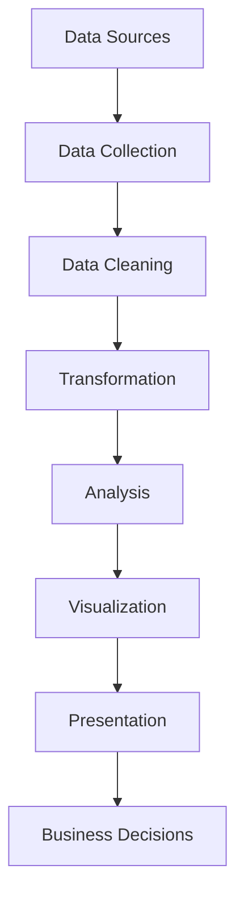
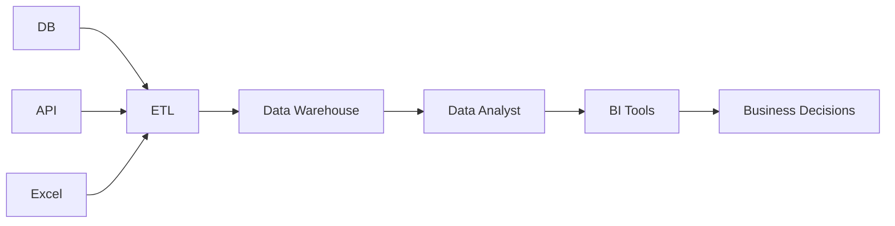
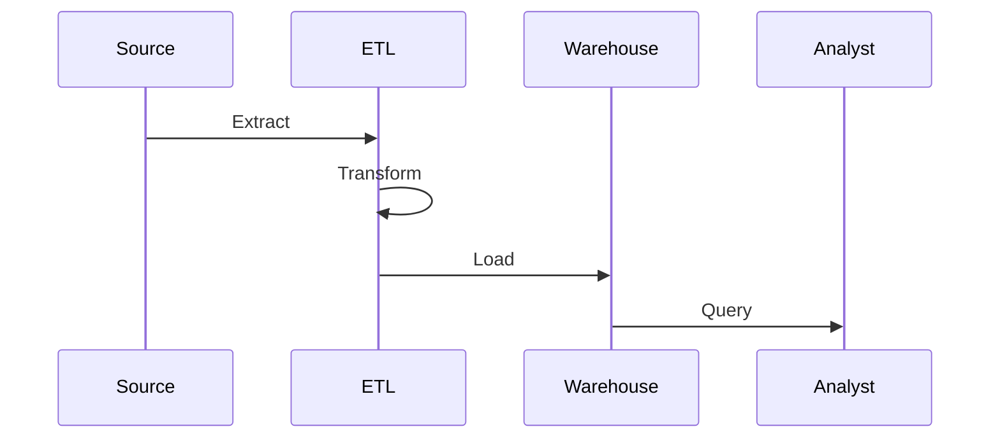

# Основні задачі Data Analyst

## Вступ

Задачі Data Analyst охоплюють весь цикл роботи з даними — від збору до презентації результатів. Аналітик не просто «рахує цифри», а будує міст між даними та бізнес-рішеннями, допомагає знаходити відповіді на складні питання, оптимізувати процеси, прогнозувати майбутнє.

## Історія/Походження

Задачі аналітика еволюціонували разом із розвитком технологій. Якщо у 1980-х це були прості розрахунки у Excel, то сьогодні це складні ETL-процеси, інтеграція даних з десятків джерел, побудова інтерактивних дашбордів, робота з Big Data та машинним навчанням.

## Основний матеріал

### 1. Збір даних

-   Визначення джерел: БД, API, Excel, веб-сервіси, лог-файли, соцмережі, open data
-   Вибір методу збору: ручний, автоматизований (скрипти, ETL)
-   Оцінка якості джерела, перевірка на актуальність, повноту, достовірність

### 2. Очищення та підготовка даних

-   Видалення пропусків, дублікати, обробка аномалій
-   Нормалізація форматів (дати, числа, категорії)
-   Стандартизація назв, кодування
-   Валідація даних, перевірка на логічні помилки

### 3. Трансформація та інтеграція

-   Злиття даних з різних джерел (JOIN, merge)
-   Побудова нових ознак (feature engineering)
-   Агрегація, групування, фільтрація
-   Перетворення структури даних для аналізу

### 4. Аналіз та статистика

-   Описова статистика: середні, медіани, дисперсії, розподіли
-   Індуктивна статистика: гіпотези, тестування, кореляції
-   Побудова моделей, кластеризація, регресія
-   Виявлення трендів, сезонності, аномалій

### 5. Візуалізація

-   Побудова графіків, heatmap, геоаналіз
-   Інтерактивні дашборди (Power BI, Tableau)
-   Storytelling через дані

### 6. Презентація результатів

-   Підготовка звітів, презентацій, дашбордів
-   Вміння пояснити складні речі просто
-   Взаємодія з бізнесом, менеджментом, технічними командами

### 7. Автоматизація та оптимізація

-   Написання скриптів для рутинних задач
-   Впровадження ETL-процесів
-   Оптимізація запитів, підвищення продуктивності

### 8. Валідація та тестування

-   Перевірка результатів, тестування гіпотез
-   Крос-перевірка з іншими джерелами
-   Документування процесу

### 9. Етичні аспекти

-   Дотримання privacy, GDPR
-   Відповідальність за інтерпретацію даних

## Приклад коду: автоматизований збір та очищення

```python
import pandas as pd
import requests
response = requests.get('https://api.example.com/data')
data = response.json()
df = pd.DataFrame(data)
df = df.drop_duplicates()
df = df.dropna()
df['date'] = pd.to_datetime(df['date'])
print(df.info())
```

## Пояснення під капотом

Аналітик використовує інструменти для автоматизації збору (ETL, API, скрипти), очищення (pandas, OpenRefine), трансформації (SQL, Python), візуалізації (Tableau, matplotlib), презентації (Power BI, Google Data Studio). Важливо розуміти, як працює пам’ять, як оптимізувати запити, як обирати типи даних для ефективної обробки.

## Нюанси та підводні камені

-   Дані з різних джерел можуть мати різну структуру, якість, формат
-   Важливо враховувати timezone, локалізацію, кодування
-   Не всі пропуски потрібно видаляти — іноді їх треба інтерпретувати
-   Агрегація може приховати важливі деталі
-   Візуалізація може вводити в оману, якщо неправильно підібрано тип графіка
-   Важливо тестувати гіпотези, а не лише описувати дані

## Діаграма: цикл задач Data Analyst



## Приклад застосування в реальних проєктах

**Ритейл:** Збір даних про продажі, очищення, аналіз сезонності, побудова дашборду для закупівельників.

**Фінанси:** Автоматизований збір транзакцій, виявлення аномалій, побудова скорингової моделі.

**E-commerce:** Аналіз поведінки користувачів, оптимізація маркетингових кампаній, A/B тестування.

**Медицина:** Збір даних пацієнтів, очищення, пошук кореляцій між симптомами та результатами лікування.

## Best practices

-   Документуйте всі етапи роботи
-   Використовуйте автоматизацію для рутинних задач
-   Перевіряйте якість даних на кожному етапі
-   Візуалізуйте дані для пошуку неочевидних патернів
-   Вчіться пояснювати результати для нетехнічної аудиторії
-   Дотримуйтесь етики роботи з даними

## Крос-посилання

-   [Типи даних](../../03-data-basics/types.md)
-   [Очищення даних](../../04-wrangling/cleaning.md)
-   [Візуалізація даних](../../05-visualization/principles.md)
-   [SQL для аналітики](../../06-sql/basics.md)
-   [Python для аналізу даних](../../08-python/pandas.md)

## Підсумок

-   Задачі Data Analyst охоплюють весь цикл роботи з даними
-   Важливо розуміти як технічний, так і бізнес-контекст
-   Якісна робота аналітика = якісні дані + правильні висновки
-   Постійне навчання, розвиток компетенцій, адаптація до нових технологій

---

# Додатково: розширений матеріал

## Еволюція задач Data Analyst

З розвитком технологій задачі аналітика стали складнішими: інтеграція Big Data, робота з хмарними платформами, побудова складних ETL-процесів, застосування ML для прогнозування.

### Види задач

-   Оперативна аналітика (оперативні звіти, моніторинг)
-   Стратегічна аналітика (прогнозування, планування)
-   Дослідницька аналітика (пошук нових патернів, гіпотез)
-   Візуальна аналітика (інтерактивні дашборди)

## Інструменти для задач

-   SQL, Python, R, Scala
-   Excel, Google Sheets, OpenRefine
-   Power BI, Tableau, Qlik, Looker, Google Data Studio
-   Jupyter Notebook, Google Colab, Zeppelin
-   ETL-платформи: Apache Airflow, Talend, Informatica

## Приклад коду: побудова інтерактивного дашборду

```python
import dash
import dash_core_components as dcc
import dash_html_components as html
import pandas as pd
df = pd.read_csv('sales.csv')
app = dash.Dash(__name__)
app.layout = html.Div([
    dcc.Graph(
        id='sales-graph',
        figure={
            'data': [
                {'x': df['date'], 'y': df['revenue'], 'type': 'line', 'name': 'Revenue'},
            ],
            'layout': {'title': 'Sales Over Time'}
        }
    )
])
if __name__ == '__main__':
    app.run_server(debug=True)
```

## Діаграма: інтеграція даних з різних джерел



## Типові помилки

-   Ігнорування пропусків у даних
-   Неправильна агрегація
-   Відсутність валідації результатів
-   Використання застарілих джерел
-   Недостатня документація процесу аналізу
-   Відсутність резервного копіювання даних

## Антипатерни

-   "Excel-only" аналітика без автоматизації
-   Відсутність документації
-   Аналіз без розуміння бізнесу
-   Використання одного джерела даних без крос-перевірки
-   Відсутність тестування скриптів

## Приклад: кейс з e-commerce

Аналітик отримав дані про поведінку користувачів на сайті. Після очищення та аналізу виявив, що більшість покупок здійснюється у вечірній час. Це дозволило маркетологам оптимізувати час розсилки акційних пропозицій, що підвищило конверсію на 15%.

**Кейс з фінансів:**
Аналітик виявив аномальні транзакції у великому банку, що дозволило службі безпеки оперативно заблокувати шахрайські операції.

**Кейс з медицини:**
Аналізуючи дані пацієнтів, аналітик знайшов кореляцію між певними симптомами та ефективністю лікування, що допомогло лікарям скоригувати протоколи.

## Пояснення під капотом: як працює ETL

ETL (Extract, Transform, Load) — це процес отримання даних, їх трансформації та завантаження у сховище. Data Analyst часто працює з готовими ETL-процесами, але має розуміти їхню логіку для коректної інтерпретації даних.

### Етапи ETL:

-   Extract — отримання даних з різних джерел (БД, API, файли)
-   Transform — очищення, нормалізація, агрегація, об’єднання
-   Load — завантаження у сховище (Data Warehouse, Data Lake)

## Діаграма: ETL-процес



## Підсумок (розширений)

-   Задачі Data Analyst — це не просто «рахувати цифри», а будувати міст між даними та рішеннями
-   Вміння працювати з різними джерелами та інструментами
-   Важливість комунікації та пояснення результатів
-   Постійне навчання та розвиток компетенцій
-   Вміння адаптуватися до нових технологій і вимог ринку
