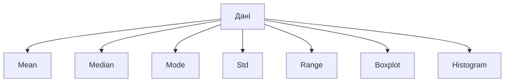
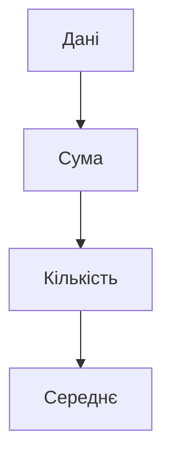

# Описова статистика

## Вступ

Описова статистика — це фундаментальний розділ статистики, який дозволяє узагальнювати, описувати та візуалізувати великі обсяги даних. Вона дає змогу швидко зрозуміти структуру, розподіл, основні характеристики вибірки без складних математичних моделей.

## Історія/Походження

Описова статистика виникла ще у XVIII–XIX століттях, коли вчені почали збирати та аналізувати демографічні, економічні, медичні дані. Перші методи — середнє арифметичне, медіана, мода, дисперсія — були розроблені для узагальнення великих таблиць чисел. З розвитком комп’ютерів і програмного забезпечення описова статистика стала основою для сучасної аналітики даних.

## Основний матеріал

Описова статистика включає:

### 1. Міри центральної тенденції

-   Середнє арифметичне (mean)
-   Медіана (median)
-   Мода (mode)

### 2. Міри розсіювання

-   Дисперсія (variance)
-   Стандартне відхилення (standard deviation)
-   Розмах (range)
-   Квартилі, перцентилі

### 3. Міри форми розподілу

-   Асиметрія (skewness)
-   Ексцес (kurtosis)

### 4. Візуалізація

-   Гістограми
-   Boxplot
-   Scatterplot
-   Heatmap

### 5. Опис вибірки

-   Кількість спостережень (n)
-   Частоти, відсотки

#### Приклад: описова статистика для продажів

```python
import pandas as pd
df = pd.read_csv('sales.csv')
print('Mean:', df['revenue'].mean())
print('Median:', df['revenue'].median())
print('Mode:', df['revenue'].mode()[0])
print('Std:', df['revenue'].std())
print('Min:', df['revenue'].min())
print('Max:', df['revenue'].max())
print('Count:', df['revenue'].count())
```

## Пояснення під капотом

Описова статистика працює з реальними даними, не роблячи припущень про їхню природу. Вона дозволяє швидко знайти аномалії, зрозуміти розподіл, оцінити якість даних. Важливо знати, як працюють алгоритми розрахунку середнього, медіани, стандартного відхилення, як обирати правильні міри для різних типів даних (кількісні, категоріальні).

## Нюанси та підводні камені

-   Середнє чутливе до викидів (outliers)
-   Медіана краще для асиметричних розподілів
-   Мода корисна для категоріальних даних
-   Дисперсія та стандартне відхилення — для кількісних змінних
-   Boxplot дозволяє швидко знайти викиди
-   Heatmap — для візуалізації кореляцій
-   Важливо враховувати пропуски, дублікати

## Діаграма: основні міри описової статистики



## Приклад застосування в реальних проєктах

**Ритейл:** Аналіз середнього чеку, розподілу продажів, виявлення сезонних патернів.

**Фінанси:** Оцінка ризиків, аналіз розподілу транзакцій, пошук аномалій.

**E-commerce:** Визначення типового користувача, аналіз конверсії, сегментація клієнтів.

**Медицина:** Аналіз розподілу віку пацієнтів, пошук аномальних значень, оцінка ефективності лікування.

## Best practices

-   Завжди перевіряйте якість даних перед аналізом
-   Використовуйте візуалізацію для пошуку патернів
-   Обирайте правильні міри для типу даних
-   Документуйте всі етапи аналізу
-   Враховуйте вплив викидів
-   Пояснюйте результати для нетехнічної аудиторії

## Крос-посилання

-   [Індуктивна статистика](../inductive.md)
-   [Очищення даних](../../04-wrangling/cleaning.md)
-   [Візуалізація даних](../../05-visualization/principles.md)
-   [Python для аналізу даних](../../08-python/pandas.md)

## Підсумок

-   Описова статистика — основа для аналізу даних
-   Дозволяє швидко оцінити структуру, розподіл, якість вибірки
-   Важливо обирати правильні міри для задачі
-   Якісний опис = якісні висновки
-   Постійне навчання, розвиток компетенцій

---

# Додатково: розширений матеріал

## Еволюція описової статистики

Від ручних розрахунків до інтерактивних дашбордів: описова статистика стала основою для BI, Data Science, машинного навчання. Сучасні інструменти дозволяють аналізувати мільйони рядків за секунди.

### Види описової статистики

-   Для кількісних даних (mean, std, range)
-   Для категоріальних даних (mode, частоти)
-   Для часових рядів (trend, сезонність)

## Інструменти

-   Python (pandas, numpy, scipy, seaborn)
-   R (dplyr, ggplot2)
-   Excel, Google Sheets
-   Power BI, Tableau

## Приклад коду: побудова boxplot та heatmap

```python
import pandas as pd
import seaborn as sns
import matplotlib.pyplot as plt
df = pd.read_csv('sales.csv')
sns.boxplot(x=df['revenue'])
plt.show()
corr = df.corr()
sns.heatmap(corr, annot=True)
plt.show()
```

## Діаграма: процес описового аналізу


## Типові помилки

-   Ігнорування викидів
-   Неправильний вибір міри для типу даних
-   Відсутність візуалізації
-   Недостатня документація
-   Відсутність резервного копіювання даних

## Антипатерни

-   "Mean-only" аналіз без врахування медіани, моди
-   Відсутність аналізу розсіювання
-   Аналіз без візуалізації
-   Використання одного джерела даних без крос-перевірки

## Приклад: кейс з e-commerce

Аналізуючи розподіл покупок, аналітик виявив, що середній чек у вихідні на 20% вищий, ніж у будні. Це дозволило оптимізувати маркетингову стратегію.

**Кейс з фінансів:**
Аналіз розподілу транзакцій дозволив виявити аномальні платежі, що сигналізували про шахрайство.

**Кейс з медицини:**
Описова статистика віку пацієнтів допомогла визначити групу ризику для певного захворювання.

## Пояснення під капотом: як працюють алгоритми

Середнє — сума всіх значень, поділена на їхню кількість. Медіана — центральне значення у впорядкованій вибірці. Мода — найчастіше зустрічається. Дисперсія — середній квадрат відхилення від середнього. Стандартне відхилення — корінь із дисперсії. Boxplot — графік, що показує розподіл, викиди, квартилі.

## Діаграма: алгоритм розрахунку середнього



## Підсумок (розширений)

-   Описова статистика — ключ до розуміння даних
-   Вміння обирати правильні міри та інструменти
-   Важливість візуалізації та документації
-   Постійне навчання та розвиток компетенцій
