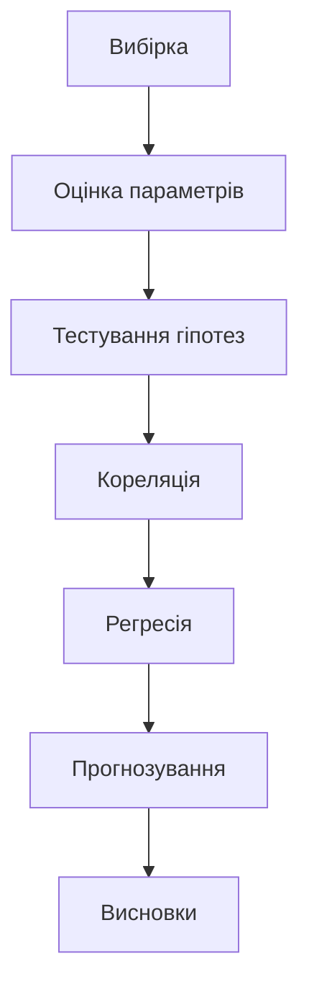
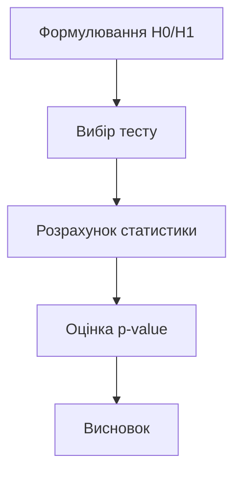
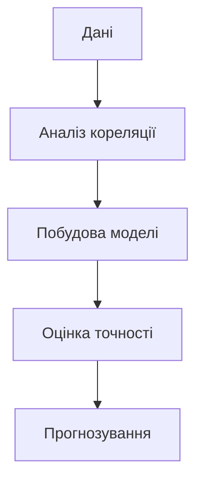

# Індуктивна статистика

## Вступ

Індуктивна статистика — це розділ статистики, який дозволяє робити висновки про всю генеральну сукупність на основі вибірки. Вона дає змогу перевіряти гіпотези, оцінювати ймовірності, будувати прогнози та приймати рішення в умовах невизначеності.

## Історія/Походження

Індуктивна статистика виникла у XIX–XX століттях, коли вчені почали шукати способи узагальнення результатів експериментів, соціологічних опитувань, медичних досліджень. Поява теорії ймовірностей, закону великих чисел, центральної граничної теореми стала основою для сучасних методів індуктивного аналізу.

## Основний матеріал

Індуктивна статистика включає:

### 1. Гіпотези

-   Нульова гіпотеза (H0)
-   Альтернативна гіпотеза (H1)
-   Формулювання, перевірка, прийняття/відхилення

### 2. Вибірка та генеральна сукупність

-   Вибірка — частина генеральної сукупності
-   Репрезентативність, випадковість, розмір вибірки

### 3. Оцінки параметрів

-   Оцінка середнього, дисперсії, пропорції
-   Довірчий інтервал

### 4. Тестування гіпотез

-   t-тест, z-тест, χ²-тест, ANOVA
-   p-value, рівень значущості (α)
-   Помилки першого та другого роду

### 5. Кореляція та регресія

-   Кореляція (коефіцієнт Пірсона, Спірмена)
-   Лінійна, множинна регресія
-   Оцінка сили та напряму зв’язку

### 6. Прогнозування

-   Побудова моделей для передбачення майбутніх значень
-   Оцінка точності прогнозу

#### Приклад: t-тест для порівняння середніх

```python
import pandas as pd
from scipy.stats import ttest_ind
df = pd.read_csv('sales.csv')
group1 = df[df['region'] == 'East']['revenue']
group2 = df[df['region'] == 'West']['revenue']
t_stat, p_val = ttest_ind(group1, group2)
print('t-statistic:', t_stat)
print('p-value:', p_val)
```

## Пояснення під капотом

Індуктивна статистика базується на теорії ймовірностей. Вона дозволяє оцінити, наскільки результати вибірки можуть бути узагальнені на всю сукупність. Важливо розуміти, як працюють алгоритми тестування гіпотез, як обирати правильний тест для задачі, як інтерпретувати p-value, довірчі інтервали.

## Нюанси та підводні камені

-   Вибірка має бути репрезентативною
-   Неправильний вибір тесту може призвести до хибних висновків
-   p-value не завжди означає практичну значущість
-   Помилки першого та другого роду
-   Кореляція не означає причинно-наслідковий зв’язок
-   Важливо враховувати розмір вибірки

## Діаграма: процес індуктивного аналізу



## Приклад застосування в реальних проєктах

**Ритейл:** Перевірка гіпотези про різницю середнього чеку у двох магазинах.

**Фінанси:** Оцінка ймовірності дефолту клієнта, побудова скорингової моделі.

**E-commerce:** Тестування ефективності нової функції сайту (A/B тестування).

**Медицина:** Перевірка ефективності нового препарату на основі вибірки пацієнтів.

## Best practices

-   Формулюйте гіпотези чітко
-   Обирайте правильний тест для задачі
-   Враховуйте розмір та якість вибірки
-   Документуйте всі етапи аналізу
-   Інтерпретуйте результати з урахуванням бізнес-контексту
-   Візуалізуйте результати тестування

## Крос-посилання

-   [Описова статистика](./descriptive.md)
-   [Ймовірності](./probability.md)
-   [Очищення даних](../../04-wrangling/cleaning.md)
-   [Python для аналізу даних](../../08-python/pandas.md)

## Підсумок

-   Індуктивна статистика — ключ до прийняття рішень на основі даних
-   Дозволяє узагальнювати результати вибірки
-   Важливо обирати правильні методи та інтерпретувати результати
-   Якісний аналіз = якісні висновки
-   Постійне навчання, розвиток компетенцій

---

# Додатково: розширений матеріал

## Еволюція індуктивної статистики

Від простих тестів до складних моделей прогнозування: індуктивна статистика стала основою для Data Science, машинного навчання, бізнес-аналітики.

### Види індуктивного аналізу

-   Тестування гіпотез (t-тест, z-тест, χ²-тест, ANOVA)
-   Оцінка параметрів (довірчі інтервали)
-   Кореляція та регресія
-   Прогнозування (time series, ML)

## Інструменти

-   Python (scipy, statsmodels, sklearn)
-   R (stats, car, lm)
-   Excel, Google Sheets
-   Power BI, Tableau

## Приклад коду: побудова довірчого інтервалу

```python
import numpy as np
import scipy.stats as stats
data = np.random.normal(100, 15, 200)
mean = np.mean(data)
std = np.std(data)
conf_int = stats.norm.interval(0.95, loc=mean, scale=std/np.sqrt(len(data)))
print('Mean:', mean)
print('95% CI:', conf_int)
```

## Діаграма: алгоритм тестування гіпотези



## Типові помилки

-   Неправильний вибір тесту
-   Ігнорування розміру вибірки
-   Неправильна інтерпретація p-value
-   Відсутність візуалізації результатів
-   Недостатня документація
-   Відсутність резервного копіювання даних

## Антипатерни

-   "p-value-only" аналіз без врахування бізнес-контексту
-   Відсутність аналізу якості вибірки
-   Аналіз без візуалізації
-   Використання одного джерела даних без крос-перевірки

## Приклад: кейс з e-commerce

Тестування нової функції сайту показало, що конверсія зросла на 10% (p < 0.05). Це дозволило бізнесу впровадити зміни для всіх користувачів.

**Кейс з фінансів:**
Оцінка ймовірності дефолту клієнта дозволила банку скоригувати кредитну політику.

**Кейс з медицини:**
Перевірка ефективності нового препарату показала статистично значущий результат, що дозволило рекомендувати його для широкого застосування.

## Пояснення під капотом: як працюють алгоритми

Тестування гіпотез — це порівняння статистики вибірки з теоретичним розподілом. Довірчий інтервал — діапазон, у якому з певною ймовірністю знаходиться параметр сукупності. Кореляція — міра зв’язку між змінними. Регресія — побудова моделі для прогнозування.

## Діаграма: алгоритм побудови регресії



## Підсумок (розширений)

-   Індуктивна статистика — ключ до прийняття рішень на основі даних
-   Вміння обирати правильні методи та інтерпретувати результати
-   Важливість візуалізації та документації
-   Постійне навчання та розвиток компетенцій
