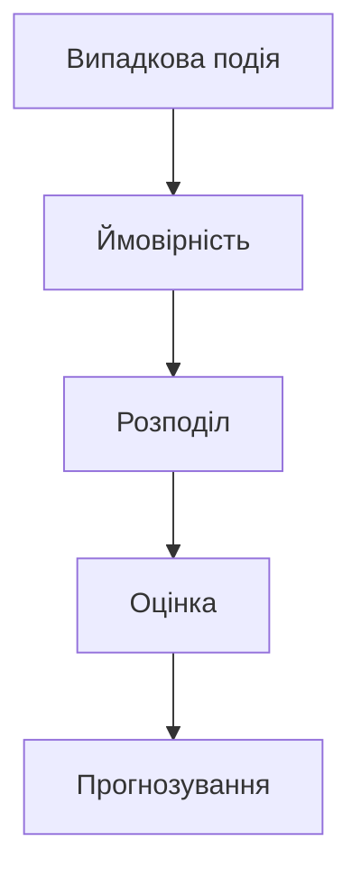
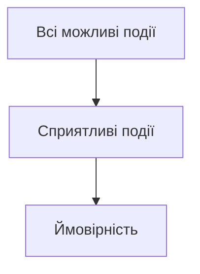

# Ймовірності

## Вступ

Ймовірності — це фундаментальна концепція статистики, яка дозволяє оцінювати шанси настання подій, приймати рішення в умовах невизначеності, моделювати випадкові процеси. В аналітиці даних ймовірності лежать в основі тестування гіпотез, прогнозування, машинного навчання.

## Історія/Походження

Теорія ймовірностей виникла у XVII столітті завдяки роботам Блеза Паскаля, П’єра Ферма, Якоба Бернуллі. Спочатку вона застосовувалась для аналізу азартних ігор, потім — у страхуванні, фінансах, фізиці, біології. Сьогодні ймовірності — основа для Data Science, AI, статистики, економіки, медицини.

## Основний матеріал

### 1. Основні поняття

-   Випадкова подія
-   Простір подій
-   Ймовірність події (від 0 до 1)
-   Несумісні, незалежні, залежні події

### 2. Властивості ймовірностей

-   P(A) ≥ 0
-   P(∅) = 0
-   P(Ω) = 1
-   P(A ∪ B) = P(A) + P(B) для несумісних
-   P(A ∩ B) = P(A) \* P(B) для незалежних

### 3. Класичне, статистичне, геометричне визначення

-   Класичне: рівноймовірні події
-   Статистичне: частота у великій кількості експериментів
-   Геометричне: площа, довжина, об’єм

### 4. Формули

-   Формула суми: P(A ∪ B) = P(A) + P(B) – P(A ∩ B)
-   Формула добутку: P(A ∩ B) = P(A) \* P(B|A)
-   Формула повної ймовірності
-   Формула Байєса

### 5. Розподіли ймовірностей

-   Дискретні: біноміальний, Пуассона
-   Неперервні: нормальний, експоненціальний

### 6. Закон великих чисел, центральна гранична теорема

-   Закон великих чисел: середнє значення вибірки наближається до математичного очікування при збільшенні розміру вибірки
-   Центральна гранична теорема: сума незалежних випадкових змінних має нормальний розподіл

#### Приклад: оцінка ймовірності події

```python
# Монета: ймовірність орла
import random
trials = 10000
heads = sum([random.choice([0,1]) for _ in range(trials)])
print('Empirical probability:', heads/trials)
```

#### Приклад: формула Байєса

```python
# P(A|B) = P(B|A) * P(A) / P(B)
def bayes(P_A, P_B_given_A, P_B):
    return (P_B_given_A * P_A) / P_B
print(bayes(0.01, 0.9, 0.05))
```

## Пояснення під капотом

Ймовірності використовуються для моделювання невизначеності, оцінки ризиків, прогнозування. Важливо розуміти, як працюють розподіли, як обирати правильну модель для задачі, як інтерпретувати результати. Закон великих чисел гарантує стабільність оцінок, центральна гранична теорема — універсальність нормального розподілу.

## Нюанси та підводні камені

-   Ймовірність не гарантує результат, а лише оцінює шанси
-   Важливо розрізняти незалежність і несумісність
-   Емпірична ймовірність може відрізнятися від теоретичної
-   Неправильний вибір розподілу призводить до хибних висновків
-   Байєсівський підхід — для задач з умовною ймовірністю
-   Важливо враховувати розмір вибірки

## Діаграма: основні поняття ймовірностей



## Приклад застосування в реальних проєктах

**Ритейл:** Оцінка ймовірності покупки, прогнозування попиту.

**Фінанси:** Оцінка ризику дефолту, страхування, моделювання портфеля.

**E-commerce:** Прогнозування конверсії, A/B тестування.

**Медицина:** Оцінка ймовірності захворювання, ефективності лікування.

## Best practices

-   Формулюйте задачі чітко
-   Обирайте правильний розподіл для даних
-   Враховуйте розмір вибірки
-   Документуйте всі етапи аналізу
-   Інтерпретуйте результати з урахуванням бізнес-контексту
-   Візуалізуйте результати

## Крос-посилання

-   [Описова статистика](./descriptive.md)
-   [Індуктивна статистика](./inductive.md)
-   [Очищення даних](../../04-wrangling/cleaning.md)
-   [Python для аналізу даних](../../08-python/pandas.md)

## Підсумок

-   Ймовірності — основа для прийняття рішень в умовах невизначеності
-   Дозволяють моделювати випадкові процеси
-   Важливо обирати правильні методи та інтерпретувати результати
-   Якісний аналіз = якісні висновки
-   Постійне навчання, розвиток компетенцій

---

# Додатково: розширений матеріал

## Еволюція теорії ймовірностей

Від азартних ігор до штучного інтелекту: ймовірності стали основою для Data Science, машинного навчання, фінансів, медицини.

### Види ймовірностей

-   Класична (рівноймовірні події)
-   Статистична (частота)
-   Геометрична (площа, об’єм)
-   Байєсівська (умовна ймовірність)

## Інструменти

-   Python (random, numpy, scipy, statsmodels)
-   R (prob, stats)
-   Excel, Google Sheets
-   Power BI, Tableau

## Приклад коду: моделювання нормального розподілу

```python
import numpy as np
import matplotlib.pyplot as plt
data = np.random.normal(100, 15, 1000)
plt.hist(data, bins=30)
plt.title('Normal Distribution')
plt.show()
```

## Діаграма: процес оцінки ймовірності


## Типові помилки

-   Неправильний вибір розподілу
-   Ігнорування залежності між подіями
-   Неправильна інтерпретація результатів
-   Відсутність візуалізації
-   Недостатня документація
-   Відсутність резервного копіювання даних

## Антипатерни

-   "Empirical-only" аналіз без теоретичної перевірки
-   Відсутність аналізу залежності
-   Аналіз без візуалізації
-   Використання одного джерела даних без крос-перевірки

## Приклад: кейс з e-commerce

Оцінка ймовірності покупки дозволила оптимізувати маркетингову стратегію, підвищити конверсію на 12%.

**Кейс з фінансів:**
Оцінка ризику дефолту дозволила банку скоригувати кредитну політику.

**Кейс з медицини:**
Оцінка ймовірності захворювання допомогла визначити групу ризику для профілактики.

## Пояснення під капотом: як працюють алгоритми

Ймовірність — це частка сприятливих подій у загальній кількості можливих. Формула Байєса дозволяє оновлювати оцінки з урахуванням нових даних. Нормальний розподіл — універсальна модель для багатьох процесів.

## Діаграма: алгоритм розрахунку ймовірності



## Підсумок (розширений)

-   Ймовірності — ключ до розуміння невизначеності
-   Вміння обирати правильні моделі та інструменти
-   Важливість візуалізації та документації
-   Постійне навчання та розвиток компетенцій
