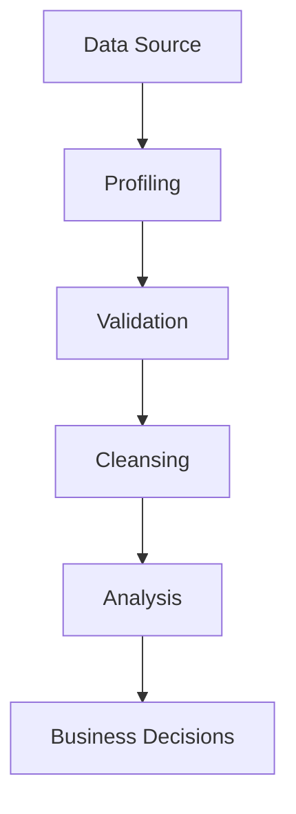
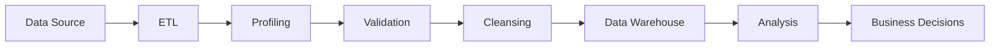
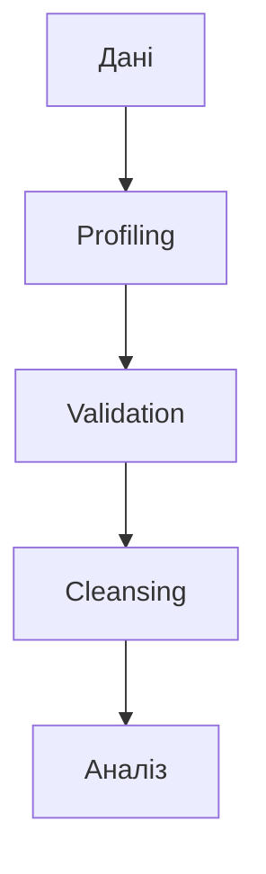

# Оцінка якості даних

## Вступ

Якість даних — це фундамент для будь-якої аналітики, машинного навчання, бізнес-рішень. Без якісних даних неможливо отримати достовірні результати, побудувати коректні моделі, приймати обґрунтовані рішення. Оцінка якості даних — це системний процес, який дозволяє виявити проблеми, підвищити точність та надійність аналізу.

## Історія/Походження

Питання якості даних виникло ще у XX столітті з розвитком інформаційних систем, баз даних, статистики. Перші стандарти (ISO, DAMA DMBOK) були розроблені для корпоративних систем, фінансів, медицини. Сьогодні оцінка якості — це окремий напрям у Data Management, Data Governance, Data Engineering.

## Основний матеріал

### 1. Виміри якості даних

-   Точність (accuracy)
-   Повнота (completeness)
-   Актуальність (timeliness)
-   Узгодженість (consistency)
-   Унікальність (uniqueness)
-   Доступність (accessibility)
-   Валідність (validity)

### 2. Джерела проблем якості

-   Пропуски, дублікати, помилки введення
-   Застарілі дані
-   Некоректне форматування
-   Різні стандарти у різних джерелах
-   Відсутність документації

### 3. Методи оцінки якості

-   Data profiling (аналіз розподілу, частот, унікальності)
-   Data validation (перевірка на відповідність правилам)
-   Data lineage (відстеження походження даних)
-   Data cleansing (очищення, нормалізація)
-   Візуалізація якості (heatmap, barplot)

### 4. Інструменти

-   Python (pandas, great_expectations, pandas-profiling)
-   OpenRefine
-   SQL (CHECK, CONSTRAINT)
-   BI-інструменти (Power BI, Tableau)

#### Приклад: оцінка якості даних у pandas

```python
import pandas as pd
df = pd.read_csv('sales.csv')
print('Missing values:', df.isnull().sum())
print('Duplicates:', df.duplicated().sum())
print('Unique regions:', df['region'].nunique())
print('Data types:', df.dtypes)
```

## Пояснення під капотом

Оцінка якості даних — це не одноразова дія, а постійний процес. Важливо розуміти, як працюють алгоритми пошуку пропусків, дублікати, як перевіряти валідність, як впроваджувати автоматичні тести якості. Data lineage дозволяє відстежити шлях даних від джерела до аналітики.

## Нюанси та підводні камені

-   Якість даних залежить від джерела
-   Автоматичні тести не завжди виявляють всі проблеми
-   Важливо враховувати бізнес-контекст
-   Очищення може призвести до втрати важливої інформації
-   Не всі пропуски — це помилки
-   Важливо документувати всі зміни

## Діаграма: процес оцінки якості даних



## Приклад застосування в реальних проєктах

**Ритейл:** Виявлення дублікативних записів про клієнтів, очищення бази для маркетингових кампаній.

**Фінанси:** Перевірка валідності транзакцій, виявлення аномалій, підвищення точності скорингових моделей.

**E-commerce:** Очищення даних про покупки, виявлення пропусків, оптимізація рекомендацій.

**Медицина:** Перевірка повноти даних пацієнтів, виявлення помилок введення, підвищення якості аналізу.

## Best practices

-   Використовуйте автоматичні тести якості
-   Документуйте всі зміни
-   Впроваджуйте data lineage
-   Перевіряйте якість на кожному етапі ETL
-   Візуалізуйте якість для пошуку проблем
-   Враховуйте бізнес-контекст

## Крос-посилання

-   [Типи даних](./types.md)
-   [Очищення даних](../../04-wrangling/cleaning.md)
-   [Візуалізація даних](../../05-visualization/principles.md)
-   [Python для аналізу даних](../../08-python/pandas.md)

## Підсумок

-   Якість даних — основа для достовірної аналітики
-   Важливо оцінювати всі виміри якості
-   Якісний аналіз = якісні висновки
-   Постійне навчання, розвиток компетенцій

---

# Додатково: розширений матеріал

## Еволюція підходів до якості даних

Від ручної перевірки до автоматичних тестів: сучасні системи дозволяють оцінювати якість у реальному часі, впроваджувати data lineage, автоматизувати очищення.

### Види проблем якості

-   Пропуски (missing values)
-   Дублікати (duplicates)
-   Некоректні формати (invalid formats)
-   Аномалії (outliers)
-   Відсутність документації

## Інструменти

-   Python (pandas, great_expectations, pandas-profiling)
-   OpenRefine
-   SQL (CHECK, CONSTRAINT)
-   BI-інструменти (Power BI, Tableau)

## Приклад коду: автоматичний data profiling

```python
import pandas_profiling
import pandas as pd
df = pd.read_csv('sales.csv')
profile = pandas_profiling.ProfileReport(df)
profile.to_file('report.html')
```

## Діаграма: інтеграція оцінки якості у ETL



## Типові помилки

-   Ігнорування проблем якості
-   Недостатня документація
-   Відсутність резервного копіювання
-   Очищення без аналізу впливу
-   Використання одного джерела даних

## Антипатерни

-   "Manual-only" перевірка без автоматизації
-   Відсутність data lineage
-   Аналіз без оцінки якості
-   Відсутність тестування скриптів

## Приклад: кейс з e-commerce

Очищення даних про покупки дозволило підвищити точність рекомендацій на 20%.

**Кейс з фінансів:**
Виявлення аномалій у транзакціях дозволило знизити ризик шахрайства.

**Кейс з медицини:**
Перевірка повноти даних пацієнтів допомогла визначити групу ризику для профілактики.

## Пояснення під капотом: як працюють алгоритми

Data profiling — це аналіз розподілу, частот, унікальності. Data validation — перевірка на відповідність правилам. Data lineage — відстеження шляху даних. Data cleansing — автоматичне або ручне очищення.

## Діаграма: алгоритм оцінки якості



## Підсумок (розширений)

-   Якість даних — ключ до достовірної аналітики
-   Вміння обирати правильні інструменти та методи
-   Важливість документації та автоматизації
-   Постійне навчання та розвиток компетенцій
