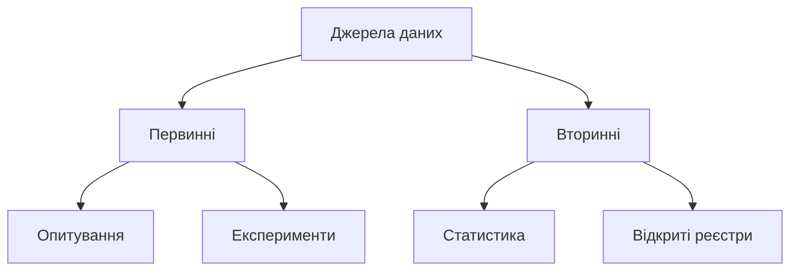
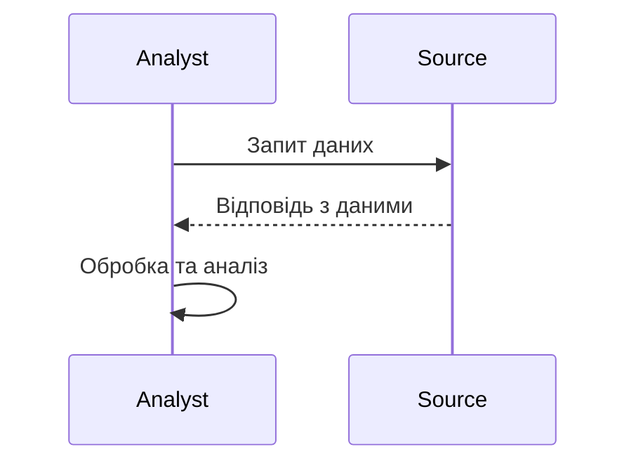

# Джерела даних

---

## Вступ

Джерела даних — це фундамент будь-якої аналітичної діяльності. Від якості, структури, доступності та релевантності джерел залежить успіх аналізу, точність висновків і ефективність прийняття рішень. У цьому розділі розглянемо класифікацію джерел даних, їхню історію, сучасні тенденції, типові приклади, нюанси роботи, поширені помилки та кращі практики.

---

## Історія та еволюція джерел даних

### Витоки

Перші джерела даних — це паперові документи, книги, архіви, бухгалтерські книги. З розвитком інформаційних технологій з’явилися електронні таблиці, бази даних, потім — великі сховища даних (Data Warehouses), хмарні сервіси, API, сенсори IoT.

### Етапи розвитку

-   **Паперові архіви**: ручний збір, обмежена доступність.
-   **Електронні таблиці**: автоматизація, перші спроби структуризації.
-   **Бази даних**: централізація, SQL, реляційна модель.
-   **Data Warehouses**: інтеграція з різних джерел, OLAP.
-   **Big Data**: Hadoop, NoSQL, розподілені системи.
-   **Хмарні сервіси**: доступність, масштабованість, API.
-   **IoT та сенсори**: потоки даних у реальному часі.

---

## Класифікація джерел даних

### За типом походження

-   **Первинні** — дані, зібрані безпосередньо для конкретної задачі (опитування, експерименти).
-   **Вторинні** — дані, зібрані раніше для інших цілей (статистика, відкриті реєстри).

### За структурою

-   **Структуровані** — таблиці, бази даних, Excel.
-   **Напівструктуровані** — JSON, XML, лог-файли.
-   **Неструктуровані** — текст, зображення, аудіо, відео.

### За доступністю

-   **Відкриті** — open data, державні реєстри.
-   **Закриті** — корпоративні бази, приватні дані.
-   **Платні** — комерційні бази, підписки.

### За джерелом надходження

-   **Внутрішні** — CRM, ERP, фінансові системи компанії.
-   **Зовнішні** — API, відкриті дані, соцмережі, партнери.

---

## Основні джерела даних для аналітика

1. **Бази даних** (SQL, NoSQL)
2. **Електронні таблиці** (Excel, Google Sheets)
3. **API** (REST, SOAP)
4. **Веб-скрапінг** (парсинг сайтів)
5. **Open Data** (державні портали, Kaggle)
6. **Лог-файли** (системні, веб-сервери)
7. **Сенсори та IoT**
8. **Соціальні мережі**
9. **Файли** (CSV, JSON, XML)
10. **Внутрішні корпоративні системи**

---

## Приклади коду для роботи з джерелами даних

### 1. Підключення до SQL бази даних (Python)

```python
import sqlite3
conn = sqlite3.connect('example.db')
cursor = conn.cursor()
cursor.execute('SELECT * FROM users')
rows = cursor.fetchall()
for row in rows:
    print(row)
conn.close()
```

### 2. Зчитування даних з CSV

```python
import pandas as pd
data = pd.read_csv('data.csv')
print(data.head())
```

### 3. Робота з API

```python
import requests
response = requests.get('https://api.example.com/data')
data = response.json()
print(data)
```

### 4. Веб-скрапінг

```python
from bs4 import BeautifulSoup
import requests
url = 'https://example.com'
response = requests.get(url)
soup = BeautifulSoup(response.text, 'html.parser')
for item in soup.find_all('div', class_='data'):
    print(item.text)
```

---

## Діаграми та візуалізації

### Mermaid: Класифікація джерел даних



### Mermaid: Потік отримання даних



---

## Реальні кейси використання джерел даних

### Кейс 1: Аналіз продажів у ритейлі

-   **Джерела**: CRM, POS, Excel, API постачальників.
-   **Завдання**: Визначити тренди, сезонність, прогнозувати попит.
-   **Підхід**: Інтеграція даних з різних джерел, очищення, побудова моделей.

### Кейс 2: Соціологічне дослідження

-   **Джерела**: Опитування, відкриті реєстри, соцмережі.
-   **Завдання**: Виявити демографічні особливості, настрої.
-   **Підхід**: Збір первинних та вторинних даних, аналіз тексту, візуалізація.

### Кейс 3: Моніторинг ІТ-інфраструктури

-   **Джерела**: Лог-файли, сенсори, API систем моніторингу.
-   **Завдання**: Виявити аномалії, оптимізувати ресурси.
-   **Підхід**: Потік даних у реальному часі, автоматичний аналіз, алерти.

---

## Кращі практики роботи з джерелами даних

1. **Валідація та очищення** — перевірка якості, видалення дублікатів, коригування помилок.
2. **Документування джерел** — фіксація метаданих, опис структури.
3. **Автоматизація збору** — використання ETL, скриптів, API.
4. **Безпека та конфіденційність** — шифрування, контроль доступу.
5. **Використання відкритих стандартів** — CSV, JSON, XML.
6. **Регулярне оновлення** — підтримка актуальності даних.
7. **Використання тестових даних** — для перевірки процесів.

---

## Нюанси та підводні камені

-   **Неповнота даних** — відсутність частини інформації.
-   **Невідповідність форматів** — різні структури, кодування.
-   **Обмеження доступу** — платні, закриті джерела.
-   **Юридичні аспекти** — GDPR, персональні дані.
-   **Застарілість** — дані не оновлюються.
-   **Відсутність метаданих** — складно зрозуміти контекст.
-   **Великий обсяг** — складність обробки Big Data.

---

## Перехресні посилання

-   [Якість даних](quality.md)
-   [Типи даних](types.md)
-   [Очищення та трансформація](../04-wrangling/cleaning.md)
-   [Візуалізація даних](../05-visualization/overview.md)
-   [SQL](../06-sql/overview.md)
-   [Python для роботи з даними](../08-python/overview.md)

---

## Розширене резюме

Джерела даних — це основа аналітики. Від їхнього вибору, якості, структури та доступності залежить успіх будь-якого аналітичного проєкту. Сучасний аналітик працює з різноманітними джерелами: від класичних баз даних до потоків IoT, від відкритих реєстрів до приватних корпоративних систем. Важливо не лише вміти знаходити та інтегрувати дані, а й розуміти їхню природу, обмеження, юридичні аспекти, забезпечувати якість і безпеку. Кращі практики включають автоматизацію, документування, регулярне оновлення та дотримання стандартів. Нюанси роботи з джерелами — це виклики, які потребують досвіду, уважності та глибокого розуміння предметної області. Вміння ефективно працювати з джерелами даних — ключова компетенція сучасного дата-аналітика.

---
