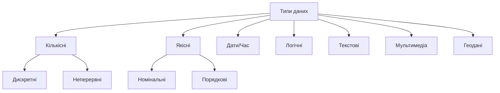
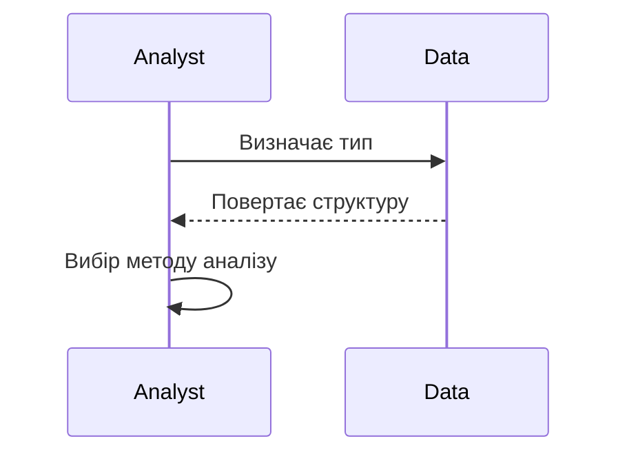

# Типи даних

---

## Вступ

Типи даних — це основа для розуміння, як зберігається, обробляється та аналізується інформація. Від правильного визначення типу залежить коректність аналізу, вибір інструментів, методів візуалізації та статистичних операцій. У цьому розділі розглянемо класифікацію типів даних, їхню історію, особливості, приклади, нюанси, поширені помилки та кращі практики.

---

## Історія та еволюція типів даних

### Витоки

Перші типи даних виникли разом із розвитком математики та статистики: числові, текстові, категоріальні. З появою комп’ютерів та баз даних типи стали формалізованими: integer, float, string, boolean, date, array, object.

### Етапи розвитку

-   **Математичні типи**: числа, категорії, множини.
-   **Статистичні типи**: кількісні, якісні, номінальні, порядкові.
-   **Комп’ютерні типи**: int, float, str, bool, date, list, dict.
-   **Складні типи**: JSON, XML, геодані, мультимедіа.

---

## Класифікація типів даних

### За структурою

-   **Структуровані** — мають чітку структуру (таблиці, бази даних).
-   **Напівструктуровані** — частково структуровані (JSON, XML).
-   **Неструктуровані** — не мають чіткої структури (текст, зображення, аудіо).

### За природою

-   **Кількісні (numeric)**
    -   **Дискретні** — цілі числа (кількість товарів).
    -   **Неперервні** — дробові числа (вага, температура).
-   **Якісні (categorical)**
    -   **Номінальні** — категорії без порядку (стать, країна).
    -   **Порядкові** — категорії з порядком (рівень освіти).
-   **Дати та час** — timestamp, дата, час.
-   **Логічні (boolean)** — True/False, 0/1.
-   **Текстові (string)** — слова, речення, документи.
-   **Мультимедіа** — зображення, аудіо, відео.
-   **Геодані** — координати, адреси.

---

## Основні типи даних у аналітиці

1. **Integer** — цілі числа.
2. **Float** — числа з плаваючою комою.
3. **String** — текст.
4. **Boolean** — логічні значення.
5. **Date/Time** — дати та час.
6. **Category** — категоріальні дані.
7. **Array/List** — масиви.
8. **Object/Dict** — словники, об’єкти.
9. **JSON/XML** — складні структури.
10. **Image/Audio/Video** — мультимедіа.

---

## Приклади коду для роботи з типами даних

### 1. Визначення типу даних у Python

```python
x = 42
print(type(x))  # <class 'int'>

s = 'Hello'
print(type(s))  # <class 'str'>

f = 3.14
print(type(f))  # <class 'float'>

b = True
print(type(b))  # <class 'bool'>
```

### 2. Робота з категоріальними даними (pandas)

```python
import pandas as pd
df = pd.DataFrame({'gender': ['male', 'female', 'female']})
df['gender'] = df['gender'].astype('category')
print(df['gender'].cat.categories)
```

### 3. Дати та час

```python
import pandas as pd
df = pd.DataFrame({'date': ['2025-08-03', '2025-08-04']})
df['date'] = pd.to_datetime(df['date'])
print(df['date'].dt.year)
```

### 4. Робота з JSON

```python
import json
data = '{"name": "John", "age": 30}'
obj = json.loads(data)
print(obj['name'])
```

---

## Діаграми та візуалізації

### Mermaid: Класифікація типів даних



### Mermaid: Взаємодія типів даних у процесі аналізу



---

## Реальні кейси використання типів даних

### Кейс 1: Аналіз продажів

-   **Типи**: кількісні (сума, кількість), категоріальні (товар, регіон), дати (дата продажу).
-   **Завдання**: Визначити тренди, сезонність, сегментацію.

### Кейс 2: Соціологічне опитування

-   **Типи**: номінальні (стать, місто), порядкові (рівень освіти), текстові (відкриті відповіді).
-   **Завдання**: Виявити демографічні особливості, настрої.

### Кейс 3: Моніторинг ІТ-систем

-   **Типи**: логічні (статус), кількісні (час відповіді), дати (timestamp).
-   **Завдання**: Виявити аномалії, оптимізувати ресурси.

---

## Кращі практики роботи з типами даних

1. **Коректне визначення типу** — уникнення помилок при аналізі.
2. **Конвертація типів** — приведення до потрібного формату.
3. **Валідація даних** — перевірка на відповідність типу.
4. **Документування** — опис структури та типів.
5. **Використання стандартів** — ISO для дат, Unicode для тексту.
6. **Обробка пропусків** — NaN, None, null.
7. **Тестування** — перевірка типів у процесі ETL.

---

## Нюанси та підводні камені

-   **Змішані типи** — одна колонка містить різні типи.
-   **Неправильне визначення** — категоріальні як текстові, дати як строки.
-   **Втрата точності** — float vs int.
-   **Кодування тексту** — UTF-8, ASCII.
-   **Часові зони** — некоректна інтерпретація дат.
-   **Відсутність метаданих** — складно зрозуміти структуру.
-   **Великі обсяги мультимедіа** — складність обробки.

---

## Перехресні посилання

-   [Джерела даних](sources.md)
-   [Якість даних](quality.md)
-   [Очищення та трансформація](../04-wrangling/cleaning.md)
-   [Візуалізація даних](../05-visualization/overview.md)
-   [SQL](../06-sql/overview.md)
-   [Python для роботи з даними](../08-python/overview.md)

---

## Розширене резюме

Типи даних — це ключ до ефективної аналітики. Від правильного визначення типу залежить вибір інструментів, методів аналізу, візуалізації та інтерпретації результатів. Сучасний аналітик працює з різноманітними типами: від простих числових до складних мультимедійних та геоданих. Важливо не лише знати класифікацію, а й розуміти нюанси, обмеження, кращі практики та типові помилки. Документування, валідація, конвертація та тестування — основа якісної роботи з типами даних. Вміння ефективно працювати з типами — одна з базових компетенцій дата-аналітика.

---
