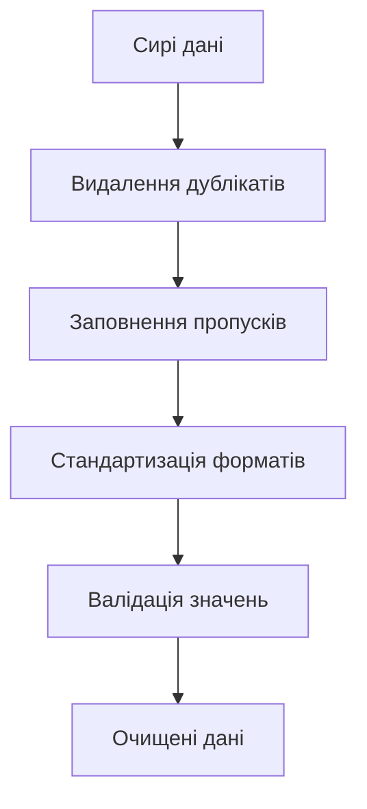
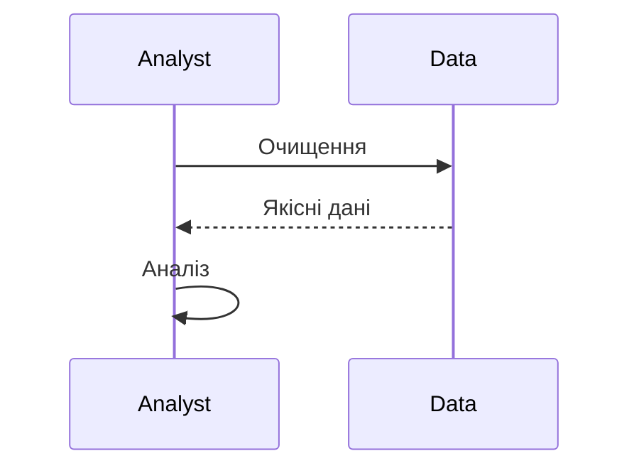

# Очищення даних

---

## Вступ

Очищення даних — це один із найважливіших етапів у процесі аналітики. Від якості очищення залежить точність аналізу, достовірність висновків і ефективність моделей. У цьому розділі розглянемо історію, основні методи, інструменти, реальні кейси, кращі практики, нюанси, типові помилки та перехресні посилання.

---

## Історія та еволюція очищення даних

### Витоки

Перші спроби очищення даних здійснювалися вручну: перевірка, виправлення, видалення помилок у паперових таблицях. З появою електронних таблиць та баз даних процес став автоматизованим, з’явилися спеціалізовані інструменти та алгоритми.

### Етапи розвитку

-   **Ручне очищення**: перевірка, виправлення, видалення.
-   **Автоматизація**: скрипти, макроси, регулярні вирази.
-   **ETL-процеси**: Extract, Transform, Load.
-   **Інструменти для Big Data**: Spark, Hadoop, Dask.
-   **ML для очищення**: автоматичне виявлення аномалій, класифікація помилок.

---

## Основні задачі очищення даних

1. **Видалення дублікатів**
2. **Заповнення пропусків**
3. **Виправлення помилок**
4. **Стандартизація форматів**
5. **Валідація значень**
6. **Обробка аномалій**
7. **Нормалізація та уніфікація**
8. **Видалення шуму**
9. **Обробка неструктурованих даних**
10. **Документування змін**

---

## Методи та інструменти очищення

### Ручні методи

-   Перевірка вручну
-   Використання Excel, Google Sheets

### Автоматизовані методи

-   Скрипти на Python, R
-   Використання pandas, numpy
-   Регулярні вирази
-   ETL-процеси

### Інструменти

-   **OpenRefine** — для очищення та трансформації
-   **Trifacta** — для підготовки даних
-   **Talend, Informatica** — ETL
-   **pandas, dplyr** — Python, R
-   **Spark, Dask** — для великих даних

---

## Приклади коду для очищення даних

### 1. Видалення дублікатів (pandas)

```python
import pandas as pd
df = pd.DataFrame({'name': ['Anna', 'Anna', 'John'], 'age': [22, 22, 30]})
df = df.drop_duplicates()
print(df)
```

### 2. Заповнення пропусків

```python
df = pd.DataFrame({'score': [90, None, 85]})
df['score'] = df['score'].fillna(df['score'].mean())
print(df)
```

### 3. Стандартизація форматів

```python
df = pd.DataFrame({'date': ['2025/08/03', '03-08-2025']})
df['date'] = pd.to_datetime(df['date'], dayfirst=True)
print(df)
```

### 4. Валідація значень

```python
def validate_age(age):
    return 0 < age < 120
print(validate_age(25))  # True
print(validate_age(150)) # False
```

### 5. Обробка аномалій

```python
import numpy as np
df = pd.DataFrame({'value': [10, 12, 1000, 11]})
q1 = df['value'].quantile(0.25)
q3 = df['value'].quantile(0.75)
iqr = q3 - q1
filtered = df[(df['value'] > (q1 - 1.5*iqr)) & (df['value'] < (q3 + 1.5*iqr))]
print(filtered)
```

---

## Діаграми та візуалізації

### Mermaid: Процес очищення даних



### Mermaid: Взаємодія аналітика з даними



---

## Реальні кейси очищення даних

### Кейс 1: Очищення даних продажів

-   **Задача**: Видалити дублікатні транзакції, заповнити пропуски у цінах.
-   **Інструменти**: pandas, Excel.
-   **Результат**: Якісна база для аналізу трендів.

### Кейс 2: Очищення опитувань

-   **Задача**: Стандартизація відповідей, видалення некоректних значень.
-   **Інструменти**: OpenRefine, Python.
-   **Результат**: Коректна сегментація респондентів.

### Кейс 3: Очищення лог-файлів

-   **Задача**: Виявлення аномалій, видалення шуму.
-   **Інструменти**: Spark, регулярні вирази.
-   **Результат**: Надійний моніторинг систем.

---

## Кращі практики очищення даних

1. **Автоматизація процесу** — мінімізація ручної роботи.
2. **Документування змін** — фіксація всіх трансформацій.
3. **Валідація на кожному етапі** — перевірка якості.
4. **Використання тестових даних** — для перевірки скриптів.
5. **Збереження сирих даних** — можливість повернутися до оригіналу.
6. **Використання стандартних бібліотек** — pandas, numpy, dplyr.
7. **Регулярне оновлення процесу** — адаптація до нових джерел.

---

## Нюанси та підводні камені

-   **Втрата важливої інформації** — надмірне очищення.
-   **Неправильне заповнення пропусків** — спотворення статистики.
-   **Відсутність документування** — складно відтворити процес.
-   **Неврахування контексту** — очищення без розуміння предметної області.
-   **Великі обсяги даних** — складність обробки.
-   **Відсутність автоматизації** — ручна робота призводить до помилок.

---

## Перехресні посилання

-   [Типи даних](../03-data-basics/types.md)
-   [Якість даних](../03-data-basics/quality.md)
-   [Трансформація даних](transformation.md)
-   [Візуалізація даних](../05-visualization/overview.md)
-   [SQL](../06-sql/overview.md)
-   [Python для роботи з даними](../08-python/overview.md)

---

## Розширене резюме

Очищення даних — це ключовий етап, що забезпечує якість аналітики. Від правильного очищення залежить достовірність висновків, ефективність моделей та прийняття рішень. Сучасний аналітик використовує автоматизовані інструменти, документує всі зміни, валідує дані на кожному етапі та зберігає сирі дані для можливості повернення. Важливо враховувати нюанси, не втрачати важливу інформацію, адаптувати процес до нових джерел і використовувати кращі практики. Вміння ефективно очищати дані — одна з базових компетенцій дата-аналітика.

---
