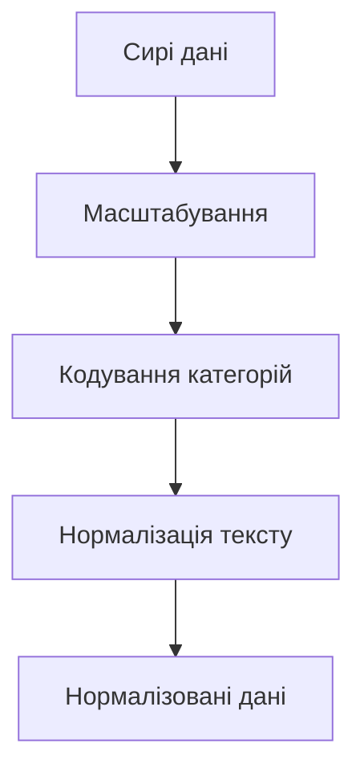
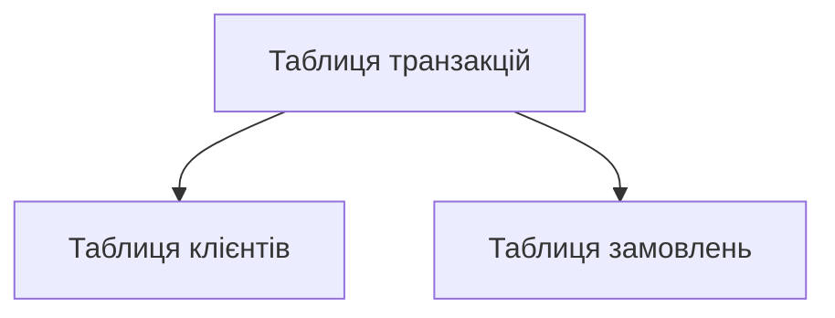

# Нормалізація даних

---

## Вступ

Нормалізація даних — це процес приведення даних до єдиного масштабу, формату чи структури для забезпечення коректності аналізу, порівнянності та ефективності моделей. Вона є критично важливою для роботи з різнорідними джерелами, побудови статистичних і машинних моделей, а також для візуалізації. У цьому розділі розглянемо історію, основні методи, інструменти, реальні кейси, кращі практики, нюанси, типові помилки та перехресні посилання.

---

## Історія та еволюція нормалізації

### Витоки

Перші спроби нормалізації даних виникли у статистиці для порівняння різних показників. З появою баз даних з’явилася нормалізація структур (нормальні форми), а з розвитком машинного навчання — нормалізація числових ознак.

### Етапи розвитку

-   **Статистична нормалізація**: стандартизація, масштабування.
-   **Нормалізація баз даних**: нормальні форми (1NF, 2NF, 3NF).
-   **Масштабування ознак**: min-max, z-score, robust scaling.
-   **Нормалізація тексту**: лемматизація, стемінг.
-   **Нормалізація категорій**: one-hot encoding, label encoding.

---

## Основні задачі нормалізації

1. **Масштабування числових ознак**
2. **Стандартизація форматів**
3. **Нормалізація структур баз даних**
4. **Кодування категоріальних ознак**
5. **Нормалізація тексту**
6. **Уніфікація часових форматів**
7. **Видалення аномалій**
8. **Обробка пропусків**
9. **Документування змін**
10. **Підготовка до моделювання**

---

## Методи та інструменти нормалізації

### Масштабування числових ознак

-   **Min-Max Scaling** — приведення до діапазону [0, 1]
-   **Z-score Standardization** — приведення до середнього 0 і стандартного відхилення 1
-   **Robust Scaling** — використання медіани та IQR

### Кодування категоріальних ознак

-   **One-hot encoding**
-   **Label encoding**

### Нормалізація тексту

-   **Лемматизація**
-   **Стемінг**
-   **Видалення стоп-слів**

### Нормалізація структур баз даних

-   **Нормальні форми** (1NF, 2NF, 3NF)

### Інструменти

-   **pandas, scikit-learn** — Python
-   **dplyr, caret** — R
-   **SQL** — нормалізація структур
-   **NLTK, spaCy** — текстова нормалізація

---

## Приклади коду для нормалізації даних

### 1. Min-Max Scaling (scikit-learn)

```python
from sklearn.preprocessing import MinMaxScaler
import pandas as pd
scaler = MinMaxScaler()
data = pd.DataFrame({'score': [10, 20, 30]})
data['score_norm'] = scaler.fit_transform(data[['score']])
print(data)
```

### 2. Z-score Standardization

```python
from sklearn.preprocessing import StandardScaler
scaler = StandardScaler()
data['score_z'] = scaler.fit_transform(data[['score']])
print(data)
```

### 3. One-hot encoding

```python
import pandas as pd
df = pd.DataFrame({'color': ['red', 'blue', 'green']})
df_encoded = pd.get_dummies(df, columns=['color'])
print(df_encoded)
```

### 4. Нормалізація тексту

```python
import nltk
from nltk.stem import WordNetLemmatizer
lemmatizer = WordNetLemmatizer()
words = ['running', 'flies', 'better']
lemmas = [lemmatizer.lemmatize(word) for word in words]
print(lemmas)
```

### 5. Нормалізація структур баз даних (SQL)

```sql
-- Перехід до 3NF
CREATE TABLE Customers (
    CustomerID INT PRIMARY KEY,
    Name VARCHAR(100)
);
CREATE TABLE Orders (
    OrderID INT PRIMARY KEY,
    CustomerID INT,
    Date DATE,
    FOREIGN KEY (CustomerID) REFERENCES Customers(CustomerID)
);
```

---

## Діаграми та візуалізації

### Mermaid: Процес нормалізації даних



### Mermaid: Нормалізація структур баз даних



---

## Реальні кейси нормалізації даних

### Кейс 1: Побудова моделі прогнозування

-   **Задача**: Масштабування ознак для коректної роботи алгоритму.
-   **Інструменти**: scikit-learn, pandas.
-   **Результат**: Підвищення точності моделі.

### Кейс 2: Аналіз продажів

-   **Задача**: Кодування категорій для сегментації.
-   **Інструменти**: pandas, SQL.
-   **Результат**: Коректна класифікація клієнтів.

### Кейс 3: Обробка тексту для NLP

-   **Задача**: Лемматизація, видалення стоп-слів.
-   **Інструменти**: NLTK, spaCy.
-   **Результат**: Якісна класифікація тексту.

---

## Кращі практики нормалізації даних

1. **Вибір методу відповідно до задачі**
2. **Документування всіх трансформацій**
3. **Валідація результату**
4. **Використання стандартних бібліотек**
5. **Збереження оригінальних даних**
6. **Тестування на підмножинах**
7. **Аналіз впливу нормалізації на результати**

---

## Нюанси та підводні камені

-   **Надмірна нормалізація** — втрата важливої інформації
-   **Неправильний вибір методу** — спотворення результатів
-   **Відсутність документування** — складно відтворити процес
-   **Втрата зв’язків між даними** — при нормалізації структур
-   **Вплив на інтерпретацію** — зміна масштабу
-   **Великі обсяги даних** — складність обробки

---

## Перехресні посилання

-   [Очищення даних](cleaning.md)
-   [Типи даних](../03-data-basics/types.md)
-   [Якість даних](../03-data-basics/quality.md)
-   [Трансформація даних](transformation.md)
-   [Візуалізація даних](../05-visualization/overview.md)
-   [SQL](../06-sql/overview.md)
-   [Python для роботи з даними](../08-python/overview.md)

---

## Розширене резюме

Нормалізація даних — це ключовий етап підготовки до аналізу, моделювання та візуалізації. Вона забезпечує порівнянність, коректність і ефективність роботи з різнорідними джерелами. Сучасний аналітик використовує різні методи нормалізації: масштабування, кодування, стандартизацію, нормалізацію структур. Важливо вибирати метод відповідно до задачі, документувати всі зміни, зберігати оригінальні дані та аналізувати вплив нормалізації на результати. Вміння ефективно нормалізувати дані — одна з базових компетенцій дата-аналітика.

---
