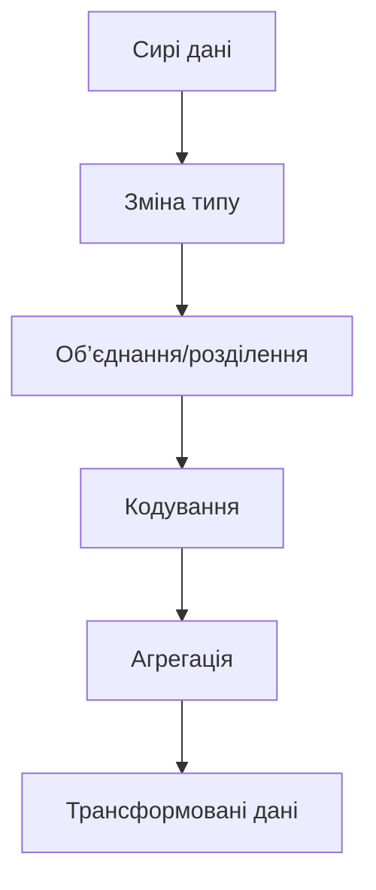
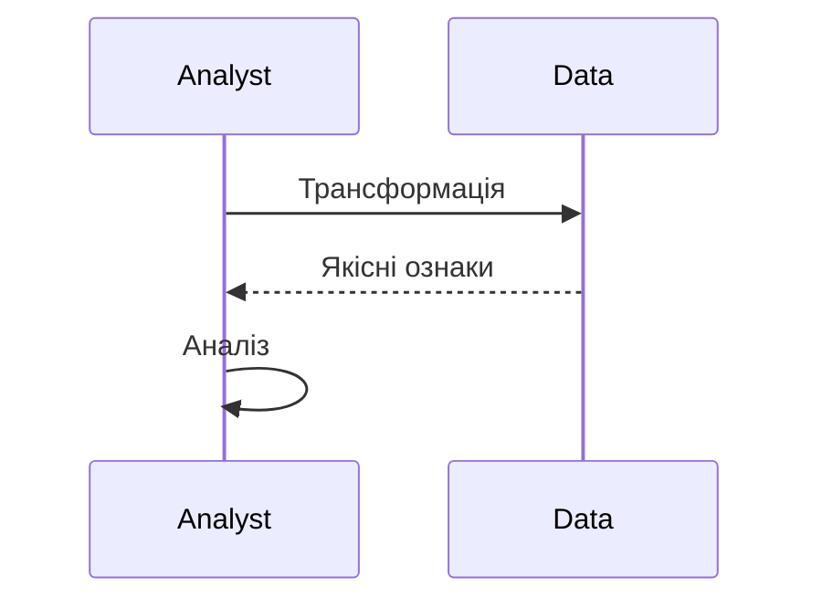

# Трансформація даних

---

## Вступ

Трансформація даних — це процес зміни структури, формату, значень або типу даних для підготовки їх до аналізу, моделювання чи візуалізації. Вона дозволяє адаптувати дані до вимог задачі, інтегрувати різні джерела, підвищити якість та релевантність інформації. У цьому розділі розглянемо історію, основні методи, інструменти, реальні кейси, кращі практики, нюанси, типові помилки та перехресні посилання.

---

## Історія та еволюція трансформації даних

### Витоки

Перші трансформації здійснювалися вручну: перекодування, об’єднання, розділення даних у паперових таблицях. З появою електронних таблиць та баз даних процес став автоматизованим, з’явилися ETL-процеси, скрипти, спеціалізовані інструменти.

### Етапи розвитку

-   **Ручна трансформація**: перекодування, об’єднання, розділення.
-   **Автоматизація**: скрипти, макроси, регулярні вирази.
-   **ETL-процеси**: Extract, Transform, Load.
-   **Інструменти для Big Data**: Spark, Hadoop, Dask.
-   **ML для трансформації**: feature engineering, автоматичне створення ознак.

---

## Основні задачі трансформації даних

1. **Зміна типу даних**
2. **Об’єднання та розділення колонок**
3. **Кодування категоріальних ознак**
4. **Агрегація та групування**
5. **Створення нових ознак (feature engineering)**
6. **Трансформація тексту**
7. **Обробка дат та часу**
8. **Інтеграція даних з різних джерел**
9. **Нормалізація та стандартизація**
10. **Документування змін**

---

## Методи та інструменти трансформації

### Ручні методи

-   Використання Excel, Google Sheets
-   Макроси, формули

### Автоматизовані методи

-   Скрипти на Python, R
-   pandas, numpy, dplyr
-   Регулярні вирази
-   ETL-процеси

### Інструменти

-   **OpenRefine** — для трансформації
-   **Trifacta** — для підготовки даних
-   **Talend, Informatica** — ETL
-   **pandas, dplyr** — Python, R
-   **Spark, Dask** — для великих даних

---

## Приклади коду для трансформації даних

### 1. Зміна типу даних (pandas)

```python
import pandas as pd
df = pd.DataFrame({'age': ['22', '30', '25']})
df['age'] = df['age'].astype(int)
print(df)
```

### 2. Об’єднання колонок

```python
df = pd.DataFrame({'first': ['Anna', 'John'], 'last': ['Smith', 'Doe']})
df['full_name'] = df['first'] + ' ' + df['last']
print(df)
```

### 3. Розділення колонки

```python
df = pd.DataFrame({'full_name': ['Anna Smith', 'John Doe']})
df[['first', 'last']] = df['full_name'].str.split(' ', expand=True)
print(df)
```

### 4. Кодування категоріальних ознак

```python
df = pd.DataFrame({'color': ['red', 'blue', 'green']})
df_encoded = pd.get_dummies(df, columns=['color'])
print(df_encoded)
```

### 5. Агрегація та групування

```python
df = pd.DataFrame({'group': ['A', 'A', 'B'], 'score': [10, 20, 30]})
grouped = df.groupby('group').agg({'score': 'mean'})
print(grouped)
```

### 6. Створення нових ознак

```python
df = pd.DataFrame({'height': [170, 180], 'weight': [70, 80]})
df['bmi'] = df['weight'] / ((df['height']/100)**2)
print(df)
```

---

## Діаграми та візуалізації

### Mermaid: Процес трансформації даних



### Mermaid: Взаємодія аналітика з даними



---

## Реальні кейси трансформації даних

### Кейс 1: Побудова моделі прогнозування

-   **Задача**: Створення нових ознак, кодування категорій.
-   **Інструменти**: pandas, scikit-learn.
-   **Результат**: Підвищення точності моделі.

### Кейс 2: Аналіз продажів

-   **Задача**: Агрегація даних по регіонах, об’єднання джерел.
-   **Інструменти**: SQL, pandas.
-   **Результат**: Коректна сегментація клієнтів.

### Кейс 3: Обробка тексту для NLP

-   **Задача**: Трансформація тексту, створення ознак.
-   **Інструменти**: NLTK, spaCy.
-   **Результат**: Якісна класифікація тексту.

---

## Кращі практики трансформації даних

1. **Вибір методу відповідно до задачі**
2. **Документування всіх трансформацій**
3. **Валідація результату**
4. **Використання стандартних бібліотек**
5. **Збереження оригінальних даних**
6. **Тестування на підмножинах**
7. **Аналіз впливу трансформації на результати**

---

## Нюанси та підводні камені

-   **Надмірна трансформація** — втрата важливої інформації
-   **Неправильний вибір методу** — спотворення результатів
-   **Відсутність документування** — складно відтворити процес
-   **Втрата зв’язків між даними** — при об’єднанні/розділенні
-   **Вплив на інтерпретацію** — зміна структури
-   **Великі обсяги даних** — складність обробки

---

## Перехресні посилання

-   [Очищення даних](cleaning.md)
-   [Нормалізація даних](normalization.md)
-   [Типи даних](../03-data-basics/types.md)
-   [Якість даних](../03-data-basics/quality.md)
-   [Візуалізація даних](../05-visualization/overview.md)
-   [SQL](../06-sql/overview.md)
-   [Python для роботи з даними](../08-python/overview.md)

---

## Розширене резюме

Трансформація даних — це ключовий етап підготовки до аналізу, моделювання та візуалізації. Вона забезпечує адаптацію, інтеграцію та підвищення якості даних. Сучасний аналітик використовує різні методи трансформації: зміна типу, об’єднання, розділення, кодування, агрегацію, створення нових ознак. Важливо вибирати метод відповідно до задачі, документувати всі зміни, зберігати оригінальні дані та аналізувати вплив трансформації на результати. Вміння ефективно трансформувати дані — одна з базових компетенцій дата-аналітика.

---
