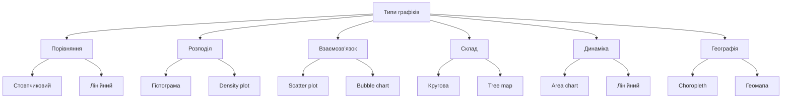
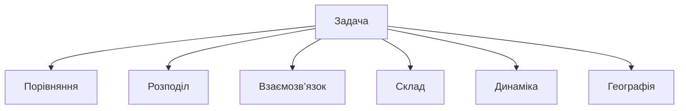

# Типи графіків

---

## Вступ

Типи графіків — це ключовий інструмент для візуалізації даних, що дозволяє швидко і ефективно донести інформацію, виявити закономірності, тренди, аномалії та взаємозв’язки. Вибір правильного типу графіка залежить від задачі, структури даних, аудиторії та цілей аналізу. У цьому розділі розглянемо класифікацію графіків, історію, особливості, приклади, нюанси, поширені помилки та кращі практики.

---

## Історія та еволюція графіків

### Витоки

Перші графіки з’явилися у XVIII столітті: лінійні, стовпчикові, кругові діаграми. З розвитком статистики та комп’ютерних технологій з’явилися складніші типи: гістограми, теплові карти, boxplot, scatter plot, інтерактивні графіки.

### Етапи розвитку

-   **Класичні графіки**: лінійні, стовпчикові, кругові.
-   **Статистичні графіки**: гістограми, boxplot, scatter plot.
-   **Мультимедійні**: heatmap, bubble chart, tree map.
-   **Інтерактивні**: plotly, d3.js, Tableau.
-   **Географічні**: картограми, choropleth, геомапи.

---

## Класифікація типів графіків

### За призначенням

-   **Порівняння** — стовпчикові, лінійні, boxplot.
-   **Розподіл** — гістограми, density plot.
-   **Взаємозв’язок** — scatter plot, bubble chart.
-   **Склад** — кругові, tree map.
-   **Динаміка** — лінійні, area chart.
-   **Географія** — картограми, choropleth.

### За структурою даних

-   **Одновимірні** — лінійні, стовпчикові.
-   **Двовимірні** — scatter plot, heatmap.
-   **Багатовимірні** — bubble chart, radar chart.

---

## Основні типи графіків

1. **Лінійний графік (Line chart)**
2. **Стовпчиковий графік (Bar chart)**
3. **Гістограма (Histogram)**
4. **Кругова діаграма (Pie chart)**
5. **Точкова діаграма (Scatter plot)**
6. **Boxplot**
7. **Heatmap**
8. **Bubble chart**
9. **Tree map**
10. **Area chart**
11. **Radar chart**
12. **Choropleth map**
13. **Геомапа**

---

## Приклади коду для побудови графіків

### 1. Лінійний графік (matplotlib)

```python
import matplotlib.pyplot as plt
x = [1, 2, 3, 4]
y = [10, 20, 15, 25]
plt.plot(x, y)
plt.title('Лінійний графік')
plt.xlabel('X')
plt.ylabel('Y')
plt.show()
```

### 2. Стовпчиковий графік

```python
plt.bar(x, y)
plt.title('Стовпчиковий графік')
plt.show()
```

### 3. Гістограма

```python
import numpy as np
data = np.random.randn(100)
plt.hist(data, bins=10)
plt.title('Гістограма')
plt.show()
```

### 4. Кругова діаграма

```python
labels = ['A', 'B', 'C']
sizes = [30, 50, 20]
plt.pie(sizes, labels=labels, autopct='%1.1f%%')
plt.title('Кругова діаграма')
plt.show()
```

### 5. Точкова діаграма

```python
x = np.random.rand(50)
y = np.random.rand(50)
plt.scatter(x, y)
plt.title('Точкова діаграма')
plt.show()
```

### 6. Boxplot

```python
data = np.random.randn(100)
plt.boxplot(data)
plt.title('Boxplot')
plt.show()
```

### 7. Heatmap (seaborn)

```python
import seaborn as sns
data = np.random.rand(10, 12)
sns.heatmap(data)
plt.title('Heatmap')
plt.show()
```

---

## Діаграми та візуалізації

### Mermaid: Класифікація графіків



### Mermaid: Вибір графіка за типом задачі



---

## Реальні кейси використання графіків

### Кейс 1: Аналіз продажів

-   **Графіки**: лінійний (динаміка), стовпчиковий (порівняння), pie chart (склад).
-   **Завдання**: Виявити тренди, сезонність, структуру продажів.

### Кейс 2: Соціологічне дослідження

-   **Графіки**: histogram (розподіл), scatter plot (взаємозв’язок), boxplot (варіативність).
-   **Завдання**: Виявити демографічні особливості, кореляції.

### Кейс 3: Моніторинг ІТ-систем

-   **Графіки**: heatmap (навантаження), area chart (динаміка), radar chart (порівняння метрик).
-   **Завдання**: Виявити аномалії, оптимізувати ресурси.

---

## Кращі практики побудови графіків

1. **Вибір графіка відповідно до задачі**
2. **Чіткі підписи та легенди**
3. **Використання кольорів для акцентів**
4. **Уникнення зайвої складності**
5. **Валідація даних перед візуалізацією**
6. **Адаптація до аудиторії**
7. **Тестування на різних пристроях**

---

## Нюанси та підводні камені

-   **Неправильний вибір графіка** — спотворення висновків
-   **Занадто багато інформації** — перевантаження
-   **Відсутність підписів** — неясність
-   **Неправильне використання кольорів** — складність сприйняття
-   **Відсутність легенди** — неясність структури
-   **Великі обсяги даних** — складність візуалізації

---

## Перехресні посилання

-   [Вступ до візуалізації](overview.md)
-   [Очищення та трансформація](../04-wrangling/cleaning.md)
-   [Типи даних](../03-data-basics/types.md)
-   [SQL для візуалізації](../06-sql/overview.md)
-   [Python для побудови графіків](../08-python/overview.md)

---

## Розширене резюме

Типи графіків — це основа ефективної візуалізації даних. Від правильного вибору графіка залежить якість інтерпретації, швидкість прийняття рішень та ефективність комунікації результатів. Сучасний аналітик використовує різноманітні типи: від класичних лінійних до складних інтерактивних та географічних. Важливо враховувати нюанси, адаптувати графіки до задачі та аудиторії, документувати вибір і тестувати на різних пристроях. Вміння ефективно візуалізувати дані — одна з базових компетенцій дата-аналітика.

---
