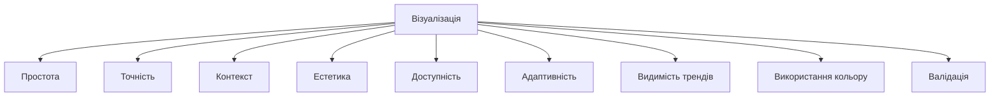
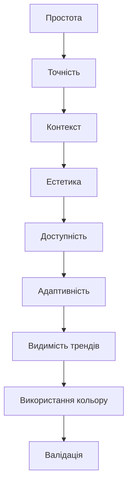

# Принципи візуалізації

---

## Вступ

Принципи візуалізації — це набір правил і рекомендацій, які допомагають ефективно передавати інформацію через графіки, діаграми та інші візуальні засоби. Від дотримання принципів залежить зрозумілість, точність, естетика та вплив візуалізації на прийняття рішень. У цьому розділі розглянемо основні принципи, історію, приклади, нюанси, типові помилки та кращі практики.

---

## Історія та еволюція принципів візуалізації

### Витоки

Перші принципи формувалися разом із появою статистичних графіків у XVIII-XIX століттях. Відомі дослідники — Вільям Плейфейр, Джон Сноу, Едвард Таффт — заклали основи сучасної візуалізації: простота, точність, контекст.

### Етапи розвитку

-   **Класичні принципи**: простота, точність, контекст.
-   **Психологічні аспекти**: сприйняття кольору, форми, розміру.
-   **Інтерактивність**: адаптація до аудиторії, динаміка.
-   **Естетика**: гармонія, баланс, мінімалізм.
-   **Доступність**: врахування особливостей сприйняття (кольорова сліпота, шрифти).

---

## Основні принципи візуалізації

1. **Простота** — уникайте зайвої складності.
2. **Точність** — не спотворюйте дані.
3. **Контекст** — додавайте підписи, легенди, джерела.
4. **Актуальність** — відображайте найважливіше.
5. **Естетика** — гармонія кольорів, форм, розмірів.
6. **Доступність** — враховуйте особливості аудиторії.
7. **Адаптивність** — графіки мають бути зрозумілі на різних пристроях.
8. **Видимість трендів** — акцентуйте на закономірностях.
9. **Використання кольору** — для акцентів, але не для плутанини.
10. **Валідація** — перевіряйте коректність візуалізації.

---

## Приклади застосування принципів

### 1. Простота

-   Використовуйте мінімум елементів.
-   Уникайте зайвих підписів, ліній, кольорів.

### 2. Точність

-   Не змінюйте масштаби для маніпуляції.
-   Відображайте всі дані коректно.

### 3. Контекст

-   Додавайте назви осей, легенди, джерела.
-   Пояснюйте, що показує графік.

### 4. Естетика

-   Використовуйте гармонійні кольори.
-   Дотримуйтесь балансу між елементами.

### 5. Доступність

-   Використовуйте контрастні кольори.
-   Перевіряйте графіки для людей з кольоровою сліпотою.

---

## Діаграми та візуалізації

### Mermaid: Принципи візуалізації

### Mermaid: Взаємодія принципів

---

## Реальні кейси застосування принципів

### Кейс 1: Аналіз продажів

-   **Принципи**: простота, точність, контекст.
-   **Результат**: Зрозуміла динаміка продажів для керівництва.

### Кейс 2: Соціологічне дослідження

-   **Принципи**: естетика, доступність, адаптивність.
-   **Результат**: Візуалізації для різних аудиторій.

### Кейс 3: Моніторинг ІТ-систем

-   **Принципи**: видимість трендів, валідація.
-   **Результат**: Вчасне виявлення аномалій.

---

## Кращі практики візуалізації

1. **Тестуйте графіки на різних пристроях**
2. **Використовуйте шаблони та бібліотеки**
3. **Документуйте вибір типу графіка**
4. **Аналізуйте реакцію аудиторії**
5. **Оновлюйте графіки відповідно до змін даних**
6. **Використовуйте інтерактивні елементи для складних даних**
7. **Перевіряйте доступність для всіх користувачів**

---

## Нюанси та підводні камені

-   **Занадто складні графіки** — перевантаження
-   **Маніпуляція масштабом** — спотворення висновків
-   **Відсутність контексту** — неясність
-   **Погана естетика** — складність сприйняття
-   **Недоступність для частини аудиторії** — ігнорування особливостей
-   **Відсутність тестування** — помилки на різних пристроях

---

## Перехресні посилання

-   [Типи графіків](charts.md)
-   [Вступ до візуалізації](overview.md)
-   [Очищення та трансформація](../04-wrangling/cleaning.md)
-   [Типи даних](../03-data-basics/types.md)
-   [SQL для візуалізації](../06-sql/overview.md)
-   [Python для побудови графіків](../08-python/overview.md)

---

## Розширене резюме

Принципи візуалізації — це основа якісної комунікації даних. Від їхнього дотримання залежить зрозумілість, точність, естетика та вплив графіків на прийняття рішень. Сучасний аналітик використовує набір принципів: простота, точність, контекст, естетика, доступність, адаптивність, видимість трендів, коректне використання кольору та валідація. Важливо тестувати графіки, адаптувати їх до аудиторії, документувати вибір і оновлювати відповідно до змін даних. Вміння ефективно застосовувати принципи візуалізації — одна з базових компетенцій дата-аналітика.

---
