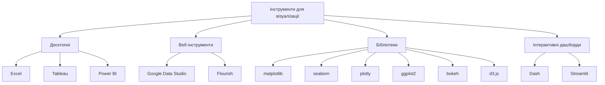
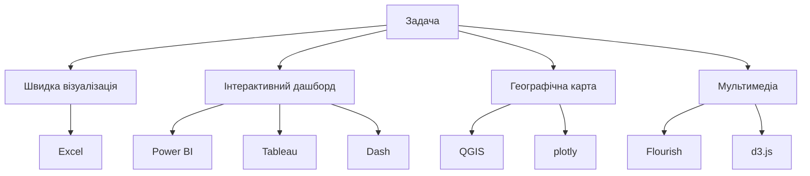

# Інструменти для візуалізації

---

## Вступ

Інструменти для візуалізації — це програмне забезпечення, бібліотеки та платформи, які дозволяють створювати графіки, діаграми, інтерактивні дашборди та презентації даних. Вибір інструменту залежить від задачі, типу даних, аудиторії та вимог до інтерактивності, масштабованості та естетики. У цьому розділі розглянемо основні інструменти, їхню історію, особливості, приклади, нюанси, поширені помилки та кращі практики.

---

## Історія та еволюція інструментів для візуалізації

### Витоки

Перші інструменти — папір, олівець, графічні редактори. З появою комп’ютерів — Excel, PowerPoint, потім спеціалізовані бібліотеки (matplotlib, ggplot2), BI-платформи (Tableau, Power BI), інтерактивні фреймворки (plotly, d3.js).

### Етапи розвитку

-   **Класичні інструменти**: Excel, PowerPoint.
-   **Бібліотеки для програмування**: matplotlib, seaborn, ggplot2, plotly, bokeh.
-   **BI-платформи**: Tableau, Power BI, QlikView.
-   **Інтерактивні фреймворки**: d3.js, plotly, Dash.
-   **Онлайн-сервіси**: Google Data Studio, Flourish.

---

## Класифікація інструментів для візуалізації

### За способом використання

-   **Десктопні** — Excel, Tableau, Power BI.
-   **Веб-інструменти** — Google Data Studio, Flourish.
-   **Бібліотеки для програмування** — matplotlib, seaborn, plotly, ggplot2, bokeh, d3.js.
-   **Інтерактивні дашборди** — Dash, Streamlit, Tableau.

### За типом даних

-   **Числові** — matplotlib, seaborn, ggplot2.
-   **Категоріальні** — bar chart, pie chart, tree map.
-   **Географічні** — plotly, Tableau, QGIS.
-   **Мультимедіа** — Flourish, d3.js.

---

## Основні інструменти для візуалізації

1. **Excel** — класика для швидких графіків.
2. **Power BI** — інтерактивні дашборди.
3. **Tableau** — потужна BI-платформа.
4. **Google Data Studio** — онлайн-візуалізація.
5. **matplotlib** — базова бібліотека Python.
6. **seaborn** — статистичні графіки Python.
7. **plotly** — інтерактивні графіки Python, JS.
8. **ggplot2** — графіки для R.
9. **bokeh** — інтерактивна візуалізація Python.
10. **d3.js** — гнучка JS-бібліотека.
11. **Dash, Streamlit** — Python-фреймворки для дашбордів.
12. **QGIS** — географічна візуалізація.
13. **Flourish** — онлайн-сервіс для мультимедіа.

---

## Приклади коду для візуалізації

### 1. matplotlib (Python)

```python
import matplotlib.pyplot as plt
x = [1, 2, 3, 4]
y = [10, 20, 15, 25]
plt.plot(x, y)
plt.title('Лінійний графік')
plt.show()
```

### 2. seaborn

```python
import seaborn as sns
import numpy as np
data = np.random.randn(100)
sns.histplot(data)
plt.title('Гістограма')
plt.show()
```

### 3. plotly

```python
import plotly.express as px
df = px.data.iris()
fig = px.scatter(df, x='sepal_width', y='sepal_length', color='species')
fig.show()
```

### 4. ggplot2 (R)

```r
library(ggplot2)
data <- data.frame(x = 1:4, y = c(10, 20, 15, 25))
ggplot(data, aes(x=x, y=y)) + geom_line() + ggtitle('Лінійний графік')
```

### 5. d3.js (JS)

```js
// d3.js приклад створення svg кола
const svg = d3
    .select("body")
    .append("svg")
    .attr("width", 100)
    .attr("height", 100);
svg.append("circle")
    .attr("cx", 50)
    .attr("cy", 50)
    .attr("r", 40)
    .style("fill", "steelblue");
```

---

## Діаграми та візуалізації

### Mermaid: Класифікація інструментів



### Mermaid: Вибір інструменту за типом задачі



---

## Реальні кейси використання інструментів

### Кейс 1: Аналіз продажів

-   **Інструменти**: Power BI, Tableau, Excel.
-   **Завдання**: Динаміка, порівняння, структура продажів.

### Кейс 2: Соціологічне дослідження

-   **Інструменти**: Google Data Studio, Flourish, plotly.
-   **Завдання**: Візуалізація опитувань, інтерактивні графіки.

### Кейс 3: Моніторинг ІТ-систем

-   **Інструменти**: Dash, Streamlit, d3.js.
-   **Завдання**: Дашборди, heatmap, аномалії.

---

## Кращі практики використання інструментів

1. **Вибір інструменту відповідно до задачі**
2. **Використання стандартних бібліотек**
3. **Адаптація до аудиторії**
4. **Тестування інтерактивності**
5. **Документування процесу створення графіків**
6. **Оновлення інструментів та бібліотек**
7. **Використання шаблонів для уніфікації стилю**

---

## Нюанси та підводні камені

-   **Неправильний вибір інструменту** — складність роботи
-   **Відсутність інтерактивності** — низька залученість
-   **Складність налаштування** — довгий старт
-   **Відсутність підтримки типу даних** — обмеження
-   **Великі обсяги даних** — повільна робота
-   **Відсутність оновлень** — застарілість

---

## Перехресні посилання

-   [Типи графіків](charts.md)
-   [Принципи візуалізації](principles.md)
-   [Вступ до візуалізації](overview.md)
-   [Очищення та трансформація](../04-wrangling/cleaning.md)
-   [SQL для візуалізації](../06-sql/overview.md)
-   [Python для побудови графіків](../08-python/overview.md)

---

## Розширене резюме

Інструменти для візуалізації — це основа ефективної роботи з даними. Від правильного вибору інструменту залежить якість графіків, швидкість створення, інтерактивність та адаптація до аудиторії. Сучасний аналітик використовує широкий спектр інструментів: від класичних Excel до потужних BI-платформ і програмних бібліотек. Важливо враховувати нюанси, тестувати інтерактивність, документувати процес і оновлювати інструменти. Вміння ефективно використовувати інструменти для візуалізації — одна з базових компетенцій дата-аналітика.

---
