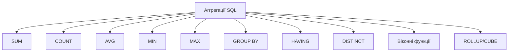
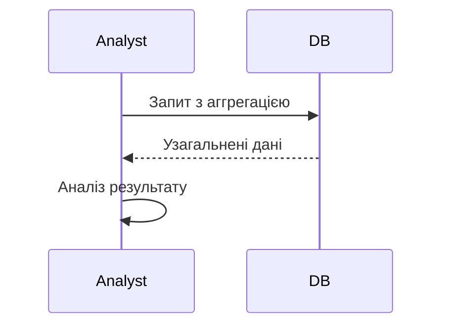

# Аггрегації SQL

---

## Вступ

Аггрегації SQL — це набір функцій і прийомів, які дозволяють узагальнювати, групувати та підсумовувати дані в реляційних базах. Вони є основою для звітності, аналітики, побудови дашбордів і прийняття рішень. У цьому розділі розглянемо історію, основні функції, приклади, нюанси, типові помилки, кращі практики та реальні кейси.

---

## Історія та еволюція аггрегацій

### Витоки

Перші аггрегації з’явилися разом із розвитком реляційних баз даних у 1970-х роках. SQL став стандартом для роботи з даними, а функції SUM, COUNT, AVG, MIN, MAX — базовими інструментами аналітика.

### Етапи розвитку

-   **Класичні аггрегації**: SUM, COUNT, AVG, MIN, MAX.
-   **Групування**: GROUP BY, HAVING.
-   **Віконні функції**: OVER, PARTITION BY.
-   **Розширені аггрегації**: ROLLUP, CUBE, GROUPING SETS.
-   **Інтеграція з BI**: аггрегації для звітів, дашбордів.

---

## Основні аггрегаційні функції SQL

1. **SUM** — сума значень.
2. **COUNT** — кількість рядків.
3. **AVG** — середнє значення.
4. **MIN** — мінімум.
5. **MAX** — максимум.
6. **GROUP BY** — групування.
7. **HAVING** — фільтрація груп.
8. **DISTINCT** — унікальні значення.
9. **Віконні функції** — ROW_NUMBER, RANK, DENSE_RANK, LEAD, LAG.
10. **ROLLUP, CUBE, GROUPING SETS** — багатовимірні аггрегації.

---

## Приклади коду для аггрегацій SQL

### 1. SUM, COUNT, AVG, MIN, MAX

```sql
SELECT
    SUM(sales) AS total_sales,
    COUNT(*) AS num_orders,
    AVG(sales) AS avg_sales,
    MIN(sales) AS min_sales,
    MAX(sales) AS max_sales
FROM orders;
```

### 2. GROUP BY

```sql
SELECT region, SUM(sales) AS total_sales
FROM orders
GROUP BY region;
```

### 3. HAVING

```sql
SELECT region, SUM(sales) AS total_sales
FROM orders
GROUP BY region
HAVING SUM(sales) > 10000;
```

### 4. DISTINCT

```sql
SELECT DISTINCT customer_id FROM orders;
```

### 5. Віконні функції

```sql
SELECT
    customer_id,
    sales,
    AVG(sales) OVER (PARTITION BY customer_id) AS avg_sales_per_customer,
    ROW_NUMBER() OVER (ORDER BY sales DESC) AS sales_rank
FROM orders;
```

### 6. ROLLUP, CUBE

```sql
SELECT region, product, SUM(sales) AS total_sales
FROM orders
GROUP BY ROLLUP (region, product);
```

---

## Діаграми та візуалізації

### Mermaid: Класифікація аггрегацій



### Mermaid: Потік аггрегації



---

## Реальні кейси використання аггрегацій

### Кейс 1: Аналіз продажів

-   **Аггрегації**: SUM, GROUP BY, HAVING.
-   **Завдання**: Визначити топ-регіони за продажами.

### Кейс 2: Сегментація клієнтів

-   **Аггрегації**: COUNT, DISTINCT, AVG.
-   **Завдання**: Виявити активних клієнтів, середній чек.

### Кейс 3: Моніторинг ІТ-систем

-   **Аггрегації**: MIN, MAX, віконні функції.
-   **Завдання**: Виявити пікові навантаження, ранжування подій.

---

## Кращі практики аггрегацій SQL

1. **Використовуйте індекси для великих таблиць**
2. **Документуйте запити**
3. **Перевіряйте коректність аггрегації**
4. **Оптимізуйте запити для продуктивності**
5. **Використовуйте HAVING для фільтрації груп**
6. **Тестуйте запити на підмножинах даних**
7. **Аналізуйте вплив аггрегації на результати**

---

## Нюанси та підводні камені

-   **Неправильне групування** — спотворення результатів
-   **Відсутність індексів** — повільна робота
-   **Великі обсяги даних** — складність аггрегації
-   **Неправильне використання HAVING** — некоректна фільтрація
-   **Відсутність документування** — складно відтворити запит
-   **Відсутність тестування** — помилки у звітах

---

## Перехресні посилання

-   [Основи SQL](overview.md)
-   [Типи даних](../03-data-basics/types.md)
-   [Очищення та трансформація](../04-wrangling/cleaning.md)
-   [Візуалізація даних](../05-visualization/overview.md)
-   [Python для роботи з SQL](../08-python/overview.md)

---

## Розширене резюме

Аггрегації SQL — це основа аналітики в реляційних базах. Від правильного використання аггрегаційних функцій залежить якість звітів, швидкість аналізу та ефективність прийняття рішень. Сучасний аналітик використовує широкий спектр функцій: від класичних SUM, COUNT до складних віконних і багатовимірних аггрегацій. Важливо враховувати нюанси, оптимізувати запити, документувати процес і тестувати результати. Вміння ефективно використовувати аггрегації SQL — одна з базових компетенцій дата-аналітика.

---
