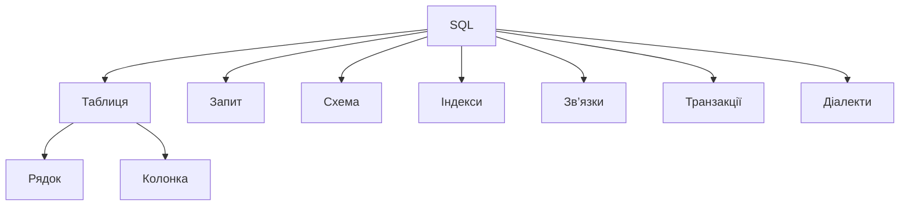
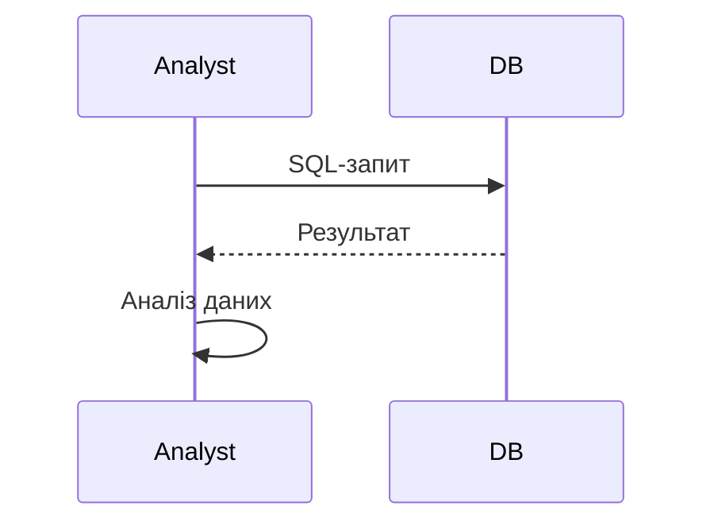

# Основи SQL

---

## Вступ

SQL (Structured Query Language) — це стандартна мова для роботи з реляційними базами даних. Вона дозволяє створювати, змінювати, видаляти та аналізувати дані, будувати запити, звіти, дашборди. Володіння SQL — одна з базових компетенцій дата-аналітика. У цьому розділі розглянемо історію, основні концепції, синтаксис, приклади, нюанси, типові помилки, кращі практики та реальні кейси.

---

## Історія та еволюція SQL

### Витоки

SQL був розроблений у 1970-х роках IBM для роботи з реляційними моделями даних. У 1986 році став стандартом ANSI. З того часу SQL постійно розвивається, з’являються нові діалекти (MySQL, PostgreSQL, MS SQL, Oracle).

### Етапи розвитку

-   **Стандартний SQL**: базові оператори SELECT, INSERT, UPDATE, DELETE.
-   **Розширення**: JOIN, GROUP BY, HAVING, ORDER BY.
-   **Віконні функції**: OVER, PARTITION BY.
-   **Інтеграція з BI**: SQL для звітів, дашбордів.
-   **NoSQL**: альтернативи для нереляційних даних.

---

## Основні концепції SQL

1. **Таблиця** — основна структура даних.
2. **Рядок (record)** — окремий запис у таблиці.
3. **Колонка (field)** — атрибут запису.
4. **Запит (query)** — інструкція для вибірки, зміни, аналізу даних.
5. **Схема** — структура бази даних.
6. **Індекси** — для оптимізації пошуку.
7. **Зв’язки** — FOREIGN KEY, PRIMARY KEY.
8. **Транзакції** — атомарність операцій.
9. **Діалекти SQL** — MySQL, PostgreSQL, MS SQL, Oracle.

---

## Основні оператори SQL

1. **SELECT** — вибірка даних.
2. **INSERT** — додавання даних.
3. **UPDATE** — зміна даних.
4. **DELETE** — видалення даних.
5. **WHERE** — фільтрація.
6. **ORDER BY** — сортування.
7. **GROUP BY** — групування.
8. **HAVING** — фільтрація груп.
9. **JOIN** — об’єднання таблиць.
10. **DISTINCT** — унікальні значення.

---

## Приклади коду SQL

### 1. SELECT

```sql
SELECT * FROM customers;
```

### 2. WHERE

```sql
SELECT * FROM orders WHERE sales > 1000;
```

### 3. INSERT

```sql
INSERT INTO customers (name, age) VALUES ('Anna', 22);
```

### 4. UPDATE

```sql
UPDATE customers SET age = 23 WHERE name = 'Anna';
```

### 5. DELETE

```sql
DELETE FROM customers WHERE name = 'Anna';
```

### 6. ORDER BY

```sql
SELECT * FROM orders ORDER BY sales DESC;
```

### 7. GROUP BY

```sql
SELECT region, SUM(sales) FROM orders GROUP BY region;
```

### 8. JOIN

```sql
SELECT o.order_id, c.name
FROM orders o
JOIN customers c ON o.customer_id = c.customer_id;
```

### 9. DISTINCT

```sql
SELECT DISTINCT region FROM orders;
```

---

## Діаграми та візуалізації

### Mermaid: Основні концепції SQL



### Mermaid: Потік виконання запиту



---

## Реальні кейси використання SQL

### Кейс 1: Аналіз продажів

-   **Оператори**: SELECT, GROUP BY, ORDER BY.
-   **Завдання**: Визначити топ-регіони за продажами.

### Кейс 2: Сегментація клієнтів

-   **Оператори**: SELECT, DISTINCT, JOIN.
-   **Завдання**: Виявити унікальних клієнтів, об’єднати дані.

### Кейс 3: Моніторинг ІТ-систем

-   **Оператори**: SELECT, WHERE, HAVING.
-   **Завдання**: Виявити аномалії, фільтрувати події.

---

## Кращі практики роботи з SQL

1. **Документуйте запити**
2. **Використовуйте індекси для великих таблиць**
3. **Перевіряйте коректність запитів**
4. **Оптимізуйте запити для продуктивності**
5. **Тестуйте запити на підмножинах даних**
6. **Аналізуйте вплив запитів на результати**
7. **Використовуйте транзакції для атомарності**

---

## Нюанси та підводні камені

-   **Неправильне використання JOIN** — дублювання даних
-   **Відсутність індексів** — повільна робота
-   **Великі обсяги даних** — складність аналізу
-   **Відсутність документування** — складно відтворити запит
-   **Відсутність тестування** — помилки у звітах
-   **Відсутність транзакцій** — некоректність змін

---

## Перехресні посилання

-   [Аггрегації SQL](aggregations.md)
-   [Типи даних](../03-data-basics/types.md)
-   [Очищення та трансформація](../04-wrangling/cleaning.md)
-   [Візуалізація даних](../05-visualization/overview.md)
-   [Python для роботи з SQL](../08-python/overview.md)

---

## Розширене резюме

Основи SQL — це фундамент аналітики в реляційних базах. Від правильного використання операторів залежить якість звітів, швидкість аналізу та ефективність прийняття рішень. Сучасний аналітик використовує широкий спектр операторів: від базових SELECT, INSERT до складних JOIN, GROUP BY, HAVING. Важливо враховувати нюанси, оптимізувати запити, документувати процес і тестувати результати. Вміння ефективно працювати з SQL — одна з базових компетенцій дата-аналітика.

---
