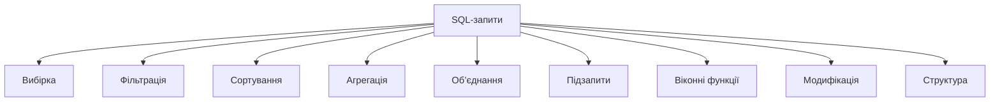
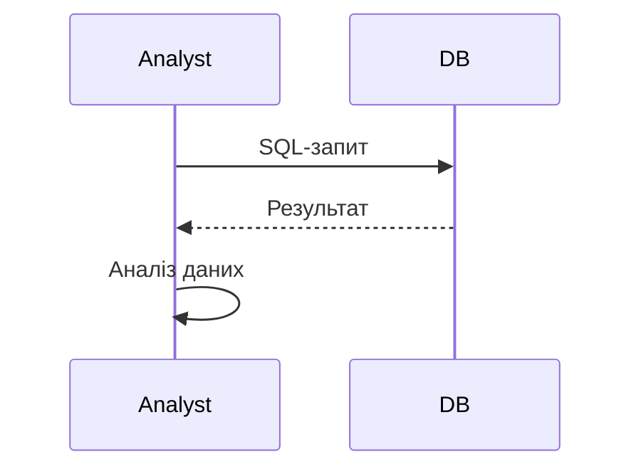

# Запити SQL

---

## Вступ

Запити SQL — це інструкції, які дозволяють отримувати, змінювати, аналізувати та агрегувати дані з реляційних баз. Вміння будувати ефективні запити — ключова навичка для аналітика, що впливає на швидкість, якість та глибину аналізу. У цьому розділі розглянемо історію, типи запитів, синтаксис, приклади, нюанси, типові помилки, кращі практики та реальні кейси.

---

## Історія та еволюція SQL-запитів

### Витоки

Перші запити SQL з’явилися у 1970-х роках разом із реляційними базами. Від простих SELECT до складних JOIN, агрегацій, підзапитів, віконних функцій — SQL постійно розширюється.

### Етапи розвитку

-   **Базові запити**: SELECT, WHERE, ORDER BY.
-   **Агрегації**: GROUP BY, HAVING.
-   **Об’єднання**: JOIN, UNION.
-   **Підзапити**: вкладені SELECT.
-   **Віконні функції**: OVER, PARTITION BY.
-   **Оптимізація**: індекси, план виконання.

---

## Типи SQL-запитів

1. **Вибірка (SELECT)** — отримання даних.
2. **Фільтрація (WHERE)** — вибір підмножини.
3. **Сортування (ORDER BY)** — впорядкування.
4. **Агрегація (GROUP BY, HAVING)** — узагальнення.
5. **Об’єднання (JOIN, UNION)** — інтеграція даних.
6. **Підзапити** — вкладені запити.
7. **Віконні функції** — аналітичні запити.
8. **Модифікація (INSERT, UPDATE, DELETE)** — зміна даних.
9. **Створення та зміна структури (CREATE, ALTER, DROP)** — робота зі схемою.

---

## Синтаксис SQL-запитів

### 1. SELECT

```sql
SELECT column1, column2 FROM table;
```

### 2. WHERE

```sql
SELECT * FROM orders WHERE sales > 1000;
```

### 3. ORDER BY

```sql
SELECT * FROM customers ORDER BY age DESC;
```

### 4. GROUP BY

```sql
SELECT region, SUM(sales) FROM orders GROUP BY region;
```

### 5. HAVING

```sql
SELECT region, SUM(sales) FROM orders GROUP BY region HAVING SUM(sales) > 10000;
```

### 6. JOIN

```sql
SELECT o.order_id, c.name
FROM orders o
JOIN customers c ON o.customer_id = c.customer_id;
```

### 7. UNION

```sql
SELECT name FROM customers
UNION
SELECT name FROM employees;
```

### 8. Підзапит

```sql
SELECT name FROM customers WHERE age > (SELECT AVG(age) FROM customers);
```

### 9. Віконна функція

```sql
SELECT
    customer_id,
    sales,
    AVG(sales) OVER (PARTITION BY customer_id) AS avg_sales_per_customer
FROM orders;
```

---

## Діаграми та візуалізації

### Mermaid: Класифікація SQL-запитів



### Mermaid: Потік виконання запиту



---

## Реальні кейси використання SQL-запитів

### Кейс 1: Аналіз продажів

-   **Запити**: SELECT, GROUP BY, HAVING, ORDER BY.
-   **Завдання**: Визначити топ-регіони за продажами.

### Кейс 2: Сегментація клієнтів

-   **Запити**: SELECT, DISTINCT, JOIN, підзапити.
-   **Завдання**: Виявити унікальних клієнтів, об’єднати дані.

### Кейс 3: Моніторинг ІТ-систем

-   **Запити**: SELECT, WHERE, віконні функції.
-   **Завдання**: Виявити аномалії, фільтрувати події.

---

## Кращі практики побудови SQL-запитів

1. **Документуйте запити**
2. **Оптимізуйте запити для продуктивності**
3. **Використовуйте індекси для великих таблиць**
4. **Перевіряйте коректність запитів**
5. **Тестуйте запити на підмножинах даних**
6. **Аналізуйте план виконання**
7. **Використовуйте транзакції для атомарності**

---

## Нюанси та підводні камені

-   **Неправильне використання JOIN** — дублювання даних
-   **Відсутність індексів** — повільна робота
-   **Великі обсяги даних** — складність аналізу
-   **Відсутність документування** — складно відтворити запит
-   **Відсутність тестування** — помилки у звітах
-   **Відсутність транзакцій** — некоректність змін

---

## Перехресні посилання

-   [Основи SQL](basics.md)
-   [Аггрегації SQL](aggregations.md)
-   [Типи даних](../03-data-basics/types.md)
-   [Очищення та трансформація](../04-wrangling/cleaning.md)
-   [Візуалізація даних](../05-visualization/overview.md)
-   [Python для роботи з SQL](../08-python/overview.md)

---

## Розширене резюме

Запити SQL — це основа аналітики в реляційних базах. Від правильного використання запитів залежить якість звітів, швидкість аналізу та ефективність прийняття рішень. Сучасний аналітик використовує широкий спектр запитів: від базових SELECT, WHERE до складних JOIN, підзапитів, віконних функцій. Важливо враховувати нюанси, оптимізувати запити, документувати процес і тестувати результати. Вміння ефективно будувати SQL-запити — одна з базових компетенцій дата-аналітика.

---
