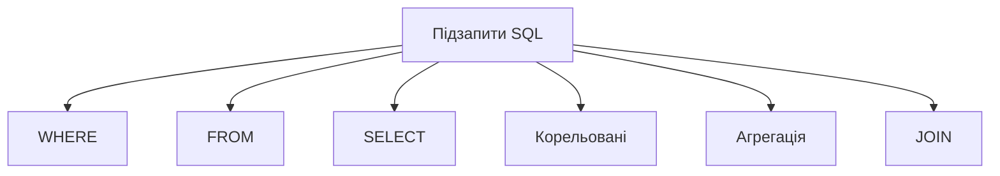
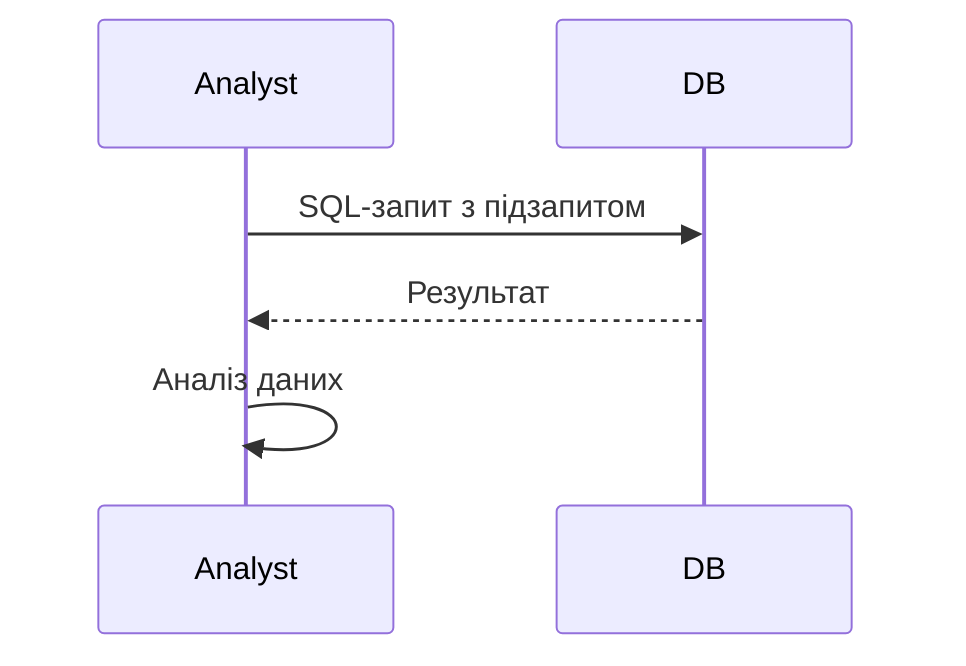

# Підзапити SQL

---

## Вступ

Підзапити SQL — це вкладені запити, які дозволяють виконувати складні вибірки, фільтрацію, агрегацію та інтеграцію даних у реляційних базах. Вони є потужним інструментом для аналітика, дозволяють будувати багаторівневі запити, оптимізувати аналіз і підвищувати гнучкість роботи з даними. У цьому розділі розглянемо історію, типи підзапитів, синтаксис, приклади, нюанси, типові помилки, кращі практики та реальні кейси.

---

## Історія та еволюція підзапитів

### Витоки

Підзапити з’явилися у SQL у 1980-х роках для розширення можливостей вибірки та фільтрації. Від простих вкладених SELECT до складних корельованих підзапитів — SQL постійно розширює функціонал.

### Етапи розвитку

-   **Базові підзапити**: вкладені SELECT у WHERE, FROM, HAVING.
-   **Корельовані підзапити**: залежність від зовнішнього запиту.
-   **Агрегація у підзапитах**: SUM, AVG, COUNT.
-   **Підзапити у JOIN**: інтеграція даних.
-   **Оптимізація**: індекси, план виконання.

---

## Типи підзапитів SQL

1. **Вкладені підзапити у WHERE** — фільтрація.
2. **Вкладені підзапити у FROM** — створення тимчасових таблиць.
3. **Вкладені підзапити у SELECT** — обчислення значень.
4. **Корельовані підзапити** — залежність від зовнішнього запиту.
5. **Агрегація у підзапитах** — SUM, AVG, COUNT.
6. **Підзапити у JOIN** — інтеграція даних.

---

## Синтаксис підзапитів SQL

### 1. Підзапит у WHERE

```sql
SELECT name FROM customers WHERE age > (SELECT AVG(age) FROM customers);
```

### 2. Підзапит у FROM

```sql
SELECT region, avg_sales
FROM (
    SELECT region, AVG(sales) AS avg_sales
    FROM orders
    GROUP BY region
) AS subquery;
```

### 3. Підзапит у SELECT

```sql
SELECT name, (SELECT COUNT(*) FROM orders WHERE customer_id = c.customer_id) AS num_orders
FROM customers c;
```

### 4. Корельований підзапит

```sql
SELECT name FROM customers c
WHERE EXISTS (
    SELECT 1 FROM orders o WHERE o.customer_id = c.customer_id AND o.sales > 1000
);
```

### 5. Агрегація у підзапиті

```sql
SELECT region, (SELECT SUM(sales) FROM orders WHERE orders.region = r.region) AS total_sales
FROM regions r;
```

### 6. Підзапит у JOIN

```sql
SELECT c.name, o.total_sales
FROM customers c
JOIN (
    SELECT customer_id, SUM(sales) AS total_sales
    FROM orders
    GROUP BY customer_id
) o ON c.customer_id = o.customer_id;
```

---

## Діаграми та візуалізації

### Mermaid: Класифікація підзапитів



### Mermaid: Потік виконання підзапиту



---

## Реальні кейси використання підзапитів

### Кейс 1: Аналіз продажів

-   **Підзапити**: у WHERE, FROM, агрегація.
-   **Завдання**: Визначити топ-регіони за середнім продажем.

### Кейс 2: Сегментація клієнтів

-   **Підзапити**: корельовані, у SELECT.
-   **Завдання**: Виявити клієнтів з певною активністю.

### Кейс 3: Моніторинг ІТ-систем

-   **Підзапити**: у JOIN, агрегація.
-   **Завдання**: Виявити аномалії, інтегрувати дані.

---

## Кращі практики побудови підзапитів

1. **Документуйте запити**
2. **Оптимізуйте підзапити для продуктивності**
3. **Використовуйте індекси для великих таблиць**
4. **Перевіряйте коректність підзапитів**
5. **Тестуйте запити на підмножинах даних**
6. **Аналізуйте план виконання**
7. **Уникайте надмірної вкладеності**

---

## Нюанси та підводні камені

-   **Надмірна вкладеність** — повільна робота
-   **Відсутність індексів** — складність виконання
-   **Великі обсяги даних** — складність аналізу
-   **Відсутність документування** — складно відтворити запит
-   **Відсутність тестування** — помилки у звітах
-   **Корельовані підзапити** — можуть бути повільними

---

## Перехресні посилання

-   [Запити SQL](queries.md)
-   [Основи SQL](basics.md)
-   [Аггрегації SQL](aggregations.md)
-   [Типи даних](../03-data-basics/types.md)
-   [Очищення та трансформація](../04-wrangling/cleaning.md)
-   [Візуалізація даних](../05-visualization/overview.md)
-   [Python для роботи з SQL](../08-python/overview.md)

---

## Розширене резюме

Підзапити SQL — це потужний інструмент для складного аналізу даних. Від правильного використання підзапитів залежить якість звітів, швидкість аналізу та ефективність прийняття рішень. Сучасний аналітик використовує різні типи підзапитів: у WHERE, FROM, SELECT, корельовані, агрегаційні, у JOIN. Важливо враховувати нюанси, оптимізувати запити, документувати процес і тестувати результати. Вміння ефективно будувати підзапити SQL — одна з базових компетенцій дата-аналітика.

---
