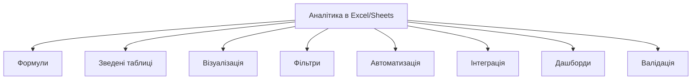
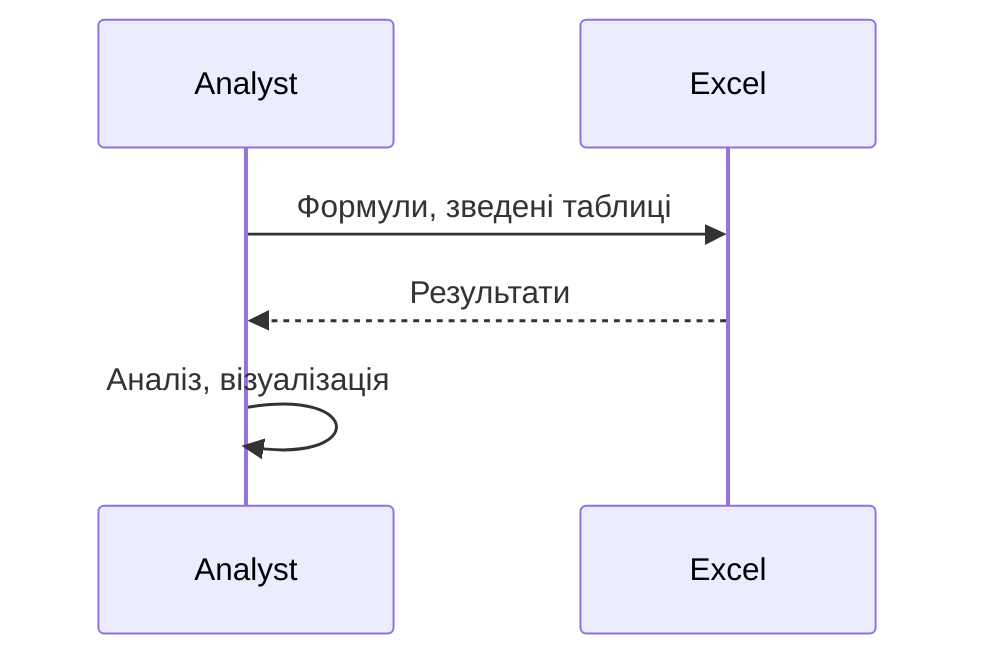

# Аналітика в Excel/Google Sheets

---

## Вступ

Аналітика в Excel та Google Sheets — це набір інструментів, функцій і прийомів для обробки, аналізу та візуалізації даних у табличних процесорах. Володіння цими інструментами дозволяє швидко отримувати інсайти, будувати звіти, автоматизувати рутинні задачі та приймати обґрунтовані рішення. У цьому розділі розглянемо історію, основні можливості, приклади, нюанси, типові помилки, кращі практики та реальні кейси.

---

## Історія та еволюція аналітики в табличних процесорах

### Витоки

Excel з’явився у 1985 році, Google Sheets — у 2006. Від простих обчислень до складних дашбордів, макросів, інтеграції з BI — табличні процесори стали універсальним інструментом для аналітиків.

### Етапи розвитку

-   **Базові функції**: SUM, AVERAGE, COUNT, IF.
-   **Зведені таблиці**: групування, агрегація.
-   **Візуалізація**: графіки, діаграми.
-   **Автоматизація**: макроси, скрипти.
-   **Інтеграція**: імпорт/експорт, API, Google Apps Script.
-   **Спільна робота**: коментарі, доступи, версії.

---

## Основні можливості аналітики в Excel/Google Sheets

1. **Формули та функції** — SUM, AVERAGE, VLOOKUP, INDEX/MATCH, IF, COUNTIF, ARRAYFORMULA.
2. **Зведені таблиці** — групування, агрегація, фільтрація.
3. **Візуалізація** — графіки, діаграми, умовне форматування.
4. **Фільтри та сортування** — швидкий аналіз.
5. **Обробка великих обсягів даних** — Power Query, імпорт з CSV, Google BigQuery.
6. **Автоматизація** — макроси, Google Apps Script.
7. **Інтеграція з іншими сервісами** — API, імпорт даних.
8. **Спільна робота** — коментарі, доступи, версії.
9. **Побудова дашбордів** — інтерактивні звіти.
10. **Валідація та очищення даних** — Data Validation, Remove Duplicates.

---

## Приклади формул та функцій

### 1. SUM, AVERAGE, COUNT

```excel
=SUM(A2:A100)
=AVERAGE(B2:B100)
=COUNT(C2:C100)
```

### 2. IF, COUNTIF

```excel
=IF(D2 > 1000, "High", "Low")
=COUNTIF(E2:E100, ">1000")
```

### 3. VLOOKUP, INDEX/MATCH

```excel
=VLOOKUP("John", A2:C100, 2, FALSE)
=INDEX(B2:B100, MATCH("John", A2:A100, 0))
```

### 4. Зведена таблиця

-   Виберіть дані → Вставка → Зведена таблиця → Групуйте, агрегуйте, фільтруйте.

### 5. Умовне форматування

-   Виділіть діапазон → Формат → Умовне форматування → Встановіть правила.

### 6. Графіки та діаграми

-   Вставка → Графік → Виберіть тип (лінійний, стовпчиковий, круговий тощо).

### 7. Макроси та автоматизація

-   Excel: Розробник → Записати макрос → VBA.
-   Google Sheets: Extensions → Apps Script → JavaScript.

---

## Пояснення під капотом

-   **Обчислення**: Excel та Sheets використовують власні рушії для обробки формул, оптимізують обчислення для великих обсягів.
-   **Зведені таблиці**: створюють тимчасові структури для агрегації.
-   **Візуалізація**: графіки рендеряться через вбудовані бібліотеки.
-   **Автоматизація**: макроси виконуються у середовищі VBA (Excel) або JS (Sheets).
-   **Інтеграція**: імпорт даних через API, Google Apps Script, Power Query.

---

## Нюанси та підводні камені

-   **Великі обсяги даних** — Excel може "зависати", Sheets має обмеження.
-   **Помилки у формулах** — складні вкладені формули важко дебажити.
-   **Відсутність автоматизації** — ручна робота призводить до помилок.
-   **Проблеми з форматуванням** — різні локалі, кодування.
-   **Обмеження на кількість рядків/стовпців** — особливо у Sheets.
-   **Відсутність контролю версій** — складно відстежити зміни.

---

## Діаграми та візуалізації

### Mermaid: Основні можливості аналітики



### Mermaid: Потік роботи аналітика



---

## Реальні кейси аналітики в Excel/Google Sheets

### Кейс 1: Аналіз продажів

-   **Інструменти**: зведені таблиці, графіки, формули.
-   **Завдання**: Визначити топ-продукти, сезонність, тренди.

### Кейс 2: Опитування

-   **Інструменти**: умовне форматування, фільтри, COUNTIF.
-   **Завдання**: Сегментація респондентів, візуалізація результатів.

### Кейс 3: Моніторинг ІТ-систем

-   **Інструменти**: імпорт даних, автоматизація, дашборди.
-   **Завдання**: Виявити аномалії, побудувати звіти.

---

## Кращі практики аналітики в Excel/Google Sheets

1. **Використовуйте стандартні функції та формули**
2. **Автоматизуйте рутинні задачі**
3. **Документуйте структуру та формули**
4. **Використовуйте умовне форматування для акцентів**
5. **Тестуйте формули на підмножинах даних**
6. **Оновлюйте дані регулярно**
7. **Використовуйте інтеграцію з іншими сервісами**

---

## Підсумок

-   Табличні процесори — універсальний інструмент аналітика.
-   Володіння формулами, зведеними таблицями, візуалізацією — ключ до ефективного аналізу.
-   Автоматизація та інтеграція — підвищують продуктивність.
-   Важливо враховувати нюанси, тестувати формули, документувати процес.
-   Вміння працювати з Excel/Google Sheets — базова компетенція дата-аналітика.

---
