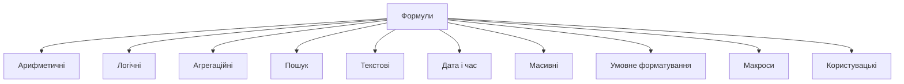
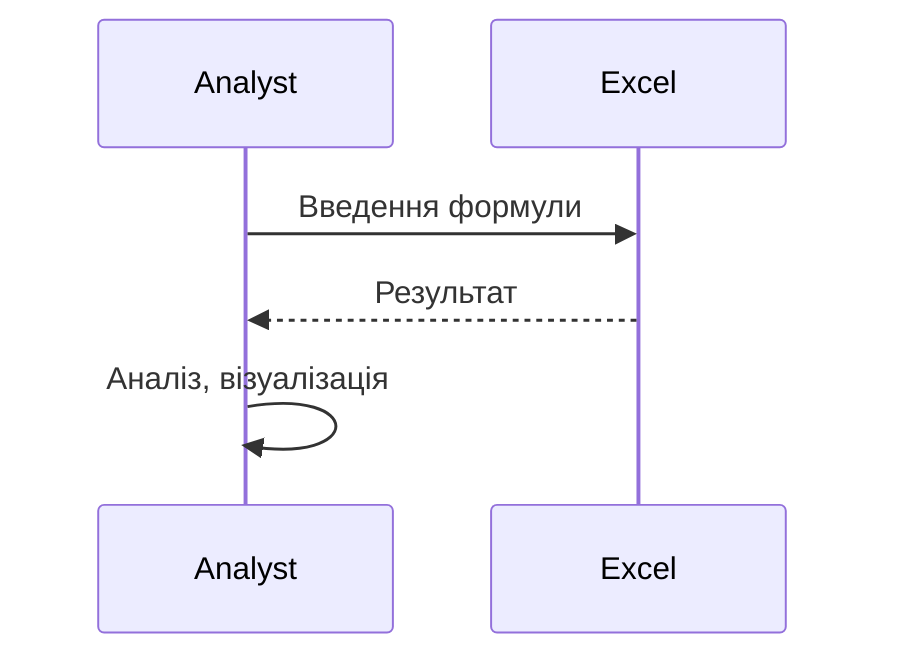

# Формули в Excel/Google Sheets

---

## Вступ

Формули — це основний інструмент для обробки, аналізу та автоматизації даних у Excel та Google Sheets. Вони дозволяють виконувати обчислення, логічні операції, пошук, агрегацію, трансформацію та валідацію даних. Володіння формулами — ключова навичка для аналітика, що забезпечує швидкість і глибину аналізу. У цьому розділі розглянемо історію, основні типи формул, синтаксис, приклади, нюанси, типові помилки, кращі практики та реальні кейси.

---

## Історія та еволюція формул

### Витоки

Перші формули з’явилися у табличних процесорах у 1980-х роках. Від простих арифметичних операцій до складних масивних формул, макросів, скриптів — функціонал постійно розширюється.

### Етапи розвитку

-   **Базові формули**: SUM, AVERAGE, COUNT, IF.
-   **Логічні**: AND, OR, NOT.
-   **Пошук і посилання**: VLOOKUP, HLOOKUP, INDEX, MATCH.
-   **Агрегація**: COUNTIF, SUMIF, AVERAGEIF.
-   **Масивні формули**: ARRAYFORMULA, TRANSPOSE.
-   **Текстові**: CONCATENATE, LEFT, RIGHT, MID, LEN.
-   **Дата і час**: TODAY, NOW, DATE, YEAR, MONTH.
-   **Умовне форматування**: формули для форматування.
-   **Макроси та скрипти**: VBA, Google Apps Script.

---

## Основні типи формул

1. **Арифметичні** — SUM, AVERAGE, MIN, MAX.
2. **Логічні** — IF, AND, OR, NOT.
3. **Агрегаційні** — COUNT, COUNTIF, SUMIF, AVERAGEIF.
4. **Пошук і посилання** — VLOOKUP, HLOOKUP, INDEX, MATCH.
5. **Текстові** — CONCATENATE, LEFT, RIGHT, MID, LEN.
6. **Дата і час** — TODAY, NOW, DATE, YEAR, MONTH.
7. **Масивні** — ARRAYFORMULA, TRANSPOSE.
8. **Умовне форматування** — формули для форматування.
9. **Макроси та скрипти** — VBA, Google Apps Script.
10. **Користувацькі функції** — власні формули через скрипти.

---

## Синтаксис формул

-   Формула починається з знаку "=".
-   Аргументи — діапазони, значення, функції.
-   Вкладені формули — одна формула всередині іншої.
-   Масивні формули — працюють з діапазонами.

### 1. Арифметичні

```excel
=SUM(A2:A100)
=AVERAGE(B2:B100)
=MIN(C2:C100)
=MAX(D2:D100)
```

### 2. Логічні

```excel
=IF(E2 > 1000, "High", "Low")
=AND(F2 > 0, G2 < 100)
=OR(H2 = "Yes", I2 = "No")
=NOT(J2 = "Done")
```

### 3. Агрегаційні

```excel
=COUNTIF(K2:K100, ">1000")
=SUMIF(L2:L100, ">0", M2:M100)
=AVERAGEIF(N2:N100, "<50", O2:O100)
```

### 4. Пошук і посилання

```excel
=VLOOKUP("John", A2:C100, 2, FALSE)
=HLOOKUP("Sales", A1:Z1, 2, FALSE)
=INDEX(P2:P100, MATCH("Anna", Q2:Q100, 0))
```

### 5. Текстові

```excel
=CONCATENATE(R2, " ", S2)
=LEFT(T2, 3)
=RIGHT(U2, 2)
=MID(V2, 2, 5)
=LEN(W2)
```

### 6. Дата і час

```excel
=TODAY()
=NOW()
=DATE(2025, 8, 3)
=YEAR(X2)
=MONTH(Y2)
```

### 7. Масивні

```excel
=ARRAYFORMULA(A2:A10 * B2:B10)
=TRANSPOSE(Z2:Z10)
```

---

## Пояснення під капотом

-   **Обчислення**: рушій Excel/Sheets оптимізує обчислення, кешує результати.
-   **Масивні формули**: обробляють діапазони паралельно.
-   **Вкладені формули**: виконуються рекурсивно.
-   **Макроси**: виконуються у середовищі VBA (Excel) або JS (Sheets).
-   **Користувацькі функції**: через Google Apps Script або VBA.

---

## Нюанси та підводні камені

-   **Помилки у формулах** — складні вкладені формули важко дебажити.
-   **Великі обсяги даних** — повільна робота.
-   **Відсутність автоматизації** — ручна робота призводить до помилок.
-   **Проблеми з форматуванням** — різні локалі, кодування.
-   **Обмеження на кількість рядків/стовпців** — особливо у Sheets.
-   **Відсутність контролю версій** — складно відстежити зміни.
-   **Відсутність коментарів** — важко підтримувати формули.

---

## Діаграми та візуалізації

### Mermaid: Класифікація формул



### Mermaid: Потік роботи формули



---

## Реальні кейси використання формул

### Кейс 1: Аналіз продажів

-   **Формули**: SUM, AVERAGE, COUNTIF, VLOOKUP.
-   **Завдання**: Визначити топ-продукти, сезонність, тренди.

### Кейс 2: Опитування

-   **Формули**: IF, COUNTIF, CONCATENATE.
-   **Завдання**: Сегментація респондентів, візуалізація результатів.

### Кейс 3: Моніторинг ІТ-систем

-   **Формули**: імпорт даних, масивні формули, макроси.
-   **Завдання**: Виявити аномалії, побудувати звіти.

---

## Кращі практики роботи з формулами

1. **Використовуйте стандартні функції та формули**
2. **Автоматизуйте рутинні задачі**
3. **Документуйте структуру та формули**
4. **Використовуйте коментарі для складних формул**
5. **Тестуйте формули на підмножинах даних**
6. **Оновлюйте формули відповідно до змін даних**
7. **Використовуйте інтеграцію з іншими сервісами**

---

## Підсумок

-   Формули — основа аналітики в Excel/Google Sheets.
-   Володіння різними типами формул — ключ до ефективного аналізу.
-   Автоматизація та коментарі — підвищують продуктивність.
-   Важливо враховувати нюанси, тестувати формули, документувати процес.
-   Вміння працювати з формулами — базова компетенція дата-аналітика.

---
