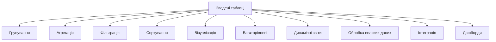
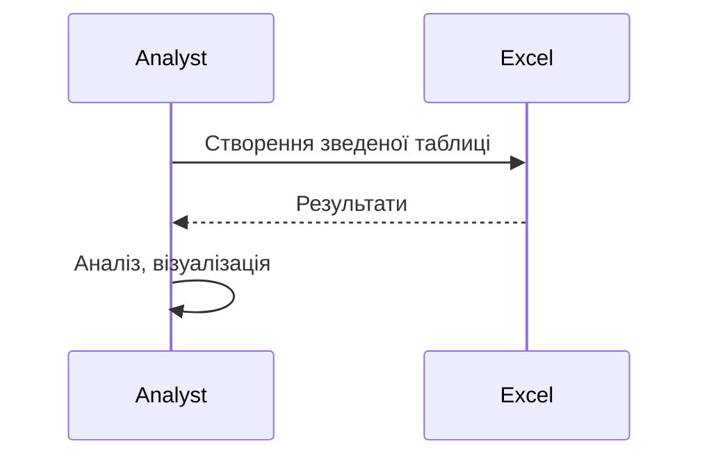

# Зведені таблиці

---

## Вступ

Зведені таблиці — це потужний інструмент для аналізу, агрегації та візуалізації великих обсягів даних у Excel та Google Sheets. Вони дозволяють швидко групувати, фільтрувати, підсумовувати та порівнювати дані, створювати інтерактивні звіти та дашборди. Володіння зведеними таблицями — ключова навичка для аналітика. У цьому розділі розглянемо історію, основні можливості, синтаксис, приклади, нюанси, типові помилки, кращі практики та реальні кейси.

---

## Історія та еволюція зведених таблиць

### Витоки

Перші зведені таблиці з’явилися у Excel у 1990-х роках. Google Sheets додав підтримку у 2010-х. Від простих групувань до складних багаторівневих дашбордів — функціонал постійно розширюється.

### Етапи розвитку

-   **Базові зведені таблиці**: групування, агрегація.
-   **Фільтрація**: швидкий аналіз підмножин.
-   **Візуалізація**: інтеграція з графіками.
-   **Багаторівневі групування**: вкладені категорії.
-   **Динамічні звіти**: інтерактивність, оновлення.
-   **Інтеграція з Power Query, Google BigQuery**.

---

## Основні можливості зведених таблиць

1. **Групування даних** — за категоріями, датами, числовими діапазонами.
2. **Агрегація** — сума, середнє, мінімум, максимум, кількість.
3. **Фільтрація** — вибір підмножин.
4. **Сортування** — впорядкування результатів.
5. **Візуалізація** — інтеграція з графіками.
6. **Багаторівневі групування** — вкладені категорії.
7. **Динамічні звіти** — автоматичне оновлення.
8. **Обробка великих обсягів даних** — оптимізація.
9. **Інтеграція з іншими джерелами** — Power Query, BigQuery.
10. **Побудова дашбордів** — інтерактивні звіти.

---

## Синтаксис та створення зведених таблиць

### 1. Excel

-   Виберіть діапазон даних → Вставка → Зведена таблиця.
-   Виберіть поля для "Рядків", "Стовпців", "Значень", "Фільтрів".
-   Налаштуйте агрегацію (сума, середнє, кількість тощо).
-   Додавайте багаторівневі групування.
-   Інтегруйте з графіками.

### 2. Google Sheets

-   Виберіть діапазон → Дані → Зведена таблиця.
-   Додавайте "Рядки", "Стовпці", "Значення", "Фільтри".
-   Налаштуйте тип агрегації.
-   Оновлюйте дані автоматично.

---

## Приклади використання зведених таблиць

### 1. Групування продажів за регіонами

-   "Рядки": Регіон
-   "Значення": Сума продажів
-   "Фільтр": Дата

### 2. Аналіз сезонності

-   "Рядки": Місяць
-   "Стовпці": Рік
-   "Значення": Кількість транзакцій

### 3. Сегментація клієнтів

-   "Рядки": Категорія клієнта
-   "Значення": Середній чек
-   "Фільтр": Регіон

### 4. Побудова дашборду

-   Декілька зведених таблиць + графіки на одному аркуші.

---

## Пояснення під капотом

-   **Обчислення**: рушій Excel/Sheets створює тимчасові структури для агрегації.
-   **Оновлення**: зведені таблиці автоматично оновлюються при зміні даних.
-   **Візуалізація**: інтеграція з графіками через вбудовані бібліотеки.
-   **Інтеграція**: імпорт даних через Power Query, BigQuery.

---

## Нюанси та підводні камені

-   **Великі обсяги даних** — повільна робота, обмеження.
-   **Помилки у групуванні** — некоректна агрегація.
-   **Відсутність автоматизації** — ручна робота.
-   **Проблеми з форматуванням** — різні локалі, кодування.
-   **Обмеження на кількість рядків/стовпців** — особливо у Sheets.
-   **Відсутність контролю версій** — складно відстежити зміни.
-   **Відсутність коментарів** — важко підтримувати структуру.

---

## Діаграми та візуалізації

### Mermaid: Класифікація можливостей зведених таблиць

### Mermaid: Потік роботи зі зведеною таблицею

---

## Реальні кейси використання зведених таблиць

### Кейс 1: Аналіз продажів

-   **Зведена таблиця**: групування за регіонами, агрегація суми продажів.
-   **Завдання**: Визначити топ-регіони, сезонність.

### Кейс 2: Опитування

-   **Зведена таблиця**: фільтрація за категоріями, агрегація відповідей.
-   **Завдання**: Сегментація респондентів, візуалізація результатів.

### Кейс 3: Моніторинг ІТ-систем

-   **Зведена таблиця**: обробка великих обсягів, багаторівневі групування.
-   **Завдання**: Виявити аномалії, побудувати звіти.

---

## Кращі практики роботи зі зведеними таблицями

1. **Використовуйте стандартні функції та структури**
2. **Автоматизуйте оновлення даних**
3. **Документуйте структуру та поля**
4. **Використовуйте коментарі для складних групувань**
5. **Тестуйте структуру на підмножинах даних**
6. **Оновлюйте структуру відповідно до змін даних**
7. **Використовуйте інтеграцію з іншими джерелами**

---

## Підсумок

-   Зведені таблиці — основа аналітики в Excel/Google Sheets.
-   Володіння групуванням, агрегацією, фільтрацією — ключ до ефективного аналізу.
-   Автоматизація та коментарі — підвищують продуктивність.
-   Важливо враховувати нюанси, тестувати структуру, документувати процес.
-   Вміння працювати зі зведеними таблицями — базова компетенція дата-аналітика.

---
