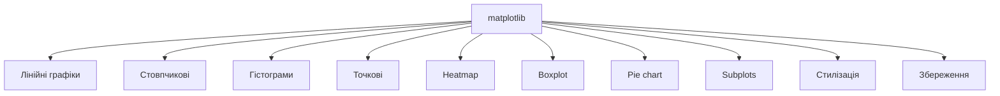
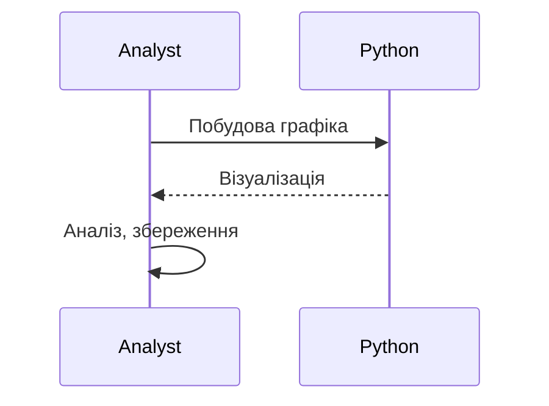

# matplotlib

---

## Вступ

matplotlib — це потужна бібліотека для візуалізації даних у Python, яка дозволяє створювати графіки, діаграми, гістограми, heatmap, scatter plot та багато іншого. Вона є стандартом де-факто для побудови графіків у наукових, аналітичних та бізнес-проєктах. Володіння matplotlib — ключова навичка для дата-аналітика та дата-сайєнтиста. У цьому розділі розглянемо історію, основні можливості, синтаксис, приклади, нюанси, типові помилки, кращі практики та реальні кейси.

---

## Історія та еволюція matplotlib

### Витоки

matplotlib була створена Джоном Хантером у 2003 році для потреб наукової візуалізації. Від простих лінійних графіків до складних інтерактивних дашбордів — бібліотека постійно розширюється.

### Етапи розвитку

-   **Базові графіки**: plot, bar, scatter, hist.
-   **Стилізація**: кольори, маркери, лінії.
-   **Візуалізація багатовимірних даних**: heatmap, subplot.
-   **Інтерактивність**: zoom, hover, savefig.
-   **Інтеграція з pandas, numpy, seaborn**.
-   **Підтримка різних форматів**: PNG, PDF, SVG.

---

## Основні можливості matplotlib

1. **Лінійні графіки** — plt.plot()
2. **Стовпчикові графіки** — plt.bar()
3. **Гістограми** — plt.hist()
4. **Точкові діаграми** — plt.scatter()
5. **Heatmap** — plt.imshow()
6. **Boxplot** — plt.boxplot()
7. **Pie chart** — plt.pie()
8. **Subplots** — plt.subplot(), plt.subplots()
9. **Стилізація** — кольори, маркери, лінії, легенди
10. **Збереження графіків** — plt.savefig()

---

## Синтаксис та приклади коду

### 1. Лінійний графік

```python
import matplotlib.pyplot as plt
x = [1, 2, 3, 4]
y = [10, 20, 15, 25]
plt.plot(x, y, marker='o', color='b', label='Дані')
plt.title('Лінійний графік')
plt.xlabel('X')
plt.ylabel('Y')
plt.legend()
plt.show()
```

### 2. Стовпчиковий графік

```python
plt.bar(x, y, color='g')
plt.title('Стовпчиковий графік')
plt.show()
```

### 3. Гістограма

```python
import numpy as np
data = np.random.randn(100)
plt.hist(data, bins=10, color='orange')
plt.title('Гістограма')
plt.show()
```

### 4. Точкова діаграма

```python
x = np.random.rand(50)
y = np.random.rand(50)
plt.scatter(x, y, color='red')
plt.title('Точкова діаграма')
plt.show()
```

### 5. Heatmap

```python
matrix = np.random.rand(10, 12)
plt.imshow(matrix, cmap='hot', interpolation='nearest')
plt.title('Heatmap')
plt.colorbar()
plt.show()
```

### 6. Subplots

```python
fig, axs = plt.subplots(2, 2)
axs[0, 0].plot(x, y)
axs[0, 1].bar(x, y)
axs[1, 0].hist(data)
axs[1, 1].scatter(x, y)
plt.tight_layout()
plt.show()
```

### 7. Збереження графіка

```python
plt.plot(x, y)
plt.savefig('plot.png')
```

---

## Пояснення під капотом

-   **Рендеринг**: matplotlib використовує рушій Agg для побудови графіків, підтримує різні бекенди (TkAgg, Qt5Agg).
-   **Інтеграція**: працює з pandas DataFrame, numpy масивами.
-   **Стилізація**: через rcParams, стилі, теми.
-   **Інтерактивність**: zoom, hover, callback-функції.
-   **Збереження**: підтримка PNG, PDF, SVG, EPS.

---

## Нюанси та підводні камені

-   **Велика кількість параметрів** — складність налаштування.
-   **Проблеми з кирилицею** — шрифти, кодування.
-   **Відсутність інтерактивності** — для складних дашбордів краще plotly.
-   **Великі обсяги даних** — повільна робота.
-   **Відсутність коментарів** — важко підтримувати код.
-   **Несумісність стилів** — різні версії бібліотеки.

---

## Діаграми та візуалізації

### Mermaid: Класифікація можливостей matplotlib



### Mermaid: Потік роботи з matplotlib



---

## Реальні кейси використання matplotlib

### Кейс 1: Аналіз продажів

-   **Графіки**: лінійний, стовпчиковий, гістограма.
-   **Завдання**: Виявити тренди, сезонність, структуру продажів.

### Кейс 2: Соціологічне дослідження

-   **Графіки**: scatter plot, heatmap, boxplot.
-   **Завдання**: Виявити кореляції, розподіли, аномалії.

### Кейс 3: Моніторинг ІТ-систем

-   **Графіки**: subplots, інтерактивність, збереження.
-   **Завдання**: Побудова дашбордів, аналіз навантаження.

---

## Кращі практики роботи з matplotlib

1. **Використовуйте стандартні функції та стилі**
2. **Документуйте код та параметри**
3. **Використовуйте інтеграцію з pandas/numpy**
4. **Тестуйте графіки на різних пристроях**
5. **Оновлюйте бібліотеку до актуальної версії**
6. **Використовуйте коментарі для складних графіків**
7. **Зберігайте графіки у різних форматах**

---

## Підсумок

-   matplotlib — стандарт для візуалізації у Python.
-   Володіння різними типами графіків — ключ до ефективного аналізу.
-   Інтеграція з pandas/numpy — підвищує продуктивність.
-   Важливо враховувати нюанси, тестувати графіки, документувати процес.
-   Вміння працювати з matplotlib — базова компетенція дата-аналітика.

---
