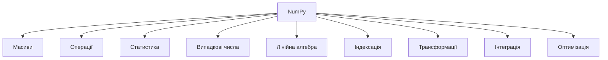
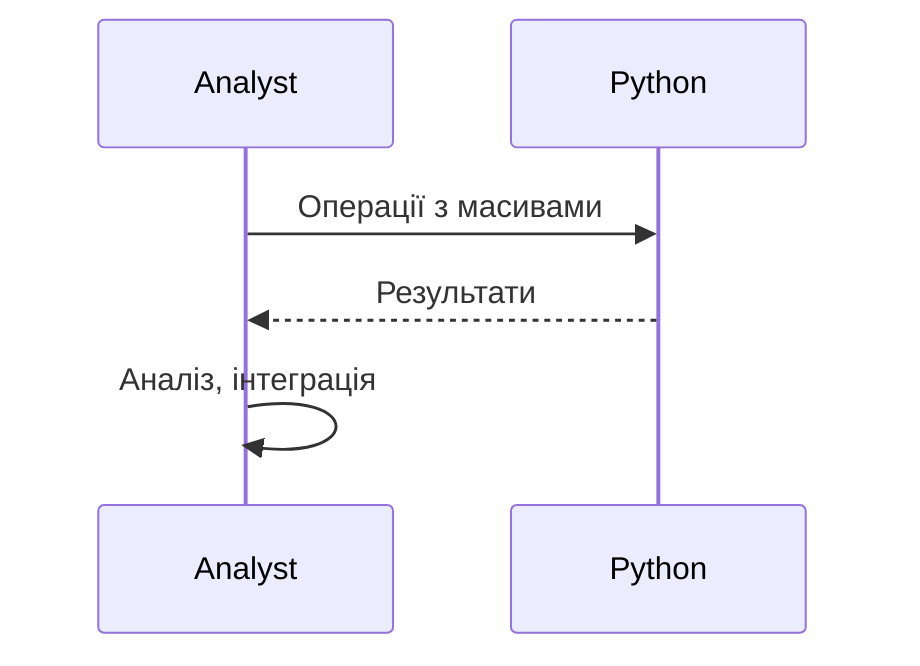

# numpy

---

## Вступ

NumPy — це фундаментальна бібліотека для роботи з числовими даними у Python. Вона забезпечує швидкі операції над масивами, матрицями, статистичними функціями, генерацією випадкових чисел, лінійною алгеброю та інтеграцією з іншими науковими бібліотеками. NumPy — основа для pandas, matplotlib, scikit-learn та багатьох інших інструментів аналітики й машинного навчання. У цьому розділі розглянемо історію, основні можливості, синтаксис, приклади, нюанси, типові помилки, кращі практики та реальні кейси.

---

## Історія та еволюція NumPy

### Витоки

NumPy виникла у 2005 році як об’єднання Numeric та numarray. Автор — Тревіс Оліфант. Від простих масивів до потужної платформи для наукових обчислень — бібліотека постійно розширюється.

### Етапи розвитку

-   **Масиви**: ndarray, shape, dtype.
-   **Операції**: арифметика, логіка, трансформації.
-   **Статистика**: mean, std, median, min, max.
-   **Генерація випадкових чисел**: random, randint, normal.
-   **Лінійна алгебра**: dot, inv, eig, svd.
-   **Інтеграція**: pandas, matplotlib, scipy.
-   **Оптимізація**: C-реалізація, багатопотоковість.

---

## Основні можливості NumPy

1. **Масиви ndarray** — багатовимірні структури.
2. **Операції над масивами** — арифметика, логіка, трансформації.
3. **Статистичні функції** — mean, std, median, min, max.
4. **Генерація випадкових чисел** — random, randint, normal.
5. **Лінійна алгебра** — dot, inv, eig, svd.
6. **Інтеграція з pandas, matplotlib, scipy**.
7. **Індексація та зрізи** — доступ до елементів, підмасивів.
8. **Трансформації** — reshape, transpose, flatten.
9. **Масиви з різними типами даних** — dtype.
10. **Оптимізація обчислень** — C-реалізація, багатопотоковість.

---

## Синтаксис та приклади коду

### 1. Створення масиву

```python
import numpy as np
arr = np.array([1, 2, 3, 4])
print(arr)
```

### 2. Операції над масивами

```python
arr2 = arr * 2
arr3 = arr + arr2
print(arr2, arr3)
```

### 3. Статистичні функції

```python
mean = np.mean(arr)
std = np.std(arr)
median = np.median(arr)
print(mean, std, median)
```

### 4. Генерація випадкових чисел

```python
rand_arr = np.random.randint(0, 10, size=(3, 3))
print(rand_arr)
```

### 5. Лінійна алгебра

```python
A = np.array([[1, 2], [3, 4]])
B = np.array([[5, 6], [7, 8]])
dot = np.dot(A, B)
inv = np.linalg.inv(A)
eigvals, eigvecs = np.linalg.eig(A)
print(dot, inv, eigvals)
```

### 6. Індексація та зрізи

```python
print(arr[1])      # другий елемент
print(arr[1:3])    # підмасив
```

### 7. Трансформації

```python
reshaped = arr.reshape((2, 2))
transposed = reshaped.T
flattened = reshaped.flatten()
print(reshaped, transposed, flattened)
```

---

## Пояснення під капотом

-   **C-реалізація**: NumPy написана на C для швидкості.
-   **ndarray**: багатовимірна структура з метаданими (shape, dtype).
-   **Бродкастинг**: автоматичне узгодження розмірів масивів для операцій.
-   **Оптимізація**: використання BLAS, LAPACK для лінійної алгебри.
-   **Інтеграція**: pandas використовує NumPy для зберігання даних.

---

## Нюанси та підводні камені

-   **Бродкастинг** — може призводити до неочікуваних результатів.
-   **Великі обсяги даних** — пам’ять, швидкість.
-   **Відмінність від списків Python** — індексація, типи.
-   **Проблеми з dtype** — неочікувані типи даних.
-   **Відсутність коментарів** — важко підтримувати код.
-   **Несумісність версій** — різні API.

---

## Діаграми та візуалізації

### Mermaid: Класифікація можливостей NumPy



### Mermaid: Потік роботи з NumPy



---

## Реальні кейси використання NumPy

### Кейс 1: Аналіз продажів

-   **Масиви**: зберігання даних, статистика.
-   **Завдання**: Виявити тренди, сезонність, структуру продажів.

### Кейс 2: Машинне навчання

-   **Операції**: підготовка даних, нормалізація, лінійна алгебра.
-   **Завдання**: Побудова моделей, оптимізація.

### Кейс 3: Моніторинг ІТ-систем

-   **Генерація випадкових чисел**: моделювання навантаження.
-   **Завдання**: Аналіз аномалій, побудова симуляцій.

---

## Кращі практики роботи з NumPy

1. **Використовуйте стандартні функції та методи**
2. **Документуйте код та параметри**
3. **Використовуйте інтеграцію з pandas/matplotlib**
4. **Тестуйте операції на підмножинах даних**
5. **Оновлюйте бібліотеку до актуальної версії**
6. **Використовуйте коментарі для складних операцій**
7. **Оптимізуйте пам’ять та швидкість**

---

## Підсумок

-   NumPy — стандарт для роботи з числовими даними у Python.
-   Володіння масивами, статистикою, лінійною алгеброю — ключ до ефективного аналізу.
-   Інтеграція з pandas/matplotlib — підвищує продуктивність.
-   Важливо враховувати нюанси, тестувати операції, документувати процес.
-   Вміння працювати з NumPy — базова компетенція дата-аналітика.

---
