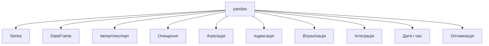
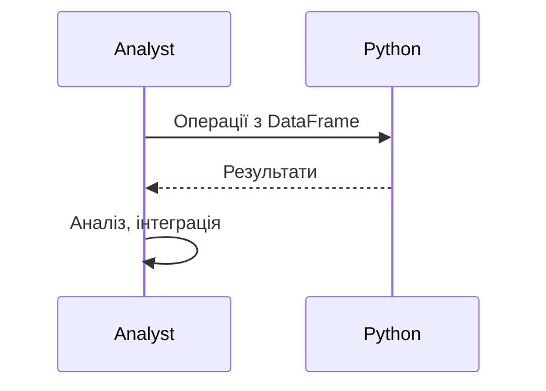

# pandas

---

## Вступ

pandas — це потужна бібліотека для роботи з табличними даними у Python. Вона забезпечує зручні структури (DataFrame, Series), інструменти для обробки, аналізу, очищення, трансформації, агрегації, візуалізації та інтеграції даних. pandas — стандарт де-факто для дата-аналітики, машинного навчання, фінансового моделювання та наукових досліджень. У цьому розділі розглянемо історію, основні можливості, синтаксис, приклади, нюанси, типові помилки, кращі практики та реальні кейси.

---

## Історія та еволюція pandas

### Витоки

pandas створена Весом МакКінні у 2008 році для фінансового аналізу. Від простих Series до потужних DataFrame — бібліотека постійно розширюється, інтегрується з NumPy, matplotlib, SQL, Excel.

### Етапи розвитку

-   **Series**: одномірні структури.
-   **DataFrame**: двовимірні таблиці.
-   **Імпорт/експорт**: CSV, Excel, SQL, JSON.
-   **Очищення та трансформація**: dropna, fillna, replace, apply.
-   **Агрегація**: groupby, pivot_table, resample.
-   **Індексація та фільтрація**: loc, iloc, query.
-   **Візуалізація**: plot, hist, boxplot.
-   **Інтеграція**: NumPy, matplotlib, scikit-learn.

---

## Основні можливості pandas

1. **Series** — одномірні дані.
2. **DataFrame** — двовимірні таблиці.
3. **Імпорт/експорт** — CSV, Excel, SQL, JSON.
4. **Очищення та трансформація** — dropna, fillna, replace, apply.
5. **Агрегація** — groupby, pivot_table, resample.
6. **Індексація та фільтрація** — loc, iloc, query.
7. **Візуалізація** — plot, hist, boxplot.
8. **Інтеграція** — NumPy, matplotlib, scikit-learn.
9. **Обробка дат і часу** — to_datetime, resample.
10. **Оптимізація** — типи даних, пам’ять, швидкість.

---

## Синтаксис та приклади коду

### 1. Створення Series та DataFrame

```python
import pandas as pd
s = pd.Series([1, 2, 3, 4])
df = pd.DataFrame({'A': [1, 2], 'B': [3, 4]})
print(s)
print(df)
```

### 2. Імпорт/експорт даних

```python
df = pd.read_csv('data.csv')
df.to_excel('data.xlsx')
```

### 3. Очищення та трансформація

```python
df = df.dropna()
df['A'] = df['A'].fillna(0)
df['B'] = df['B'].replace(3, 99)
df['C'] = df['A'].apply(lambda x: x * 2)
```

### 4. Агрегація

```python
grouped = df.groupby('A').agg({'B': 'sum'})
pivot = df.pivot_table(values='B', index='A', columns='C', aggfunc='mean')
```

### 5. Індексація та фільтрація

```python
row = df.loc[0]
rows = df.iloc[:2]
filtered = df.query('A > 1')
```

### 6. Візуалізація

```python
df.plot(kind='bar')
df['A'].hist()
df.boxplot(column='B')
```

### 7. Обробка дат і часу

```python
df['date'] = pd.to_datetime(df['date'])
df.set_index('date').resample('M').sum()
```

---

## Пояснення під капотом

-   **DataFrame**: побудований на NumPy ndarray, оптимізований для табличних операцій.
-   **Індексація**: багаторівнева, гнучка, швидка.
-   **Групування**: створює тимчасові структури для агрегації.
-   **Візуалізація**: інтеграція з matplotlib.
-   **Оптимізація**: типи даних, пам’ять, швидкість.

---

## Нюанси та підводні камені

-   **Великі обсяги даних** — пам’ять, швидкість.
-   **Відмінність від SQL/Excel** — синтаксис, логіка.
-   **Проблеми з типами даних** — неочікувані dtype.
-   **Відсутність коментарів** — важко підтримувати код.
-   **Несумісність версій** — різні API.
-   **Відсутність індексації** — повільна робота.

---

## Діаграми та візуалізації

### Mermaid: Класифікація можливостей pandas



### Mermaid: Потік роботи з pandas



---

## Реальні кейси використання pandas

### Кейс 1: Аналіз продажів

-   **DataFrame**: зберігання даних, групування, агрегація.
-   **Завдання**: Виявити тренди, сезонність, структуру продажів.

### Кейс 2: Машинне навчання

-   **Очищення, трансформація**: підготовка даних, нормалізація.
-   **Завдання**: Побудова моделей, оптимізація.

### Кейс 3: Моніторинг ІТ-систем

-   **Імпорт/експорт, агрегація**: інтеграція з різними джерелами.
-   **Завдання**: Аналіз аномалій, побудова звітів.

---

## Кращі практики роботи з pandas

1. **Використовуйте стандартні функції та методи**
2. **Документуйте код та параметри**
3. **Використовуйте інтеграцію з NumPy/matplotlib**
4. **Тестуйте операції на підмножинах даних**
5. **Оновлюйте бібліотеку до актуальної версії**
6. **Використовуйте коментарі для складних операцій**
7. **Оптимізуйте пам’ять та швидкість**

---

## Підсумок

-   pandas — стандарт для роботи з табличними даними у Python.
-   Володіння DataFrame, Series, агрегацією, трансформацією — ключ до ефективного аналізу.
-   Інтеграція з NumPy/matplotlib — підвищує продуктивність.
-   Важливо враховувати нюанси, тестувати операції, документувати процес.
-   Вміння працювати з pandas — базова компетенція дата-аналітика.

---
