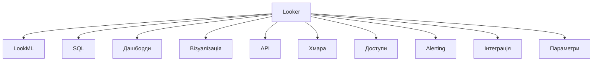
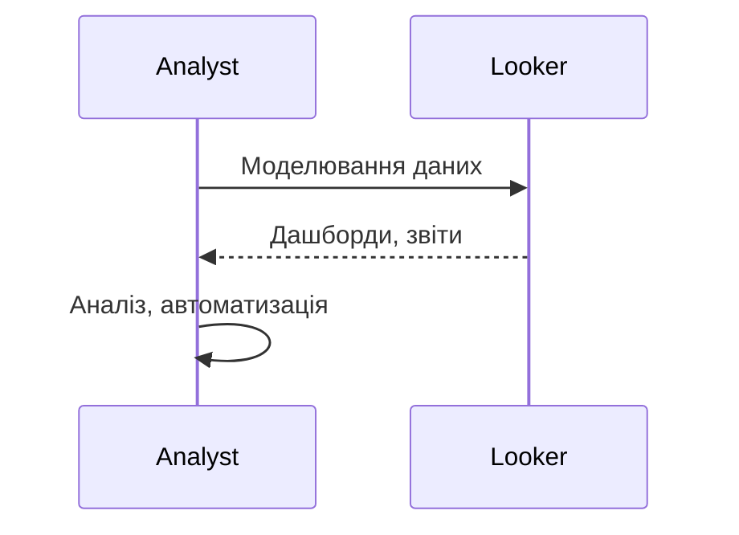

# Looker

---

## Вступ

Looker — це сучасна платформа для бізнес-аналітики (BI), яка дозволяє створювати інтерактивні дашборди, звіти, аналізувати великі обсяги даних, інтегрувати різні джерела та автоматизувати прийняття рішень. Looker використовує власну мову моделювання даних LookML, підтримує гнучку інтеграцію з SQL-базами, хмарними сховищами та API. Володіння Looker — важлива компетенція для аналітика, який працює з BI-інструментами. У цьому розділі розглянемо історію, основні можливості, синтаксис, приклади, нюанси, типові помилки, кращі практики та реальні кейси.

---

## Історія та еволюція Looker

### Витоки

Looker заснований у 2012 році Ллойдом Табером і Беном Портерфілдом. У 2019 році компанія стала частиною Google Cloud. Від простих звітів до складних інтегрованих дашбордів — платформа постійно розширюється.

### Етапи розвитку

-   **LookML**: власна мова моделювання даних.
-   **Інтеграція з SQL**: робота з різними базами.
-   **Дашборди**: інтерактивність, візуалізація.
-   **API**: автоматизація, інтеграція.
-   **Хмарна інфраструктура**: масштабованість, безпека.
-   **Інтеграція з Google Cloud, BigQuery, Snowflake, Redshift**.

---

## Основні можливості Looker

1. **LookML** — моделювання даних, створення моделей, views, explores.
2. **Інтеграція з SQL** — робота з різними базами.
3. **Дашборди та звіти** — інтерактивні, кастомізовані.
4. **Візуалізація** — графіки, діаграми, heatmap, KPI.
5. **API** — автоматизація, експорт, інтеграція.
6. **Хмарна інфраструктура** — масштабованість, безпека.
7. **Доступи та ролі** — контроль доступу, спільна робота.
8. **Alerting** — автоматичні сповіщення.
9. **Інтеграція з іншими сервісами** — Google Cloud, BigQuery, Snowflake.
10. **Використання параметрів та фільтрів** — гнучкий аналіз.

---

## Синтаксис та приклади коду

### 1. LookML: створення моделі

```lookml
model: sales {
  connection: "my_db"
  include: "sales.view"
}
```

### 2. LookML: створення view

```lookml
view: sales {
  sql_table_name: sales ;
  dimension: id {
    type: number
    sql: ${TABLE}.id ;
  }
  measure: total_sales {
    type: sum
    sql: ${TABLE}.amount ;
  }
}
```

### 3. SQL-запит у Looker

```sql
SELECT id, SUM(amount) AS total_sales
FROM sales
GROUP BY id
```

### 4. Використання параметрів та фільтрів

```lookml
filter: date_range {
  type: date
  sql: ${TABLE}.date ;
}
```

### 5. API-запит

```python
import looker_sdk
sdk = looker_sdk.init31()
result = sdk.run_query(query_id, 'json')
print(result)
```

---

## Пояснення під капотом

-   **LookML**: описує структуру даних, зв’язки, агрегації.
-   **SQL**: Looker генерує SQL-запити на основі моделей.
-   **Візуалізація**: інтеграція з вбудованими бібліотеками.
-   **API**: REST API для автоматизації.
-   **Хмарна інфраструктура**: масштабування, безпека, доступність.

---

## Нюанси та підводні камені

-   **Складність LookML** — потребує навчання.
-   **Великі обсяги даних** — оптимізація моделей.
-   **Відмінність від класичного SQL** — логіка, синтаксис.
-   **Проблеми з доступами** — контроль ролей.
-   **Відсутність коментарів** — важко підтримувати моделі.
-   **Несумісність версій** — різні API.
-   **Відсутність автоматизації** — ручна робота.

---

## Діаграми та візуалізації

### Mermaid: Класифікація можливостей Looker



### Mermaid: Потік роботи з Looker



---

## Реальні кейси використання Looker

### Кейс 1: Аналіз продажів

-   **LookML, дашборди**: групування, агрегація, візуалізація.
-   **Завдання**: Виявити тренди, сезонність, структуру продажів.

### Кейс 2: Сегментація клієнтів

-   **LookML, фільтри, API**: інтеграція з BigQuery, кастомні звіти.
-   **Завдання**: Виявити активних клієнтів, побудувати сегменти.

### Кейс 3: Моніторинг ІТ-систем

-   **Alerting, дашборди**: автоматичні сповіщення, інтеграція з хмарою.
-   **Завдання**: Виявити аномалії, побудувати звіти.

---

## Кращі практики роботи з Looker

1. **Документуйте моделі та звіти**
2. **Оптимізуйте LookML для продуктивності**
3. **Використовуйте інтеграцію з SQL/BigQuery**
4. **Тестуйте моделі на підмножинах даних**
5. **Оновлюйте структуру відповідно до змін даних**
6. **Використовуйте коментарі для складних моделей**
7. **Автоматизуйте звіти через API**

---

## Підсумок

-   Looker — сучасна BI-платформа для аналітики.
-   Володіння LookML, дашбордами, інтеграцією — ключ до ефективного аналізу.
-   Автоматизація та коментарі — підвищують продуктивність.
-   Важливо враховувати нюанси, тестувати моделі, документувати процес.
-   Вміння працювати з Looker — базова компетенція дата-аналітика.

---
