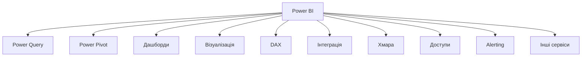
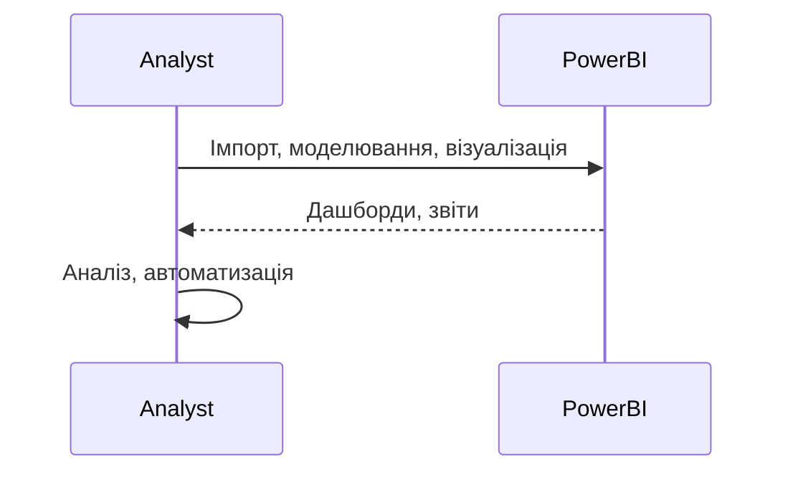

# Power BI

---

## Вступ

Power BI — це потужна платформа для бізнес-аналітики (BI) від Microsoft, яка дозволяє створювати інтерактивні дашборди, звіти, аналізувати великі обсяги даних, інтегрувати різні джерела та автоматизувати прийняття рішень. Power BI підтримує гнучку інтеграцію з SQL-базами, Excel, хмарними сховищами, API та іншими сервісами. Володіння Power BI — важлива компетенція для аналітика, який працює з BI-інструментами. У цьому розділі розглянемо історію, основні можливості, синтаксис, приклади, нюанси, типові помилки, кращі практики та реальні кейси.

---

## Історія та еволюція Power BI

### Витоки

Power BI з’явився у 2013 році як частина Microsoft Office 365. Від простих звітів до складних інтегрованих дашбордів — платформа постійно розширюється, інтегрується з Azure, SQL Server, Excel, SharePoint.

### Етапи розвитку

-   **Power Query**: імпорт, трансформація даних.
-   **Power Pivot**: моделювання, агрегація.
-   **Дашборди**: інтерактивність, візуалізація.
-   **DAX**: мова для обчислень.
-   **Інтеграція з Azure, SQL, Excel, API**.
-   **Хмарна інфраструктура**: масштабованість, безпека.

---

## Основні можливості Power BI

1. **Power Query** — імпорт, очищення, трансформація даних.
2. **Power Pivot** — моделювання, агрегація, зв’язки.
3. **Дашборди та звіти** — інтерактивні, кастомізовані.
4. **Візуалізація** — графіки, діаграми, KPI, heatmap.
5. **DAX** — мова для обчислень, створення формул.
6. **Інтеграція з SQL, Excel, Azure, API**.
7. **Хмарна інфраструктура** — масштабованість, безпека.
8. **Доступи та ролі** — контроль доступу, спільна робота.
9. **Alerting** — автоматичні сповіщення.
10. **Інтеграція з іншими сервісами** — SharePoint, Teams, OneDrive.

---

## Синтаксис та приклади коду

### 1. Power Query: імпорт та трансформація

```powerquery
let
    Source = Csv.Document(File.Contents("data.csv"),[Delimiter=",", Columns=5, Encoding=1251, QuoteStyle=QuoteStyle.None]),
    ChangedType = Table.TransformColumnTypes(Source,{{"Column1", type text}, {"Column2", type number}})
in
    ChangedType
```

### 2. DAX: створення міри

```dax
Total Sales = SUM(Sales[Amount])
Average Sales = AVERAGE(Sales[Amount])
```

### 3. Візуалізація

-   Додайте графік, діаграму, KPI через drag-and-drop у Power BI Desktop.

### 4. Інтеграція з SQL

-   Підключіть SQL Server → Виберіть таблиці → Імпортуйте дані.

### 5. Alerting

-   Налаштуйте сповіщення для KPI у Power BI Service.

---

## Пояснення під капотом

-   **Power Query**: ETL-рушій для імпорту та трансформації.
-   **Power Pivot**: моделювання даних, зв’язки, агрегації.
-   **DAX**: мова для обчислень, створення формул.
-   **Візуалізація**: інтеграція з вбудованими бібліотеками.
-   **Хмарна інфраструктура**: масштабування, безпека, доступність.

---

## Нюанси та підводні камені

-   **Складність DAX** — потребує навчання.
-   **Великі обсяги даних** — оптимізація моделей.
-   **Відмінність від Excel** — логіка, синтаксис.
-   **Проблеми з доступами** — контроль ролей.
-   **Відсутність коментарів** — важко підтримувати моделі.
-   **Несумісність версій** — різні API.
-   **Відсутність автоматизації** — ручна робота.

---

## Діаграми та візуалізації

### Mermaid: Класифікація можливостей Power BI



### Mermaid: Потік роботи з Power BI



---

## Реальні кейси використання Power BI

### Кейс 1: Аналіз продажів

-   **Power Query, дашборди**: групування, агрегація, візуалізація.
-   **Завдання**: Виявити тренди, сезонність, структуру продажів.

### Кейс 2: Сегментація клієнтів

-   **Power Pivot, DAX, фільтри**: інтеграція з SQL, кастомні звіти.
-   **Завдання**: Виявити активних клієнтів, побудувати сегменти.

### Кейс 3: Моніторинг ІТ-систем

-   **Alerting, дашборди**: автоматичні сповіщення, інтеграція з хмарою.
-   **Завдання**: Виявити аномалії, побудувати звіти.

---

## Кращі практики роботи з Power BI

1. **Документуйте моделі та звіти**
2. **Оптимізуйте Power Query/DAX для продуктивності**
3. **Використовуйте інтеграцію з SQL/Excel/Azure**
4. **Тестуйте моделі на підмножинах даних**
5. **Оновлюйте структуру відповідно до змін даних**
6. **Використовуйте коментарі для складних моделей**
7. **Автоматизуйте звіти через Power BI Service**

---

## Підсумок

-   Power BI — сучасна BI-платформа для аналітики.
-   Володіння Power Query, DAX, дашбордами, інтеграцією — ключ до ефективного аналізу.
-   Автоматизація та коментарі — підвищують продуктивність.
-   Важливо враховувати нюанси, тестувати моделі, документувати процес.
-   Вміння працювати з Power BI — базова компетенція дата-аналітика.

---
