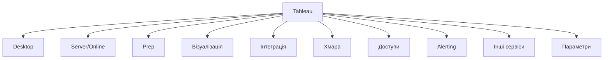
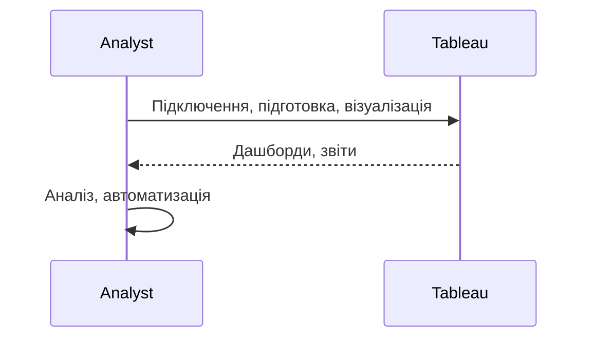

# Tableau

---

## Вступ

Tableau — це одна з найпотужніших платформ для бізнес-аналітики (BI) та візуалізації даних, яка дозволяє створювати інтерактивні дашборди, звіти, аналізувати великі обсяги даних, інтегрувати різні джерела та автоматизувати прийняття рішень. Tableau підтримує гнучку інтеграцію з SQL-базами, Excel, хмарними сховищами, API та іншими сервісами. Володіння Tableau — важлива компетенція для аналітика, який працює з BI-інструментами. У цьому розділі розглянемо історію, основні можливості, синтаксис, приклади, нюанси, типові помилки, кращі практики та реальні кейси.

---

## Історія та еволюція Tableau

### Витоки

Tableau заснований у 2003 році Крістіаном Чабо, Петом Ханраханом і Крісом Столте. У 2019 році компанія стала частиною Salesforce. Від простих звітів до складних інтегрованих дашбордів — платформа постійно розширюється.

### Етапи розвитку

-   **Tableau Desktop**: створення дашбордів, звітів.
-   **Tableau Server/Online**: спільна робота, публікація.
-   **Tableau Prep**: підготовка, очищення даних.
-   **Інтеграція з SQL, Excel, Google Sheets, API**.
-   **Візуалізація**: drag-and-drop, інтерактивність.
-   **Хмарна інфраструктура**: масштабованість, безпека.

---

## Основні можливості Tableau

1. **Tableau Desktop** — створення дашбордів, звітів.
2. **Tableau Server/Online** — спільна робота, публікація.
3. **Tableau Prep** — підготовка, очищення, трансформація даних.
4. **Візуалізація** — графіки, діаграми, heatmap, KPI.
5. **Інтеграція з SQL, Excel, Google Sheets, API**.
6. **Хмарна інфраструктура** — масштабованість, безпека.
7. **Доступи та ролі** — контроль доступу, спільна робота.
8. **Alerting** — автоматичні сповіщення.
9. **Інтеграція з іншими сервісами** — Salesforce, Google Cloud.
10. **Використання параметрів та фільтрів** — гнучкий аналіз.

---

## Синтаксис та приклади роботи

### 1. Підключення до джерела даних

-   Виберіть "Connect" → SQL Server, Excel, Google Sheets, Web Data Connector.

### 2. Створення дашборду

-   Drag-and-drop поля на аркуш.
-   Додавайте графіки, діаграми, KPI.
-   Налаштуйте фільтри, параметри.

### 3. Використання формул (Calculated Field)

```tableau
IF [Sales] > 1000 THEN "High" ELSE "Low" END
```

### 4. Підготовка даних у Tableau Prep

-   Очищення, трансформація, об’єднання даних.

### 5. Публікація на Tableau Server/Online

-   File → Publish to Server/Online.

---

## Пояснення під капотом

-   **Data Engine**: оптимізований рушій для обробки даних.
-   **VizQL**: мова для побудови візуалізацій.
-   **Інтеграція**: підтримка SQL, Excel, API, Salesforce.
-   **Візуалізація**: drag-and-drop, інтерактивність.
-   **Хмарна інфраструктура**: масштабування, безпека, доступність.

---

## Нюанси та підводні камені

-   **Складність формул** — потребує навчання.
-   **Великі обсяги даних** — оптимізація моделей.
-   **Відмінність від Excel/Power BI** — логіка, синтаксис.
-   **Проблеми з доступами** — контроль ролей.
-   **Відсутність коментарів** — важко підтримувати моделі.
-   **Несумісність версій** — різні API.
-   **Відсутність автоматизації** — ручна робота.

---

## Діаграми та візуалізації

### Mermaid: Класифікація можливостей Tableau



### Mermaid: Потік роботи з Tableau



---

## Реальні кейси використання Tableau

### Кейс 1: Аналіз продажів

-   **Дашборди, формули**: групування, агрегація, візуалізація.
-   **Завдання**: Виявити тренди, сезонність, структуру продажів.

### Кейс 2: Сегментація клієнтів

-   **Prep, фільтри, параметри**: інтеграція з SQL, кастомні звіти.
-   **Завдання**: Виявити активних клієнтів, побудувати сегменти.

### Кейс 3: Моніторинг ІТ-систем

-   **Alerting, дашборди**: автоматичні сповіщення, інтеграція з хмарою.
-   **Завдання**: Виявити аномалії, побудувати звіти.

---

## Кращі практики роботи з Tableau

1. **Документуйте моделі та звіти**
2. **Оптимізуйте Prep/формули для продуктивності**
3. **Використовуйте інтеграцію з SQL/Excel/Google Sheets**
4. **Тестуйте моделі на підмножинах даних**
5. **Оновлюйте структуру відповідно до змін даних**
6. **Використовуйте коментарі для складних моделей**
7. **Автоматизуйте звіти через Tableau Server/Online**

---

## Підсумок

-   Tableau — сучасна BI-платформа для аналітики та візуалізації.
-   Володіння Desktop, Prep, дашбордами, інтеграцією — ключ до ефективного аналізу.
-   Автоматизація та коментарі — підвищують продуктивність.
-   Важливо враховувати нюанси, тестувати моделі, документувати процес.
-   Вміння працювати з Tableau — базова компетенція дата-аналітика.

---
