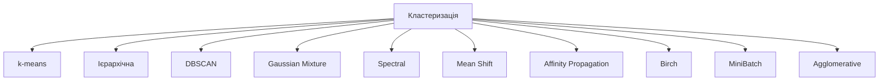
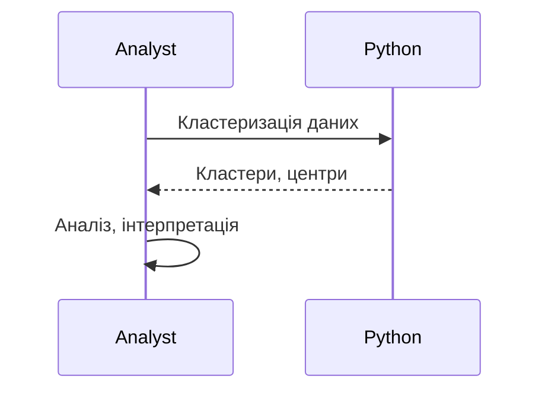

# Кластеризація

---

## Вступ

Кластеризація — це метод машинного навчання, який дозволяє групувати об’єкти у кластери на основі схожості ознак. Вона використовується для сегментації клієнтів, виявлення патернів, аналізу поведінки, оптимізації процесів та в багатьох інших задачах аналітики. Кластеризація є основою unsupervised learning і широко застосовується у бізнесі, науці, ІТ. У цьому розділі розглянемо історію, основні алгоритми, синтаксис, приклади, нюанси, типові помилки, кращі практики та реальні кейси.

---

## Історія та еволюція кластеризації

### Витоки

Перші методи кластеризації з’явилися у статистиці у XX столітті: ієрархічна кластеризація, k-means, DBSCAN. З розвитком машинного навчання з’явилися нові алгоритми, оптимізації, інтеграція з Python, R, BI-інструментами.

### Етапи розвитку

-   **Ієрархічна кластеризація**: агломеративна, дивізивна.
-   **k-means**: розподіл на k кластерів.
-   **DBSCAN**: виділення щільних областей.
-   **Gaussian Mixture**: ймовірнісна кластеризація.
-   **Spectral Clustering**: графові методи.
-   **Інтеграція з sklearn, pandas, BI**.

---

## Основні алгоритми кластеризації

1. **k-means** — розподіл на k кластерів.
2. **Ієрархічна кластеризація** — агломеративна, дивізивна.
3. **DBSCAN** — виділення щільних областей.
4. **Gaussian Mixture** — ймовірнісна кластеризація.
5. **Spectral Clustering** — графові методи.
6. **Mean Shift** — пошук центрів щільності.
7. **Affinity Propagation** — автоматичне визначення кількості кластерів.
8. **Birch** — масштабована кластеризація.
9. **MiniBatch k-means** — оптимізація для великих даних.
10. **Agglomerative Clustering** — ієрархічний підхід.

---

## Синтаксис та приклади коду

### 1. k-means (sklearn)

```python
from sklearn.cluster import KMeans
import numpy as np
X = np.array([[1, 2], [1, 4], [1, 0], [10, 2], [10, 4], [10, 0]])
kmeans = KMeans(n_clusters=2, random_state=0).fit(X)
print(kmeans.labels_)
print(kmeans.cluster_centers_)
```

### 2. DBSCAN

```python
from sklearn.cluster import DBSCAN
X = np.array([[1, 2], [2, 2], [2, 3], [8, 7], [8, 8], [25, 80]])
db = DBSCAN(eps=3, min_samples=2).fit(X)
print(db.labels_)
```

### 3. Ієрархічна кластеризація

```python
from sklearn.cluster import AgglomerativeClustering
X = np.array([[1, 2], [1, 4], [1, 0], [10, 2], [10, 4], [10, 0]])
clustering = AgglomerativeClustering(n_clusters=2).fit(X)
print(clustering.labels_)
```

### 4. Gaussian Mixture

```python
from sklearn.mixture import GaussianMixture
X = np.array([[1, 2], [1, 4], [1, 0], [10, 2], [10, 4], [10, 0]])
gmm = GaussianMixture(n_components=2).fit(X)
print(gmm.predict(X))
```

---

## Пояснення під капотом

-   **k-means**: ітеративний пошук центрів кластерів, мінімізація відстані.
-   **DBSCAN**: виділення щільних областей, нечутливість до форми кластерів.
-   **Ієрархічна кластеризація**: побудова дерева (дендрограми).
-   **Gaussian Mixture**: ймовірнісний підхід, soft clustering.
-   **Spectral Clustering**: використання власних значень матриці суміжності.
-   **Інтеграція з pandas, sklearn**: зручна робота з табличними даними.

---

## Нюанси та підводні камені

-   **Вибір кількості кластерів** — elbow method, silhouette score.
-   **Масштабування ознак** — впливає на результат.
-   **Аномалії та шум** — DBSCAN краще працює з шумом.
-   **Великі обсяги даних** — MiniBatch k-means, Birch.
-   **Відмінність від supervised learning** — немає "правильних" відповідей.
-   **Проблеми з інтерпретацією** — складність пояснення кластерів.
-   **Відсутність коментарів** — важко підтримувати код.

---

## Діаграми та візуалізації

### Mermaid: Класифікація алгоритмів кластеризації



### Mermaid: Потік роботи кластеризації



---

## Реальні кейси використання кластеризації

### Кейс 1: Сегментація клієнтів

-   **k-means, DBSCAN**: групування за поведінкою, ознаками.
-   **Завдання**: Виявити сегменти для маркетингу.

### Кейс 2: Аналіз аномалій

-   **DBSCAN, Gaussian Mixture**: виділення шуму, аномалій.
-   **Завдання**: Виявити підозрілі транзакції.

### Кейс 3: Оптимізація процесів

-   **Ієрархічна кластеризація, Spectral**: групування задач, оптимізація ресурсів.
-   **Завдання**: Побудова ефективних груп, класифікація.

---

## Кращі практики роботи з кластеризацією

1. **Вибирайте алгоритм відповідно до задачі**
2. **Масштабуйте ознаки перед кластеризацією**
3. **Використовуйте метрики якості (silhouette, inertia)**
4. **Документуйте код та параметри**
5. **Тестуйте алгоритми на підмножинах даних**
6. **Оновлюйте бібліотеки до актуальної версії**
7. **Використовуйте коментарі для складних моделей**

---

## Підсумок

-   Кластеризація — основа unsupervised learning.
-   Володіння різними алгоритмами — ключ до ефективного аналізу.
-   Масштабування ознак, вибір кількості кластерів — критично важливі.
-   Важливо враховувати нюанси, тестувати моделі, документувати процес.
-   Вміння працювати з кластеризацією — базова компетенція дата-аналітика.

---
