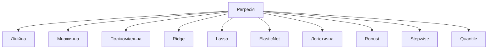
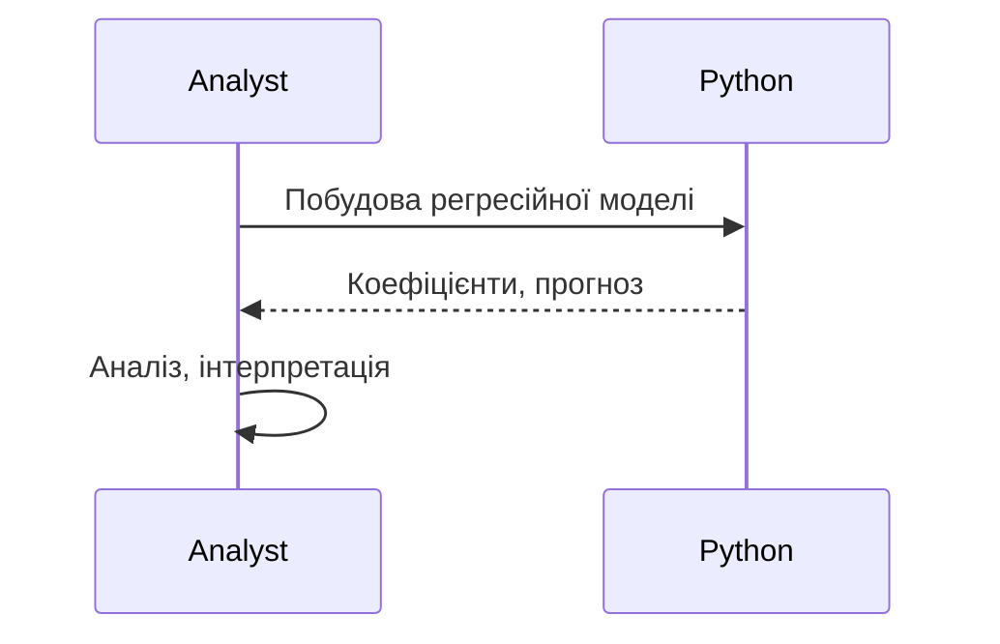

# Регресія

---

## Вступ

Регресія — це фундаментальний метод машинного навчання та статистики, який дозволяє моделювати залежність між змінними. Вона використовується для прогнозування числових значень, аналізу трендів, оцінки впливу факторів, оптимізації бізнес-процесів. У цьому розділі розглянемо історію, основні типи регресії, синтаксис, приклади, діаграми, реальні кейси, кращі практики, нюанси та типові помилки.

---

## Історія та еволюція регресії

### Витоки

Перші регресійні моделі з’явилися у статистиці у XIX столітті (Френсіс Гальтон, Карл Пірсон). Лінійна регресія стала основою для багатьох сучасних методів аналізу даних. З розвитком ML з’явилися нелінійні, багатофакторні, регуляризовані моделі.

### Етапи розвитку

-   **Лінійна регресія**: класика статистики.
-   **Множинна регресія**: багатофакторний аналіз.
-   **Поліноміальна регресія**: моделювання нелінійних залежностей.
-   **Ridge, Lasso, ElasticNet**: регуляризація.
-   **Логістична регресія**: класифікація.
-   **Robust Regression**: стійкість до аномалій.
-   **Інтеграція з sklearn, pandas, BI**.

---

## Основні типи регресії

1. **Лінійна регресія** — моделювання прямої залежності.
2. **Множинна регресія** — декілька незалежних змінних.
3. **Поліноміальна регресія** — нелінійні залежності.
4. **Ridge Regression** — регуляризація L2.
5. **Lasso Regression** — регуляризація L1.
6. **ElasticNet** — комбінація L1 і L2.
7. **Логістична регресія** — для класифікації.
8. **Robust Regression** — стійкість до викидів.
9. **Stepwise Regression** — автоматичний вибір змінних.
10. **Quantile Regression** — моделювання квантилів.

---

## Синтаксис та приклади коду

### 1. Лінійна регресія (sklearn)

```python
from sklearn.linear_model import LinearRegression
import numpy as np
X = np.array([[1], [2], [3], [4], [5]])
y = np.array([2, 4, 5, 4, 5])
model = LinearRegression().fit(X, y)
print(model.coef_, model.intercept_)
print(model.predict([[6]]))
```

### 2. Множинна регресія

```python
X = np.array([[1, 2], [2, 3], [3, 4], [4, 5]])
y = np.array([3, 5, 7, 9])
model = LinearRegression().fit(X, y)
print(model.coef_)
```

### 3. Поліноміальна регресія

```python
from sklearn.preprocessing import PolynomialFeatures
poly = PolynomialFeatures(degree=2)
X_poly = poly.fit_transform(X)
model = LinearRegression().fit(X_poly, y)
print(model.coef_)
```

### 4. Ridge, Lasso, ElasticNet

```python
from sklearn.linear_model import Ridge, Lasso, ElasticNet
ridge = Ridge(alpha=1.0).fit(X, y)
lasso = Lasso(alpha=0.1).fit(X, y)
elastic = ElasticNet(alpha=0.1, l1_ratio=0.5).fit(X, y)
```

### 5. Логістична регресія

```python
from sklearn.linear_model import LogisticRegression
X = np.array([[1], [2], [3], [4], [5]])
y = np.array([0, 0, 1, 1, 1])
model = LogisticRegression().fit(X, y)
print(model.predict([[2.5]]))
```

---

## Пояснення під капотом

-   **Лінійна регресія**: знаходження коефіцієнтів, що мінімізують суму квадратів відхилень.
-   **Множинна регресія**: врахування декількох факторів.
-   **Поліноміальна регресія**: апроксимація складних залежностей.
-   **Ridge, Lasso**: боротьба з переобученням.
-   **Логістична регресія**: оцінка ймовірності класу.
-   **Robust Regression**: стійкість до аномалій.
-   **Інтеграція з pandas, sklearn**: зручна робота з табличними даними.

---

## Нюанси та підводні камені

-   **Лінійність зв’язку** — не завжди залежність лінійна.
-   **Мультиколінеарність** — корельовані змінні спотворюють модель.
-   **Аномалії та викиди** — впливають на якість.
-   **Переобучення** — регуляризація допомагає.
-   **Вибір ознак** — важливо для точності.
-   **Масштабування ознак** — впливає на результат.
-   **Інтерпретація коефіцієнтів** — складність для складних моделей.

---

## Діаграми та візуалізації

### Mermaid: Класифікація регресійних моделей



### Mermaid: Потік роботи регресії



---

## Реальні кейси використання регресії

### Кейс 1: Прогнозування продажів

-   **Лінійна, множинна регресія**: моделювання залежності від ціни, сезону, реклами.
-   **Завдання**: Прогнозувати обсяг продажів.

### Кейс 2: Оцінка впливу факторів

-   **Множинна, поліноміальна регресія**: аналіз впливу різних змінних.
-   **Завдання**: Визначити ключові драйвери.

### Кейс 3: Класифікація клієнтів

-   **Логістична регресія**: оцінка ймовірності покупки.
-   **Завдання**: Сегментація для маркетингу.

---

## Кращі практики роботи з регресією

1. **Перевіряйте лінійність зв’язку**
2. **Масштабуйте ознаки перед моделюванням**
3. **Використовуйте регуляризацію для складних моделей**
4. **Документуйте код та параметри**
5. **Тестуйте моделі на підмножинах даних**
6. **Оновлюйте бібліотеки до актуальної версії**
7. **Використовуйте коментарі для складних моделей**

---

## Підсумок

-   Регресія — основа прогнозування та аналізу залежностей.
-   Володіння різними типами регресії — ключ до ефективної аналітики.
-   Масштабування ознак, вибір ознак, регуляризація — критично важливі.
-   Важливо враховувати нюанси, тестувати моделі, документувати процес.
-   Вміння працювати з регресією — базова компетенція дата-аналітика.

---
