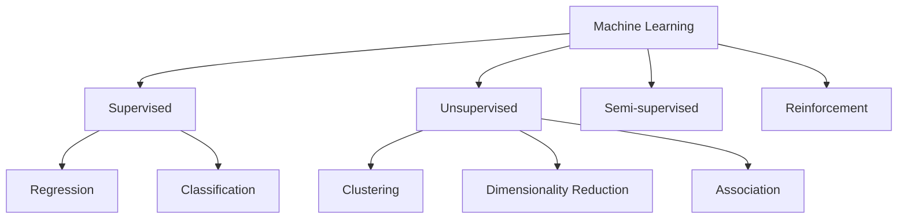
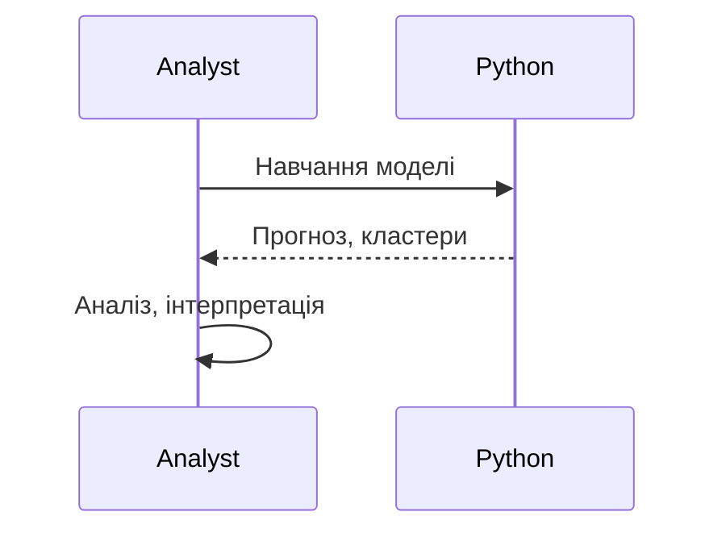

# Supervised/Unsupervised ML

---

## Вступ

Supervised та Unsupervised Machine Learning — це два фундаментальні підходи до аналізу даних та побудови моделей. Supervised ML навчається на розмічених даних, де є "правильна" відповідь, а Unsupervised ML працює з нерозміченими даними, шукаючи структуру, патерни, кластери. У цьому розділі розглянемо історію, основні алгоритми, синтаксис, приклади, діаграми, реальні кейси, кращі практики, нюанси та типові помилки.

---

## Історія та еволюція підходів ML

### Витоки

Supervised ML виник з класичної статистики (регресія, класифікація), а Unsupervised — з аналізу даних, кластеризації, пошуку патернів. З розвитком ML з’явилися нові алгоритми, гібридні підходи, інтеграція з Python, R, BI.

### Етапи розвитку

-   **Supervised ML**: регресія, класифікація, дерева рішень, ансамблі, нейронні мережі.
-   **Unsupervised ML**: кластеризація, зниження розмірності, асоціативний аналіз.
-   **Semi-supervised, Reinforcement Learning**: гібридні та спеціалізовані підходи.
-   **Інтеграція з sklearn, pandas, BI**.

---

## Основні алгоритми

### Supervised ML

1. **Лінійна регресія**
2. **Логістична регресія**
3. **Decision Trees**
4. **Random Forest**
5. **Gradient Boosting**
6. **Support Vector Machines (SVM)**
7. **K-Nearest Neighbors (KNN)**
8. **Neural Networks**
9. **Naive Bayes**
10. **Ensemble Methods**

### Unsupervised ML

1. **Кластеризація (k-means, DBSCAN, Hierarchical)**
2. **Principal Component Analysis (PCA)**
3. **t-SNE, UMAP**
4. **Association Rule Learning (Apriori, FP-Growth)**
5. **Autoencoders**
6. **Spectral Clustering**
7. **Mean Shift**
8. **Affinity Propagation**
9. **Dimensionality Reduction**
10. **Anomaly Detection**

---

## Синтаксис та приклади коду

### 1. Supervised ML: Класифікація (Random Forest)

```python
from sklearn.ensemble import RandomForestClassifier
X = [[0, 0], [1, 1]]
y = [0, 1]
clf = RandomForestClassifier().fit(X, y)
print(clf.predict([[0.5, 0.5]]))
```

### 2. Unsupervised ML: Кластеризація (k-means)

```python
from sklearn.cluster import KMeans
import numpy as np
X = np.array([[1, 2], [1, 4], [1, 0], [10, 2], [10, 4], [10, 0]])
kmeans = KMeans(n_clusters=2, random_state=0).fit(X)
print(kmeans.labels_)
```

### 3. Зниження розмірності (PCA)

```python
from sklearn.decomposition import PCA
X = np.array([[1, 2], [3, 4], [5, 6]])
pca = PCA(n_components=1)
X_new = pca.fit_transform(X)
print(X_new)
```

---

## Пояснення під капотом

-   **Supervised ML**: навчання на розмічених даних, оптимізація функції втрат, оцінка якості (accuracy, RMSE).
-   **Unsupervised ML**: пошук структури, кластерів, зниження розмірності, виявлення аномалій.
-   **Semi-supervised, Reinforcement Learning**: використання частково розмічених даних, навчання через винагороду.
-   **Інтеграція з pandas, sklearn**: зручна робота з табличними даними.

---

## Нюанси та підводні камені

-   **Якість розмітки** — критично для supervised ML.
-   **Вибір кількості кластерів** — важливо для unsupervised ML.
-   **Масштабування ознак** — впливає на результат.
-   **Аномалії та шум** — unsupervised ML краще працює з шумом.
-   **Переобучення** — регуляризація допомагає.
-   **Вибір ознак** — важливо для точності.
-   **Інтерпретація результатів** — складність для unsupervised ML.

---

## Діаграми та візуалізації

### Mermaid: Класифікація ML-підходів



### Mermaid: Потік роботи ML



---

## Реальні кейси використання ML

### Кейс 1: Прогнозування відтоку клієнтів (Supervised)

-   **Random Forest, Logistic Regression**: навчання на історичних даних.
-   **Завдання**: Виявити клієнтів, які можуть піти.

### Кейс 2: Сегментація ринку (Unsupervised)

-   **k-means, PCA**: пошук сегментів без розмітки.
-   **Завдання**: Виявити нові групи для маркетингу.

### Кейс 3: Виявлення аномалій (Unsupervised)

-   **DBSCAN, Isolation Forest**: пошук нетипових транзакцій.
-   **Завдання**: Виявити шахрайство.

---

## Кращі практики роботи з ML

1. **Вибирайте підхід відповідно до задачі**
2. **Масштабуйте ознаки перед моделюванням**
3. **Використовуйте метрики якості (accuracy, silhouette, RMSE)**
4. **Документуйте код та параметри**
5. **Тестуйте моделі на підмножинах даних**
6. **Оновлюйте бібліотеки до актуальної версії**
7. **Використовуйте коментарі для складних моделей**

---

## Підсумок

-   Supervised ML — навчання на розмічених даних, прогнозування.
-   Unsupervised ML — пошук структури, кластерів, аномалій.
-   Володіння обома підходами — ключ до ефективної аналітики.
-   Важливо враховувати нюанси, тестувати моделі, документувати процес.
-   Вміння працювати з ML — базова компетенція дата-аналітика.

---
