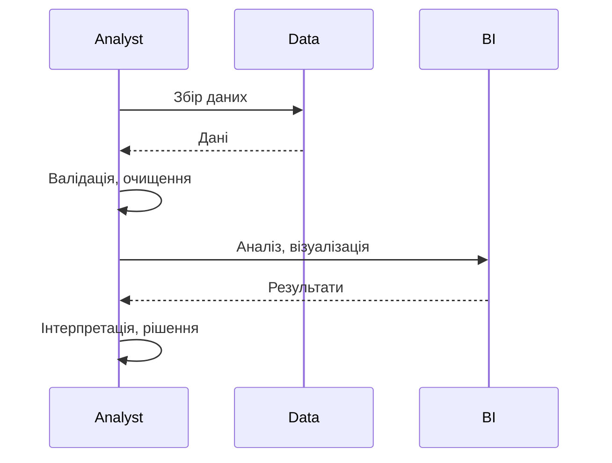
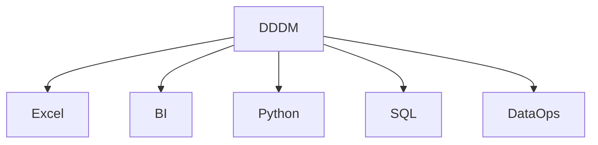

# Data-driven decision making

---

## Вступ

Data-driven decision making (DDDM) — це підхід до прийняття рішень, заснований на аналізі даних, а не інтуїції чи досвіді. DDDM дозволяє організаціям підвищувати ефективність, знижувати ризики, оптимізувати процеси та досягати бізнес-цілей. У цьому розділі розглянемо історію, принципи, інструменти, синтаксис, приклади, діаграми, реальні кейси, кращі практики, нюанси та типові помилки.

---

## Історія та еволюція DDDM

### Витоки

Перші підходи до DDDM з’явилися у фінансах, виробництві, маркетингу. З розвитком ІТ, BI, ML, аналітики даних DDDM став стандартом для сучасних організацій.

### Етапи розвитку

-   **Excel-аналітика**: перші спроби аналізу даних.
-   **BI-інструменти**: автоматизація звітності.
-   **Big Data**: робота з великими обсягами даних.
-   **ML/AI**: прогнозування, оптимізація.
-   **DataOps**: інтеграція даних у процеси.

---

## Основні принципи DDDM

1. **Збір якісних даних**
2. **Валідація та очищення даних**
3. **Аналіз та візуалізація**
4. **Інтерпретація результатів**
5. **Прийняття рішень на основі фактів**
6. **Моніторинг та корекція**
7. **Документування процесу**

---

## Інструменти для DDDM

-   **Excel, Google Sheets** — базова аналітика.
-   **Power BI, Tableau, Looker** — BI-платформи.
-   **Python, R** — глибокий аналіз, ML.
-   **SQL** — робота з базами даних.
-   **DataOps, ETL** — інтеграція та автоматизація.

---

## Синтаксис та приклади коду

### 1. SQL: Вибірка для прийняття рішення

```sql
SELECT region, SUM(sales) AS total_sales
FROM sales_data
GROUP BY region
ORDER BY total_sales DESC;
```

### 2. Python: Аналіз тренду продажів

```python
import pandas as pd
sales = pd.read_csv('sales.csv')
trend = sales.groupby('month')['amount'].sum()
print(trend)
```

### 3. Power BI: Візуалізація KPI

-   Створіть дашборд з метриками: sales, profit, churn rate.

### 4. Tableau: Сегментація клієнтів

-   Використайте кластеризацію для виявлення груп клієнтів.

---

## Пояснення під капотом

-   **Збір даних**: автоматизовані ETL-процеси, API, ручний ввід.
-   **Валідація**: перевірка на пропуски, аномалії, дублікати.
-   **Аналіз**: статистика, ML, BI.
-   **Візуалізація**: графіки, heatmaps, дашборди.
-   **Інтерпретація**: пояснення результатів, пошук причин.
-   **Прийняття рішень**: вибір стратегії, оптимізація.
-   **Моніторинг**: регулярний перегляд метрик, корекція.

---

## Нюанси та підводні камені

-   **Якість даних** — критично для DDDM.
-   **Суб’єктивність інтерпретації** — ризик упередженості.
-   **Вибір метрик** — впливає на рішення.
-   **Аномалії та шум** — можуть спотворити аналіз.
-   **Відсутність автоматизації** — ручна робота знижує ефективність.
-   **Проблеми з візуалізацією** — складність для нефахівців.
-   **Відсутність документації** — важко повторити процес.

---

## Діаграми та візуалізації

### Mermaid: Потік DDDM



### Mermaid: Класифікація інструментів DDDM



---

## Реальні кейси використання DDDM

### Кейс 1: Оптимізація маркетингової кампанії

-   **BI, Python, SQL**: аналіз ефективності каналів.
-   **Завдання**: Збільшити ROI.

### Кейс 2: Управління запасами

-   **Excel, Power BI**: прогнозування потреб.
-   **Завдання**: Знизити витрати на склад.

### Кейс 3: Виявлення аномалій у фінансах

-   **Python, ML**: пошук підозрілих транзакцій.
-   **Завдання**: Знизити ризики шахрайства.

---

## Кращі практики DDDM

1. **Збирайте якісні дані**
2. **Валідуйте та очищайте дані**
3. **Використовуйте автоматизацію (ETL, DataOps)**
4. **Візуалізуйте результати для бізнесу**
5. **Документуйте процес прийняття рішень**
6. **Тестуйте гіпотези на підмножинах даних**
7. **Оновлюйте інструменти та бібліотеки**

---

## Підсумок

-   DDDM — основа сучасного управління та аналітики.
-   Якість даних, автоматизація, візуалізація — ключові фактори успіху.
-   Важливо враховувати нюанси, тестувати гіпотези, документувати процес.
-   Вміння працювати з DDDM — базова компетенція дата-аналітика.

---
