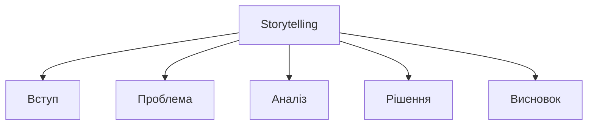
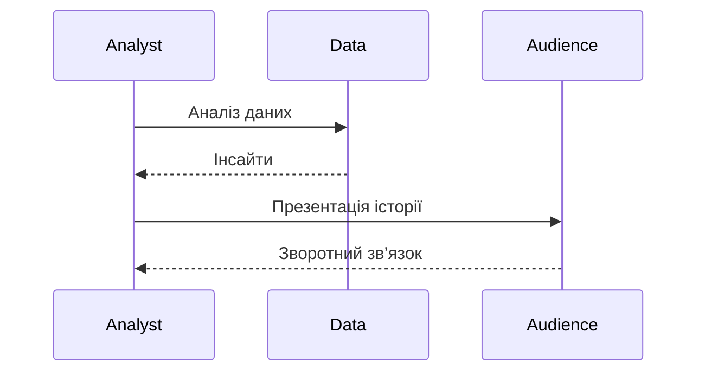

# Storytelling

---

## Вступ

Storytelling у Data Analytics — це мистецтво перетворення даних на зрозумілу, захоплюючу історію, яка допомагає приймати рішення, впливати на аудиторію, пояснювати складні ідеї. Ефективний сторітелінг поєднує аналітику, візуалізацію, структуру, емоції та бізнес-цілі. У цьому розділі розглянемо історію, принципи, інструменти, синтаксис, приклади, діаграми, реальні кейси, кращі практики, нюанси та типові помилки.

---

## Історія та еволюція Data Storytelling

### Витоки

Перші приклади сторітелінгу — це звіти, презентації, інфографіка. З розвитком BI, ML, DataViz сторітелінг став ключовим навиком аналітика.

### Етапи розвитку

-   **Текстові звіти**: класичний сторітелінг.
-   **Інфографіка**: візуалізація даних.
-   **Інтерактивні дашборди**: BI-інструменти.
-   **Data Journalism**: публікації на основі даних.
-   **ML/AI**: автоматичне створення історій.

---

## Основні принципи Data Storytelling

1. **Зрозуміла структура**
2. **Візуалізація ключових ідей**
3. **Емоційний зв’язок з аудиторією**
4. **Фокус на бізнес-цілях**
5. **Ясність та простота**
6. **Адаптація під аудиторію**
7. **Використання реальних кейсів**

---

## Інструменти для Data Storytelling

-   **PowerPoint, Google Slides** — презентації.
-   **Tableau, Power BI, Looker** — інтерактивні дашборди.
-   **Python (matplotlib, seaborn, plotly)** — візуалізація.
-   **Canva, Infogram** — інфографіка.
-   **Datawrapper** — швидкі графіки.

---

## Синтаксис та приклади

### 1. Python: Візуалізація тренду

```python
import matplotlib.pyplot as plt
months = ['Jan', 'Feb', 'Mar', 'Apr']
sales = [100, 120, 90, 150]
plt.plot(months, sales)
plt.title('Sales Trend')
plt.xlabel('Month')
plt.ylabel('Sales')
plt.show()
```

### 2. Tableau: Story Points

-   Створіть послідовність дашбордів для розкриття історії.

### 3. PowerPoint: Слайд з ключовим меседжем

-   Використайте короткий заголовок, графік, висновок.

---

## Пояснення під капотом

-   **Структура**: вступ, проблема, аналіз, рішення, висновок.
-   **Візуалізація**: графіки, heatmaps, інфографіка.
-   **Емоції**: використання кольорів, метафор, прикладів.
-   **Адаптація**: різні формати для різних аудиторій.
-   **Інтерактивність**: дашборди, story points.

---

## Нюанси та підводні камені

-   **Складність даних** — ризик перевантаження аудиторії.
-   **Відсутність структури** — історія стає незрозумілою.
-   **Неправильна візуалізація** — спотворення меседжу.
-   **Відсутність емоцій** — низький вплив.
-   **Неадаптованість під аудиторію** — втрата уваги.
-   **Занадто багато деталей** — розсіювання фокусу.
-   **Відсутність висновків** — немає дії.

---

## Діаграми та візуалізації

### Mermaid: Структура Data Storytelling



### Mermaid: Потік створення історії



---

## Реальні кейси Data Storytelling

### Кейс 1: Презентація результатів аналітики

-   **PowerPoint, Tableau**: пояснення трендів, висновків.
-   **Завдання**: Вплинути на рішення керівництва.

### Кейс 2: Data Journalism

-   **Infogram, Datawrapper**: публікація історії на основі даних.
-   **Завдання**: Пояснити складну проблему широкій аудиторії.

### Кейс 3: Внутрішній тренінг

-   **Google Slides, Python**: навчання співробітників.
-   **Завдання**: Підвищити data literacy.

---

## Кращі практики Data Storytelling

1. **Створюйте чітку структуру історії**
2. **Використовуйте візуалізацію для ключових ідей**
3. **Адаптуйте меседж під аудиторію**
4. **Використовуйте реальні кейси та приклади**
5. **Документуйте процес створення історії**
6. **Тестуйте презентацію на колегах**
7. **Оновлюйте інструменти та бібліотеки**

---

## Підсумок

-   Storytelling — ключ до ефективної презентації даних.
-   Структура, візуалізація, емоції — основа впливу.
-   Важливо враховувати нюанси, адаптувати історію, документувати процес.
-   Вміння працювати зі сторітелінгом — базова компетенція дата-аналітика.

---
