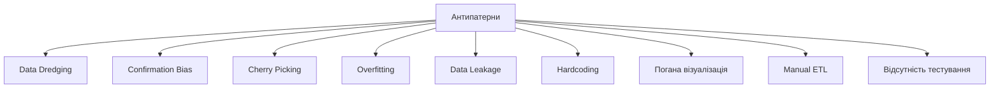
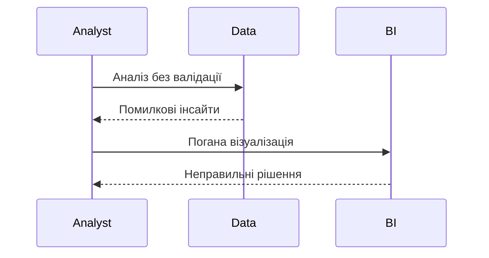

# Антипатерни

---

## Вступ

Антипатерни в Data Analytics — це типові помилки, неефективні підходи, які призводять до неправильних висновків, втрати часу, ресурсів, довіри до аналітики. Знання антипатернів допомагає уникати критичних помилок, підвищувати якість роботи та приймати обґрунтовані рішення. У цьому розділі розглянемо історію, основні антипатерни, приклади, діаграми, реальні кейси, кращі практики, нюанси та підсумок.

---

## Історія та еволюція антипатернів

### Витоки

Перші антипатерни описані у програмуванні, менеджменті, BI. З розвитком Data Analytics з’явилися специфічні антипатерни для роботи з даними, візуалізацією, ML, BI.

### Етапи розвитку

-   **Класичні антипатерни**: copy-paste, magic numbers, hardcoding.
-   **BI-антипатерни**: неякісна візуалізація, відсутність документації.
-   **ML-антипатерни**: переобучення, data leakage.
-   **DataOps-антипатерни**: ручна інтеграція, відсутність тестів.

---

## Основні антипатерни в Data Analytics

1. **Data Dredging (p-hacking)** — пошук "сенсацій" у випадкових даних.
2. **Confirmation Bias** — підтвердження власних гіпотез.
3. **Cherry Picking** — вибірковий аналіз даних.
4. **Overfitting** — надмірна складність моделі.
5. **Data Leakage** — потрапляння інформації з майбутнього.
6. **Hardcoding** — жорстко задані параметри.
7. **Відсутність документації** — неможливість повторити аналіз.
8. **Погана візуалізація** — спотворення меседжу.
9. **Manual ETL** — ручна інтеграція даних.
10. **Відсутність тестування** — помилки залишаються непоміченими.
11. **Ignoring Outliers** — ігнорування аномалій.
12. **Not Scaling Features** — відсутність масштабування ознак.
13. **Misleading Aggregations** — некоректне групування.
14. **No Version Control** — втрата історії змін.
15. **Poor Communication** — незрозумілі звіти.

---

## Приклади антипатернів та коду

### 1. Overfitting (Python)

```python
from sklearn.tree import DecisionTreeRegressor
X = [[1], [2], [3], [4], [5]]
y = [2, 4, 5, 4, 5]
model = DecisionTreeRegressor(max_depth=10).fit(X, y)
# Модель надто складна для малих даних
```

### 2. Data Leakage

```python
# Використання даних з майбутнього у тренуванні
train = data[data['date'] < '2023-01-01']
test = data[data['date'] >= '2023-01-01']
# Якщо у train потрапляє інформація з test — leakage
```

### 3. Hardcoding

```python
# Параметри жорстко задані
threshold = 0.7
if value > threshold:
    print('OK')
# Замість конфігурації чи змінних середовища
```

---

## Діаграми та візуалізації

### Mermaid: Класифікація антипатернів



### Mermaid: Потік виникнення антипатернів



---

## Реальні кейси антипатернів

### Кейс 1: Data Dredging у маркетингу

-   **Пошук "сенсацій"**: аналіз тисяч гіпотез без корекції.
-   **Результат**: хибні висновки, втрати бюджету.

### Кейс 2: Overfitting у ML

-   **Складна модель на малих даних**: ідеальна на train, провал на test.
-   **Результат**: неефективна бізнес-модель.

### Кейс 3: Confirmation Bias у звітах

-   **Підтвердження власних гіпотез**: ігнорування альтернатив.
-   **Результат**: упереджені рішення.

---

## Кращі практики для уникнення антипатернів

1. **Валідуйте дані та гіпотези**
2. **Використовуйте автоматизацію та тестування**
3. **Документуйте процес та параметри**
4. **Використовуйте version control**
5. **Аналізуйте аномалії та викиди**
6. **Масштабуйте ознаки**
7. **Візуалізуйте дані коректно**
8. **Адаптуйте аналіз під бізнес-цілі**
9. **Тестуйте моделі на підмножинах даних**
10. **Оновлюйте інструменти та бібліотеки**

---

## Нюанси та підводні камені

-   **Складність виявлення антипатернів** — потрібен досвід.
-   **Відсутність культури тестування** — ризик помилок.
-   **Суб’єктивність інтерпретації** — упередженість.
-   **Відсутність документації** — неможливість повторити аналіз.
-   **Проблеми з візуалізацією** — спотворення меседжу.

---

## Підсумок

-   Антипатерни — типові помилки, які знижують якість аналітики.
-   Знання антипатернів — ключ до професійного зростання.
-   Важливо валідувати дані, тестувати моделі, документувати процес.
-   Вміння уникати антипатернів — базова компетенція дата-аналітика.

---
