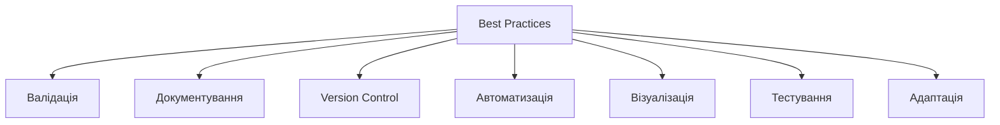
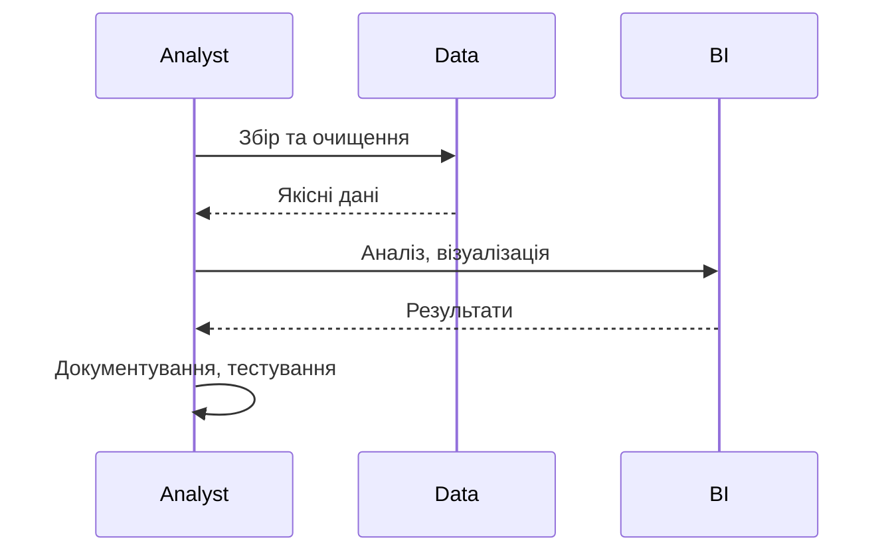

# Best practices

---

## Вступ

Best practices у Data Analytics — це перевірені підходи, які допомагають підвищити якість аналізу, ефективність роботи, достовірність результатів та вплив на бізнес. Дотримання best practices дозволяє уникати типових помилок, оптимізувати процеси, підвищувати довіру до аналітики. У цьому розділі розглянемо історію, основні принципи, інструменти, приклади, діаграми, реальні кейси, нюанси, підводні камені та підсумок.

---

## Історія та еволюція best practices

### Витоки

Перші best practices з’явилися у програмуванні, менеджменті, BI. З розвитком Data Analytics сформувалися специфічні best practices для роботи з даними, ML, BI, DataOps.

### Етапи розвитку

-   **Класичні best practices**: DRY, KISS, documentation.
-   **BI-best practices**: якісна візуалізація, автоматизація.
-   **ML-best practices**: валідація, тестування, регуляризація.
-   **DataOps-best practices**: автоматизація, version control.

---

## Основні best practices у Data Analytics

1. **Валідація та очищення даних**
2. **Документування процесу та параметрів**
3. **Використання version control**
4. **Автоматизація ETL та аналізу**
5. **Масштабування ознак**
6. **Використання тестування та валідації моделей**
7. **Якісна візуалізація**
8. **Адаптація аналізу під бізнес-цілі**
9. **Використання сучасних інструментів та бібліотек**
10. **Тестування гіпотез на підмножинах даних**
11. **Регулярне оновлення інструментів**
12. **Комунікація результатів у зрозумілій формі**
13. **Аналіз аномалій та викидів**
14. **Використання метрик якості**
15. **Підвищення data literacy у команді**

---

## Інструменти для best practices

-   **Git, DVC** — version control.
-   **Jupyter, Google Colab** — інтерактивний аналіз.
-   **Power BI, Tableau, Looker** — BI-платформи.
-   **Python, R** — глибокий аналіз, ML.
-   **SQL** — робота з базами даних.
-   **DataOps, ETL** — автоматизація.

---

## Приклади best practices та коду

### 1. Валідація даних (Python)

```python
import pandas as pd
data = pd.read_csv('data.csv')
print(data.isnull().sum()) # Перевірка пропусків
```

### 2. Version control (Git)

```bash
git init
git add .
git commit -m "Initial commit"
```

### 3. Автоматизація ETL (Python)

```python
def etl_process():
    # Збір, очищення, трансформація
    pass
```

### 4. Візуалізація (Tableau)

-   Створіть дашборд з ключовими метриками.

---

## Діаграми та візуалізації

### Mermaid: Класифікація best practices



### Mermaid: Потік впровадження best practices



---

## Реальні кейси best practices

### Кейс 1: Впровадження version control

-   **Git, DVC**: контроль змін, reproducibility.
-   **Результат**: підвищення якості, зниження ризиків.

### Кейс 2: Автоматизація ETL

-   **Python, DataOps**: регулярний збір та очищення даних.
-   **Результат**: економія часу, зниження помилок.

### Кейс 3: Якісна візуалізація

-   **Tableau, Power BI**: зрозумілі дашборди для бізнесу.
-   **Результат**: швидке прийняття рішень.

---

## Кращі практики для Data Analytics

1. **Валідуйте та очищайте дані**
2. **Документуйте процес та параметри**
3. **Використовуйте version control**
4. **Автоматизуйте ETL та аналіз**
5. **Масштабуйте ознаки**
6. **Тестуйте моделі та гіпотези**
7. **Візуалізуйте результати для бізнесу**
8. **Адаптуйте аналіз під бізнес-цілі**
9. **Оновлюйте інструменти та бібліотеки**
10. **Підвищуйте data literacy у команді**

---

## Нюанси та підводні камені

-   **Складність впровадження** — потрібна культура та мотивація.
-   **Відсутність документації** — ризик втрати знань.
-   **Проблеми з автоматизацією** — складність інтеграції.
-   **Суб’єктивність візуалізації** — ризик спотворення меседжу.
-   **Відсутність тестування** — помилки залишаються непоміченими.

---

## Підсумок

-   Best practices — основа якісної аналітики.
-   Валідація, автоматизація, version control, візуалізація — ключові фактори успіху.
-   Важливо враховувати нюанси, тестувати моделі, документувати процес.
-   Вміння впроваджувати best practices — базова компетенція дата-аналітика.

---
