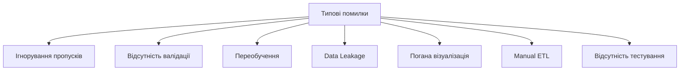
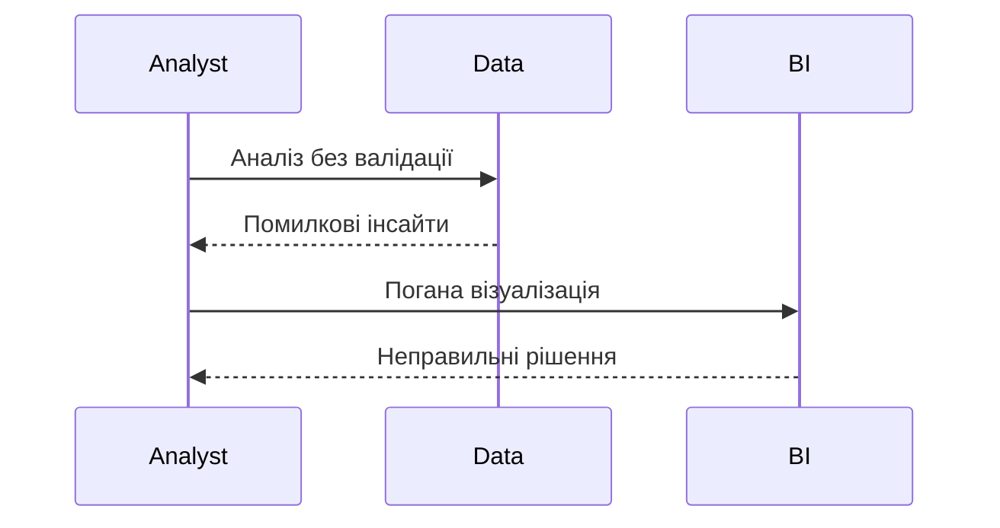

# Типові помилки

---

## Вступ

Типові помилки в Data Analytics — це поширені недоліки, які призводять до неправильних висновків, втрати часу, ресурсів, довіри до аналітики. Знання типових помилок допомагає уникати критичних ситуацій, підвищувати якість роботи та приймати обґрунтовані рішення. У цьому розділі розглянемо історію, основні помилки, приклади, діаграми, реальні кейси, кращі практики, нюанси та підсумок.

---

## Історія та еволюція типових помилок

### Витоки

Перші типові помилки описані у статистиці, програмуванні, BI. З розвитком Data Analytics з’явилися специфічні помилки для роботи з даними, ML, BI, DataOps.

### Етапи розвитку

-   **Класичні помилки**: неправильна інтерпретація, відсутність валідації.
-   **BI-помилки**: неякісна візуалізація, відсутність документації.
-   **ML-помилки**: переобучення, data leakage.
-   **DataOps-помилки**: ручна інтеграція, відсутність тестів.

---

## Основні типові помилки в Data Analytics

1. **Ігнорування пропусків та аномалій**
2. **Відсутність валідації даних**
3. **Неправильний вибір метрик**
4. **Переобучення моделі**
5. **Data Leakage**
6. **Відсутність документації**
7. **Погана візуалізація**
8. **Manual ETL**
9. **Відсутність тестування**
10. **Ігнорування мультиколінеарності**
11. **Неадаптованість під бізнес-цілі**
12. **Відсутність version control**
13. **Суб’єктивна інтерпретація**
14. **Використання застарілих інструментів**
15. **Погана комунікація результатів**

---

## Приклади типових помилок та коду

### 1. Ігнорування пропусків (Python)

```python
import pandas as pd
data = pd.read_csv('data.csv')
# Помилка: не перевіряємо пропуски
data.mean()
```

### 2. Data Leakage

```python
# Використання даних з майбутнього у тренуванні
train = data[data['date'] < '2023-01-01']
test = data[data['date'] >= '2023-01-01']
# Якщо у train потрапляє інформація з test — leakage
```

### 3. Погана візуалізація

```python
import matplotlib.pyplot as plt
plt.plot([1,2,3],[4,5,6]) # Без підписів, кольорів, пояснень
plt.show()
```

---

## Діаграми та візуалізації

### Mermaid: Класифікація типових помилок



### Mermaid: Потік виникнення помилок



---

## Реальні кейси типових помилок

### Кейс 1: Ігнорування пропусків у фінансах

-   **Аналіз без перевірки пропусків**: некоректні висновки.
-   **Результат**: втрати бюджету.

### Кейс 2: Data Leakage у ML

-   **Складна модель на малих даних**: ідеальна на train, провал на test.
-   **Результат**: неефективна бізнес-модель.

### Кейс 3: Погана візуалізація у звітах

-   **Без підписів, кольорів, пояснень**: незрозумілі графіки.
-   **Результат**: втрата довіри до аналітики.

---

## Кращі практики для уникнення типових помилок

1. **Валідуйте дані та гіпотези**
2. **Використовуйте автоматизацію та тестування**
3. **Документуйте процес та параметри**
4. **Використовуйте version control**
5. **Аналізуйте аномалії та викиди**
6. **Масштабуйте ознаки**
7. **Візуалізуйте дані коректно**
8. **Адаптуйте аналіз під бізнес-цілі**
9. **Тестуйте моделі на підмножинах даних**
10. **Оновлюйте інструменти та бібліотеки**

---

## Нюанси та підводні камені

-   **Складність виявлення помилок** — потрібен досвід.
-   **Відсутність культури тестування** — ризик помилок.
-   **Суб’єктивність інтерпретації** — упередженість.
-   **Відсутність документації** — неможливість повторити аналіз.
-   **Проблеми з візуалізацією** — спотворення меседжу.

---

## Підсумок

-   Типові помилки — поширені недоліки, які знижують якість аналітики.
-   Знання типових помилок — ключ до професійного зростання.
-   Важливо валідувати дані, тестувати моделі, документувати процес.
-   Вміння уникати типових помилок — базова компетенція дата-аналітика.

---
