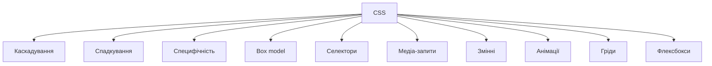
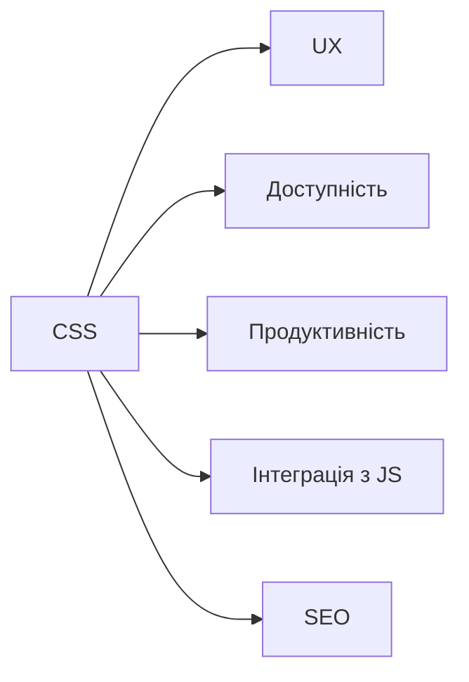

# Вступ: історія, роль CSS у веб-розробці

## Вступ

CSS (Cascading Style Sheets) — це мова стилів, яка визначає зовнішній вигляд HTML-елементів. Вона дозволяє розділити структуру (HTML) і презентацію (CSS), забезпечує адаптивність, кросбраузерність, гнучкість дизайну.

## Історія/Походження

Перші веб-сторінки були монохромними, без стилів. У 1994 році Хокон Віум Лі запропонував концепцію CSS. У 1996 році CSS1 став офіційним стандартом W3C. Згодом з’явилися CSS2, CSS3, модульна архітектура, змінні, анімації, гріди, флексбокси.

### Віхи розвитку CSS

-   **1994:** концепція CSS
-   **1996:** CSS1 — базові властивості
-   **1998:** CSS2 — медіа, позиціонування, таблиці
-   **2011+:** CSS3 — модулі, анімації, трансформації, гріди, флексбокси
-   **2020+:** змінні, контейнерні запити, нові селектори

## Роль CSS у веб-розробці

-   Відокремлення структури і стилю
-   Адаптивність і респонсивність
-   Кросбраузерність
-   Темізація, кастомізація
-   Анімації, інтерактивність
-   Оптимізація продуктивності
-   Доступність

## Основний матеріал

### Фундаментальні механізми CSS

-   Каскадування — порядок застосування стилів
-   Спадкування — передача властивостей від батьків до дітей
-   Специфічність — пріоритет селекторів
-   Box model — модель блоку (content, padding, border, margin)
-   Селектори — вибір елементів для стилізації
-   Медіа-запити — адаптивність
-   Змінні — гнучкість стилів
-   Анімації, трансформації

### Приклад коду

```css
body {
    font-family: Arial, sans-serif;
    background: #f5f5f5;
}

h1 {
    color: #0077cc;
    margin-bottom: 1em;
}

.container {
    max-width: 800px;
    margin: 0 auto;
    padding: 2em;
    background: #fff;
    border-radius: 8px;
}
```

### Неочевидний приклад: змінні CSS

```css
:root {
    --main-color: #0077cc;
}
h1 {
    color: var(--main-color);
}
```

### Неочевидний приклад: медіа-запити

```css
@media (max-width: 600px) {
    .container {
        padding: 1em;
    }
}
```

### Неочевидний приклад: гріди

```css
.grid {
    display: grid;
    grid-template-columns: 1fr 2fr;
    gap: 1em;
}
```

### Неочевидний приклад: флексбокси

```css
.flex {
    display: flex;
    justify-content: space-between;
    align-items: center;
}
```

### Неочевидний приклад: анімації

```css
.fade-in {
    animation: fadeIn 1s ease-in;
}
@keyframes fadeIn {
    from {
        opacity: 0;
    }
    to {
        opacity: 1;
    }
}
```

## Пояснення під капотом

Браузер парсить CSS, створює CSSOM (CSS Object Model), об’єднує з DOM, застосовує каскадування, спадкування, специфічність, рендерить стилі, оптимізує продуктивність, інтегрує з API (Web Animations, Custom Properties).

### Як працює CSS у рушії

CSSOM інтегрується з DOM, формує кінцевий вигляд сторінки, впливає на рендеринг, анімації, адаптивність, доступність, інтеграцію з JS.

## Нюанси та підводні камені

-   Конфлікти специфічності — неочікувані стилі
-   Надмірне використання !important — антипатерн
-   Відсутність медіа-запитів — поганий UX на мобільних
-   Відсутність змінних — складна підтримка
-   Відсутність box-sizing: border-box — некоректний розрахунок розмірів
-   Надмірне вкладення селекторів — погана продуктивність
-   Відсутність fallback для властивостей — проблеми у старих браузерах

## Діаграми





## Приклад застосування в реальних проєктах

-   Корпоративні сайти — темізація, адаптивність, кастомізація
-   Блоги — респонсивність, анімації, змінні
-   E-commerce — гріди, флексбокси, оптимізація
-   SPA — інтеграція з JS, кастомні властивості
-   Документація — структура, box model, медіа-запити

### Кейс: адаптивність

Медіа-запити, гріди, флексбокси — для мобільних пристроїв.

### Кейс: продуктивність

Мінімізація CSS, використання змінних, box-sizing.

### Кейс: доступність

Контрастність, розмір шрифту, фокус, outline.

## Крос-посилання

-   [HTML: базова структура](../HTML/02-basic-structure.md)
-   [HTML: семантичні теги](../HTML/03-semantic-tags.md)
-   [Best practices](../HTML/10-best-practices.md)
-   [CSS: Box model](./02-box-model.md)
-   [CSS: Селектори](./03-selectors.md)

## Підсумок

-   CSS — основа стилізації вебу
-   Відокремлення структури і стилю — ключ до підтримуваності
-   Каскадування, спадкування, специфічність — фундаментальні механізми
-   Адаптивність, продуктивність, доступність — сучасні вимоги
-   Неочевидні приклади — для гнучкості, інтеграції, оптимізації
