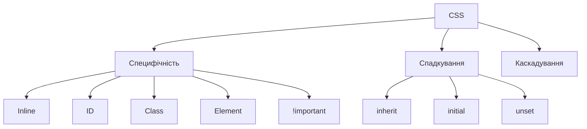
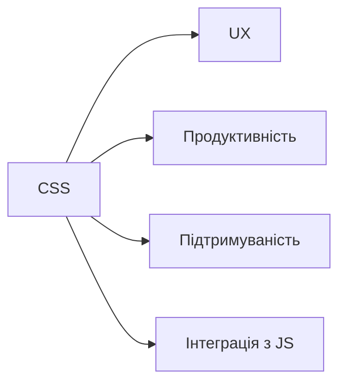

# Як працює CSS у браузері: специфічність, спадкування

## Вступ

CSS у браузері — це складний процес, який включає парсинг, побудову CSSOM, застосування каскадування, специфічності, спадкування. Від правильного розуміння цих механізмів залежить вигляд і поведінка сторінки.

## Історія/Походження

Перші браузери підтримували лише базові стилі. З розвитком CSS з’явилися складніші селектори, механізми специфічності, спадкування, каскадування, оптимізації рендерингу.

### Віхи розвитку специфічності та спадкування

-   **CSS1:** базова специфічність, спадкування
-   **CSS2:** складні селектори, псевдокласи, псевдоелементи
-   **CSS3:** атрибути, медіа-запити, змінні

## Основний матеріал

### Специфічність

-   Визначає пріоритет стилів, якщо кілька селекторів застосовуються до одного елемента
-   Розраховується за формулою: inline > id > class/attribute/pseudo-class > element/pseudo-element
-   !important — перевизначає всі, але антипатерн

#### Таблиця ваги специфічності

| Тип селектора            | Вага |
| ------------------------ | ---- |
| Inline-стиль             | 1000 |
| ID                       | 100  |
| Class/атрибут/псевдоклас | 10   |
| Елемент/псевдоелемент    | 1    |

> Наприклад, селектор `#main .title h1` має вагу 100 (ID) + 10 (class) + 1 (element) = 111.

#### Як працює специфічність

Сума балів для кожного селектора визначає, який стиль буде застосовано. Чим більша вага — тим вищий пріоритет. Якщо специфічність однакова, застосовується останній стиль у каскаді.

#### Приклад розрахунку специфічності

```css
/* 0,1,0,0 */
h1 {
    color: blue;
}
/* 0,0,1,0 */
.title {
    color: green;
}
/* 1,0,0,0 */
#main {
    color: red;
}
/* 0,1,1,0 */
h1.title {
    color: orange;
}
/* 1,1,1,1 */
div#main.title strong {
    color: purple;
}
```

### Спадкування

-   Властивості можуть передаватися від батьків до дітей
-   Не всі властивості спадкові (наприклад, color, font-family — спадкові; margin, padding — ні)
-   Можна явно задавати inheritance через `inherit`, `initial`, `unset`

#### Приклад спадкування

```css
body {
    color: #333;
}
h1 {
    /* color успадковується з body */
}
div {
    font-family: Arial;
}
p {
    /* font-family успадковується з div */
}
```

### Каскадування

-   Порядок застосування стилів: браузерні стилі → зовнішні стилі → inline-стилі → !important
-   Останній стиль у каскаді має пріоритет

### Неочевидний приклад: специфічність inline-стилів

```html
<h1 style="color: red;">Inline стиль</h1>
```

### Неочевидний приклад: специфічність !important

```css
h1 {
    color: blue !important;
}
```

### Неочевидний приклад: inheritance через inherit

```css
span {
    color: inherit;
}
```

### Неочевидний приклад: unset

```css
p {
    color: unset;
}
```

### Неочевидний приклад: initial

```css
div {
    font-size: initial;
}
```

## Пояснення під капотом

Браузер парсить CSS, створює CSSOM, розраховує специфічність для кожного селектора, застосовує каскадування, спадкування, оптимізує рендеринг, інтегрує з DOM, API (Custom Properties, Web Animations).

### Як працює специфічність і спадкування у рушії

CSSOM інтегрується з DOM, для кожного елемента розраховується фінальний стиль, враховується специфічність, спадкування, каскадування, оптимізація для продуктивності.

## Нюанси та підводні камені

-   Надмірне використання !important — важко підтримувати
-   Конфлікти специфічності — неочікувані стилі
-   Відсутність inheritance — некоректний вигляд
-   Відсутність fallback — проблеми у старих браузерах
-   Inline-стилі — антипатерн для великих проєктів
-   Відсутність box-sizing — некоректний розрахунок розмірів

## Діаграми





## Приклад застосування в реальних проєктах

-   Корпоративні сайти — специфічність для темізації
-   Блоги — спадкування для типографіки
-   E-commerce — каскадування для адаптивності
-   SPA — специфічність для компонентів
-   Документація — спадкування для структури

### Кейс: продуктивність

Оптимізація специфічності, мінімізація !important.

### Кейс: підтримуваність

Використання спадкування, уникнення inline-стилів.

## Крос-посилання

-   [CSS: історія, роль](./01-history-role.md)
-   [CSS: Box model](./02-box-model.md)
-   [Best practices](../HTML/10-best-practices.md)
-   [HTML: семантичні теги](../HTML/03-semantic-tags.md)

## Підсумок

-   Специфічність, спадкування, каскадування — фундаментальні механізми CSS
-   Від правильного розрахунку залежить вигляд сторінки
-   Неочевидні приклади — для гнучкості, підтримуваності, оптимізації
