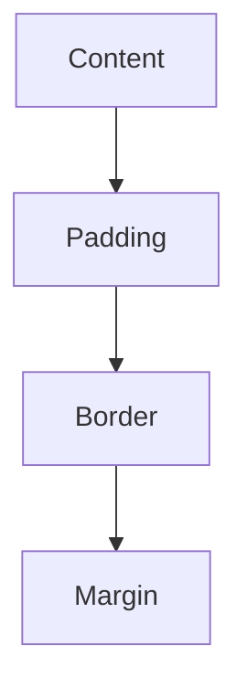
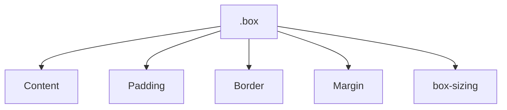

# Бокс-модель: розміри, padding, border, margin

## Вступ

Бокс-модель — фундаментальний механізм CSS, який визначає, як елементи займають простір на сторінці. Вона впливає на розміщення, розміри, відступи, межі, взаємодію з іншими елементами та рендеринг у браузері.

## Історія/Походження

Перші версії CSS використовували просту модель блоку. З розвитком стандарту з’явилися властивості для контролю розмірів, padding, border, margin, а також box-sizing для зміни поведінки моделі.

### Віхи розвитку бокс-моделі

-   **CSS1:** базова модель блоку
-   **CSS2:** додаткові властивості, border-collapse для таблиць
-   **CSS3:** box-sizing, outline, border-radius, box-shadow

## Основний матеріал

### Структура бокс-моделі

-   Content (вміст)
-   Padding (внутрішній відступ)
-   Border (межа)
-   Margin (зовнішній відступ)

### Візуалізація



### Властивості бокс-моделі

-   width, height — розміри контенту
-   padding — внутрішній відступ
-   border — межа
-   margin — зовнішній відступ
-   box-sizing — визначає, як розраховується ширина/висота

#### Приклад коду

```css
.box {
    width: 200px;
    height: 100px;
    padding: 20px;
    border: 2px solid #0077cc;
    margin: 10px;
}
```

### box-sizing

-   content-box (за замовчуванням): width/height — тільки контент
-   border-box: width/height — включає padding і border

#### Приклад box-sizing

```css
.box {
    box-sizing: border-box;
}
```

### Неочевидний приклад: outline

```css
.box {
    outline: 2px dashed red;
}
```

### Неочевидний приклад: border-radius

```css
.box {
    border-radius: 12px;
}
```

### Неочевидний приклад: box-shadow

```css
.box {
    box-shadow: 0 2px 8px rgba(0, 0, 0, 0.2);
}
```

### Неочевидний приклад: margin auto

```css
.box {
    margin: 0 auto;
}
```

### Неочевидний приклад: негативний margin

```css
.box {
    margin-top: -20px;
}
```

## Пояснення під капотом

Браузер парсить CSS, створює CSSOM, розраховує розміри елементів згідно бокс-моделі, враховує box-sizing, padding, border, margin, оптимізує рендеринг, інтегрує з DOM, API (ResizeObserver).

### Як працює бокс-модель у рушії

Бокс-модель інтегрується з DOM, визначає layout, впливає на взаємодію елементів, адаптивність, продуктивність, доступність.

## Нюанси та підводні камені

-   Відсутність box-sizing: border-box — некоректний розрахунок розмірів
-   Надмірний padding/border — елемент виходить за межі контейнера
-   Негативний margin — накладання елементів
-   Відсутність margin auto — нецентровані блоки
-   Відсутність border-radius — незграбний вигляд
-   Відсутність outline — погана доступність

## Діаграми



## Приклад застосування в реальних проєктах

-   Карточки товарів — padding, border, border-radius, box-shadow
-   Модальні вікна — margin auto, outline
-   Галереї — border-box, адаптивність
-   Форми — padding, border, outline
-   Кнопки — border-radius, box-shadow

### Кейс: адаптивність

Використання box-sizing: border-box для гнучких layout.

### Кейс: доступність

Outline для фокусу, border для видимості.

## Крос-посилання

-   [CSS: специфічність, спадкування](./02-browser-specificity-inheritance.md)
-   [HTML: базова структура](../HTML/02-basic-structure.md)
-   [Best practices](../HTML/10-best-practices.md)

## Підсумок

-   Бокс-модель — основа layout у CSS
-   Content, padding, border, margin — фундаментальні частини
-   box-sizing — ключ до адаптивності
-   Неочевидні приклади — для гнучкості, доступності, оптимізації
