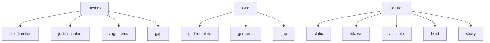

# Layout: Flexbox, Grid, позиціонування

## Вступ

Layout — це система розміщення елементів на сторінці. Сучасний CSS пропонує потужні інструменти: Flexbox, Grid, класичне позиціонування, які дозволяють створювати адаптивні, складні, гнучкі інтерфейси.

## Історія/Походження

Перші layout реалізовувалися через таблиці, float, inline-block. З появою Flexbox і Grid CSS став набагато гнучкішим і семантичнішим.

### Віхи розвитку layout

-   **CSS1:** таблиці, float
-   **CSS2:** позиціонування, inline-block
-   **CSS3:** Flexbox, Grid, gap, order

## Основний матеріал

### Flexbox

-   Одновимірний layout (рядок або колонка)
-   Контейнер: `display: flex;`
-   Властивості контейнера: `flex-direction`, `justify-content`, `align-items`, `flex-wrap`, `gap`
-   Властивості елементів: `flex-grow`, `flex-shrink`, `flex-basis`, `order`, `align-self`

#### Приклад Flexbox

```css
.container {
    display: flex;
    flex-direction: row;
    justify-content: space-between;
    align-items: center;
    gap: 16px;
}
.item {
    flex: 1;
}
```

### Grid

-   Двовимірний layout (рядки і колонки)
-   Контейнер: `display: grid;`
-   Властивості контейнера: `grid-template-columns`, `grid-template-rows`, `gap`, `grid-area`, `justify-items`, `align-items`
-   Властивості елементів: `grid-column`, `grid-row`, `grid-area`

#### Приклад Grid

```css
.grid {
    display: grid;
    grid-template-columns: 1fr 2fr;
    grid-template-rows: auto 1fr;
    gap: 20px;
}
.item {
    grid-column: 1 / 3;
}
```

### Класичне позиціонування

-   `position: static` — за замовчуванням
-   `position: relative` — зміщення від початкової позиції
-   `position: absolute` — позиціонування всередині найближчого позиціонованого контейнера
-   `position: fixed` — фіксація відносно вікна браузера
-   `position: sticky` — прилипає при скролі
-   Властивості: `top`, `right`, `bottom`, `left`, `z-index`

#### Приклад позиціонування

```css
.box {
    position: absolute;
    top: 20px;
    left: 40px;
}
.fixed {
    position: fixed;
    bottom: 0;
    right: 0;
}
.sticky {
    position: sticky;
    top: 0;
}
```

### Неочевидний приклад: gap у Flexbox

```css
.container {
    display: flex;
    gap: 24px;
}
```

### Неочевидний приклад: grid-area

```css
.grid {
    display: grid;
    grid-template-areas:
        "header header"
        "sidebar main"
        "footer footer";
}
.header {
    grid-area: header;
}
.sidebar {
    grid-area: sidebar;
}
.main {
    grid-area: main;
}
.footer {
    grid-area: footer;
}
```

### Неочевидний приклад: order у Flexbox

```css
.item {
    order: 2;
}
```

### Неочевидний приклад: align-self

```css
.item {
    align-self: flex-end;
}
```

### Неочевидний приклад: minmax у Grid

```css
.grid {
    grid-template-columns: 1fr minmax(200px, 2fr);
}
```

## Пояснення під капотом

Браузер парсить CSS, створює CSSOM, розраховує layout згідно Flexbox, Grid, позиціонування, оптимізує рендеринг, інтегрує з DOM, API (ResizeObserver, IntersectionObserver).

### Як працює layout у рушії

Layout-алгоритми інтегруються з DOM, визначають розміщення, розміри, взаємодію елементів, адаптивність, продуктивність, доступність.

## Нюанси та підводні камені

-   Надмірне вкладення контейнерів — складний DOM
-   Відсутність gap — елементи злипаються
-   Неправильне використання position — накладання елементів
-   Відсутність minmax — погана адаптивність
-   Відсутність order — неправильний порядок
-   Відсутність grid-area — складна верстка

## Діаграми



## Приклад застосування в реальних проєктах

-   Дашборди — Grid, Flexbox, gap
-   Галереї — Grid, minmax, order
-   Меню — Flexbox, align-items, gap
-   Модальні вікна — position: fixed, z-index
-   Sticky header — position: sticky

### Кейс: адаптивність

Grid, Flexbox, minmax, gap — для гнучких layout.

### Кейс: доступність

Правильне позиціонування, порядок, gap — для зручності користувача.

## Крос-посилання

-   [CSS: бокс-модель](./03-box-model.md)
-   [HTML: базова структура](../HTML/02-basic-structure.md)
-   [Best practices](../HTML/10-best-practices.md)

## Підсумок

-   Layout — основа сучасного CSS
-   Flexbox, Grid, позиціонування — ключові інструменти
-   Неочевидні приклади — для гнучкості, адаптивності, доступності
