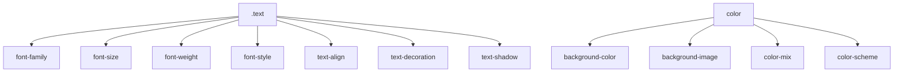

# Робота з текстом і кольорами: властивості, шрифти, color, background

## Вступ

Текст і кольори — основа візуального сприйняття веб-сторінки. CSS дозволяє керувати шрифтами, розмірами, кольорами, фоном, тінями, акцентами, забезпечує доступність і естетику.

## Історія/Походження

Перші версії CSS містили лише базові властивості для тексту і кольору. З розвитком стандарту з’явилися web-шрифти, градієнти, тіні, змінні, advanced background, підтримка SVG, color-mix, color-scheme.

### Віхи розвитку тексту і кольорів

-   **CSS1:** font-family, color, background
-   **CSS2:** font-size, font-style, font-weight, text-align, text-decoration
-   **CSS3:** web fonts, text-shadow, background-image, градієнти, color-mix, color-scheme

## Основний матеріал

### Властивості тексту

-   font-family — шрифт
-   font-size — розмір
-   font-weight — товщина
-   font-style — курсив
-   text-align — вирівнювання
-   text-decoration — підкреслення, закреслення
-   text-transform — регістр
-   letter-spacing — інтервал між літерами
-   line-height — висота рядка
-   text-shadow — тінь

#### Приклад коду

```css
.text {
    font-family: "Roboto", Arial, sans-serif;
    font-size: 20px;
    font-weight: 700;
    font-style: italic;
    text-align: center;
    text-decoration: underline;
    text-transform: uppercase;
    letter-spacing: 2px;
    line-height: 1.5;
    text-shadow: 1px 2px 4px #888;
}
```

### Властивості кольору

-   color — колір тексту
-   background-color — фон
-   background-image — зображення, градієнти
-   background-repeat, background-size, background-position
-   opacity — прозорість
-   color-mix — змішування кольорів
-   color-scheme — світла/темна тема

#### Приклад коду

```css
.colored {
    color: #0077cc;
    background-color: #f5f5f5;
    background-image: linear-gradient(90deg, #0077cc, #00cc77);
    opacity: 0.9;
}
```

### Web-шрифти

-   @font-face — підключення власних шрифтів
-   font-display — контроль рендерингу

#### Приклад підключення шрифту

```css
@font-face {
    font-family: "MyFont";
    src: url("myfont.woff2") format("woff2");
    font-display: swap;
}
.text {
    font-family: "MyFont", Arial, sans-serif;
}
```

### Неочевидний приклад: color-mix

```css
.element {
    color: color-mix(in srgb, #0077cc 60%, #ffcc00);
}
```

### Неочевидний приклад: color-scheme

```css
:root {
    color-scheme: light dark;
}
```

### Неочевидний приклад: background-clip

```css
.text {
    background: linear-gradient(90deg, #0077cc, #00cc77);
    -webkit-background-clip: text;
    color: transparent;
}
```

### Неочевидний приклад: text-shadow для акценту

```css
.accent {
    text-shadow: 0 0 8px #0077cc;
}
```

### Неочевидний приклад: SVG як фон

```css
.bg-svg {
    background-image: url("data:image/svg+xml;utf8,<svg ...>");
}
```

## Пояснення під капотом

Браузер парсить CSS, створює CSSOM, застосовує властивості тексту і кольору, оптимізує рендеринг, інтегрує з DOM, API (Font Loading, Color Scheme, Web Fonts).

### Як працює текст і кольори у рушії

Властивості тексту і кольору інтегруються з DOM, впливають на layout, доступність, продуктивність, адаптивність, темізацію.

## Нюанси та підводні камені

-   Відсутність font-display — поганий UX при завантаженні шрифтів
-   Відсутність color-scheme — некоректна тема
-   Надмірний text-shadow — погана читабельність
-   Відсутність background-clip — неяскравий текст
-   Відсутність контрасту — погана доступність
-   Відсутність fallback-шрифтів — некоректний вигляд
-   Відсутність opacity — неочікуваний фон

## Діаграми



## Приклад застосування в реальних проєктах

-   Блоги — web-шрифти, text-shadow, color-scheme
-   Корпоративні сайти — background-image, color-mix, контраст
-   E-commerce — акцентні кольори, SVG-фон, fallback-шрифти
-   SPA — темізація, адаптивність, font-display
-   Документація — читабельність, контраст, text-transform

### Кейс: доступність

Контраст, font-size, fallback-шрифти, color-scheme.

### Кейс: продуктивність

font-display, оптимізація web-шрифтів, opacity.

## Крос-посилання

-   [CSS: layout](./04-layout.md)
-   [CSS: бокс-модель](./03-box-model.md)
-   [Best practices](../HTML/10-best-practices.md)
-   [HTML: текстові елементи](../HTML/04-text.md)

## Підсумок

-   Текст і кольори — основа візуального стилю
-   font, color, background — фундаментальні властивості
-   Неочевидні приклади — для гнучкості, доступності, оптимізації
