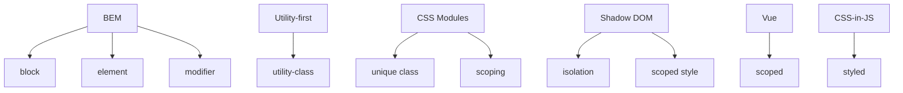

# Методології та scoping: BEM, utility-first, CSS Modules, Shadow DOM

## Вступ

Методології та scoping — це підходи до організації CSS-коду, які забезпечують масштабованість, підтримуваність, ізоляцію стилів, уникнення конфліктів. Вони критично важливі для великих проєктів, командної роботи, сучасних фреймворків.

## Історія/Походження

Перші сайти використовували глобальні стилі. З розвитком вебу з’явилися методології (BEM, OOCSS, SMACSS), utility-first підхід, модульність, Shadow DOM для ізоляції стилів у компонентах.

### Віхи розвитку методологій

-   **2009:** BEM, OOCSS, SMACSS
-   **2015+:** utility-first (Tailwind), CSS Modules, CSS-in-JS
-   **2018+:** Shadow DOM, scoped styles у фреймворках

## Основний матеріал

### BEM (Block Element Modifier)

-   Блок: `.block`
-   Елемент: `.block__element`
-   Модифікатор: `.block--modifier`
-   Забезпечує унікальність, читабельність, масштабованість

#### Приклад BEM

```html
<div class="card card--featured">
    <div class="card__header">...</div>
    <div class="card__body">...</div>
</div>
```

### Utility-first

-   Класи для окремих властивостей: `.p-4`, `.text-center`, `.bg-blue-500`
-   Використовується у Tailwind, Bootstrap
-   Швидка розробка, гнучкість, менше кастомного CSS

#### Приклад utility-first

```html
<div class="p-4 text-center bg-blue-500">...</div>
```

### CSS Modules

-   Модульність, ізоляція стилів для компонентів
-   Використовується у React, Vue, Svelte
-   Унікальні імена класів, автоматичний scoping

#### Приклад CSS Modules (React)

```jsx
import styles from "./Button.module.css";
<button className={styles.primary}>Кнопка</button>;
```

### Shadow DOM

-   Ізоляція стилів у Web Components
-   Стилі не впливають на глобальний DOM
-   Використовується у сучасних фреймворках (Angular, Vue, Lit)

#### Приклад Shadow DOM

```js
const shadow = element.attachShadow({ mode: "open" });
shadow.innerHTML = `<style>p { color: red; }</style><p>Текст</p>`;
```

### Неочевидний приклад: scoped styles у Vue

```html
<style scoped>
    .card {
        color: green;
    }
</style>
```

### Неочевидний приклад: CSS-in-JS

```jsx
const Button = styled.button`
    background: #0077cc;
    color: #fff;
`;
```

### Неочевидний приклад: глобальні utility-класи

```css
.text-accent {
    color: #0077cc;
}
```

## Пояснення під капотом

Браузер парсить CSS, створює CSSOM, застосовує scoping, ізоляцію, унікальні імена класів, оптимізує рендеринг, інтегрує з DOM, API (Shadow DOM, CSS Modules).

### Як працює scoping у рушії

Scoping інтегрується з DOM, забезпечує ізоляцію стилів, уникає конфліктів, підвищує продуктивність, підтримуваність.

## Нюанси та підводні камені

-   Відсутність scoping — конфлікти стилів
-   Надмірна глобалізація — важко підтримувати
-   Відсутність модульності — складний CSS
-   Відсутність utility-класів — багато кастомного CSS
-   Відсутність Shadow DOM — неможлива ізоляція
-   Відсутність CSS-in-JS — складна інтеграція з JS

## Діаграми



## Приклад застосування в реальних проєктах

-   Корпоративні сайти — BEM, CSS Modules
-   SPA — utility-first, CSS-in-JS, Shadow DOM
-   Дизайн-системи — модульність, scoping
-   Web Components — Shadow DOM, scoped styles
-   Блоги — utility-класи, BEM

### Кейс: підтримуваність

BEM, CSS Modules, scoped styles — для масштабування.

### Кейс: продуктивність

Utility-first, CSS-in-JS, Shadow DOM — для швидкої розробки.

## Крос-посилання

-   [CSS: анімації](./08-animations-transform.md)
-   [CSS: layout](./04-layout.md)
-   [Best practices](../HTML/10-best-practices.md)
-   [HTML: семантичні теги](../HTML/03-semantic-tags.md)

## Підсумок

-   Методології та scoping — основа сучасного CSS
-   BEM, utility-first, CSS Modules, Shadow DOM — ключові підходи
-   Неочевидні приклади — для ізоляції, продуктивності, підтримуваності
