# Оптимізація, best practices, типові помилки, антипатерни

## Вступ

Оптимізація, best practices, типові помилки та антипатерни — це основа якісного CSS-коду. Вони впливають на продуктивність, підтримуваність, доступність, UX, SEO, масштабованість проєкту.

## Історія/Походження

З розвитком CSS сформувалися стандарти, best practices (W3C, Google, Mozilla), а також типові помилки та антипатерни, які слід уникати для якісної розробки.

### Віхи розвитку best practices

-   **CSS2/3:** семантика, оптимізація, продуктивність
-   **W3C, Google:** стандарти, рекомендації
-   **2020+:** CSS-in-JS, utility-first, модульність

## Основний матеріал

### Оптимізація

-   Мінімізація CSS (minify)
-   Використання сучасних властивостей (grid, flex, clamp)
-   Lazy loading шрифтів, зображень
-   Використання box-sizing: border-box
-   Кешування стилів
-   Використання змінних для централізації
-   Уникнення !important
-   Групування селекторів
-   Використання shorthand

#### Приклад оптимізації

```css
.card {
    margin: 0 0 24px;
    padding: 16px;
    box-sizing: border-box;
}
```

### Best practices

-   Семантичні класи
-   Модульність, scoping
-   Utility-first для швидкої розробки
-   Використання змінних, темізація
-   Mobile-first, адаптивність
-   Контрастність, доступність
-   Використання fallback для шрифтів, кольорів
-   CSS validation (validator.w3.org)

### Неочевидні best practices

-   Використання clamp/min/max для гнучких розмірів
-   prefers-color-scheme для темізації
-   container queries для адаптивності
-   font-display для оптимізації шрифтів
-   CSS-in-JS для інтеграції з JS
-   Scoped styles у компонентах

## Типові помилки

-   Надмірне використання !important
-   Відсутність box-sizing: border-box
-   Відсутність fallback для шрифтів, кольорів
-   Глобальні стилі без scoping
-   Відсутність адаптивності
-   Відсутність темізації
-   Відсутність контрасту
-   Відсутність CSS validation
-   Надмірне вкладення селекторів
-   Використання inline-стилів
-   Відсутність оптимізації зображень

## Антипатерни

-   Глобальні стилі для всього
-   Використання !important для вирішення конфліктів
-   Inline-стилі для layout
-   Відсутність модульності
-   Відсутність utility-класів
-   Deprecated властивості (float для layout, zoom, filter для IE)
-   Відсутність темізації
-   Відсутність адаптивності

## Пояснення під капотом

Браузер парсить CSS, створює CSSOM, оптимізує рендеринг, застосовує best practices, уникає антипатернів, інтегрує з DOM, API (Font Loading, Container Queries).

### Як працює оптимізація у рушії

Оптимізація CSS впливає на швидкість завантаження, продуктивність, доступність, підтримуваність, UX.

## Нюанси та підводні камені

-   Надмірне використання !important — важко підтримувати
-   Відсутність box-sizing — некоректний layout
-   Відсутність fallback — поганий UX
-   Відсутність темізації — некоректна тема
-   Відсутність адаптивності — поганий вигляд на мобільних
-   Deprecated властивості — проблеми у сучасних браузерах

## Діаграми

```mermaid
graph TD
    OPT[Оптимізація] --> MINIFY[minify]
    OPT --> BOX[box-sizing]
    OPT --> CACHE[cache]
    OPT --> SHORTHAND[shorthand]
    BEST[Best practices] --> SEMANTIC[семантика]
    BEST --> MODULAR[модульність]
    BEST --> UTILITY[utility-first]
    BEST --> MOBILE[mobile-first]
    BEST --> CONTRAST[контраст]
    ERRORS[Помилки] --> IMPORTANT[!important]
    ERRORS --> INLINE[inline]
    ERRORS --> GLOBAL[глобальні стилі]
    ERRORS --> FALLBACK[fallback]
    ANTI[Антипатерни] --> DEPRECATED[deprecated]
    ANTI --> GLOBALA[глобалізація]
    ANTI --> NOADAPT[без адаптивності]
```



## Приклад застосування в реальних проєктах

-   Корпоративні сайти — оптимізація, модульність, темізація
-   SPA — utility-first, CSS-in-JS, container queries
-   E-commerce — адаптивність, контраст, оптимізація зображень
-   Блоги — семантика, validation, fallback
-   Дизайн-системи — best practices, scoped styles

### Кейс: продуктивність

Оптимізація, кешування, minify, font-display.

### Кейс: підтримуваність

Модульність, utility-класи, validation.

## Крос-посилання

-   [CSS: методології](./09-methodologies-scoping.md)
-   [CSS: layout](./04-layout.md)
-   [Best practices](../HTML/10-best-practices.md)
-   [HTML: семантичні теги](../HTML/03-semantic-tags.md)

## Підсумок

-   Оптимізація, best practices — основа якісного CSS
-   Типові помилки, антипатерни — що слід уникати
-   Неочевидні best practices — для продуктивності, підтримуваності, доступності
