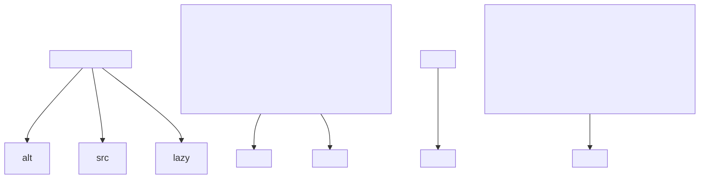
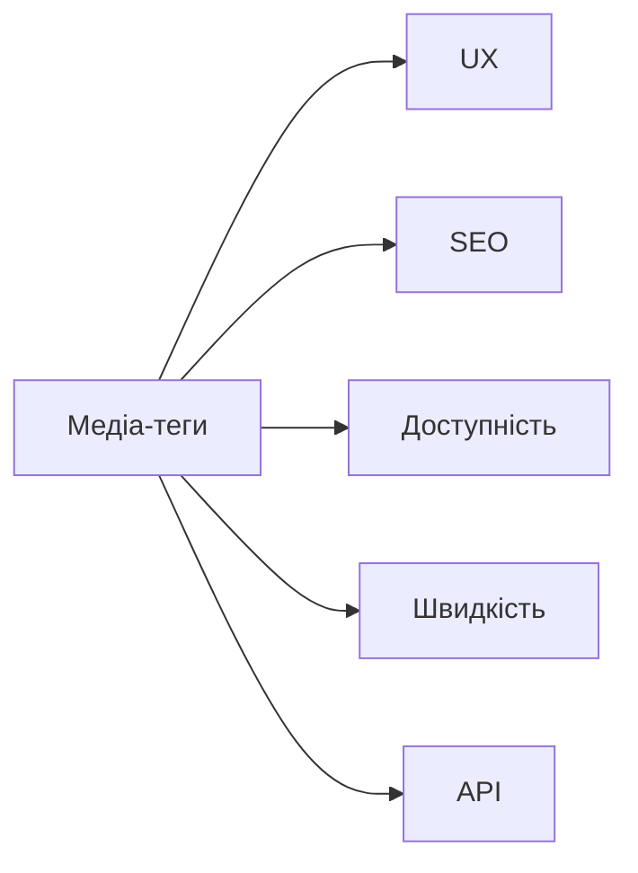

# Робота з медіа: зображення, відео, аудіо, SVG

## Вступ

Медіа-елементи — ключ до сучасного вебу. Зображення, відео, аудіо, SVG формують візуальну та інтерактивну складову сторінки, впливають на UX, SEO, доступність, швидкість завантаження.

## Історія/Походження

Перші версії HTML підтримували лише зображення (``). З розвитком стандарту додано відео (`<video>`), аудіо (`<audio>`), SVG (`<svg>`), а також атрибути для інтеграції з API, доступності, адаптивності.

### Віхи розвитку медіа в HTML

-   **HTML 2.0:** ``
-   **HTML5:** `<video>`, `<audio>`, `<source>`, `<track>`, `<svg>`

## Основний матеріал

### Зображення

-   `` — основний тег для вставки зображень
-   Атрибути: `src`, `alt`, `width`, `height`, `loading`, `srcset`, `sizes`

### Відео

-   `<video src="...">` — тег для відео
-   Атрибути: `controls`, `autoplay`, `loop`, `muted`, `poster`, `width`, `height`
-   Вкладені теги: `<source>`, `<track>`

### Аудіо

-   `<audio src="...">` — тег для аудіо
-   Атрибути: `controls`, `autoplay`, `loop`, `muted`
-   Вкладені теги: `<source>`

### SVG

-   `<svg>` — тег для векторної графіки
-   Можна вставляти як inline, так і через ``

### Семантика та доступність

-   Атрибут `alt` для зображень — критично важливий для скрінрідерів
-   Атрибут `track` для відео — субтитри, переклади
-   Атрибут `aria-label` — для додаткової доступності

## Приклад коду

### Зображення

```html

```

### Адаптивні зображення

```html

```

### Відео

```html
<video controls width="400" poster="preview.jpg">
    <source src="movie.mp4" type="video/mp4" />
    <source src="movie.webm" type="video/webm" />
    <track
        src="subtitles.vtt"
        kind="subtitles"
        srclang="uk"
        label="Українська"
    />
    Ваш браузер не підтримує відео.
</video>
```

### Аудіо

```html
<audio controls>
    <source src="sound.mp3" type="audio/mpeg" />
    <source src="sound.ogg" type="audio/ogg" />
    Ваш браузер не підтримує аудіо.
</audio>
```

### SVG inline

```html
<svg width="100" height="100">
    <circle
        cx="50"
        cy="50"
        r="40"
        stroke="green"
        stroke-width="4"
        fill="yellow"
    />
</svg>
```

### SVG через 

```html

```

## Неочевидні приклади

### Ліниве завантаження зображень

```html

```

### Відео з субтитрами

```html
<video controls>
    <source src="movie.mp4" type="video/mp4" />
    <track src="subs.vtt" kind="subtitles" srclang="en" label="English" />
</video>
```

### SVG-анімація

```html
<svg width="120" height="120">
    <circle cx="60" cy="60" r="50" fill="blue">
        <animate
            attributeName="r"
            from="50"
            to="10"
            dur="1s"
            repeatCount="indefinite"
        />
    </circle>
</svg>
```

### Аудіо з автозапуском

```html
<audio src="sound.mp3" autoplay muted></audio>
```

## Пояснення під капотом

Браузер парсить медіа-теги, створює відповідні DOM-елементи, ініціалізує завантаження ресурсів, оптимізує рендеринг, інтегрує з API (Canvas, Web Audio, WebGL). Атрибути керують поведінкою: lazy loading, адаптивність, доступність, інтеграція з JS.

### Як працює медіа у рушії

Медіа-елементи інтегруються з рушієм браузера, використовують апаратне прискорення, кешування, оптимізацію потоків, обробку подій (play, pause, ended, error).

## Нюанси та підводні камені

-   Відсутність `alt` у `` — погана доступність
-   Відсутність `controls` у `<video>`/`<audio>` — неможливо керувати відтворенням
-   Неправильний формат файлу — не відтворюється у браузері
-   Відсутність субтитрів — недоступно для людей з вадами слуху
-   Відсутність адаптивності — поганий UX на мобільних
-   Надмірне використання великих зображень — повільне завантаження
-   SVG без `viewBox` — проблеми з масштабуванням

## Діаграми





## Приклад застосування в реальних проєктах

-   Галереї — адаптивні зображення, lazy loading
-   Відео-уроки — субтитри, постери, інтеграція з JS
-   Подкасти — аудіо з контролями, автозапуск
-   Логотипи — SVG для масштабування
-   Інтерактивні дашборди — SVG-анімації

### Кейс: SEO

Атрибут `alt` у зображеннях підвищує рейтинг сторінки.

### Кейс: доступність

Субтитри, альтернативний текст, aria-label — для скрінрідерів.

### Кейс: оптимізація

Lazy loading, адаптивні формати — для швидкого завантаження.

## Крос-посилання

-   [Текстові елементи](./04-text.md)
-   [Семантичний HTML](./03-semantic-tags.md)
-   [Best practices](./10-best-practices.md)
-   [Форми](./06-forms.md)

## Підсумок

-   Медіа — основа сучасного вебу
-   Зображення, відео, аудіо, SVG — різні типи контенту
-   Семантика, доступність, оптимізація — ключові аспекти
-   Важливо використовувати правильні атрибути
-   Неочевидні приклади — для інтеграції, адаптивності, доступності
