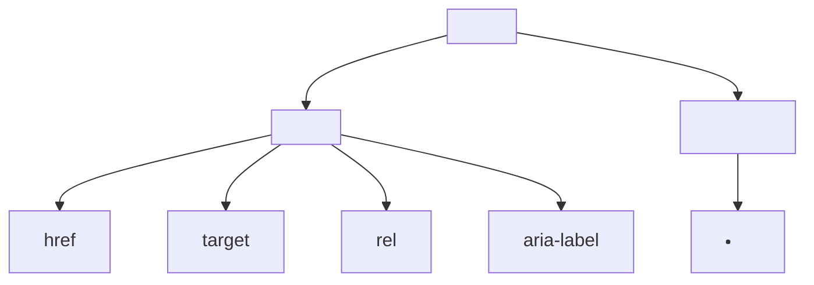
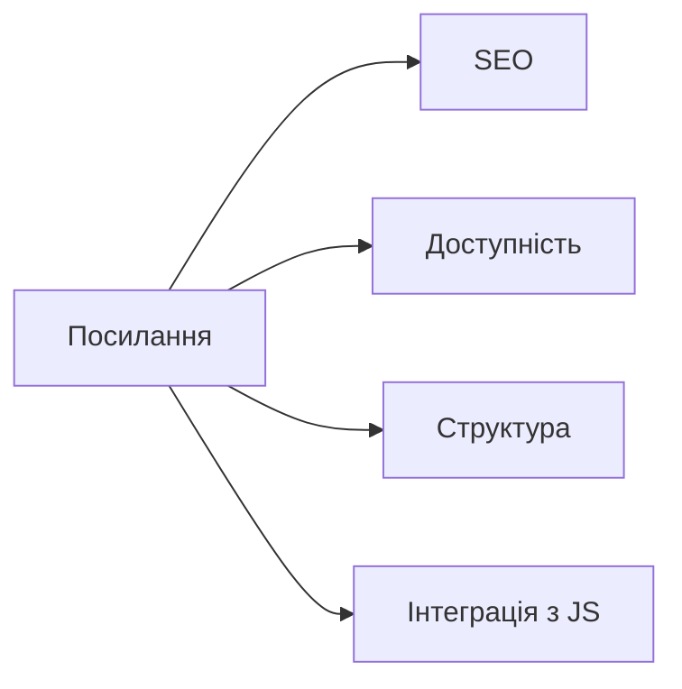

# Посилання та навігація: <a>, <nav>, внутрішні/зовнішні переходи

## Вступ

Посилання та навігація — основа взаємодії у вебі. Вони формують структуру сайту, забезпечують переходи між сторінками, інтеграцію з браузером, SEO, доступність.

## Історія/Походження

Перші версії HTML містили лише тег `<a>`. З розвитком стандарту з’явилися `<nav>`, атрибути для відкриття у новій вкладці, навігаційні меню, інтеграція з SPA, API для роботи з історією браузера.

### Віхи розвитку навігації

-   **HTML 2.0:** `<a>` — базові посилання
-   **HTML5:** `<nav>` — семантична навігація, атрибути для доступності

## Основний матеріал

### Тег <a>

-   `<a href="...">` — основний тег для створення посилань
-   Атрибути: `href`, `target`, `rel`, `download`, `title`, `aria-label`

### Тег <nav>

-   `<nav>` — контейнер для навігаційних елементів
-   Використовується для меню, списків посилань, breadcrumbs

### Внутрішні та зовнішні переходи

-   Внутрішні: переходи між сторінками одного сайту
-   Зовнішні: переходи на інші сайти
-   Атрибут `target="_blank"` — відкриття у новій вкладці
-   Атрибут `rel="noopener noreferrer"` — безпека для зовнішніх посилань

### Семантика та доступність

-   `<nav>` — допомагає скрінрідерам і пошуковим системам ідентифікувати навігацію
-   Атрибути `aria-label`, `title` — для опису посилань

## Приклад коду

### Базове посилання

```html
<a href="https://example.com">Відкрити сайт</a>
```

### Внутрішнє посилання

```html
<a href="/about.html">Про нас</a>
```

### Зовнішнє посилання у новій вкладці

```html
<a href="https://google.com" target="_blank" rel="noopener noreferrer"
    >Google</a
>
```

### Завантаження файлу

```html
<a href="file.pdf" download>Завантажити PDF</a>
```

### Навігаційне меню

```html
<nav aria-label="Головне меню">
    <ul>
        <li><a href="/">Головна</a></li>
        <li><a href="/about.html">Про нас</a></li>
        <li><a href="/contact.html">Контакти</a></li>
    </ul>
</nav>
```

### Breadcrumbs (хлібні крихти)

```html
<nav aria-label="Breadcrumb">
    <ol>
        <li><a href="/">Головна</a></li>
        <li><a href="/products.html">Товари</a></li>
        <li>Деталі</li>
    </ol>
</nav>
```

### Неочевидний приклад: посилання-кнопка

```html
<a href="/submit" role="button" aria-label="Відправити форму">Відправити</a>
```

### Неочевидний приклад: посилання-якорі

```html
<a href="#section2">Перейти до розділу 2</a>
```

### Неочевидний приклад: посилання з іконкою

```html
<a href="/profile.html" aria-label="Профіль">
    
</a>
```

### Неочевидний приклад: навігація для SPA

```html
<nav>
    <a href="#home" onclick="showHome()">Головна</a>
    <a href="#about" onclick="showAbout()">Про нас</a>
</nav>
```

## Пояснення під капотом

Браузер парсить `<a>`, створює DOM-елемент, додає події (click, focus), інтегрує з історією браузера, SEO, доступністю. `<nav>` формує семантичний блок, допомагає скрінрідерам, пошуковим системам.

### Як працює навігація у рушії

Посилання інтегруються з рушієм браузера, обробляють події, змінюють URL, можуть взаємодіяти з JS (SPA), впливають на рендеринг, кешування, історію переходів.

## Нюанси та підводні камені

-   Відсутність `rel="noopener noreferrer"` — ризик безпеки для зовнішніх посилань
-   Відсутність `aria-label` — погана доступність
-   Надмірне вкладення `<nav>` — плутанина для скрінрідерів
-   Використання `<a>` без `href` — не працює як посилання
-   Використання `<a>` для кнопок — краще `<button>` для дій
-   Відсутність семантики — поганий SEO

## Діаграми





## Приклад застосування в реальних проєктах

-   Головне меню — `<nav>`, `<ul>`, `<a>`
-   Breadcrumbs — `<nav>`, `<ol>`, `<a>`
-   SPA — інтеграція з JS, зміна URL без перезавантаження
-   Завантаження файлів — `<a download>`
-   Внутрішні/зовнішні переходи — SEO, безпека

### Кейс: SEO

Правильна структура навігації підвищує рейтинг сторінки.

### Кейс: доступність

`aria-label`, семантичні блоки — для скрінрідерів.

### Кейс: інтеграція з JS

SPA, динамічна навігація, зміна URL без reload.

## Крос-посилання

-   [Семантичний HTML](./03-semantic-tags.md)
-   [Текстові елементи](./04-text.md)
-   [Best practices](./10-best-practices.md)
-   [Форми](./06-forms.md)

## Підсумок

-   Посилання — основа навігації у вебі
-   `<a>`, `<nav>` — фундаментальні теги
-   Семантика, доступність, безпека — ключові аспекти
-   Важливо використовувати правильні атрибути
-   Неочевидні приклади — для інтеграції, доступності, SPA
